# 모듈 1: 랩 1 - Azure AD Privileged Identity 관리


**시나리오**

이 실습에서는 PIM(Azure Privileged Identity Management)을 사용하여 적시 관리를 지원하고 권한이 필요한 작업을 수행할 수 있는 사용자 수를 제어하는 방법에 대해 알아보십시오. 또한 PIM이 리소스 수준에서 역할 할당으로 확장되는 것을 포함하는 새로운 기능뿐만 아니라 사용 가능한 다양한 디렉토리 역할에 대해서도 알아보십시오. 이 실습은 다음 내용을 포함합니다 : 

- PIM 시작
- PIM Security Wizard 
- 디렉토리 역할에 PIM 사용
- 리소스 역할 부여에 PIM 사용

ID 관리 과정에서는 Azure RBAC(역할 기반 액세스 제어)와 Azure Active Directory도 다룹니다. 다른 과정에서 다룰 내용에 대한 기초를 제공하기 위해 해당 내용을 포함하였습니다. 


## Azure AD Privileged Identity 관리

## 연습 1 - Azure 리소스 검색 및 관리

### 작업 1: 랩 환경 설정

 이 실습에서는 PIM에 쓰일 사용자를 생성해야 합니다. 

1.  **Azure 포털**의 **Cloud Shell** 창의 **PowerShell** 세션을 시작한다. 알림창이 뜨면 **스토리지 만들기**를 클릭한다.

1. 인증을 위해 다음 명령을 실행한다.

    ```powershell
    Connect-AzureAD
    ```
    **참고**: Cloud Shell 세션을 닫을 경우 실습 도중 이 명령을 다시 입력해야 할 수 있습니다. 

1.  다음 PowerShell 명령을 실행하여 기본 도메인에 AD 사용자 및 암호를 생성한다. 

    ```powershell
    $PasswordProfile = New-Object -TypeName Microsoft.Open.AzureAD.Model.PasswordProfile
    ```
    ```powershell
    $PasswordProfile.Password = "Pa55w.rd"
    ```
    ```powershell
    $domainObj = get-azureaddomain
    ```
    ```powershell
    $domain = $domainObj[0].name
    ```
    ```powershell
     New-AzureADUser -DisplayName "Isabella Simonsen" -PasswordProfile $PasswordProfile -UserPrincipalName "Isabella@$domain" -AccountEnabled $true -MailNickName "Isabella" -UsageLocation "US"
    ```


### 작업 2: Azure AD Premium P2 평가판 활성화 및 테스트 사용자 생성

1.  Azure 포털의 허브 메뉴에서 **Azure Active Directory**를 선택한다. 

1.  **라이선스**를 선택하고 **모든 제품**을 클릭한다.

1.  **사용 / 구매**를 클릭한다.

     

1.  드롭다운 화살표를 클릭하고, **Azure AD Premium P2** 의 **활성화**를 클릭한다.

     

**활성화를 적용하려면 Azure 포털에 다시 로그인해야 할 수도 있습니다.**


### 작업 3: 리소스 검색

1.  Azure 포털에서 **모든 서비스**를 선택하고 **Azure AD Privileged Identity Management**를 찾아 클릭한다.

     

2.  **Azure 리소스**를 클릭한다.

     

3.  **리소스 검색**을 클릭한다.

     

4.  **리소스 상태 필터**와 **리소스 유형 선택**을 사용하여 쓰기 권한이 있는 관리 그룹이나 구독을 필터링한다. (처음에는 **All**로 시작하는 것이 가장 간단한 방법이다.)

     

5.  Azure 구독 옆의 체크 마크를 선택한다. 
   
     
 
6.  **리소스 관리**를 클릭하여 선택한 리소스 관리를 시작한다.

     

7.  알림 창이 뜨면 **예**를 클릭한다.

    **참고**: PIM을 사용한 관리에는 구독 리소스 또는 관리 그룹만 검색하고 선택할 수 있습니다. PIM에서 관리 그룹이나 구독의 하위 리소스도 관리할 수 있습니다.

    **참고**: 관리 그룹이나 구독에 관리 설정을 하면 관리 대상에 포함됩니다. 다른 리소스 관리자가 PIM 설정을 제거할 수 없습니다.


## 연습 2 - 디렉토리 역할 할당

### 작업 1: 사용자에게 역할 부여

이 작업에서는 사용자에게 Azure AD 디렉토리 역할을 부여합니다.

1.  Azure 포털에 로그인한다.

1.  Azure 포털에서 **모든 서비스**를 클릭하고 **Azure AD Privileged Identity Management**를 선택한다.

     

1.  **Azure AD 역할**을 선택한다.

     
 
1.  **역할**을 클릭한다.

     

1.  **할당 추가**를 클릭해 관리되는 구성원을 추가한다.

     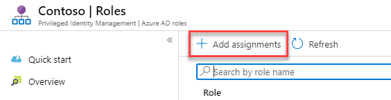

1.  **역할 선택** 드롭다운 메뉴에서 **대금 청구 관리자**를 선택한다.

     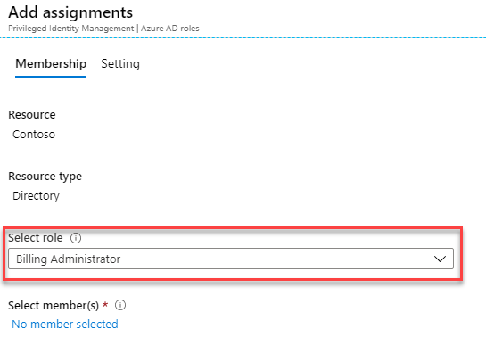

1.  **선택한 구성원이 없음**을 클릭하여 lsabella를 지정하고 **선택**을 클릭한다.

     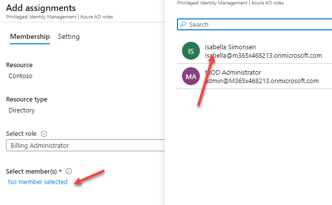

1.  할당 추가 블레이드에서 **다음**을 클릭한다.

2.  **할당**을 클릭하여 사용자에 역할을 할당한다.

3. **대금 청구 관리자** 역할을 선택한다.

4.  추가된 사용자를 검토한다. 

     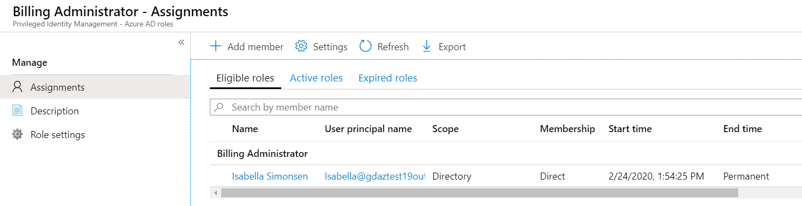

5.  역할이 할당되면 선택한 사용자가 **적격** 역할 목록에 나타난다.


## 연습 3 - PIM 역할 활성화 및 비활성화

### 작업 1: 역할 활성화

Azure AD 디렉토리 역할을 수행해야 할 경우 PIM의 **My roles** 탐색 옵션을 사용하여 활성화를 요청할 수 있습니다.

1.  **In Private** 브라우저 창을 열어 **`https://portal.azure.com`** 에 접속한 뒤, Isabella 계정으로 로그인한 후 패스워드를 변경한다. (Isabella@myaad.onmicrosoft.com, Pa55w.rd.)

1.  Azure 포털에서 **모든 서비스**를 클릭하고, **Azure AD Privileged Identity Management**를 찾아 선택한다. 

     

1.  **Azure AD 역할**을 클릭한다.

     

1.  **빠른 시작** 블레이드에서 **역할 활성화**를 클릭한다.

     

1.  목록을 오른쪽으로 스크롤하여 대금 청구 관리자의 **활성화**를 클릭한다. 

     

1.  **추가 확인이 필요합니다. 계속하려면 클릭합니다**를 클릭한다. 세션당 한 번만 인증하면 된다. 마법사를 실행하여 계정을 인증한다. 

     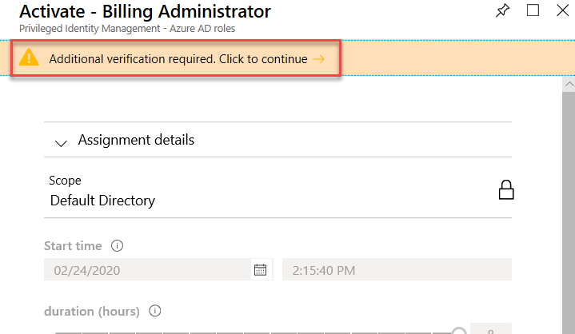
 
1.  Azure 포털로 돌아가서 활성화 이유를 입력하고 **활성화**를 클릭한다. 

     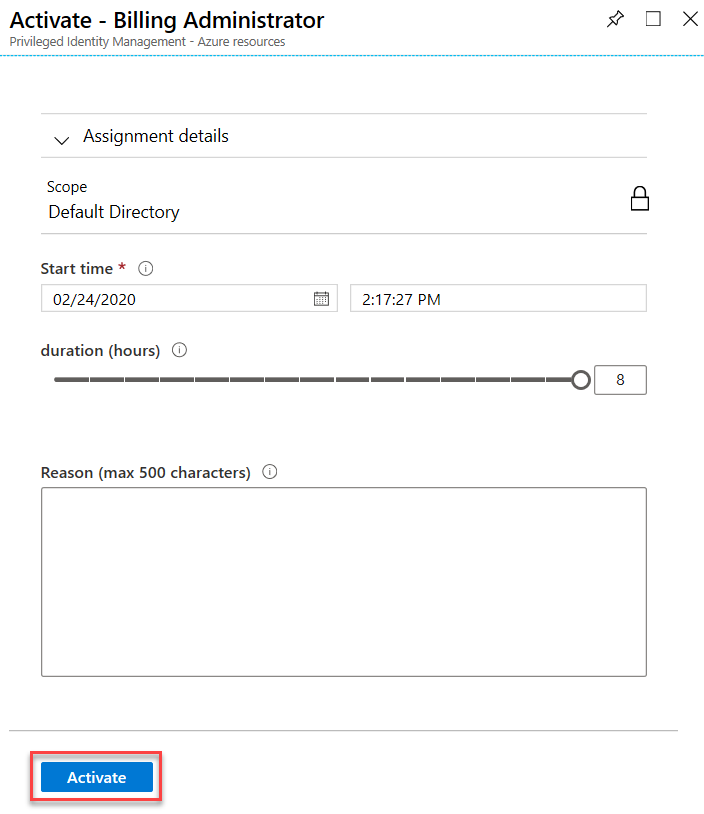

 설정에 명시적으로 구성되지 않는 한 역할에는 승인이 필요하지 않습니다.

승인이 필요하지 않으면 활성 역할 목록에 자동으로 추가됩니다. 역할을 바로 사용하려면 다음 단계를 수행하십시오.

역할을 활성화하기 위해 승인이 필요한 경우, 요청이 승인 보류 중임을 알리는 알림이 브라우저의 오른쪽 상단에 나타납니다.


### 작업 2: 활성화 직후 역할 사용

PIM에서 역할을 활성화하면 원하는 관리 포털에 접속하거나 특정 관리 워크로드 내에서 기능을 수행하기까지 최대 10분이 걸릴 수 있습니다. 권한을 강제로 업데이트하려면 다음 단계에 설명된 대로 **Application access** 페이지를 사용하십시오.

1.  **Sign Out**을 클릭한다.

     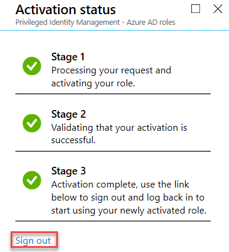

1.   Isabella 계정으로 다시 로그인한다. 


### 작업 3: 역할 비활성화

역할이 활성화된 후 시간 제한(적절한 지속 시간)에 도달하면 자동으로 비활성화됩니다.

관리자 업무를 조기에 완료하는 경우 Azure AD Privileged Identity Management에서 역할을 수동으로 비활성화할 수도 있습니다.

1.  Isabella 계정에 로그인한 상태에서 Azure AD Privileged Identity Management를 클릭한다.

1.  **Azure AD 역할**을 클릭한다.

1.  **내 역할**을 클릭한다.

     

1.  **활성 역할**을 클릭하여 활성화된 역할 목록을 확인한다.

     

1.   사용이 끝난 역할을 찾아 **비활성화**를 클릭한다.

     

1.  다시 한 번 **비활성화**를 클릭한다.

     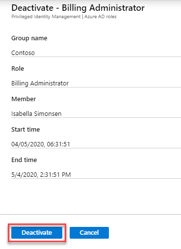


### 작업 4: 보류 중인 요청 취소

승인이 필요한 역할을 활성화할 필요가 없는 경우, 언제든지 보류 중인 요청을 취소할 수 있습니다.

1.  **Azure AD Privileged Identity Management**를 클릭한다.

1.  **Azure AD 역할**을 클릭한다.

1.  **보류 중인 요청**을 클릭한다.

1.  취소하길 원하는 역할에 대해 **취소** 버튼을 클릭한다. 

**참고**: 요청이 승인되면 이 작업의 취소 버튼이 회색으로 비활성화됩니다.

취소를 클릭하면 요청이 취소됩니다. 역할을 다시 활성화하려면 활성화 요청을 새로 제출해야 합니다.


## 연습 4 - 디렉토리 역할 (General)

### 작업 1: PIM에서 Azure AD 디렉토리 역할에 대한 액세스 검토 시작

사용자가 더 이상 필요하지 않은 특권적 액세스 권한을 가질 때 역할 할당은 "stale" 됩니다. 이러한 오래된 역할 할당과 관련된 위험을 줄이기 위해, 권한 있는 역할 관리자 또는 전역(Global) 관리자는 정기적으로 액세스 리뷰를 작성하여 관리자에게 사용자가 부여한 역할을 검토하도록 요청해야 합니다. 이 작업은 Azure AD PIM(Privileged Identity Management)에서 접근 권한을 검토하기 위한 단계를 다룹니다.

1.  전역 관리자 계정으로 로그인한 브라우저로 돌아간다.

1.  PIM 메인 페이지의 **관리** 섹션에서 **Azure AD 역할**을 클릭한다. **액세스 검토** 메뉴를 선택하고, **새로 만들기**를 클릭한다.

     

1.  다음 설정을 입력하고 **시작**을 클릭한다.

      - 검토 이름:  **Global Admin Review**
      - 시작 날짜:  **오늘 날짜** 
      - 빈도:  **한 번**
      - 종료 날짜:  **다음 달 말일**
      - 역할 멤버 자격 검토:  **Global Administrator**
      - 검토자:  **본인 계정 선택**
 
     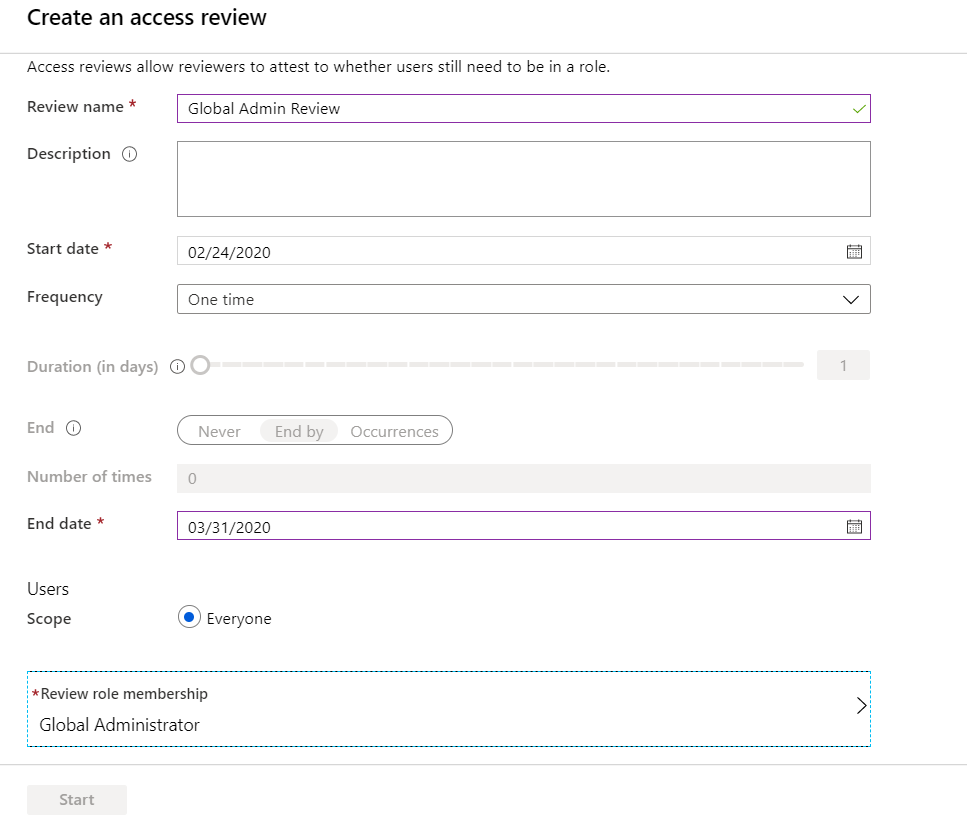
 
1.  검토가 완료되고 활성 상태가 되면 **Global Admin Review**를 클릭한다.

    **참고**: 브라우저를 새로고침해야 할 수도 있습니다.

2.  **결과**를 선택하고 **검토되지 않음** 상태의 결과를 확인한다.

     


### 작업 2: 액세스 승인 또는 거부

액세스를 승인하거나 거부할 때 이 역할을 여전히 사용하는지 여부를 검토자에게 알립니다. 역할을 유지하려면 **승인**을 선택하고, 더 이상 액세스 권한이 필요하지 않으면 **거부**를 선택하십시오. 검토자가 결과를 적용하면 상태에 반영됩니다. 다음 단계에 따라 액세스 검토를 찾아 완료하십시오.

1.  PIM 창에서 **액세스 검토**를 선택한다. 

2.  **Global Admin Review**를 선택한다.

     

3.  이름 옆에 있는 체크 표시를 선택한다.

     

5.  **Azure AD 역할 검토** 블레이드를 닫는다.


### 작업 3: PIM에서 Azure AD 디렉토리 역할에 대한 액세스 검토 완료

Privileged role administrators는 액세스 검토가 시작되면 권한 있는 액세스를 검토할 수 있습니다. Azure AD PIM(Privileged Identity Management)은 사용자들의 액세스를 검토하도록 요청하는 이메일을 자동으로 발송합니다. 사용자가 전자 메일을 받지 못한 경우 액세스 검토를 수행하는 방법에 대한 지침을 발송할 수 있습니다.

액세스 검토 기간이 종료되거나 모든 사용자가 자체 검토를 마친 후에는 이 작업의 단계에 따라 검토를 관리하고 결과를 확인하십시오.

1.  Azure 포털에서 **Azure AD Privileged Identity Management**를 선택한다.

1.  **Azure AD 역할**을 선택한다.

2.  **Access 검토**를 선택한다.


3.  Global Admin Review를 선택한다.


1.  블레이드를 검토한다.

     


### 작업 4: PIM에서 Azure AD 디렉터리 역할에 대한 보안 경고 구성

환경 및 보안 목표에 맞게 PIM의 일부 보안 경고를 사용자 지정할 수 있습니다. 다음 단계에 따라 보안 경고 설정을 여십시오.

1.  **Azure AD Privileged Identity Management**를 클릭한다.

1.  **Azure AD 역할**을 클릭한다.

1.  **경고**를 선택하고 **설정**을 클릭한다.

     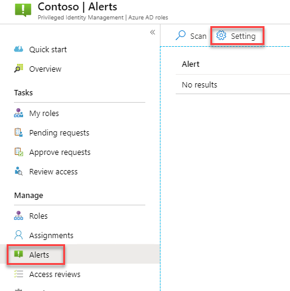


1.  미리 구성된 알림의 설정을 보려면 알림 이름을 클릭한다.


## 연습 5 - PIM Resource Workflows

### 작업 1: 승인이 필요한 전역 관리자 역할 구성

1.  **Azure AD Privileged Identity Management**를 클릭한다.

1.  **Azure AD 역할**을 클릭한다.

1.  **역할**을 클릭하고 **전역 관리자**를 선택한다.

1.  **역할 설정**을 클릭한다.

1.  **역할 설정** 블레이드에서 **편집**을 클릭한다.

1.  **활성화하려면 승인이 필요함**을 선택하고, 승인자에 사용자 계정을 할당한다.

1.  **역할 설정 편집 – 전역 관리자** 블레이드에서 **업데이트**를 클릭한다.

  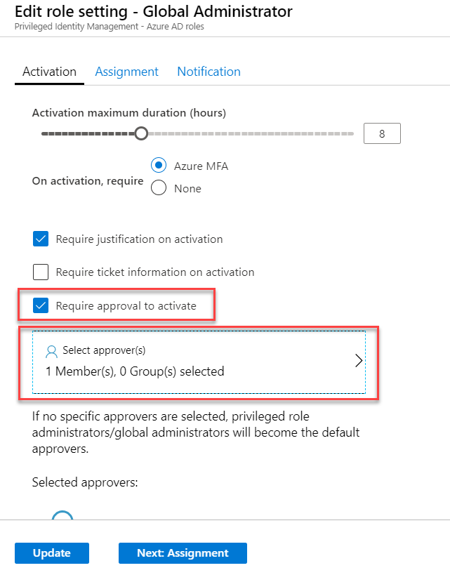


### 작업 2: Isabella에 Global Administrator 권한 부여

1.  **Azure AD Privileged Identity Management**를 클릭한다.

1.  **Azure AD 역할**을 클릭한다.

1.  **빠른 시작** 블레이드에서 **자격 할당**을 클릭한다.

     

1.  **전역 관리자**를 선택하고 **+ 할당 추가**를 클릭한다.

1.  **할당 추가** 블레이드에서 **구성원 선택** 아래 **선택한 구성원이 없음**을 클릭한다. **Isabella**를 선택하고 **다음**을 클릭한다. **할당**을 클릭한다.

1.  Private 모드로 브라우저 세션을 열어 potal.azure.com에 Isabella로 로그인한다. 

1.  **Azure AD Privileged Identity Management**를 클릭한다.

1.  **내 역할**을 선택한다.

     

1.  전역 관리자 역할을 **활성화**한다.

     

1.  마법사를 사용하여 Isabella 계정을 인증한다. 

     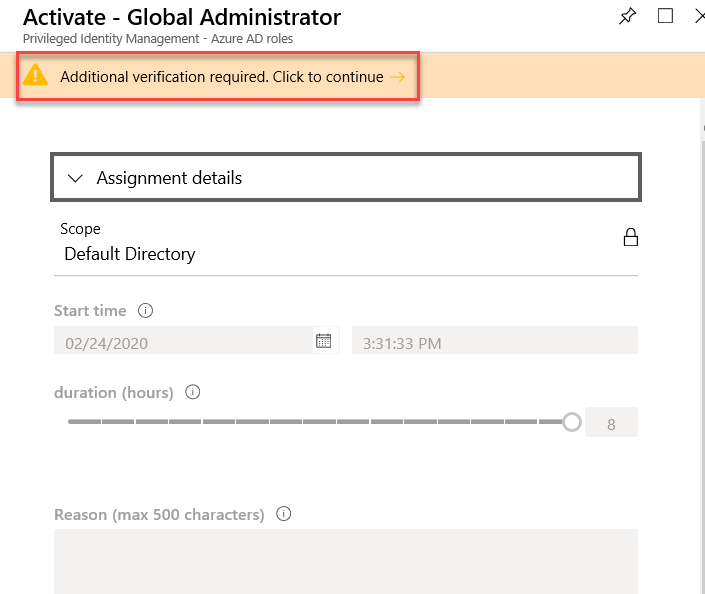

1.   **활성화 - 전역 관리자** 블레이드로 돌아와 **I need to carry out some administrative tasks** 를 이유로 입력하고 **활성화**를 클릭한다.

     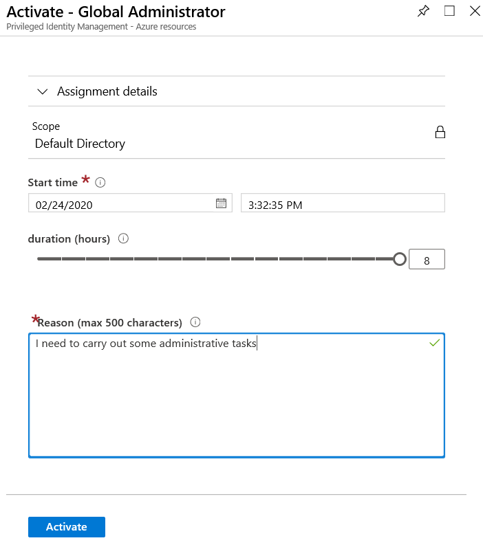


### 작업 3: PIM에서 Azure 리소스 역할에 대한 요청 승인 또는 거부

PIM(Azure AD Privileged Identity Management)을 사용하면 활성화에 대한 승인이 필요한 역할을 구성하고 하나 이상의 사용자 또는 그룹을 승인자로 위임할 수 있습니다. 이 문서의 단계에 따라 Azure 리소스 역할에 대한 요청을 승인하거나 거부하십시오.

#### 보류 중인 요청 보기

승인자로 지정된 사용자는 Azure 리소스 역할 요청이 승인 대기 중일 때 이메일 알림을 받게 됩니다. PIM에서 보류 중인 요청을 볼 수 있습니다.

1.  Global Administration 계정으로 로그인한 브라우저로 다시 전환한다.

1.  **Azure AD Privileged Identity Management**를 클릭한다.

1.  **요청 승인**을 클릭한다.

     

    **참고**: 요청을 확인하기 위해 브라우저를 새로고침해야 할 수도 있습니다. 

1.  Isabella로 부터 온 요청을 클릭하고 **승인**을 클릭한다.

     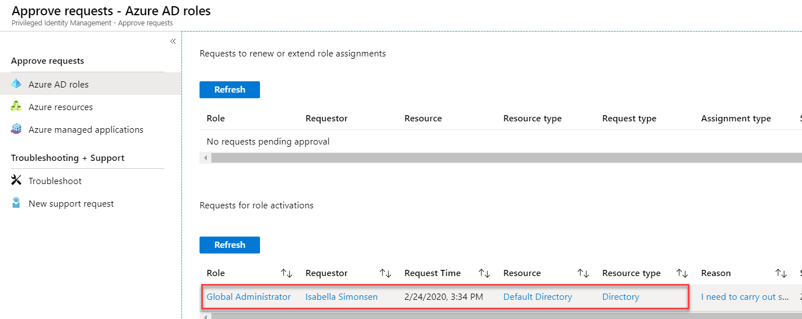

1.  Isabella가 로그인되어 있는 In Private 브라우징 세션으로 다시 전환하고, **내 역할**을 선택하고 **활성 역할** 탭을 클릭한다. 상태를 기록해 둔다.

     


## 연습 6 - PIM에서 Azure AD 역할에 대한 감사 기록 보기

Azure Active Directory(Azure AD) PIM(Privileged Identity Management) 감사 기록을 사용하여 모든 권한 있는 역할에 대해 지난 30일 이내에 모든 역할 할당 및 활성화 내역을 볼 수 있습니다. 관리자, 최종 사용자 및 동기화 활동을 포함하여 디렉토리에 있는 활동의 전체 감사 기록을 보려면, 다음을 사용하십시오. [Azure Active Directory security and activity reports](https://docs.microsoft.com/en-us/azure/active-directory/reports-monitoring/overview-reports).


### 작업 1: 감사 기록 확인

 Azure AD 역할에 대한 감사 기록을 확인하려면 다음 작업을 진행하십시오.

1.  **Azure AD Privileged Identity Management**를 클릭한다.

1.  **Azure AD roles**를 클릭한다.

1.  **개요**를 클릭해 차트를 확인한다. 

    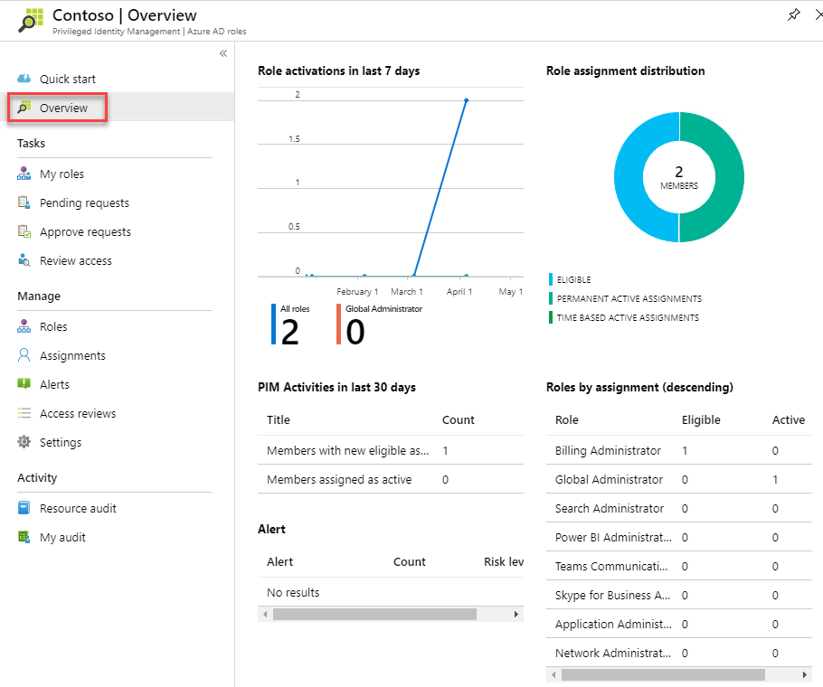

1.  **리소스 감사**를 클릭한다.

    감사 내역에 따라 총 활성화, 일일 최대 활성화, 일일 평균 활성화와 함께 열 차트가 표시된다.

    페이지 하단에 사용 가능한 감사 내역에 있는 각 조치에 대한 내용이 표시된다. 각 열은 다음과 같은 의미를 갖는다.

    | 열 | 설명 |
    | --- | --- |
    | 시간 | 작업이 수행된 시간 |
    | 요청자 | 역할 활성화 또는 변경을 요청한 사용자. 값이 **Azure System**인 경우 자세한 내용은 Azure 감사 기록을 확인 |
    | 작업 | 요청자가 취한 조치. 액션에는 할당, 할당 해제, 활성화, 비활성화 또는 AddedOutsidePIM이 포함될 수 있음 |
    | Member | 역할을 활성화하거나 할당된 사용자. |
    | Role | 사용자가 지정하거나 활성화한 역할. |
    | Reasoning | 활성화 이유 필드에 입력된 텍스트. |
    | Expiration | 활성화된 역할이 만료되는 경우. 적격 역할 할당에만 적용. |

1.  감사 로그를 정렬하려면 **시간**, **유형**, **원래 요청자** 버튼을 클릭한다.


### 작업 2: 감사 기록 필터링

1.  감사 기록 페이지 상단의 필터링 옵션을 사용한다.


