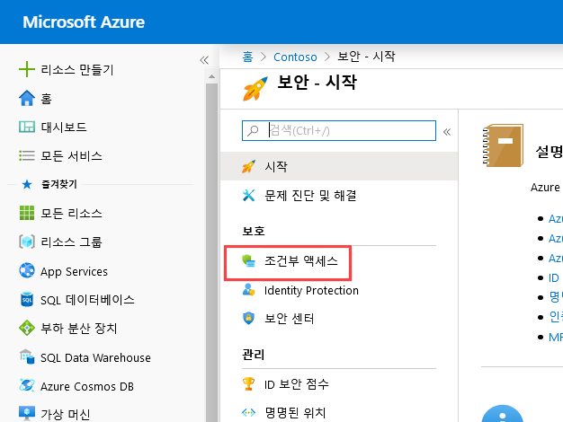
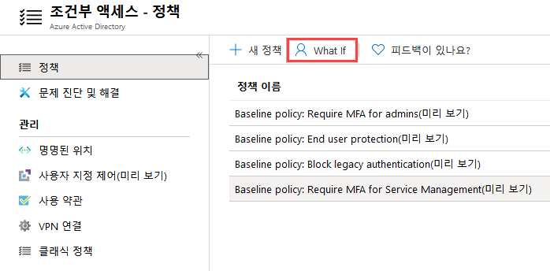
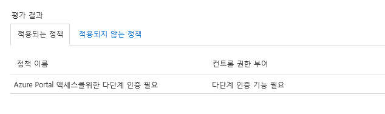
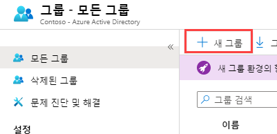
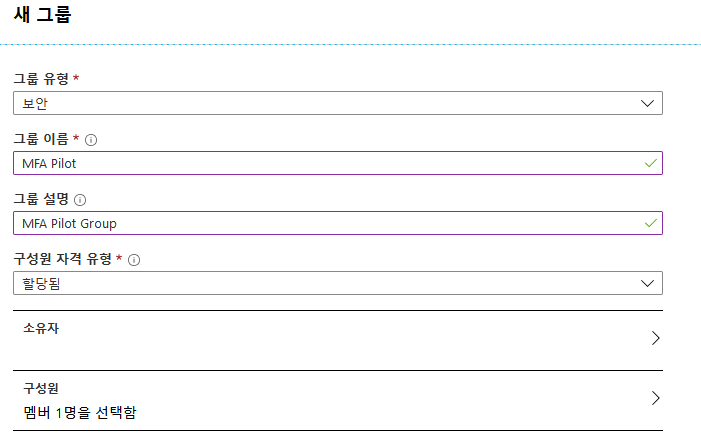

# 모듈 1: 랩 3: 보안 접근을 위한 다단계(Multi-Factor) 인증 사용

## 연습 1: MFA 인증 파일럿 (Azure Active Directory 조건부 접근이 가능한 특정 앱의 경우 MFA 필요)

### 작업 1: 조건부 접근 정책 생성

이 섹션에는 필요한 조건부 액세스 정책을 만드는 방법을 안내합니다. 이 시나리오에서는 다음을 사용합니다.

- The Azure portal as placeholder for a cloud app that requires MFA. 
- MFA가 필요한 클라우드 앱의 자리 표시자로 사용되는 Azure 포털  
- 조건부 액세스 정책을 테스트할 샘플 사용자

다음 값으로 정책을 설정합니다.

|설정 |값|
|---     | --- |
|Users and groups | Isabella Simonsen |
|Cloud apps | Microsoft Azure Management |
|Grant access | Require multi-factor authentication |

1.  Azure 포털에 로그인한다.

2.  Azure 포털의 메뉴에서 **Azure Active Directory**를 클릭한다.

3.  **관리** 섹션의 **속성**을 클릭하고, 하단의 **보안 기본값 관리**를 클릭한다.

4.  **보안 기본값 사용** 옵션을 **아니요**로 설정하고, **저장**을 클릭한다. 

5.  **관리** 섹션에서 **보안**을 클릭한다.

6.  **보안** 블레이드에서**조건부 액세스**를 클릭한다.

     
 
7.  **조건부 액세스** 페이지 상단의 **+ 새 정책**을 클릭한다.

    **참고**: 창이 활성화되지 않으면 브라우저를 새로고침 하십시오.

8.  **새로 만들기** 페이지에서 **이름** 창에 **Require MFA for Azure portal access**를 입력한다.

9.  **할당** 섹션의 **사용자 및 그룹**을 클릭한다.

10.  다음 작업을 실행한다.

      a. **사용자 및 그룹 선택**을 클릭하고, **사용자 및 그룹**을 선택한다.

      b. **선택**을 클릭한다.

      c. **선택** 페이지에서 **Isabella Simonsen**을 할당하고 **선택**을 클릭한다.

11.  **클라우드 앱 또는 작업**을 클릭한다.

12.  다음 작업을 실행한다.

    a. **앱 선택**을 클릭한다.

    b. **선택**을 클릭한다.

    c. **선택** 페이지에서 **Microsoft Azure Management**를 클릭하고, **선택**을 클릭한다.

13.  **액세스 제어** 섹션의 **허용**을 클릭한다.

14.  **허용** 페이지에서 다음 작업을 진행한다. 
     1. **액세스 허용**을 선택한다.
     2. **다단계 인증 기능 필요**를 선택한다.
     3. **선택**을 클릭한다.

15.  **정책 사용** 섹션에서 **설정**을 클릭한다.

16.  **만들기**를 클릭한다.

### 작업 2: 시뮬레이션된 로그인 평가

조건부 액세스 정책을 구성했으므로, 이 정책이 예상대로 작동하는지 여부를 확인합니다. 첫 번째 단계로 what if 정책 도구를 사용하여 테스트 사용자의 로그인을 시뮬레이션하십시오. 시뮬레이션은 이 로그인이 정책에 미치는 영향을 추정하고 시뮬레이션 보고서를 생성합니다.

다음 설정으로 정책 평가 도구를 시작합니다.

- 사용자 : **Isabella Simonsen** 
- cloud app : **Microsoft Azure Management** 

**What If**를 사용하면 다음 보고서를 생성합니다.

- **적용되는 정책** - **Require MFA for Azure portal access** 
- **컨트롤 권한 부여** - **다단계 인증 필요**

1.  조건부 액세스 - 정책 페이지 상단 메뉴에서 **What If**를 클릭한다.
 
     

2.  **사용자**를 클릭하고, **Isabella Simonsen**를 할당한 후 **선택**을 클릭한다.

3.  다음 작업을 수행하여 클라우드 앱을 선택한다.

    a. **클라우드 앱 또는 작업**을 클릭한다.

    b. **클라우드 앱** 항목에서, **앱 선택**을 클릭한다.

    c. **선택**을 클릭한다.

    d. **선택** 페이지에서 **Microsoft Azure Management**를 클릭하고 **선택**을 클릭한다.

    e. **클라우드 앱 또는 작업** 페이지에서 **완료**를 클릭한다.

4.  **What If** 버튼을 클릭한다.

5.  평가 결과에 **다단계 인증 필요**가 나타난 것을 확인한다. 

     

### 작업 3: 조건부 접근 정책 테스트

이전 섹션에서 시뮬레이션된 로그인을 평가하는 방법을 알아보았습니다. 시뮬레이션 외에도 조건부 접근 정책이 예상한 대로 작동하는지 테스트해야 합니다. 

정책을 테스트하기 위해 **Isabella Simonsen** 테스트 계정으로 **`https://portal.azure.com`** 에 로그인합니다. 추가 보안 확인을 위해 계정을 설정해야 하는 대화 상자가 표시되어야 합니다.

## 연습 2: MFA 조건부 액세스 (Azure Multi-Factor Authentication 파일럿 롤아웃 완료)

이 실습에서는 Azure 포털에 로그인할 때 Azure MFA(Azure Multi-Factor Authentication)를 활성화하는 조건부 액세스 정책을 구성하는 과정을 안내합니다. 이 정책은 특정 파일럿 사용자 그룹에 배치되고 테스트됩니다. 조건부 액세스를 이용한 Azure MFA 구축은 기존의 시행 방식과 비교할 때 조직과 관리자에게 상당한 유연성을 제공합니다.

- 다단계(Multi-Factor) 인증 사용
- 다단계(Multi-Factor) 인증 테스트

### 작업 1: Azure 다단계 인증 사용

1.  Azure 포털에 전역 관리자 계정으로 로그인한다.

1.  **Azure Active Directory**를 선택한다.

1.  **그룹**을 선택하고, **+ 새 그룹**을 클릭한다.

     

1.  다음 정보를 입력하고 **만들기**를 클릭한다.

      * 그룹 유형: **보안**
      * 그룹 이름: **MFA Pilot**
      * 그룹 설명: **MFA Pilot Group**
      * 구성원 자격 유형: **할당됨**
      * 구성원: **Isabella** 선택
  
      
  
2.  **Azure Active Directory**의 **보안**을 클릭하고, **조건부 액세스**를 클릭한다. 

3.  **+ 새 정책**을 클릭한다.

4.  이름 : **MFA Pilot**

5.  **사용자 및 그룹**을 클릭하고, **사용자 및 그룹 선택**의 체크박스를 선택한다. 
    * **MFA Pilot** 파일럿 그룹을 선택한다.
    * **선택**을 클릭한다.
     

6.  **클라우드 앱 또는 작업**에서 **앱 선택**을 클릭한다. 
    * **Microsoft Azure Management**를 할당한다.
    * **선택**을 클릭한다.
     

7.  **조건**은 그대로 둔다.

8.  **엑세스 제어** 아래 **허용**을 클릭한다.
    * **다단계 인증 기능 필요** 체크 박스를 클릭한다.
    * **선택**을 클릭한다.
     

9.  **세션**은 그대로 둔다.

10. **정책 사용**에서 **설정**을 클릭한다. 

11. **만들기**를 클릭한다.

### 작업 2: Azure 다단계 인증 테스트

조건부 액세스 정책이 작동하는지 확인하려면 MFA가 필요하지 않은 리소스에 로그인한 다음 MFA가 필요한 Azure 포털에 로그인하십시오.

1.  InPrivate 또는 Incognito 모드에서 새 브라우저 창을 열고 다음 주소로 접속한다. **`https://account.activedirectory.windowsazure.com`**
    * Isabella 계정으로 로그인한다. MFA를 요구받지 않는다. 
    * 브라우저 창을 닫는다.

2.  InPrivate 또는 Incognito 모드에서 새 브라우저 창을 열고 다음 주소로 접속한다.**`https://portal.azure.com`**

       * Isabella 계정으로 로그인한다.account. 이제 Azure Multi-Factor 인증이 요구된다.
       * 브라우저 창을 닫는다.

| 경고: 계속하기 전에 이 랩에 사용된 모든 리소스를 제거하십시오. **Azure 포털**에서 이 작업을 수행하려면 **리소스 그룹**을 클릭하십시오. 생성한 리소스 그룹을 선택하고, **리소스 그룹 삭제**를 누른 후 리소스 그룹 이름을 입력하여 **삭제**를 누르십시오. 생성한 추가 리소스 그룹에 대해 이 과정을 반복하십시오. **이 작업을 수행하지 않을 경우 다른 랩에 문제가 발생할 수 있습니다.** |
| --- |

