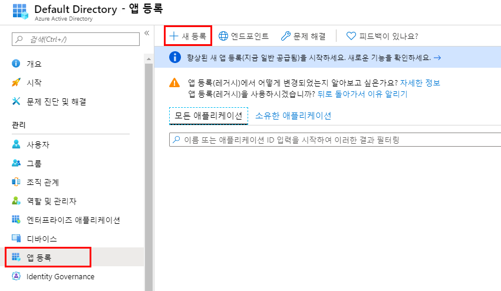
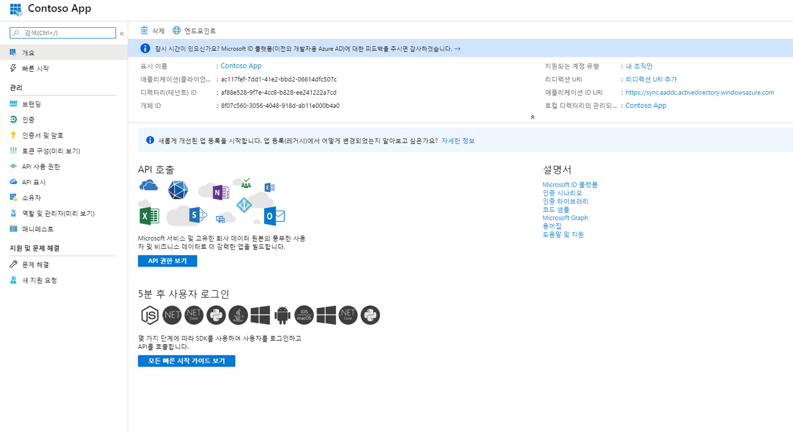

# 모듈 1: 랩 4 - 앱 등록

**시나리오**

기업 개발자 및 SaaS(Software-as-a-Service) 제공자는 Microsoft ID 플랫폼과 통합할 수 있는 상용 클라우드 서비스나 LOB(Line-of-Business) 앱을 개발하여 자사 서비스에 대한 보안 로그인 및 인증을 제공할 수 있습니다.

이 랩에서는 앱이 마이크로소프트 ID 플랫폼과 통합될 수 있도록 Azure 포털에서 앱을 추가하고 등록하는 방법을 안내합니다.

## 연습 1: 애플리케이션 등록

### 작업 1: Azure 포털을 통해 새로운 앱 등록

1.  Azure 포털에 로그인한다.

1.  메뉴에서 **Azure Active Directory** 서비스를 선택하고, **앱 등록 > 새 등록**을 클릭한다.

     

1.  **애플리케이션 등록** 페이지가 나타나면 앱의 등록 정보를 입력한다. 

       - **이름** - 입력: **Contoso App**
       - **지원되는 계정 유형** - **이 조직 디렉터리의 계정만** 선택 (아래 옵션을 참고)

       | 지원되는 계정 유형 | 설명 |
       |-------------------------|-------------|
       | **이 조직 디렉터리의 계정만** | LOB(Line-of-Business) 애플리케이션을 구축하는 경우 이 옵션을 선택하십시오. 앱을 디렉토리에 등록하지 않는 경우 이 선택사항을 사용할 수 없습니다.  이 옵션은 Azure AD 전용 단일 테넌트에 매핑됩니다.  디렉터리 외부에서 앱을 등록하지 않는 한 이 옵션은 기본 옵션입니다. 앱이 디렉토리 외부에 등록되어 있는 경우, 기본값은 Azure AD 멀티 테넌트 및 개인 마이크로소프트 계정입니다. |
       | **모든 조직 디렉터리의 계정** | 모든 비즈니스 및 교육 고객을 대상으로 지정하려면 이 옵션을 선택하십시오.  이 옵션은 Azure AD 전용 멀티 테넌트에 매핑됩니다.  앱을 Azure AD 전용 단일 테넌트로 등록한 경우 **인증** 블레이드를 통해 Azure AD 다중 테넌트로 업데이트하고 단일 테넌트로 되돌릴 수 있습니다. |
       | **모든 조직 디렉터리의 계정 및 개인 Microsoft 계정** | 가장 광범위한 고객 집합을 대상으로 지정하려면 이 옵션을 선택하십시오.  이 옵션은 Azure AD 멀티 테넌트 및 개인 마이크로소프트 계정에 매핑됩니다.  앱을 Azure AD 멀티 테넌트(Multi-tenant) 및 개인 Microsoft 계정으로 등록한 경우 UI에서 이를 변경할 수 없습니다. 대신 애플리케이션 manifest editor를 사용하여 지원되는 계정 유형을 변경하십시오. |

       - **리디렉션 URI (선택사항)** - **웹**을 선택하고, **`https://app.contoso.com`** 을 입력한다.
         - 웹 애플리케이션의 경우 앱의 기본 URL을 입력한다. 예를 들어 `http://localhost:31544`는 로컬 컴퓨터에서 실행되는 웹 앱의 URL일 수 있다. 사용자는 이 URL을 사용하여 웹 클라이언트 애플리케이션에 로그인할 수 있다.
         - 공용 클라이언트 애플리케이션의 경우 Azure AD에서 토큰 응답을 반환하는 데 사용되는 URI를 입력한다. `myapp://auth`와 같이 응용 프로그램 관련 값을 입력하십시오.
 

1.  완료되면 **등록**을 클릭한다.

1.  Azure AD가 고유 애플리케이션(클라이언트) ID를 앱에 할당하면 애플리케이션의 **개요** 페이지로 이동된다. 프로그램에 추가 기능을 추가하려면 브랜딩, 인증서 및 암호, API 사용 권한 등을 포함한 다른 구성 옵션을 선택한다.

     
 

