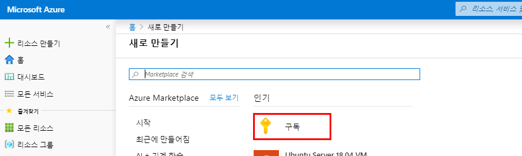
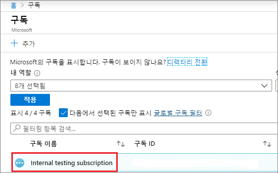
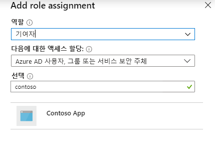
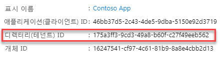
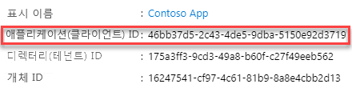
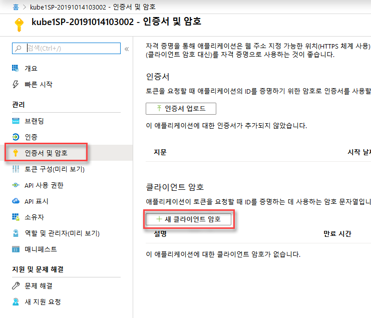
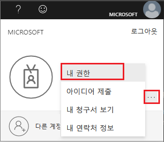
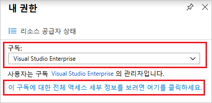

# 모듈 1: 랩 5 - 애플리케이션 서비스 주체 

**시나리오**

이 랩은 역할 기반 액세스 제어와 함께 사용할 수 있는 새로운 Azure Active Directory(Azure AD) 애플리케이션 및 서비스 주체 생성 방법을 안내합니다.리소스에 액세스하거나 리소스를 수정해야 하는 코드가 있으면 앱의 ID를 생성하십시오. ID는 서비스 주체로 알려져 있습니다. 그런 다음 서비스 주체에 필요한 권한을 부여할 수 있습니다. Azure 포털에서 서비스 주체를 생성하는 방법을 알아봅니다. 한 조직 내에서만 실행되는 단일 테넌트 애플리케이션에 초점을 맞춥니다. 일반적으로 조직 내에서 실행되는 LOB(Line-of-Business) 애플리케이션에 단일 테넌트 애플리케이션을 사용하십시오.

## 연습 1: 포털을 사용해 리소스에 접근할 수 있는 서비스 주체 생성

구독, 리소스 그룹 또는 리소스의 수준에서 범위를 설정할 수 있습니다. 권한은 하위 상속됩니다. 예를 들어, 애플리케이션에 리소스 그룹 읽기 권한을 추가하는 것은 애플리케이션이 리소스 그룹과 그 안에 포함된 모든 리소스를 읽을 수 있다는 것을 의미합니다.

### 작업 1: 역할에 애플리케이션 할당

1.  애플리케이션을 할당할 범위 수준으로 이동한다. 예를 들어 구독에서 역할을 할당하려면 **모든 서비스** 및 **구독**을 선택한다.

       

1.  구독을 선택한다.

       

1.  **액세스 제어 (IAM)** 를 선택한다.

1.  **+ 추가**를 클릭하고, **역할 할당 추가**를 클릭한다.

1.  애플리케이션에 할당할 Contributer 역할을 선택한다. 응용 프로그램에서 **reboot**, **start** 및 **stop** 인스턴스와 같은 작업을 실행할 수 있도록 하려면 **Contributor** 역할을 선택한다. 기본적으로 Azure AD 애플리케이션은 사용 가능한 옵션에 표시되지 않는다. 응용 프로그램을 찾으려면 **Contoso App** 이름을 검색하여 선택한다.

     

1.  **저장**을 클릭하여 역할 할당을 마무리한다. 해당 범위에 대해 역할에 할당된 사용자 목록에서 애플리케이션을 확인한다.

서비스 주체가 설정되었습니다. 스크립트나 앱을 실행하는 데 사용할 수 있습니다. 다음 섹션은 로그인할 때 필요한 값을 프로그래밍 방식으로 얻는 방법에 대해 알아봅니다.

### 작업 2: 로그인 값 획득

프로그래밍 방식으로 로그인할 때는 인증 요청으로 테넌트 ID를 전달해야 합니다. 애플리케이션 ID와 인증 키도 필요합니다. 이러한 값을 가져오려면 다음 단계를 수행하십시오.

1.  **Azure Active Directory**를 클릭한다.

1.  **앱 등록** 페이지에서 **Contoso App** 애플리케이션을 선택한다.

1.  **디렉터리 (테넌트) ID**를 복사하여 애플리케이션 코드에 저장한다. 

       

1.  **애플리케이션 (클라이언트) ID**를 복사하여 애플리케이션 코드에 저장한다.

       

### 작업 3: 새 애플리케이션 비밀값 생성

인증서 또는 응용 프로그램 암호를 선택할 수 있습니다. 이 작업에서 응용 프로그램 암호를 생성하십시오.

1.  **인증서 및 암호**를 선택한다.

1.  **클라이언트 암호 -> 새 클라이언트 암호**를 선택한다.
 
     

1.  암호에 대한 설명과 만료 시간을 설정하고 **추가**를 클릭한다. 

클라이언트 암호를 저장한 후 클라이언트 암호 값이 표시됩니다. 나중에 키를 검색할 수 없으므로 이 값을 복사하십시오. 애플리케이션에 로그인할 ID로 키 값을 제공하십시오. 애플리케이션에서 검색할 수 있는 키 값을 저장하십시오.

  
### 작업 4: Azure AD 권한 체크

1.  **Azure Active Directory**를 선택한다.

1.  **사용자 설정**을 선택한다.

1.  **앱 등록** 설정을 체크한다. 이 값은 관리자만 설정할 수 있다. **Yes**로 설정하면 Azure AD 테넌트의 모든 사용자가 앱을 등록할 수 있다.

 앱 등록 설정이 **No**로 설정되어 있는 경우 관리자 역할을 가진 사용자만 이러한 유형의 애플리케이션을 등록할 수 있다.

### 작업 5: Azure 구독 권한 확인 

Azure 구독에서 AD 앱을 역할에 할당하려면 계정은 반드시  `Microsoft.Authorization/*/Write` 권한이 있어야 합니다. 이 작업은 소유자 역할 또는 사용자 액세스 관리자를 통해 부여됩니다.

구독의 권한을 체크하려면

1.  오른쪽 상단의 계정을 선택하고 **... -> 내 권한**을 클릭한다.

       

1.  드롭다운 목록에서 서비스 주체를 만들 구독을 선택하십시오. 그런 다음 **'이 구독에 대한 전체 액세스 세부 정보를 보려면 여기를 클릭하세요'** 를 클릭한다. 

       
   
1.  할당된 역할을 확인거나 역할에 AD 앱을 할당할 수 있는 권한이 있는지 확인하려면 **역할 할당**을 선택한다. 그렇지 않은 경우 구독 관리자에게 사용자 액세스 관리자(User Access Administrator) 역할에 추가하도록 요청한다. 다음 이미지에서 사용자는 Owner 역할에 할당되며, 이는 사용자에게 적절한 권한이 있음을 의미한다.

       
