---
lab:
    title: '랩 6: Azure Policy'
    module: '모듈 1: ID 및 액세스 관리'
---

# 모듈 1: ID 및 액세스 관리 

리소스가 기업 표준 및 Service Level Agreement(서비스 수준 약정) 이 랩에서는 Azure Policy를 사용하여 다음과 같이 조직 전체에서 정책 만들기, 할당 및 관리와 관련된 몇 가지 일반적인 작업을 수행하는 방법을 배웁니다.

> - 나중에 만들 리소스에 대한 조건을 적용하는 정책 할당
> - 여러 리소스의 규정 준수 여부 추적을 위해 이니셔티브 정의 만들기/할당
> - 비준수 또는 거부된 리소스 확인
> - 조직 전체에서 새 정책 구현


## 랩 6: Azure Policy

### 연습 1: 규정 준수 상태를 유지하기 위해 Azure에서 정책을 만들고 관리하는 방법 이해

### 태스크 1: 정책 할당


Azure Policy를 통해 규정을 준수하는 첫 단계에서는 정책 정의를 할당합니다. 정책 정의는 정책이 적용되는 조건과 정책을 통해 적용하려는 효과를 정의합니다. 이 예제에서는 기본 제공 정책 정의인 *SQL Server 버전 12.0 필요*를 할당합니다. 이 정책 정의를 할당하면 모든 SQL Server 데이터베이스가 v12.0이어야 규정을 준수하는 상태가 됩니다.


1.  Azure Portal에서 **모든 서비스**를 클릭한 다음 **Policy**를 검색하고 선택하여 Azure Policy 서비스를 시작합니다.

    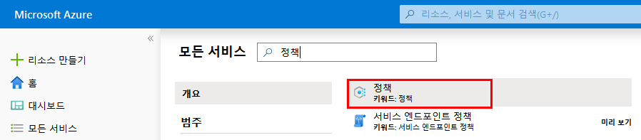

2.  Azure Policy 페이지의 왼쪽에서 **할당**을 선택합니다. 할당은
   특정 범위 내에서 수행하도록 할당된 정책입니다.

    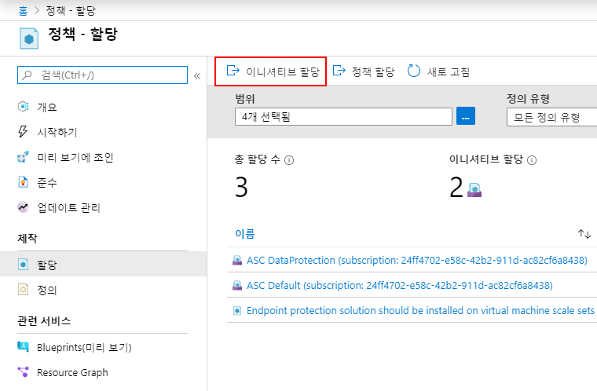

3.  **정책 - 할당** 페이지 위쪽에서 **정책 할당**을 선택합니다.

    

4.  **정책 할당** 페이지에서 줄임표를 클릭하고 관리 그룹이나 구독을 클릭하여 **범위**를 선택합니다. 필요한 경우 리소스 그룹을 선택합니다. 범위에 따라 정책 할당이 적용되는 리소스나 리소스 그룹이 결정됩니다. 그런 다음 **범위** 페이지 아래쪽의 **선택**을 클릭합니다.

    이 예제에서는 **Contoso** 구독을 사용합니다: 실제 구독의 이름은 다를 수 있습니다.

5.  **범위**를 기준으로 리소스를 제외할 수 있습니다. **제외**는 **범위** 수준 바로 아래 수준부터 시작됩니다. **제외**는 선택 사항이므로 일단은 비워 두세요.

6.  **정책 정의** 줄임표를 선택하여 사용 가능한 정의 목록을 엽니다. 정책 정의 **유형**을 *기본 제공*으로 필터링하여 모든 정의를 표시하고 해당 설명을 확인할 수 있습니다.

7.  **SQL Server 버전 12.0 필요**를 선택합니다. 이 정의를 즉시 찾을 수 없으면 검색 상자에 **SQL Server 필요**를 입력한 다음 Enter 키를 누르거나 검색 상자 바깥쪽을 클릭합니다. 정책 정의를 찾아서 선택한 후 **사용 가능한 정의** 페이지 아래쪽의 **선택**을 클릭합니다.

    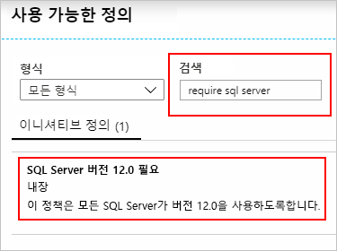

1.  **할당 이름**에는 선택한 정책 이름이 자동으로 입력됩니다. 하지만 이 이름은 변경할 수 있습니다. 이 예제에서는 *SQL Server 버전 12.0 필요*를 그대로 유지합니다. 원하는 경우 **설명**을 추가할 수도 있습니다. 설명은 이 정책 할당 관련 세부 정보를 제공합니다. **할당한 사람**은 로그인한 사용자에 따라 자동으로 입력됩니다. 이 필드도 선택 사항이므로 사용자 지정 값을 입력할 수 있습니다.

1.  **관리 ID 생성**은 선택하지 않은 상태로 유지합니다. 할당 중인 정책이나 이니셔티브에 **`deployIfNotExists`** 효과가 포함된 정책이 있으면 이 확인란을_ _선택해야 합니다. 이 연습에서 사용하는 정책에는 해당 효과가 없으므로 확인란을 선택하지 않은 상태로 두면 됩니다. 

1.  **할당**을 클릭합니다.

### 태스크 2: 새 사용자 지정 정책 구현

기본 제공 정책 정의를 할당했으므로 Azure Policy를 통해 더 많은 작업을 수행할 수 있습니다. 다음으로는 환경에 생성된 VM을 G 시리즈에 포함할 수 없음을 확인하는 유효성 검사를 수행하여 비용을 절약하는 새 사용자 지정 정책을 만듭니다. 이 정책을 적용하면 조직의 사용자가 G 시리즈에서 VM 생성을 시도할 때마다 요청이 거부됩니다.

1.  Azure Policy 페이지의 왼쪽에서 **작성** 아래의 **정의**를 선택합니다.

    
  
1.  페이지 위쪽의 **+ 정책 정의**를 선택합니다. 이 단추를 클릭하면 **정책 정의** 페이지가 열립니다.

1.  다음 정보를 입력합니다.

    - 정책 정의가 저장되는 관리 그룹이나 구독. 이 항목을 선택하려면
     **정의 위치**의 줄임표를 사용합니다.

       **참고**: 여러 구독에 이 정책 정의를 여러 구독에 적용하려는 경우에는 정책을 할당하는 구독이 포함된 관리 그룹을 위치로 지정해야 합니다. 이니셔티브 정의의 경우에도 마찬가지입니다.


    - 정책 정의 이름 - *G 시리즈보다 작은 VM SKU 필요*
    - 정책 정의의 용도 설명 - *이 정책 정의는
     비용을 줄이기 위해 이 범위에서 생성하는 모든 VM의 SKU가 G 시리즈보다 작아야 한다는 정책을
     적용합니다.*
    - _Compute_ 등의 기존 옵션에서 선택하거나 이 정책 정의용으로 새 범주를
     만듭니다.
    - 다음 JSON 코드를 복사한 다음 요구에 따라 다음 항목을 추가하여 업데이트합니다.
      - 정책 매개 변수
      - 정책 규칙/조건(여기서는 VM SKU 크기 = G 시리즈)
      - 정책의 효과(여기서는 **거부**)

    이렇게 수정된 JSON은 다음과 같습니다. Azure Portal에 수정된 코드를 붙여넣으세요.

   ```json
   {
       "policyRule": {
           "if": {
               "allOf": [{
                       "field": "type",
                       "equals": "Microsoft.Compute/virtualMachines"
                   },
                   {
                       "field": "Microsoft.Compute/virtualMachines/sku.name",
                       "like": "Standard_G*"
                   }
               ]
           },
           "then": {
               "effect": "deny"
           }
       }
   }
   ```

  
   정책 규칙의*field* 속성 값은 이름, 유형, 위치, 태그 또는 별칭 중 하나여야 합니다. 별칭의 예로는 **`"Microsoft.Compute/VirtualMachines/Size"`** 등이 있습니다.

4.  **저장**을 선택합니다.

### 태스크 3: 이니셔티브 정의 생성 및 할당

이니셔티브 정의를 사용하면 가장 중요한 목표 한 가지를 달성하기 위해 여러 정책 정의를 그룹화할 수 있습니다. 이니셔티브는 할당 범위 내의 리소스가 포함된 정책을 준수하는지를 평가합니다. 


1.  Azure Policy 페이지의 왼쪽에서 **작성** 아래의 **정의**를 선택합니다.

    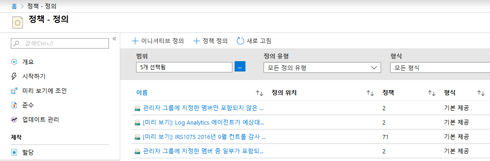

1.  **+ 이니셔티브 정의**를 선택하여 **이니셔티브 정의** 페이지를
   엽니다.

    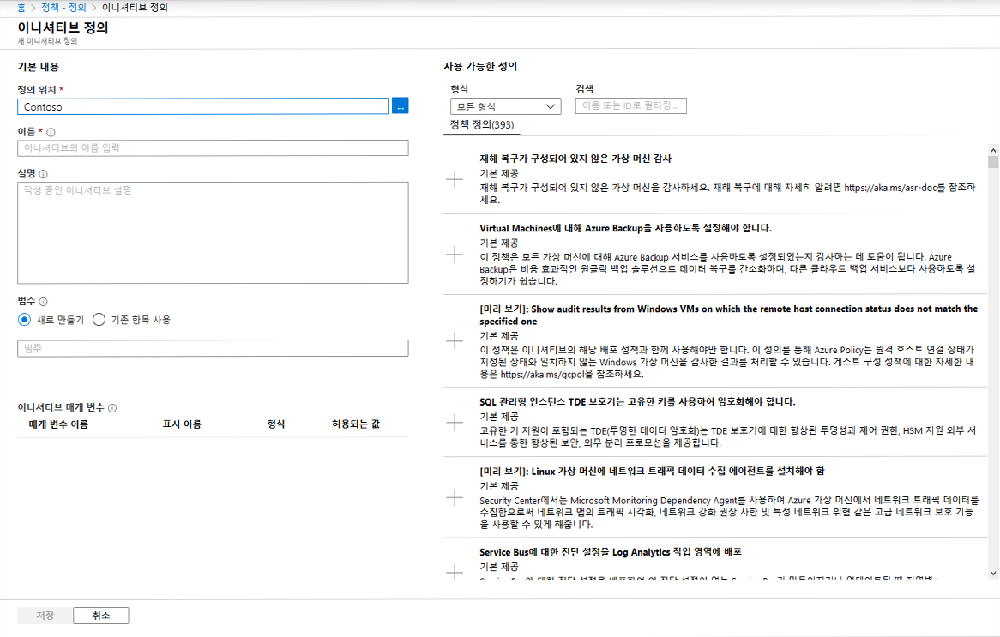

1.  **정의 위치** 줄임표를 사용하여 정의를 저장할 관리 그룹이나 구독을 선택합니다. 이전 페이지에서 범위를 단일 관리 그룹이나 구독으로 지정한 경우에는 **정의 위치**에 위치가 자동으로 입력됩니다.

1.  이니셔티브의 **이름**과 **설명**을 입력합니다.

    이 예제에서는 보안 유지 관련 정책 정의를 사용해 리소스가 규정을 준수하는지 유효성을 검사합니다. 이니셔티브 이름을 **보안 유지**로 지정하고 설명은 **리소스 보호와 연관된 모든 정책 정의를 처리하기 위해 생성된 이니셔티브입니다.**로 설정합니다.

1.  **범주**로는 기존 옵션 중에서 선택하거나 새 범주를 만듭니다.

1.  **이니셔티브 정의** 페이지 오른쪽의 **사용 가능한 정의** 목록을 검색하여
   이 이니셔티브에 추가할 정책 정의를 선택합니다. **보안
   유지** 이니셔티브에서 정책 정의 정보 옆의 **+**를 클릭하거나
   정책 정의 행을 클릭하고 세부 정보 페이지에서 **+ 추가** 옵션을 클릭하여
   다음 기본 제공 정책 정의를 추가합니다.

    - SQL Server 버전 12.0 필요
    - [미리 보기]: Security Center에서 보호되지 않는 웹 애플리케이션을 모니터링합니다.
    - [미리 보기]: Security Center 전체에서 허용되는 네트워크를 모니터링합니다.
    - [미리 보기]: Security Center에서 사용 가능한 앱 허용 목록을 모니터링합니다.
    - [미리 보기]: Security Center에서 암호화되지 않은 VM 디스크를 모니터링합니다.

    목록에서 선택한 정책 정의는 **정책 및 매개 변수** 아래에 추가됩니다.

    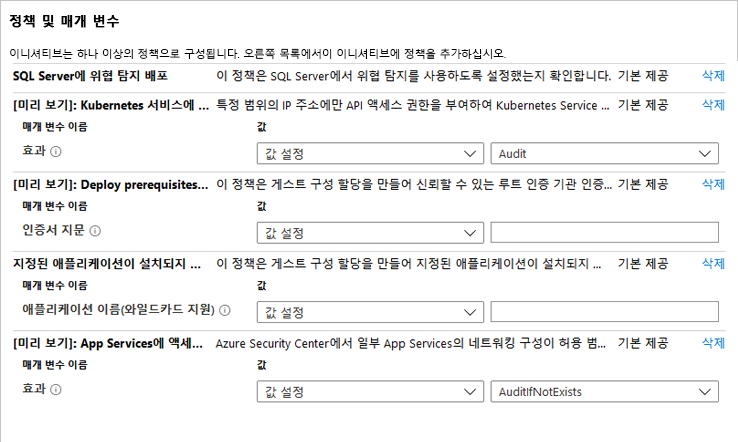

1.  이니셔티브에 추가하는 정책 정의에 매개 변수가 있으면
   **정책 및 매개 변수** 영역의 정책 이름 아래에 표시됩니다. _값_은 '값 설정'(이 이니셔티브의
   모든 할당용으로 하드 코드됨) 또는 '이니셔티브 매개 변수 사용'(각 이니셔티브 할당 중에 설정됨)으로
   설정할 수 있습니다. '값 설정'을 선택하면 _값_ 오른쪽 드롭다운에서 값을
   선택하거나 입력할 수 있습니다. '이니셔티브 매개 변수 사용'을 선택하면
   새 **이니셔티브 매개 변수** 섹션이 표시되므로 이니셔티브 할당 중에 설정되는 매개 변수를
   정의할 수 있습니다. 이 이니셔티브 매개 변수에 사용할 수 있는 값에 따라
   이니셔티브 할당 중에 설정 가능한 값이 추가로 제한될 수 있습니다.

    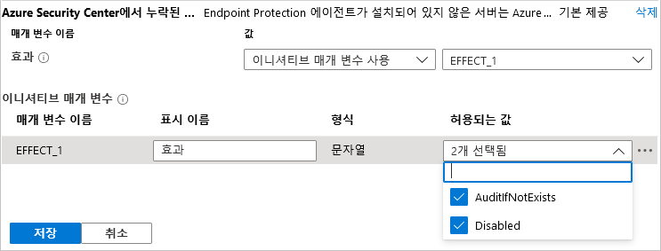

    **참고**: 일부 `strongType` 매개 변수의 경우에는 값 목록을 자동으로 결정할 수 없습니다. 이러한 경우에는 매개 변수 행 오른쪽에 줄임표가 나타납니다. 이 줄임표를 클릭하면 '매개 변수 범위(&lt;매개 변수 이름&gt;)' 페이지가 열립니다. 이 페이지에서 값 옵션을 제공하는 데 사용할 구독을 선택합니다. 이 매개 변수 범위는 이니셔티브 정의 생성 중에만 사용되며, 할당된 이니셔티브의 범위나 정책 평가에는 아무런 영향을 주지 않습니다.

2.  **저장**을 클릭합니다.

### 태스크 4: 이니셔티브 정의 할당

1.  Azure Policy 페이지의 왼쪽에서 **작성** 아래의 **정의**를 선택합니다.

1.  앞에서 만든 **보안 유지** 이니셔티브 정의를 찾아서 선택합니다. 페이지 위쪽의 **할당**을 선택하여 **보안 유지: 이니셔티브 할당** 페이지를 엽니다.

    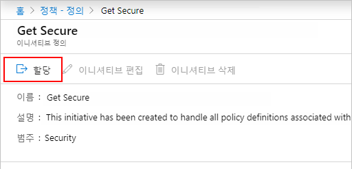
  
    선택한 행을 마우스 오른쪽 단추로 클릭하거나 행 끝의 줄임표를 마우스 왼쪽 단추로 클릭하여 상황에 맞는 메뉴를 표시한 다음 **할당**을 선택해도 됩니다.

    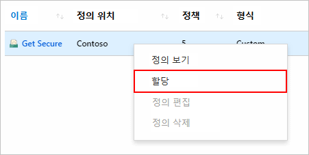

1.  **보안 유지: 이니셔티브 할당** 페이지에 다음 예제 정보를 입력합니다. 실제 정보를 사용해도 됩니다.

    - 범위: 이니셔티브를 저장한 관리 그룹이나 구독이 기본 범위로 설정됩니다. 범위를 변경하여 저장 위치 내의 구독이나 리소스 그룹에 이니셔티브를 할당할 수 있습니다.
    - 제외: 이니셔티브 할당이 적용되지 않도록 할 범위 내의 리소스를 구성합니다.
    - 이니셔티브 정의 및 할당 이름: 보안 유지(할당 중인 이니셔티브 이름이 미리 입력되어 있음)
    - 설명: 이 정책 정의 그룹을 적용하도록 조정된 이니셔티브 할당입니다.
    - 할당한 사람: 로그인한 사용자에 따라 자동으로 입력됩니다. 이 필드도 선택 사항이므로 사용자 지정 값을 입력할 수 있습니다.

2.  **관리 ID 생성**은 선택하지 않은 상태로 유지합니다. 할당 중인 정책이나 이니셔티브에 **`deployIfNotExists`** 효과가 포함된 정책이 있으면 이 확인란을_ _선택해야 합니다. 이 연습에서 사용하는 정책에는 해당 효과가 없으므로 확인란을 선택하지 않은 상태로 두면 됩니다. 

3.  **할당**을 클릭합니다.

### 태스크 5: 초기 규정 준수 확인

1.  Azure Policy 페이지의 왼쪽에서 **규정 준수**를 선택합니다.

1.  **보안 유지** 이니셔티브를 찾습니다. 이 이니셔티브의 _준수 상태_는 아직 **시작되지 않음**일 가능성이 높습니다. 이니셔티브를 클릭하여 할당 진행 상황 관련 전체 세부 정보를 표시합니다.

     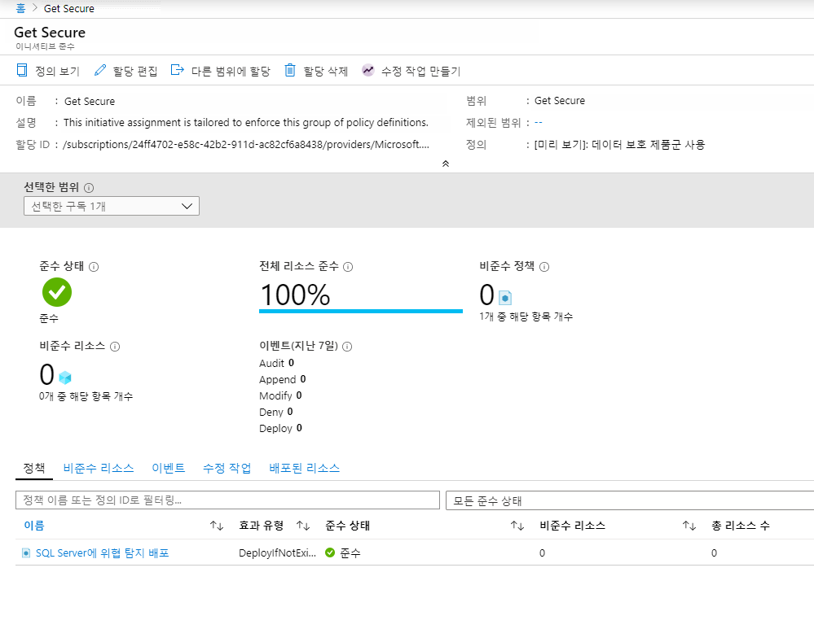

1.  이니셔티브 할당이 완료되면 규정 준수 페이지가 업데이트되어 _준수 상태_가 **준수**로 변경됩니다.

     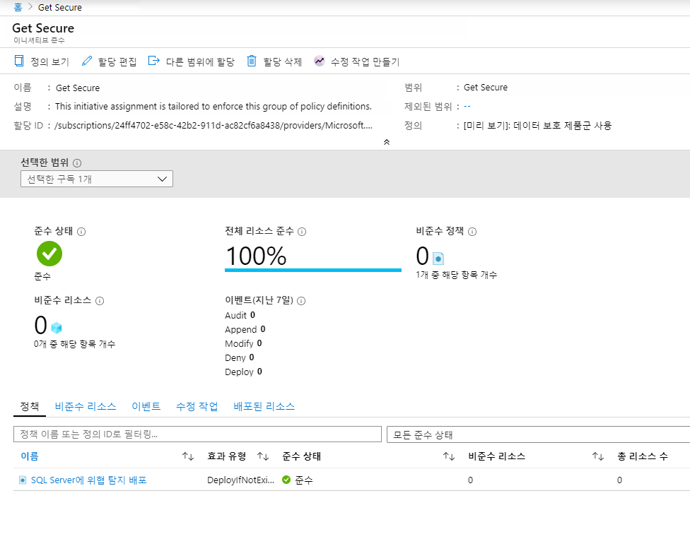

1.  이니셔티브 규정 준수 페이지에서 정책을 클릭하면 정책의 규정 준수 세부 정보 페이지가
   열립니다. 이 페이지에서는 규정 준수를 위한 리소스 수준의 세부 정보가 제공됩니다.

### 태스크 6: 제외를 사용하여 비준수 또는 거부된 리소스를 예외로 지정

위의 예제에서 SQL Server 버전 12.0이 필요하도록 지정하는 정책 정의를 할당하고 나면 12.0 이외의 버전으로 생성된 SQL Server는 거부됩니다. 이 태스크에서는 단일 리소스 그룹을 대상으로 제외를 만들어 거부된 SQL Server 생성 요청을 해결하는 과정을 진행합니다. 제외를 만들면 해당 리소스에 정책이나 이니셔티브가 적용되지 않습니다. 다음 예제에서는 단일 리소스 그룹에서 모든 SQL Server 버전이 허용됩니다. 제외는 구독/리소스 그룹에 적용할 수도 있고 개별 리소스에 적용할 수도 있습니다.


할당된 정책이나 이니셔티브에 의해 금지되는 배포는 다음의 두 위치에서 확인할 수 있습니다.

- 배포 대상 리소스 그룹: 페이지 왼쪽에서 **배포**를 선택하고 실패한 배포의 **배포 이름**을 클릭합니다. 그러면 배포가 거부된 리소스(상태: _사용할 수 없음_)가 목록에 표시됩니다. 리소스를 거부 한 정책 또는 이니셔티브와 할당을 확인하려면 배포 개요 페이지에서 **실패했습니다. 자세한 내용을 보려면 여기를 클릭하세요. ->**를 클릭합니다. 그러면 페이지 오른쪽에 오류 정보가 포함된 창이 열립니다. **오류 정보** 아래에 관련 정책 개체의 GUID가 표시됩니다.

  

- Azure 정책 페이지: 페이지 왼쪽에서 **규정 준수**를 선택하고 **SQL Server 버전 12.0 필요** 정책을 클릭합니다. 페이지가 열리면 **거부** 개수가 늘어났음을 확인할 수 있습니다. **이벤트** 탭 아래에서 정책에 의해 거부된 배포를 시도한 사람을 확인할 수 있습니다.

 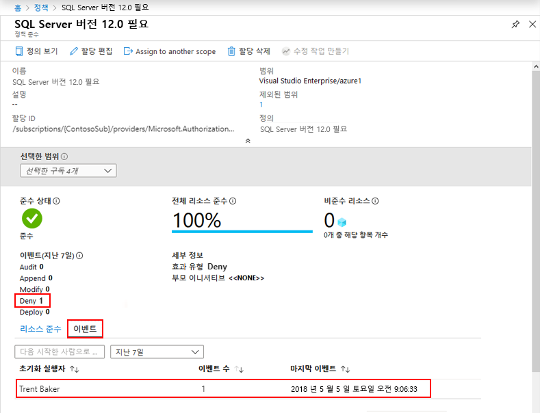

이 예제에서는 Contoso의 선임 가상화 전문가인 Trent Baker가 필요한 작업을 수행하고 있었습니다. 따라서 Trent에게는 예외를 허용하되 다른 리소스 그룹에는 버전 12.0 이외의 SQL 서버가 포함되어서는 안 됩니다. 여기서는 새로 만든 리소스 그룹 **SQLServers_Excluded**에 이 정책 할당의 예외를 허용합니다.

### 태스크 7: 예외를 포함하여 할당 업데이트

1.  Azure Policy 페이지의 왼쪽에서 **작성** 아래의 **할당**을 선택합니다.

2.  모든 정책 할당을 검색한 다음 *SQL Server 버전 12.0 필요* 할당을 엽니다.

3.  줄임표를 클릭하고 제외할 리소스 그룹을 선택하여 **예외**를 설정합니다.
   이 예제에서 제외할 리소스 그룹은 *SQLServers_Excluded*입니다.

    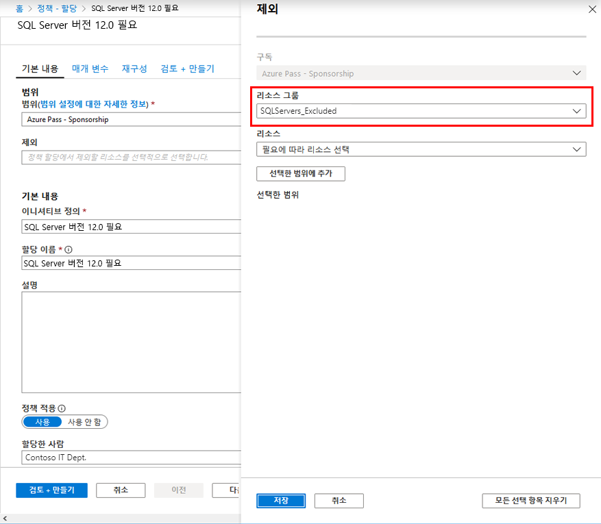

    **참고**:  정책과 해당 효과에 따라 할당 범위 내에서 리소스 그룹의 특정 리소스에 예외를 허용할 수도 있습니다. 이 자습서에서는 **거부** 효과를 사용했으므로 이미 있는 특정 리소스에 대해서는 예외를 설정할 필요가 없습니다.
@@@

1.  **선택**, **저장**을 차례로 클릭합니다.

이 섹션에서는 단일 리소스 그룹에 대한 예외를 작성하여 요청 거부 문제를 해결했습니다.


### 태스크 8: 리소스 정리

이제 이 랩의 리소스를 사용하는 작업을 완료했으므로 다음 단계를 수행하여 위에서 만든 할당이나 정의를 모두 삭제하세요.


1.  Azure Policy 페이지의 왼쪽에서 **작성** 아래의 **정의**를 선택하거나, 할당을 삭제하려면 **할당**을 선택합니다.

1.  제거하려는 새 이니셔티브 또는 정책 정의나 할당을 검색합니다.

1.  행을 마우스 오른쪽 단추로 클릭하거나 정의 또는 할당 끝부분의 줄임표를 선택하고 **정의 삭제** 또는 **할당 삭제**를 선택합니다.

이 랩에서는 다음 태스크를 완료했습니다.

> - 나중에 만들 리소스에 대한 조건을 적용하는 정책 할당
> - 여러 리소스의 규정 준수 여부 추적을 위해 이니셔티브 정의 만들기/할당
> - 비준수 또는 거부된 리소스 확인
> - 조직 전체에서 새 정책 구현


**결과**: 이 랩이 완료되었습니다.

