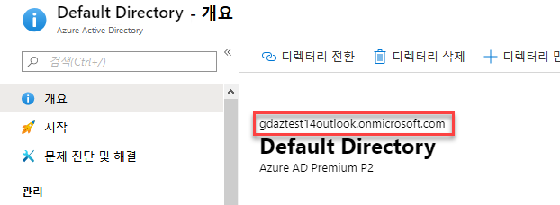
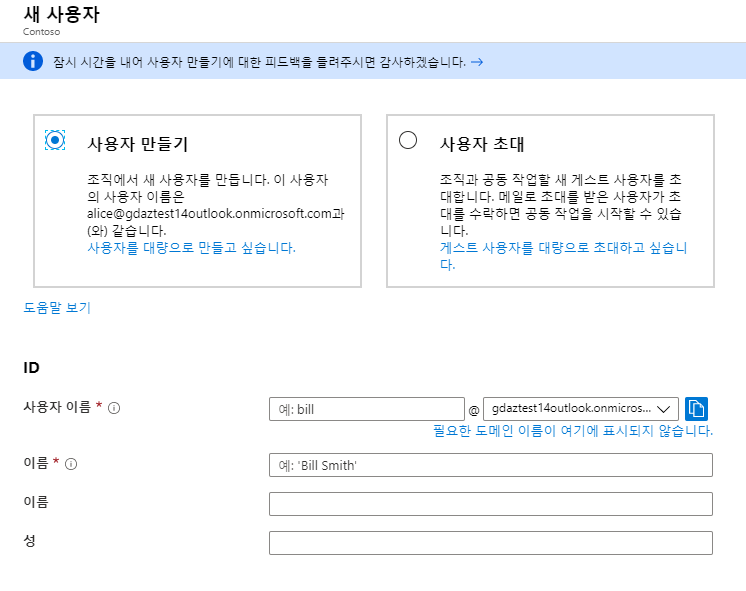
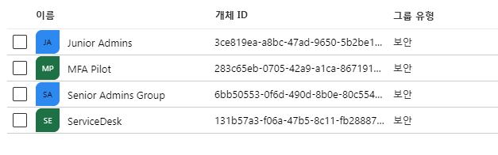
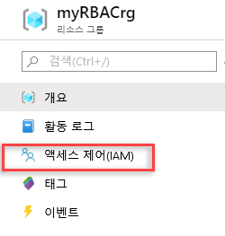
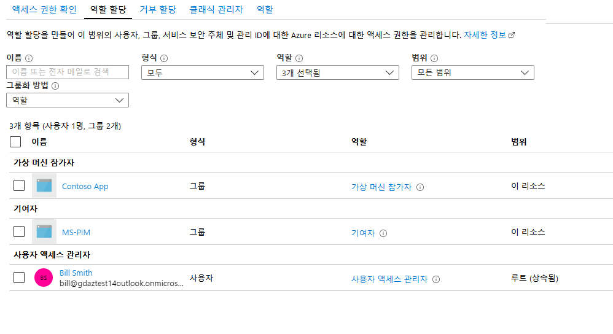

---
lab:
    title: 'LAB 06_ID 및 접근 관리'
    module: '모듈 01 - 계정과 접근 관리'
---

# 랩: ID 및 접근 관리

**시나리오**

이 모듈에서는 최소 특권의 원칙에 따라 조직의 관리 액세스를 구성하고 관리하기 위한 역할 기반 액세스 제어에 대해 안내합니다. 또한 Azure Active Directory 개념을 검토하고, IT 조직에 노출되는 보안 위험 및 보안 위험에 대한 통찰력을 얻을 수 있습니다. 

- 역할 기반 접근 제어
- Azure Active Directory (Refresher)
- Protecting Privileged Access in the Environment


# 랩 5: Azure에서의 ID 보호 도입

## 연습 1: 역할 기반 접근 제어

### 작업 1: 사용자 생성

1. Azure 포털에 로그인한다. **`https://portal.azure.com/`**

2. **Azure Active Directory**를 선택하고 개요 블레이드에서 테넌트 도메인을 메모해둔다.

     

3. **사용자**를 선택하고, **새 사용자**를 선택한다.

4. **새 사용자** 페이지에서 다음 정보를 입력한다.

      - **사용자 이름**: bill
      - **이름**: Bill Smith

     

5. 자동 생성된 암호를 **암호** 박스에서 볼 수 있다. 이 암호를 초기 로그인 과정에 사용할 수 있다. 
  
6. **만들기**를 선택한다.

    사용자가 생성되고 Azure AD 테넌트에 추가된다.

7. Azure 포털 상단의 PowerShell 아이콘을 클릭하여 **Azure Cloud Shell**을 시작한다. 다음 명령을 사용하여 AzureAD에 연결한다. 

    ```powershell
    Connect-AzureAD
    ```

8. **yourdomain** 부분을 앞서 메모한 테넌트 도메인으로 대체하여 PowerShell에 **다음 명령을 입력한다** 

    ```powershell
    $PasswordProfile = New-Object -TypeName Microsoft.Open.AzureAD.Model.PasswordProfile
    ```
    ```powershell
    $PasswordProfile.Password = "Pa55w.rd"
    ```
    ```powershell
    New-AzureADUser -DisplayName "Mark" -PasswordProfile $PasswordProfile -UserPrincipalName "Mark@yourdomain.onmicrosoft.com" -AccountEnabled $true -MailNickName "Mark"
    ```
 
     

9. 다음 명령을 입력하여 Azure AD 내의 사용자 목록을 확인한다.

    ```powershell
    Get-AzureADUser 
    ```
 
10. 드롭다운 메뉴의 **Bash**를 통해 Azure Cloud Shell의 Azure CLI 모드로 변경한다.

     

11. **yourdomain** 부분을 앞서 메모한 테넌트 도메인으로 대체하고, **Azure CLI**에 다음 명령을 입력하여 사용자를 생성한다.

    ```cli
    az ad user create --display-name Tracy --password Pa55w.rd --user-principal-name Tracy@yourdomain.onmicrosoft.com
    ```

이제 Azure AD 내에 5명의 사용자가 있어야 합니다.


### 작업 2: Azure 포털, PawerShell, CLI에서 그룹 생성 

1. Azure포털에서 **Azure Active Directory**를 클릭한다. **그룹**을 선택하고, **+새 그룹**을 클릭한다. 
 
2. 다음 설정을 사용한다.
  
      - **그룹 유형**: 보안
      - **그룹 이름**: Senior Admins Group 
    
3. 구성원 섹션에서 **선택한 멤버가 없음**을 클릭하고, **Bill**을 찾아 **선택**한다.

4. **만들기**를 클릭한다.

5. Azure Portal 상단의 Cloud Shell 아이콘을 클릭하여 **Cloud Shell** 내의 **Bash** 모드를 시작한다.

6. **Cloud Shell**에 다음 명령을 입력한다.

    ```cli
    az ad group create --display-name ServiceDesk --mail-nickname ServiceDesk
    ```

7. **PowerShell** 모드로 변경하고, 다음 명령을 입력한다.

    ```powershell
    Connect-AzureAD
    ```

    ```powershell
    New-AzureADGroup -DisplayName "Junior Admins" -MailEnabled $false -SecurityEnabled $true -MailNickName JuniorAdmins
    ```
 
8. **Cloud Shell**을 닫는다.

9. **Active Directory blade**에서 **그룹**을 클릭하고 **5**개의 그룹이 있는 것을 확인한다. 

     


## 연습 2: Azure 포털을 이용하여 역할 기반 접근 제어(RBAC)

### 작업 1: 리소스 그룹 생성

1. Azure 포털에서 **리소스 그룹**을 클릭한다.

2. **추가**를 선택한다.

3. **리소스 그룹** 이름으로 **myRBACrg**를 입력한다.

4. 구독을 선택하고, 영역을 **미국 동부**로 지정한다.

5. **검토 + 만들기**를 클릭하고, **만들기**를 클릭하여 리소스 그룹을 생성한다. 

6. **새로고침**을 클릭하여 리소스 그룹 목록을 업데이트한다.

  리소스 그룹 목록에 새로 생성한 그룹이 나타납니다.


### 작업 2: 접근권한 부여

RBAC에서 접근 권한을 부여하려면 역할 할당을 생성해야 합니다.

1. **리소스 그룹** 목록에서 **myRBACrg**를 선택한다.

1. **액세스 제어 (IAM)** 를 선택하여 역할 할당 목록을 확인한다. 

      

1. **추가**를 선택하여 **역할 할당 추가** 창을 연다.

    역할을 할당할 수 있는 권한이 없는 경우 **추가** 옵션이 표시되지 않습니다.

1. **역할** 드롭다운 목록에서 **가상 머신 참가자**를 선택한다.

1. **선택** 목록에서 **Bill Smith**를 선택한다.

1. **저장**을 선택하여 역할 할당을 생성한다.

  잠시 후, 가상 시스템 기여자 역할이 할당된 사용자가 myRBACrg 리소스 그룹 범위에 나타납니다.
  

### 작업 3: 접근 권한 제거

RBAC에서 접근 권한을 삭제하려면 역할 할당을 제거해야 합니다.

1. 역할 할당 탭을 클릭한다.

1. 역할 할당 목록에서 가상 머신 참가자 역할 옆의 체크박스를 클릭한다. 

      

1. **제거**를 선택한다.

1. 역할 할당 제거를 확인하는 메시지가 뜨면, **예**를 클릭한다.
   
  
## 연습 3: PowerShell을 사용하여 역할 기반 접근 제어(RBAC) 

이 실습에서는 PowerShell을 사용하여 다음과 같은 실습을 진행합니다.

-   `Get-AzRoleAssignment` 명령을 사용하여 역할 할당 목록을 나열
-   `Remove-AzResourceGroup` 명령을 사용하여 접근 제거


### 작업 1: 접근 권한 부여

사용자에게 접근 권한을 부여하려면 `New-AzRoleAssignment` 명령을 사용하여 역할을 할당합니다. 보안 주체, 역할 정의 및 범위를 지정해야 합니다.

1. **Cloud Shell**의 **PowerShell** 세션을 시작한다.
  
1. **`Get-AzSubscription`** 명령을 사용하여 구독 ID를 확인한다.
  
    ```powershell
    Get-AzSubscription
    ```

1. 다음 명령의 '000000' 부분을 구독 ID로 대체하여 구독 범위를 변수에 저장한다. 
  
    ```powershell
    $subScope = "/subscriptions/00000000-0000-0000-0000-000000000000" 
    ```  
  
1. 다음 명령을 사용하여 구독 범위에 있는 사용자에게 Reader 역할을 할당한다.(`yourdomain`을 앞서 메모한 테넌트 도메인으로 대체한다)

    ```powershell
    New-AzRoleAssignment -SignInName bill@yourdomain.onmicrosoft.com -RoleDefinitionName "Reader" -Scope $subScope  
    ```
  
      
  
1. 다음 명령을 사용하여 리소스 그룹 범위에 있는 사용자에게 Contributor 역할을 할당한다.
  
    ```powershell
    New-AzRoleAssignment -SignInName bill@yourdomain.onmicrosoft.com -RoleDefinitionName "Contributor" -ResourceGroupName "myRBACrg"
    ```

  
### 작업 2: List access  접근 권한 리스트
  
1. 구독 범위에서 접근 권한을 확인하기 위해 다음과 같이 Get-AzRoleAssignment 명령을 사용하여 역할 할당을 검토한다.
  
    ```powershell
    Get-AzRoleAssignment -SignInName bill@yourdomain.onmicrosoft.com -Scope $subScope
    ```
      

    출력 결과에서 구독 내 RBAC 튜토리얼 사용자에게 Reader 역할이 할당된 것을 확인할 수 있습니다. 

2. 리소스 그룹 범위에서 접근 권한을 확인하기 위해 다음과 같이 Get-AzRoleAssignment 명령을 사용하여 역할 할당을 검토한다. 

    ```powershell
    Get-AzRoleAssignment -SignInName bill@yourdomain.onmicrosoft.com     -ResourceGroupName "myRBACrg"
    ```

  출력에서 Contributor 및 Reader 역할이 모두 RBAC 튜토리얼 사용자에게 할당되었음을 확인할 수 있다. Contributor 역할은 myRBACrg 리소스 그룹 범위에 있고, Reader 역할은 구독 범위에서 상속됩니다.


### 작업 3: 접근 권한 제거

사용자, 그룹, 애플리케이션에 대한 접근 권한을 제거하려면 `Remove-AzRoleAssignment` 명령을 사용합니다.

1. 다음 명령을 사용하여 리소스 그룹 범위 내 사용자의 Contributor 역할 할당을 제거한다. 
  
    ```powershell
    Remove-AzRoleAssignment -SignInName bill@yourdomain.onmicrosoft.com -RoleDefinitionName "Contributor" -ResourceGroupName "myRBACrg"
    ```
  
1. 다음 명령을 사용하여 구독 범위 내 사용자의 Reader 역할 할당을 제거한다.

    ```powershell
    Remove-AzRoleAssignment -SignInName bill@yourdomain.onmicrosoft.com -RoleDefinitionName "Reader" -Scope $subScope
    ```
  
1. 다음 명령을 사용하여 리소스 그룹을 제거한다. (확인 메시지가 뜨면 Y를 입력한다)
  
    ```powershell
    Remove-AzResourceGroup -Name "myRBACrg"
    ```

1. **Cloud Shell** 창을 닫는다. 
