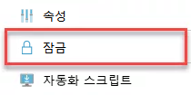
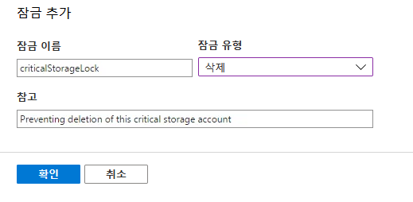

---
lab:
    title: '랩 7: Resource Manager 잠금을 통해 Azure 리소스 보호'
    module: '모듈 1: ID 및 액세스 관리'
---

# 모듈 1: ID 및 액세스 관리 


**시나리오**

관리자는 Resource Manager 잠금을 사용하여 리소스 삭제나 변경 방지를 위해 Azure 리소스를 잠글 수 있습니다. RBAC(역할 기반 액세스 제어) 계층 외부에서 적용되는 이러한 잠금을 적용하면 모든 사용자의 리소스 사용이 제한됩니다. 따라서 구독의 중요한 리소스를 사용자가 삭제하거나 변경해서는 안 되는 경우에 매우 유용하며, 해당 리소스의 실수로 인한/악의적인 변경이나 삭제를 방지할 수 있습니다.

적용할 수 있는 두 가지 리소스 잠금 유형은 다음과 같습니다.

 - **CanNotDelete** - 모든 사용자가 잠금이 설정된 리소스를 삭제할 수는 없지만 변경할 수는 있습니다.
 - **ReadOnly** - 이름에서 알 수 있듯이 리소스가 읽기 전용으로 설정되므로 변경과 삭제가 모두 불가능합니다.
필요에 따라 구독, 리소스 그룹 또는 개별 리소스에 리소스 잠금을 적용할 수 있습니다. 구독을 잠그면 잠금 설정 이후에 추가한 리소스를 비롯하여 해당 구독의 모든 리소스가 동일 잠금을 상속합니다. 이러한 잠금은 적용하고 나면 역할에 관계없이 모든 사용자에게 적용됩니다. 잠금이 적용된 리소스를 변경하거나 삭제해야 하는 경우에는 잠금을 먼저 제거해야 변경/삭제가 가능합니다.

**권한**

잠금을 설정하고 제거하려면 다음의 RBAC 권한 중 하나가 필요합니다.

- `Microsoft.Authorization/*`
- `Microsoft.Authorization/locks/*`

기본적으로는 기본 제공 RBAC 역할인 소유자 및 사용자 액세스 관리자만 이러한 작업을 수행할 수 있습니다. 그러나 필요에 따라 사용자 지정 역할에 이러한 작업을 추가할 수 있습니다. 위에서 설명한 것처럼 이러한 역할이 할당된 사용자에게도 잠금이 적용되기는 하지만 필요한 경우 잠금을 제거할 수 있습니다. Azure 활동 로그에서 잠금 만들기와 삭제를 추적할 수 있습니다.


# 랩 7: Resource Manager 잠금을 통해 Azure 리소스 보호


잠금은 ARM 템플릿 내에서 리소스를 만들 때 생성할 수도 있고 Portal이나 PowerShell을 사용하여 나중에 생성할 수도 있습니다.


## 연습 1: 잠금 생성


잠금을 적용하여 리소스를 보호하는 가장 효율적인 방법은 잠금을 런타임에 생성하고 ARM 템플릿에서 구성하는 것입니다. 잠금은 최상위 ARM 리소스이므로 잠금 대상 리소스보다 상위 위치에 있습니다. 즉, 잠금은 잠금 대상 리소스를 참조하므로 잠금을 생성하려면 리소스가 있어야 합니다. 


### 태스크 1: 잠금 추가(Portal)

1.  Cloud Shell(PowerShell)을 열고 다음 명령을 실행하여 리소스 그룹과 스토리지 계정을 만듭니다.  _명령의 XXX는 고유한 문자로 변경합니다._

     ```powershell
    New-AzResourceGroup -Name LockRG -Location EastUS
     ```
    
     ```powershell
    New-AzStorageAccount -ResourceGroupName LockRG -Name XXXXXX -Location  EastUS -SkuName Standard_LRS -Kind StorageV2 
     ```

1.  스토리지 계정을 찾아서 선택합니다. 기본 블레이드에서 "잠금" 아이콘을 클릭합니다.

     


1.  **추가**를 클릭합니다.

1.  잠금의 이름과 설명을 입력한 다음 유형(삭제 또는 읽기 전용)을 선택합니다.

     


1.  **확인**을 클릭하여 잠금을 저장합니다. 그러면 리소스가 보호됩니다.

1.  **잠금**으로 이동한 다음 잠금, 삭제를 선택하여 잠금을 제거합니다.

### 태스크 2: 잠금 추가(PowerShell)

1.  Cloud Shell(PowerShell)을 열고 다음 명령을 실행하여 스토리지 계정에 잠금을 생성합니다. _명령의 XXX는 스토리지 계정 이름으로 변경합니다._

     ```powershell
    New-AzureRmResourceLock -LockLevel CanNotDelete -LockName criticalStorageLock -ResourceName XXXXXX  -ResourceType Microsoft.Storage/storageAccounts -ResourceGroupName LockRG
     ```

1.  잠금을 제거하려면 다음 명령을 사용합니다. _명령의 XXX는 스토리지 계정 이름으로 변경합니다._

     ```powershell
    Remove-AzureRmResourceLock -LockName criticalStorageLock -ResourceName  XXXXX -ResourceGroupName LockRG -ResourceType Microsoft.Storage/storageAccounts
     ```


리소스 로그를 사용하면 실수로 인한/악의적인 가장 중요한 리소스 변경 및/또는 삭제를 추가로 방어할 수 있습니다. 관리자는 이러한 잠금을 계속 제거할 수 있으므로 리소스 로그가 완벽한 대비책은 아닙니다. 하지만 잠금 제거는 신중하게 고려해야 합니다. 잠금 제거의 목적은 잠금을 우회하려는 것뿐이기 때문입니다. 이러한 잠금은 RBAC 외부에서 적용되므로, 사용자에게 부여했을 수 있는 사용자 지정 권한이나 역할에 관계없이 모든 사용자에게 적용됩니다.


**결과**: 이 랩이 완료되었습니다.
