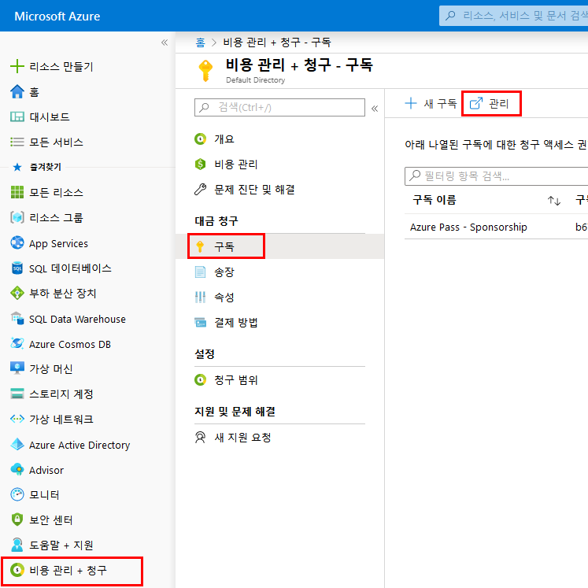
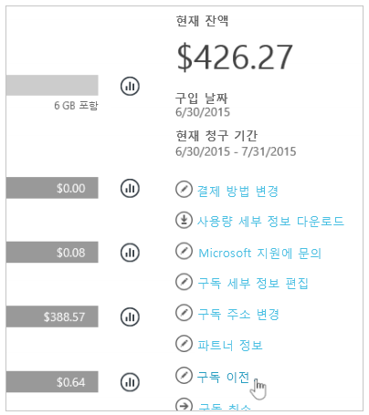
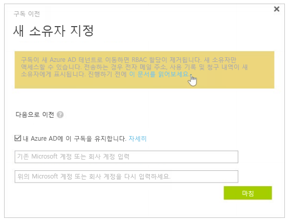
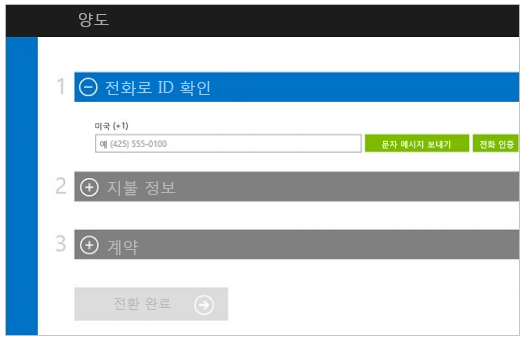

---
lab:
    title: '랩 8: 구독'
    module: '모듈 1: ID 및 액세스 관리'
---

# 모듈 1: ID 및 액세스 관리 

# 랩 8: 구독

**시나리오**

경우에 따라 원 소유자에서 Azure AD 테넌트로 구독을 이전해야 하는 경우가 있습니다. Azure AD 소유자의 구독을 다른 구독으로 이전하려면 다른 구독에 대한 액세스 권한이 있어야 합니다. 여러 구독 액세스 권한이 없는 경우
일단은 아래에 요약되어 있는 프로세스만 검토하세요.

## 연습 1: Azure AD 테넌트 간 Azure 구독 이전

### 태스크 1: Azure 구독의 소유권을 이전하려면 다음 단계를 수행합니다.

1.  Azure Portal에서 계정 관리자로 로그인합니다.

1.  **비용 관리 + 청구** > **구독**으로 이동하여 **관리**를 클릭합니다.

     

2.  사용자의 구독을 선택합니다.

3.  지원되는 제안 목록에서 제안 및 ID 제안을 확인하여 해당 구독이 셀프 서비스 전송 가능한지 확인합니다.

    **참고**: 이 문서를 작성하는 시점에 Azure Pass - 스폰서쉽은 소유권을 이전할 수 없습니다.  이 가이드에서 참조 정보를 확인하세요.

4.  **구독 이전**을 선택합니다.

     

5.  수신자를 지정합니다.

    **참고**: 새 Azure AD 테넌트에 구독을 이전하는 경우 RBAC61의 모든 역할 할당은 원본 테넌트에서 영구적으로 삭제되고 대상 테넌트로 마이그레이션되지 않습니다.

     

6.  수신자에게 수락 링크가 있는 이메일이 자동 수신됩니다.
7.  수신자는 링크를 선택하고 결제 정보 입력을 포함한 지침을 따릅니다.

     

8.  Azure에서 구독 이전을 완료합니다.

 이 시점에서 Azure 구독의 청구 소유권이 새 구독으로 이전됩니다.

**결과**: 이 모듈이 완료되었습니다.