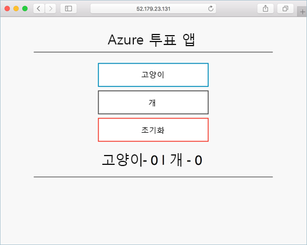

---
lab:
    title: 'Kubernetes 클러스터 만들기'
    module: '모듈 02 - 플랫폼 보호'
---

# 랩: Kubernetes 클러스터 만들기

AKS (Azure Kubernetes Service)는 클러스터를 신속하게 배포하고 관리 할 수 있는 관리형 Kubernetes 서비스입니다. 이 랩에서는 웹 프론트 엔드 및 Redis 인스턴스를 포함하는 다중 컨테이너 응용프로그램이 클러스터에서 실행됩니다. 그런 다음 응용 프로그램을 실행하는 클러스터 및 포드의 상태를 모니터링하는 방법을 알아봅니다.

### 연습 1: AKS 환경 만들기

#### 작업 1: AKS 클러스터 배포

1. <a href="https://portal.azure.com" target="_blank"><span style="color: #0066cc;" color="#0066cc">Azure Portal</span></a>에 로그인 합니다.

1. **+ 리소스 만들기**를 클릭한 다음 **kubernetes service**를 입력하고 **kubernetes service**를 클릭합니다.

1. **kubernetes service** 블레이드가 뜨면 **만들기** 버튼을 클릭합니다.

1. 다음을 참고하여 정보를 입력합니다. 정의되지 않은 설정은 기본값으로 둡니다.
     - `기본 사항`
          - `구독`: 이 랩에서 사용할 구독을 선택합니다.
          - `리소스 그룹`: **az5000203**으로 새로 만듭니다.
          - `Kubernetes 클러스터 이름`: **az5000203-aks**
          - `지역`: 가장 가까운 지역을 선택합니다.
          - `DNS 이름 접두사`: **az5000203-aks-xxx** (xxx는 유니크 해야 함)
          - `노드 개수`: **1**
     - `크기 조정`
          - `VM 확장 집합`: **사용 안 함**

1. **검토 + 만들기** 버튼을 클릭한 후 유효성 검사가 완료되면 **만들기** 버튼을 클릭하여 AKS 클러스터를 배포합니다.

> **참고**: AKS 클러스터가 배포되는데 약 10~15분 정도가 소요됩니다.

#### 작업 2: 클러스터에 연결

Kubernetes 클러스터를 관리하려면 Kubernetes 명령줄 클라이언트 인 kubectl을 사용해야 합니다. Azure Cloud Shell을 사용하는 경우 `kubectl`이 이미 설치되어 있습니다.

1. Azure Portal에서 **Cloud Shell**을 Bash 모드로 실행합니다.

1. 다음 명령어를 사용하여 Kubernetes 클러스터에 연결하도록 `kubectl`을 구성합니다.

     ```Azurecli
     az aks get-credentials --resource-group az5000203 --name az5000203-aks
     ```

1. 다음 `kubectl` 명령어를 사용하여 Kubernetes 클러스터에 연결된 노드 목록을 확인합니다.

    ```kubectl
    kubectl get nodes
    ```

1. 다음은 이전 단계에서 출력된 결과에 대한 예 입니다. 노드의 **STATUS**가 **Ready**인지 확인합니다.

    ```Execute
    NAME                        STATUS    ROLES    AGE     VERSION
    aks-nodepool1-31718369-0    Ready    agent    6m44s    v1.9.11
    ```

#### 작업 3: 응용프로그램 실행

Kubernetes 매니페스트 파일은 실행할 컨테이너 이미지와 같은 원하는 클러스터 상태를 정의합니다. 이 랩에서는 매니페스트를 사용하여 Azure Vote 응용 프로그램을 실행하는 데 필요한 모든 개체를 만듭니다. 이 매니페스트에는 두 개의 kubernetes-deployment가 포함되어 있습니다. 하나는 샘플 Azure Vote Python 응용 프로그램 용이고 다른 하나는 Redis 인스턴스 용입니다. 두 개의 kubernetes-service도 작성됩니다. Redis 인스턴스의 내부 서비스와 인터넷에서 Azure Vote 애플리케이션에 액세스하는 외부 서비스입니다. 이 실습을 위해 매니페스트 파일이 생성되어 Github 페이지에 저장되었습니다. 파일은 azure-vote.yaml이며 **`https://raw.githubusercontent.com/MicrosoftLearning/AZ-500-Azure-Security/master/Allfiles/Labs/Mod2_Lab03/azure-vote.yaml`**에 있습니다.

1. Cloud Shell에서 다음 명령어를 실행하여 Kubernetes 매니페스트 파일인 yaml 파일을 참조하여 Pod를 배포합니다.

     ```cli
     kubectl apply -f https://raw.githubusercontent.com/MicrosoftLearning/AZ-500-Azure-Security/master/Allfiles/Labs/Mod2_Lab03/azure-vote.yaml
     ```

2. 이전 단계의 명령어의 결과가 다음과 같다면 성공적으로 Pod가 생성되었음을 알 수 있습니다.

     ```Execute
     deployment "azure-vote-back" created
     service "azure-vote-back" created
     deployment "azure-vote-front" created
     service "azure-vote-front" created
     ```

> **메모**: 응용 프로그램이 실행될 때 Kubernetes 서비스는 응용프로그램의 프런트 엔드를 인터넷에 노출합니다. 이 프로세스는 완료하는 데 몇 분이 걸릴 수 있습니다.

#### 작업 4: 응용프로그램 테스트

1. 배포 진행상황을 모니터링 하려면 다음 명령어를 사용할 수 있습니다.

     ```kubectl
     kubectl get service azure-vote-front --watch
     ```

1. *azure-vote-front* 서비스는 초기에 *EXTERNAL-IP*는 *pending*으로 출력되며 시간이 지남에 따라 *EXTERNAL-IP*는 IP로 변경됩니다.

     ```
    NAME                TYPE            CLUSTER-IP    EXTERNAL-IP    PORT(S)         AGE
    azure-vote-front    LoadBalancer    10.0.37.27    <pending>     80:30572/TCP    6s
    azure-vote-front    LoadBalancer    10.0.37.27    52.179.23.131    80:30572/    TCP    2m
     ```

1. 배포된 응용프로그램이 정상적으로 동작하는지 확인하려면 *EXTERNAL-IP*에 출력된 IP를 복사하여 새로운 웹 브라우제 주소창에 붙여넣어 탐색합니다.

     

#### 작업 5: 상태와 로그 모니터링

AKS 클러스터가 생성되면 컨테이너용 Azure Monitor가 클러스터 노드와 Pod에 대한 상태 메트릭을 캡처 할 수있습니다. 이러한 상태 메트릭은 Azure Portal에서 사용할 수 있습니다.

Azure Vote Pod의 현재 상태, 가동 시간 및 리소스 사용량을 보려면 다음 단계를 완료하십시오.

1. <a href="https://portal.azure.com" target="_blank"><span style="color: #0066cc;" color="#0066cc">Azure Portal</span></a>에 접속합니다.

1. 앞서 생성한 **az5000203-aks**를 탐색합니다.

1. **모니터링**섹션에 있는 **Insight**를 클릭합니다.

1. 상단의 **+ 필터 추가**를 클릭합니다.

1. **Select property**에 **네임 스페리스**를 선택하고 **Select value(s)**에 **<kube-system을 제외한 모든 항목>**을 선택합니다.

1. **컨테이너** 탭으로 이동하여 배포된 Pod를 확인합니다.

    *azure-vote-back*과 *azure-vote-front* 컨테이너가 배포된 것을 확인할 수 있습니다.

1. `azure-vote-front` Pod의 로그를 보려면 컨테이너 목록의 오른쪽에서 **Analtyics에서 보기** 드롭다운 메뉴를 클릭한 후 **컨테이너 로그 보기**를 클릭합니다. 이 로그에는 컨테이너의 *stdout*과 *stderr* 스트림이 포함됩니다.

### 연습 2: 랩 리소스 삭제

#### 작업 1: Cloud Shell 열기

1. Azure 포털 상단에서 **Cloud Shell** 아이콘을 클릭하여 Cloud Shell 창을 엽니다.

1. Cloud Shell 인터페이스에서 **Bash**를 선택합니다.

1. **Cloud Shell** 명령 프롬프트에서 다음 명령을 입력하고 **Enter**를 눌러 이 랩에서 생성한 모든 리소스 그룹을 나열합니다.

    ```sh
    az group list --query "[?starts_with(name,'az500')].name" --output tsv
    ```

1. 출력된 결과가 이 랩에서 생성한 리소스 그룹만 포함되어 있는지 확인합니다. 이 그룹은 다음 작업에서 삭제됩니다.

#### 작업 2: 리소스 그룹 삭제하기

1. **Cloud Shell** 명령 프롬프트에서 다음 명령을 입력하고 **Enter**를 눌러 이 랩에서 생성한 모든 리소스 그룹을 삭제합니다.

    ```sh
    az group list --query "[?starts_with(name,'az500')].name" --output tsv | xargs -L1 bash -c 'az group delete --name $0 --no-wait --yes'
    ```

1. **Cloud Shell** 명령 프롬프트를 닫습니다.

> **결과**: 이 연습을 완료한 후 이 랩에서 사용된 리소스 그룹을 제거했습니다.
