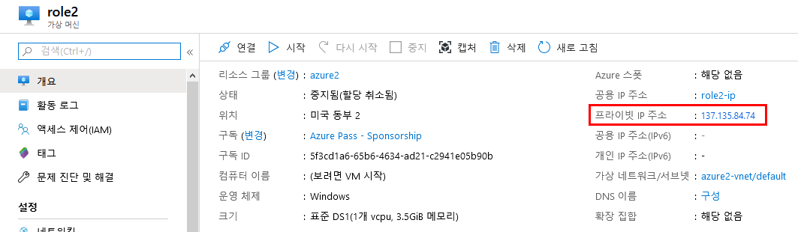

---
lab:
    title: '랩 5 - NSG'
    module: '모듈 2 - 플랫폼 보호 구현'
---

# 모듈 2: 랩 5 - NSG


네트워크 보안 그룹을 사용하여 가상 네트워크 서브넷에서 들어오고 나가는 네트워크 트래픽을 필터링할 수 있습니다. 네트워크 보안 그룹에는 IP 주소, 포트 및 프로토콜을 기준으로 네트워크 트래픽을 필터링하는 보안 규칙이 포함되어 있습니다. 보안 규칙은 서브넷에 배포된 리소스에 적용됩니다. 이 자습서의 학습 내용은 다음과 같습니다.

- 네트워크 보안 그룹 및 보안 규칙 만들기
- 가상 네트워크를 만들고 서브넷에 네트워크 보안 그룹 연결
- 서브넷에 VM(가상 머신) 배포
- 트래픽 필터 테스트


## 연습 1: Azure Portal을 사용하여 네트워크 보안 그룹으로 네트워크 트래픽 필터링

### 태스크 1:  가상 네트워크 만들기

1.  Azure Portal 왼쪽 위의 **+ 리소스 만들기**를 선택합니다.
2.  **네트워킹**, **가상 네트워크**를 차례로 선택합니다.
3.  다음 정보를 입력하거나 선택하고 나머지 설정은 기본값을 적용한 후에 **만들기**를 선택합니다.

    | 설정                 | 값                                                 |
    | ---                 | ---                                               |
    | 이름                 | myVirtualNetwork                                  |
    | 주소 공간             | 10.0.0.0/16                                       |
    | 구독                 | 사용자의 구독을 선택합니다.                              |
    | 리소스 그룹            | **새로 만들기**를 선택하고 *myResourceGroup*을 입력합니다. |
    | 위치                 | **미국 동부**를 입력합니다.                             |
    | 서브넷 - 이름         | mySubnet                                           |
    | 서브넷 - 주소 범위     | 10.0.0.0/24                                        |

### 태스크 2:  애플리케이션 보안 그룹 만들기


애플리케이션 보안 그룹을 사용하면 웹 서버 등 기능이 비슷한 서버를 그룹화할 수 있습니다.


1.  Azure Portal 왼쪽 위의 **+ 리소스 만들기**를 선택합니다.
2.  **Marketplace 검색** 상자에 *애플리케이션 보안 그룹*을 입력합니다. 검색 결과에 **애플리케이션 보안 그룹**이 표시되면 선택하고 **모든 항목** 아래에서 **애플리케이션 보안 그룹**을 다시 선택한 후에 **만들기**를 선택합니다.
3.  다음 정보를 입력하거나 선택하고 **만들기**를 선택합니다.

    | 설정            | 값                                                     |
    | ---            | ---                                                   |
    | 이름            | myAsgWebServers                                       |
    | 구독            | 사용자의 구독을 선택합니다.                                  |
    | 리소스 그룹       | **기존 항목 사용**을 선택하고 **myResourceGroup**을 선택합니다. |
    | 위치            | 미국 동부                                                |

4.  다음 값을 지정하여 3단계를 다시 완료합니다.

    | 설정           | 값                                                         |
    | ---           | ---                                                       |
    | 이름           | myAsgMgmtServers                                          |
    | 구독           | 사용자의 구독을 선택합니다.                                      |
    | 리소스 그룹      | **기존 항목 사용**을 선택하고 **myResourceGroup**을 선택합니다.    |
    | 위치           | 미국 동부                                                   |

### 태스크 3:  네트워크 보안 그룹 만들기

1.  Azure Portal 왼쪽 위의 **+ 리소스 만들기**를 선택합니다.
2.  **네트워킹**, **네트워크 보안 그룹**을 차례로 선택합니다.
3.  다음 정보를 입력하거나 선택하고 **만들기**를 선택합니다.

    |설정|값|
    |---|---|
    |이름|myNsg|
    |구독| 사용자의 구독을 선택합니다.|
    |리소스 그룹 | **기존 항목 사용**을 선택하고 *myResourceGroup*을 선택합니다.|
    |위치|미국 동부|

### 태스크 4:  서브넷에 네트워크 보안 그룹 연결

1.  Portal 위쪽의 *리소스, 서비스 및 문서 검색* 상자에 *myNsg* 입력을 시작합니다. 검색 결과에 **myNsg**가 표시되면 선택합니다.
2.  **설정**에서 **서브넷**, **+ 연결**을 차례로 선택합니다. 

3.  **서브넷 연결**에서 **가상 네트워크**를 선택하고 **myVirtualNetwork**를 선택합니다. **서브넷**, **mySubnet**, **확인**을 차례로 선택합니다.

### 태스크 5:  보안 규칙 만들기

1.  **설정**에서 **인바운드 보안 규칙**, **+ 추가**를 차례로 선택합니다.

2.  포트 80과 443에서 **myAsgWebServers** 애플리케이션 보안 그룹 액세스를 허용하는 보안 규칙을 만듭니다. **인바운드 보안 규칙 추가**에서 다음 값을 입력하거나 선택하고 나머지 항목은 기본값을 적용한 후에 **추가**를 선택합니다.

    | 설정                 | 값                                                                                                           |
    | ---------               | ---------                                                                                                       |
    | 대상             | **애플리케이션 보안 그룹**을 선택하고 **애플리케이션 보안 그룹**으로 **myAsgWebServers**를 선택합니다.  |
    | 대상 포트 범위 | 80,443을 입력합니다.                                                                                                    |
    | 프로토콜                | TCP를 선택합니다.                                                                                                      |
    | 이름                    | Allow-Web-All                                                                                                   |

3.  다음 값을 사용하여 2단계를 다시 완료합니다.

    | 설정                 | 값                                                                                                           |
    | ---------               | ---------                                                                                                       |
    | 대상             | **애플리케이션 보안 그룹**을 선택하고 **애플리케이션 보안 그룹**으로 **myAsgMgmtServers**를 선택합니다. |
    | 대상 포트 범위 | 3389를 입력합니다.                                                                                                      |
    | 프로토콜                | TCP를 선택합니다.                                                                                                      |
    | 우선 순위                | 110을 입력합니다.                                                                                                       |
    | 이름                    | Allow-RDP-All                                                                                                   |

    이 자습서에서는 RDP(포트 3339)가 *asgmgmtservers* 애플리케이션 보안 그룹에 할당되는 VM용으로 인터넷에 표시됩니다. 프로덕션 환경에서는 포트 3389를 인터넷에 표시하는 대신 VPN 또는 개인 네트워크 연결을 사용하여 관리하려는 Azure 리소스에 연결하는 것이 좋습니다.


### 태스크 6:  가상 머신 만들기

1.  Azure Portal 왼쪽 위의 **+ 리소스 만들기**를 선택합니다.
2.  **컴퓨팅**, **Windows Server 2016 Datacenter**를 차례로 선택합니다.
3.  다음 정보를 입력하거나 선택하고 나머지 설정은 기본값을 적용합니다.

    |설정|값|
    |---|---|
    |구독| 사용자의 구독을 선택합니다.|
    |리소스 그룹| **기존 항목 사용**을 선택하고 **myResourceGroup**을 선택합니다.|
    |이름|myVmWeb|
    |위치| **미국 동부**를 입력합니다.|
    |사용자 이름| 선택한 사용자 이름을 입력합니다.|
    |암호| Pa55w.rd1234 |

   

4.  VM의 크기를 선택하고 **선택**을 선택합니다.
5.  **네트워킹**에서 다음 값을 선택하고 나머지 설정은 기본값을 적용합니다.

    |설정|값|
    |---|---|
    |가상 네트워크 |**myVirtualNetwork**를 선택합니다.|
    |NIC 네트워크 보안 그룹 |**고급**을 선택합니다.|
    |공용 인바운드 포트|**없음**을 선택합니다. |

6.  왼쪽 아래에서 **검토 + 만들기**를 선택한 다음 **만들기**를 선택하여 VM 배포를 시작합니다.

### 태스크 7:  두 번째 VM 만들기

위의 1~6단계를 다시 완료하되 3단계에서 VM 이름을 *myVmMgmt*로 지정합니다. VM을 배포하려면 몇 분 정도 걸립니다. VM이 배포될 때까지 다음 단계를 계속 진행하지 마세요.

### 태스크 8:  ASG에 네트워크 인터페이스 연결


Portal에서 VM을 만들 때 각 VM용 네트워크 인터페이스가 생성되어 VM에 연결되었습니다. 앞에서 만든 애플리케이션 보안 그룹 중 하나에 각 VM용 네트워크 인터페이스를 추가해야 합니다.


1.  Portal 위쪽의 *리소스, 서비스 및 문서 검색* 상자에 *myVmWeb* 입력을 시작합니다. 검색 결과에 **myVmWeb** VM이 표시되면 선택합니다.
2.  **설정**에서 **네트워킹**을 선택합니다.  **애플리케이션 보안 그룹 구성**을 선택하고 **애플리케이션 보안 그룹**으로 **myAsgWebServers**를 선택한 다음 **저장**을 선택합니다.

3.  1~2단계를 다시 완료하되, 이번에는 **myVmMgmt** VM을 검색하고 **myAsgMgmtServers** ASG를 선택합니다.

### 태스크 9:  트래픽 필터 테스트

1.  *myVmMgmt* VM에 연결합니다. Portal 위쪽의 검색 상자에 *myVmMgmt*를 입력합니다. 검색 결과에 **myVmMgmt**가 표시되면 선택합니다. **연결** 단추를 선택합니다.
2.  **RDP 파일 다운로드**를 선택합니다.
3.  다운로드된 rdp 파일을 열고 **연결**을 선택합니다. VM을 만들 때 지정한 사용자 이름과 암호를 입력합니다. VM을 만들 때 입력한 자격 증명을 지정하려면 **다른 옵션 선택**, **다른 계정 사용**을 차례로 선택해야 할 수 있습니다.
4.  **확인**을 선택합니다.
5.  로그인 프로세스 중에 인증서 경고가 표시될 수 있습니다. 경고가 표시되면 **예** 또는 **계속**을 선택하여 연결을 계속 진행합니다.

    포트 3389에서는 인터넷에서 *myAsgMgmtServers* 애플리케이션 보안 그룹(*myVmMgmt* VM에 연결된 네트워크 인터페이스가 포함된 그룹)으로의 인바운드 연결이 허용되므로 연결은 성공합니다.

6.  PowerShell 세션에 다음 명령을 입력하여 *myVmMgmt* VM에서 *myVmWeb* VM에 연결합니다.

    ```powershell
    mstsc /v:myVmWeb
    ```

    myVmMgmt VM에서 myVmWeb VM에 연결할 수 있습니다. 같은 가상 네트워크의 VM은 기본적으로 모든 포트를 통해 서로 통신할 수 있기 때문입니다. 하지만 이번에는 인터넷에서 *myVmWeb* VM으로의 원격 데스크톱 연결을 생성할 수 없습니다. *myAsgWebServers*용 보안 규칙은 포트 3389를 사용한 인터넷의 인바운드 연결을 허용하지 않으며, 모든 리소스로 전송되는 인터넷의 인바운드 트래픽은 기본적으로 거부되기 때문입니다.

7.  *myVmWeb* VM에 Microsoft IIS를 설치하려면 *myVmWeb* VM의 PowerShell 세션에서 다음 명령을 입력합니다.

    ```powershell
    Install-WindowsFeature -name Web-Server -IncludeManagementTools
    ```

8.  IIS 설치가 완료된 후 *myVmWeb* VM에서 연결을 끊습니다. 그러면 *myVmMgmt* VM 원격 데스크톱 연결만 설정된 상태가 됩니다.
9.  *myVmMgmt* VM에서 연결을 끊습니다.
10.  컴퓨터에서 Azure Portal 위쪽의 *리소스, 서비스 및 문서 검색* 상자에 *myVmWeb* 입력을 시작합니다. 검색 결과에 **myVmWeb**이 표시되면 선택합니다. VM의 **공용 IP 주소**를 적어 둡니다. 다음 그림에 표시된 주소는 137.135.84.74이지만 실제 주소가 다릅니다.

       
  
11.  인터넷에서 *myVmWeb* 웹 서버에 액세스할 수 있는지 확인하려면 컴퓨터에서 인터넷 브라우저를 열고 `http://<이전 단계에서 적어 둔 공용 IP 주소>`로 이동합니다. IIS 시작 화면이 표시됩니다. 포트 80에서는 인터넷에서 *myAsgWebServers* 애플리케이션 보안 그룹(*myVmWeb* VM에 연결된 네트워크 인터페이스가 포함된 그룹)으로의 인바운드 연결이 허용되기 때문입니다.


| 경고: 계속하기 전에 이 랩에서 사용한 모든 리소스를 제거해야 합니다.  **Azure Portal**에서 리소스를 제거하려면 **리소스 그룹**을 클릭합니다.  랩에서 만든 리소스 그룹을 모두 선택합니다.  리소스 그룹 블레이드에서 **리소스 그룹 삭제**를 클릭하고 리소스 그룹 이름을 입력한 다음 **삭제**를 클릭합니다.  추가로 만든 리소스 그룹이 있으면 이 프로세스를 반복합니다. **리소스 그룹을 삭제하지 않으면 다른 랩에서 문제가 발생할 수 있습니다.** |
| --- |

**결과**: 이 랩이 완료되었습니다.
