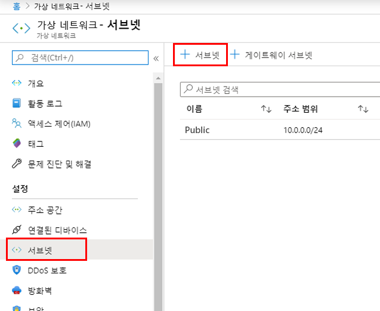
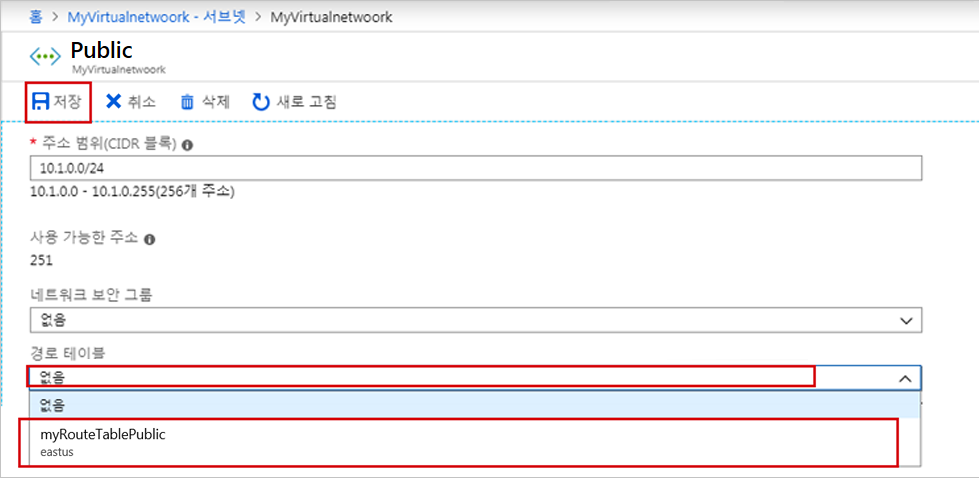
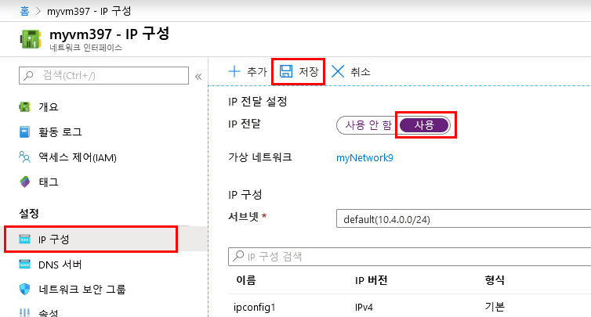

---
lab:
    title: '랩 6 - NVA'
    module: '모듈 2 - 플랫폼 보호 구현'
---

# 모듈 2: 랩 6 - NVA


**시나리오**

Azure는 기본적으로 가상 네트워크 내의 모든 서브넷 간에 트래픽을 라우팅합니다. Azure의 기본 라우팅을 재정의하는 경로를 직접 만들 수 있습니다. 사용자 지정 경로를 만드는 기능은 NVA(네트워크 가상 어플라이언스)를 통해 서브넷 간에 트래픽을 라우팅하려는 등의 경우 유용합니다. 이 랩의 학습 내용은 다음과 같습니다.


> * 경로 테이블 만들기
> * 경로 만들기
> * 서브넷이 여러 개 포함된 가상 네트워크 만들기
> * 서브넷에 경로 테이블 연결
> * 트래픽을 라우팅하는 NVA 만들기
> * 서로 다른 여러 서브넷에 VM(가상 머신) 배포
> * NVA를 통해 서브넷 간에 트래픽 라우팅

## 연습 1: Azure Portal을 사용하여 경로 테이블로 네트워크 트래픽 라우팅

### 태스크 1: 경로 테이블 만들기

1.  화면 왼쪽 위에서 **리소스 만들기** > **네트워킹** > **경로 테이블**을 선택합니다.

1.  **경로 테이블 만들기**에서 다음 정보를 입력하거나 선택합니다.

    | 설정 | 값 |
    | ------- | ------ |
    | 이름 | *myRouteTablePublic*을 입력합니다. |
    | 구독 | 사용자의 구독을 선택합니다. |
    | 리소스 그룹 | **새로 만들기**를 선택하고 *MyResourceGroup*을 입력한 다음 *확인*을 선택합니다. |
    | 위치 | 기본값인 **미국 동부**를 그대로 둡니다.
    | BGP 경로 전파 | 기본값인 **사용**을 그대로 둡니다. |

1.  **만들기**를 선택합니다.

### 태스크 2: 경로 만들기

1.  Portal의 검색 창에 *myRouteTablePublic*을 입력합니다.

1.  검색 결과에 **myRouteTablePublic**이 표시되면 선택합니다.

1.  **myRouteTablePublic**의 **설정**에서 **경로** > **+ 추가**를 선택합니다.


1.  **경로 추가**에서 다음 정보를 입력하거나 선택합니다.

    | 설정 | 값 |
    | ------- | ------ |
    | 경로 이름 | *ToPrivateSubnet*을 입력합니다. |
    | 주소 접두사 | *10.0.1.0/24*을 입력합니다. |
    | 다음 홉 유형 | **가상 어플라이언스**를 선택합니다. |
    | 다음 홉 주소 | *10.0.2.4*를 입력합니다. |

1.  **확인**을 선택합니다.

### 태스크 3: 서브넷에 경로 테이블 연결


서브넷에 라우팅 테이블을 연결하려면 가상 네트워크와 서브넷을 만들어야 합니다.


1.  화면 왼쪽 위에서 **리소스 만들기** > **네트워킹** > **가상 네트워크**를 선택합니다.

1.  **가상 네트워크 만들기**에서 다음 정보를 입력하거나 선택합니다.

    | 설정 | 값 |
    | ------- | ------ |
    | 이름 | *myVirtualNetwork*를 입력합니다. |
    | 주소 공간 | *10.0.0.0/16*을 입력합니다. |
    | 구독 | 사용자의 구독을 선택합니다. |
    | 리소스 그룹 | ***기존 항목 선택*** > **myResourceGroup**을 선택합니다. |
    | 위치 | 기본값인 **미국 동부**를 그대로 둡니다. |
    | 서브넷 - 이름 | *Public*을 입력합니다. |
    | 서브넷 - 주소 범위 | *10.0.0.0/24*을 입력합니다. |

1.  나머지 기본값은 그대로 두고 **만들기**를 선택합니다.

### 태스크 4: 가상 네트워크에 서브넷 추가

1.  Portal의 검색 창에 *myVirtualNetwork*를 입력합니다.

1.  검색 결과에 **myVirtualNetwork**가 표시되면 선택합니다.

1.  **myVirtualNetwork**의 **설정**에서 **서브넷** > **+ 서브넷**을 선택합니다.

       

1.  **서브넷 추가**에서 다음 정보를 입력합니다.

    | 설정 | 값 |
    | ------- | ------ |
    | 이름 | *Private*을 입력합니다. |
    | 주소 공간 | *10.0.1.0/24*을 입력합니다. |

1.  나머지 기본값은 그대로 두고 **확인**을 선택합니다.

1.  **+ 서브넷**을 다시 선택합니다. 이번에는 다음 정보를 입력합니다.

    | 설정 | 값 |
    | ------- | ------ |
    | 이름 | *DMZ*를 입력합니다. |
    | 주소 공간 | *10.0.2.0/24*을 입력합니다. |

1.  앞에서와 마찬가지로 나머지 기본값은 그대로 두고 **확인**을 선택합니다.

    Azure에 서브넷 3개(**Public**, **Private**, **DMZ**)가 표시됩니다.

### 태스크 5: Public 서브넷에 myRouteTablePublic 연결

1.  **Public**을 선택합니다.

1.  **Public**에서 **경로 테이블** > **MyRouteTablePublic** > **저장**을 선택합니다.

       

### 태스크 6: NSG 만들기

NVA는 라우팅 및 방화벽 최적화와 같은 네트워크 기능을 지원하는 VM입니다. 원하는 경우 다른 운영 체제를 선택할 수 있습니다. 이 자습서에서는 **Windows Server 2016 Datacenter**를 사용 중이라고 가정합니다.

1.  화면 왼쪽 위에서 **리소스 만들기** > **컴퓨팅** > **Windows Server 2016 Datacenter**를 선택합니다.

1.  **가상 머신 만들기 - 기본 사항**에서 다음 정보를 입력하거나 선택합니다.

    | 설정 | 값 |
    | ------- | ------ |
    | **프로젝트 세부 정보** | |
    | 구독 | 사용자의 구독을 선택합니다. |
    | 리소스 그룹 | **myResourceGroup**을 선택합니다. |
    | **인스턴스 세부 정보** |  |
    | 가상 머신 이름 | *myVmNva*를 입력합니다. |
    | 지역 | **미국 동부**를 입력합니다. |
    | 가용성 옵션 | 기본 **인프라 중복성 없음**을 그대로 둡니다. |
    | 이미지 | 기본 **Windows Server 2016 Datacenter**를 그대로 둡니다. |
    | 크기 | 기본 **표준 DS1 v2**를 그대로 둡니다. |
    | **관리자 계정** |  |
    | 사용자 이름 | 선택한 사용자 이름을 입력합니다. |
    | 암호 | Pa55w.rd1234|
    | 암호 확인 | 암호를 다시 입력합니다. |
    | **인바운드 포트 규칙** |  |
    | 공용 인바운드 포트 | 기본 **없음**을 그대로 둡니다.
    | **비용 절약** |  |
    | 이미 Windows 라이선스가 있으신가요? | 기본 **없음**을 그대로 둡니다. |

1.  **다음: 디스크**를 선택합니다.

1.  **가상 머신 만들기 - 디스크**에서 요구에 맞는 설정을 선택합니다.

1.  **다음: 네트워킹**을 선택합니다.

1.  **가상 머신 만들기 - 네트워킹**에서 다음 정보를 선택합니다.

    | 설정 | 값 |
    | ------- | ------ |
    | 가상 네트워크 | 기본 **myVirtualNetwork**를 그대로 둡니다. |
    | 서브넷 | **DMZ(10.0.2.0/24)**를 선택합니다. |
    | 공용 IP | **없음**을 선택합니다. 공용 IP 주소는 필요하지 않습니다. VM은 인터넷을 통해 연결하지 않기 때문입니다.|

1.  나머지 기본값은 그대로 두고 **다음: 관리**를 선택합니다.

1.  **가상 머신 만들기 - 관리**에서, **진단 스토리지 계정**에 대해 **새로 만들기**를 선택합니다.

1.  **스토리지 계정 만들기**에서 다음 정보를 입력하거나 선택합니다.

    | 설정 | 값 |
    | ------- | ------ |
    | 이름 | *mynvastorageaccount*를 입력합니다. |
    | 계정 종류 | 기본 **스토리지(범용 v1)**를 그대로 둡니다. |
    | 성능 | **기본**을 그대로 둡니다. |
    | 복제 | 기본 **로컬 중복 스토리지(LRS)**를 그대로 둡니다.

1.  **확인**을 선택합니다.

1.  **검토 + 만들기**를 선택합니다. **검토 + 만들기 페이지**로 이동하고 Azure에서 구성의 유효성을 검사합니다.

1.  **유효성 검사 통과**가 표시되면 **만들기**를 선택합니다.

    VM을 만들려면 몇 분 정도 걸립니다. Azure에서 VM 만들기가 완료될 때까지 다음 작업을 진행하지 마세요. **배포 진행 중** 페이지에 배포 세부 정보가 표시됩니다.

1.  VM이 준비되면 **리소스로 이동**을 선택합니다.

### 태스크 7: IP 전달 설정


*myVmNva*에 대해 IP 전달을 설정합니다. Azure에서 *myVmNva*에 네트워크 트래픽을 전송할 때 트래픽의 대상이 다른 IP 주소로 지정되어 있으면 IP 전달을 통해 올바른 위치로 트래픽이 전송됩니다.


1.  **myVmNva**의 **설정**에서 **네트워킹**을 선택합니다.

1.  Azure에서 VM용으로 생성된 네트워크 인터페이스인 **myvmnva123**을 선택합니다. 숫자 문자열은 고유한 네트워크 인터페이스 이름 생성을 위해 추가된 것입니다.

1.  **설정**에서 **IP 구성**을 선택합니다.

1.  **myvmnva123 - IP 구성**의 **IP 전달**에서 **사용**을 선택하고 **저장**을 선택합니다.

       

### 태스크 8: 공용/개인 가상 머신 만들기


가상 네트워크에서 공용 VM과 개인 VM을 만듭니다. 나중에 이러한 VM을 사용하여 Azure가 NVA를 통해 *공용* 서브넷 트래픽을 *개인* 서브넷으로 라우팅하는 방식을 확인할 것입니다.


1.  NVA 만들기 태스크의 1~12단계를 완료합니다. 설정은 대부분 이전과 같은 값을 사용하면 되지만, 다음 값은 다르게 설정해야 합니다.

 | 설정 | 값 |
 | ------- | ------ |
 | **공용 VM** | |
 | 기본 사항 |  |
 | 가상 머신 이름 | *myVmPublic*을 입력합니다. |
 | 네트워킹 | |
 | 서브넷 | **공용(10.0.0.0/24)**을 선택합니다. |
| 공용 IP 주소 | 기본값을 적용합니다. |
| 공용 인바운드 포트 | **선택한 포트 허용**을 선택합니다. |
| 인바운드 포트 선택 | **HTTP** 및 **RDP**를 선택합니다. |
| 관리 | |
| 진단 스토리지 계정 | 기본값인 **mynvastorageaccount**를 그대로 둡니다. |
| **개인 VM** | |
| 기본 사항 |  |
| 가상 머신 이름 | *myVmPrivate*을 입력합니다. |
| 네트워킹 | |
| 서브넷 | **개인(10.0.1.0/24)**을 선택합니다. |
| 공용 IP 주소 | 기본값을 적용합니다. |
| 공용 인바운드 포트 | **선택한 포트 허용**을 선택합니다. |
| 인바운드 포트 선택 | **HTTP** 및 **RDP**를 선택합니다. |
| 관리 | |
| 진단 스토리지 계정 | 기본값인 **mynvastorageaccount**를 그대로 둡니다. |

Azure에서 *myVmPublic* VM이 생성되는 중에 *myVmPrivate* VM을 생성할 수 있습니다. Azure에서 두 VM 생성이 완료될 때까지는 나머지 단계를 계속 진행하지 마세요.

### 태스크 9: NVA를 통한 트래픽 라우팅

1.  원격 데스크톱을 통해 myVmPrivate에 로그인합니다.

1.  Portal의 검색 창에 *myVmPrivate*을 입력합니다.

1.  검색 결과에 **myVmPrivate** VM이 표시되면 선택합니다.

1.  **연결**을 선택하여 *myVmPrivate* VM에 대한 원격 데스크톱 연결을 만듭니다.

1.  **가상 머신에 연결**에서 **RDP 파일 다운로드**를 선택합니다. 원격 데스크톱 프로토콜(*.rdp*) 파일이 작성되어 컴퓨터에 다운로드됩니다.

1.  다운로드된 *rdp* 파일을 엽니다.

    1. 메시지가 표시되면 **연결**을 선택합니다.

    1. 개인 VM을 만들 때 지정한 사용자 이름과 암호를 입력합니다.

    1. 개인 VM 자격 증명을 사용하려면 **다른 옵션 선택** > **다른 계정 사용**을 선택해야 할 수 있습니다.

1.  **확인**을 선택합니다.

    로그인 프로세스 중에 인증서 경고가 표시될 수 있습니다.

1.  **예**를 선택하여 VM에 연결합니다.

### 태스크 10: Windows 방화벽을 통해 ICMP를 사용하도록 설정


이후 단계에서 경로 추적 도구를 사용해 라우팅을 테스트합니다. 경로 추적에서 사용하는 ICMP(Internet Control Message Protocol)는 Windows 방화벽에서 기본적으로 거부됩니다. Windows 방화벽을 통해 ICMP를 사용하도록 설정할 수 있습니다.


1.  *myVmPrivate*의 원격 데스크톱에서 PowerShell을 엽니다.

1.  다음 명령을 입력합니다.

    ```powershell
    New-NetFirewallRule -DisplayName "Allow ICMPv4-In" -Protocol ICMPv4
    ```

    이 자습서에서는 경로 추적을 사용해 라우팅을 테스트합니다. 프로덕션 환경에서는 Windows 방화벽을 통해 ICMP를 허용하지 않는 것이 좋습니다.

### 태스크 11: myVmNva 내에서 IP 전달 설정


이전 태스크에서 Azure를 사용하여 VM의 네트워크 인터페이스에 대해 IP 전달을 사용하도록 설정했습니다. VM의 운영 체제도 네트워크 트래픽을 전달해야 합니다. 다음 명령을 사용하여 *myVmNva* VM의 운영 체제에 대해 IP 전달을 설정합니다.


1.  *myVmPrivate* VM의 명령 프롬프트에서 *myVmNva* VM으로의 원격 데스크톱을 엽니다.

    ```cmd
    mstsc /v:myvmnva
    ```

1.  *myVmNva*의 PowerShell에서 다음 명령을 입력하여 IP 전달을 설정합니다.

    ```powershell
    Set-ItemProperty -Path HKLM:\SYSTEM\CurrentControlSet\Services\Tcpip\Parameters -Name IpEnableRouter -Value 1
    ```

1.  *myVmNva* VM을 다시 시작합니다. 작업 표시줄에서 **시작 단추** > **전원 단추**를 선택하고 **기타(계획됨)** > **계속**을 클릭합니다.

    이렇게 하면 원격 데스크톱 세션 연결도 끊어집니다.

1.  *myVmNva* VM이 다시 시작되고 나면 *myVmPublic* VM으로의 원격 데스크톱 세션을 만듭니다. *myVmPrivate* VM에 계속 연결된 상태로 명령 프롬프트를 열고 다음 명령을 실행합니다.

    ```cmd
    mstsc /v:myVmPublic
    ```
1.  *myVmPublic*의 원격 데스크톱에서 PowerShell을 엽니다.

1.  다음 명령을 입력하여 Windows 방화벽을 통해 ICMP를 사용하도록 설정합니다.

    ```powershell
    New-NetFirewallRule -DisplayName "ICMPv4-In 허용" -Protocol ICMPv4
    ```

### 태스크 12: 네트워크 트래픽의 라우팅 테스트


먼저 *myVmPublic* VM에서 *myVmPrivate* VM으로의 네트워크 트래픽 라우팅을 테스트해 보겠습니다.


1.  *myVmPublic*의 PowerShell에서 다음 명령을 입력합니다.

    ```powershell
    tracert myVmPrivate
    ```

    다음 예제와 같은 응답이 반환됩니다.

    ```powershell
    Tracing route to myVmPrivate.vpgub4nqnocezhjgurw44dnxrc.bx.internal.cloudapp.net [10.0.1.4]
    over a maximum of 30 hops:

    1    <1 ms     *        1 ms  10.0.2.4
    2     1 ms     1 ms     1 ms  10.0.1.4

    Trace complete.
    ```

    첫 번째 홉인 10.0.2.4가 NVA의 개인 IP 주소입니다. 두 번째 홉은 *myVmPrivate* VM의 개인 IP 주소인 10.0.1.4입니다. 이전 태스크에서 *myRouteTablePublic* 경로 테이블에 경로를 추가한 다음 *Public* 서브넷에 연결했습니다. 따라서 Azure는 트래픽을 *Private* 서브넷으로 직접 전송하지 않고 NVA를 통해 전송합니다.

1.  *myVmPublic* VM으로의 원격 데스크톱 세션을 닫습니다. 그러면 *myVmPrivate* VM에는 연결된 상태가 유지됩니다.

1.  *myVmPrivate* VM의 명령 프롬프트에서 다음 명령을 입력합니다.

    ```cmd
    tracert myVmPublic
    ```

    이 명령은 *myVmPrivate* VM에서 *myVmPublic* VM으로의 네트워크 트래픽 라우팅을 테스트합니다. 다음 예제와 같은 응답이 반환됩니다.

    ```cmd
    Tracing route to myVmPublic.vpgub4nqnocezhjgurw44dnxrc.bx.internal.cloudapp.net [10.0.0.4]
    over a maximum of 30 hops:

    1     1 ms     1 ms     1 ms  10.0.0.4

    Trace complete.
    ```

    Azure가 *myVmPrivate* VM에서 *myVmPublic* VM으로 트래픽을 직접 라우팅함을 확인할 수 있습니다. Azure는 기본적으로 서브넷 간에 트래픽을 직접 라우팅합니다.

1.  *myVmPrivate* VM으로의 원격 데스크톱 세션을 닫습니다.


| 경고: 계속하기 전에 이 랩에서 사용한 모든 리소스를 제거해야 합니다.  **Azure Portal**에서 리소스를 제거하려면 **리소스 그룹**을 클릭합니다.  랩에서 만든 리소스 그룹을 모두 선택합니다.  리소스 그룹 블레이드에서 **리소스 그룹 삭제**를 클릭하고 리소스 그룹 이름을 입력한 다음 **삭제**를 클릭합니다.  추가로 만든 리소스 그룹이 있으면 이 프로세스를 반복합니다. **리소스 그룹을 삭제하지 않으면 다른 랩에서 문제가 발생할 수 있습니다.** |
| --- |
    


**결과**: 이 랩이 완료되었습니다.


