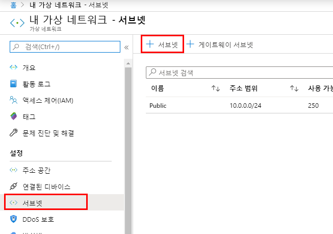
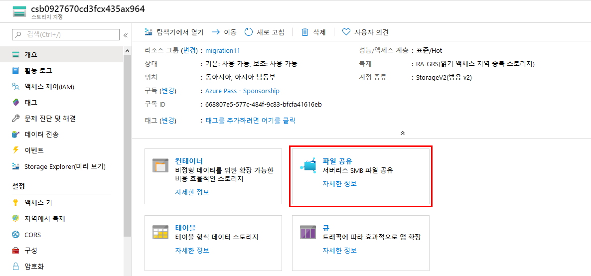
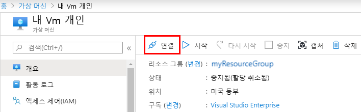
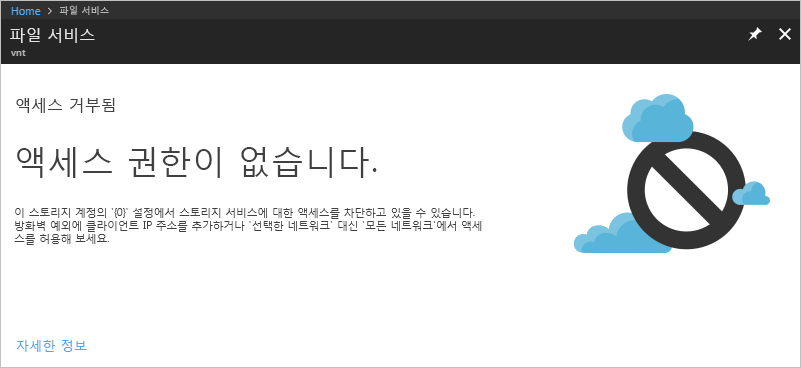

---
lab:
    title: '랩 7: 서비스 엔드포인트'
    module: '모듈 2 - 플랫폼 보호 구현'
---

# 모듈 2: 랩 7: 서비스 엔드포인트


가상 네트워크 서비스 엔드포인트를 사용하면 일부 Azure 서비스 리소스만 가상 네트워크 서브넷에 액세스하도록 네트워크 액세스 범위를 제한할 수 있습니다. 인터넷을 통한 리소스 액세스 권한을 제거할 수도 있습니다. 서비스 엔드포인트는 가상 네트워크에서 지원되는 Azure 서비스로 직접 연결하는 기능 제공하므로 가상 네트워크의 개인 주소 공간을 사용하여 Azure 서비스에 액세스할 수 있습니다. 서비스 엔드포인트를 통해 Azure 리소스로 전송되는 트래픽은 항상 Microsoft Azure 백본 네트워크에 유지됩니다. 이 자습서의 학습 내용은 다음과 같습니다.

- 서브넷이 하나 포함된 가상 네트워크 만들기
- 서브넷을 추가하고 서비스 엔드포인트를 사용하도록 설정
- Azure 리소스를 만들고 서브넷에서만 해당 리소스로의 네트워크 액세스 허용
- 각 서브넷에 VM(가상 머신) 배포
- 서브넷에서 리소스 액세스 확인
- 서브넷과 인터넷에서 리소스 액세스가 거부되는지 확인


## 연습 1: Azure Portal을 사용하여 가상 네트워크 서비스 엔드포인트로 PaaS 리소스에 대한 네트워크 액세스 제한

### 태스크 1: 가상 네트워크 만들기

1.  Azure Portal 왼쪽 위의 **+ 리소스 만들기**를 선택합니다.
2.  **네트워킹**, **가상 네트워크**를 차례로 선택합니다.
3.  다음 정보를 입력하거나 선택하고 **만들기**를 선택합니다.

   |설정|값|
   |----|----|
   |이름| myVirtualNetwork |
   |주소 공간| 10.0.0.0/16|
   |구독| 사용자의 구독을 선택합니다.|
   |리소스 그룹 | **새로 만들기**를 선택하고 *myResourceGroup*을 입력합니다.|
   |위치| **미국 동부**를 선택합니다. |
   |서브넷 이름| Public|
   |서브넷 주소 범위| 10.0.0.0/24|
   |DDoS 보호| 기본|
   |서비스 엔드포인트| 사용 안 함|
   |방화벽| 사용 안 함|


### 태스크 2: 서비스 엔드포인트를 사용하도록 설정


서비스/서브넷별로 서비스 엔드포인트를 사용하도록 설정합니다. 여기서는 서브넷을 만들고 해당 서브넷에 서비스 엔드포인트를 사용하도록 설정합니다.


1.  Portal 위쪽의 **리소스, 서비스 및 문서 검색** 상자에 *myVirtualNetwork*를 입력합니다. 검색 결과에 **myVirtualNetwork**가 표시되면 선택합니다.
2.  가상 네트워크에 서브넷을 추가합니다. 다음 그림과 같이 **설정**에서 **서브넷**, **+ 서브넷**을 차례로 선택합니다.

       

3.  **서브넷 추가**에서 다음 정보를 선택하거나 입력하고 **확인**을 선택합니다.

    |설정|값|
    |----|----|
    |이름| Private |
    |주소 범위| 10.0.1.0/24|
    |서비스 엔드포인트| **서비스**에서 **Microsoft.Storage**를 선택합니다.|

### 태스크 3: 서브넷에 대한 네트워크 액세스 제한


기본적으로 서브넷의 모든 VM은 모든 리소스와 통신할 수 있습니다. 네트워크 보안 그룹을 만든 다음 서브넷과 연결하면 서브넷에 포함된 모든 리소스와의 통신을 제한할 수 있습니다.


1.  Azure Portal 왼쪽 위의 **+ 리소스 만들기**를 선택합니다.
2.  **네트워킹**, **네트워크 보안 그룹**을 차례로 선택합니다.
3.  **네트워크 보안 그룹 만들기**에서 다음 정보를 입력하거나 선택한 다음 **만들기**를 선택합니다.

    |설정|값|
    |----|----|
    |이름| myNsgPrivate |
    |구독| 사용자의 구독을 선택합니다.|
    |리소스 그룹 | **기존 항목 사용**을 선택하고 *myResourceGroup*을 선택합니다.|
    |위치| **미국 동부**를 선택합니다. |

4.  네트워크 보안 그룹이 작성되고 나면 Portal 위쪽의 **리소스, 서비스 및 문서 검색** 상자에 *myNsgPrivate*을 입력합니다. 검색 결과에 **myNsgPrivate**이 표시되면 선택합니다.
5.  **설정**에서 **아웃바운드 보안 규칙**을 선택합니다.
6.  **+ 추가**를 선택합니다.
7.  Azure Storage 서비스와의 아웃바운드 통신을 허용하는 규칙을 만듭니다. 다음 정보를 입력하거나 선택하고 **추가**를 선택합니다.

    |설정|값|
    |----|----|
    |원본| **VirtualNetwork**를 선택합니다. |
    |원본 포트 범위| * |
    |대상 | **서비스 태그**를 선택합니다.|
    |대상 서비스 태그 | **스토리지**를 선택합니다.|
    |대상 포트 범위| * |
    |프로토콜|모두|
    |작업|허용|
    |우선 순위|100|
    |이름|Allow-Storage-All|

8.  인터넷 통신을 거부하는 다른 아웃바운드 보안 규칙을 만듭니다. 이 규칙은 모든 네트워크 보안 그룹에서 아웃바운드 인터넷 통신을 허용하는 기본 규칙을 재정의합니다. 다음 값을 사용하여 5~7단계를 다시 완료합니다.

    |설정|값|
    |----|----|
    |원본| **VirtualNetwork**를 선택합니다. |
    |원본 포트 범위| * |
    |대상 | **서비스 태그**를 선택합니다.|
    |대상 서비스 태그| **인터넷**을 선택합니다.|
    |대상 포트 범위| * |
    |프로토콜|모두|
    |작업|거부|
    |우선 순위|110|
    |이름|Deny-Internet-All|

9.  **설정**에서 **인바운드 보안 규칙**을 선택합니다.
10.  **+ 추가**를 선택합니다.
11.  모든 위치에서 서브넷으로 전송되는 RDP(원격 데스크톱 프로토콜) 트래픽을 허용하는 인바운드 보안 규칙을 만듭니다. 이 규칙은 인터넷의 모든 인바운드 트래픽을 거부하는 기본 보안 규칙을 재정의합니다. 서브넷에 대한 원격 데스크톱 연결이 허용되므로 이후 단계에서 연결을 테스트할 수 있습니다. **설정**에서 **인바운드 보안 규칙**, **+ 추가**를 차례로 선택하고 다음 값을 입력한 후에 **추가**를 선택합니다.

        |설정|값|
        |----|----|
        |원본| 모두 |
        |원본 포트 범위| * |
        |대상 | **VirtualNetwork**를 선택합니다.|
        |대상 포트 범위| 3389 |
        |프로토콜|모두|
        |작업|Allow|
        |우선 순위|120|
        |이름|Allow-RDP-All|

12.  **설정**에서 **서브넷**을 선택합니다.
13.  **+ 연결**을 선택합니다.
14.  **서브넷 연결**에서 **가상 네트워크**를 선택하고 **가상 네트워크 선택**에서 **myVirtualNetwork**를 선택합니다.
15.  **서브넷 선택**에서 **Private**을 선택한 다음 **확인**을 선택합니다.

### 태스크 4: 리소스로의 네트워크 액세스 제한


서비스 엔드포인트를 사용하도록 설정된 Azure 서비스를 통해 생성한 리소스로의 네트워크 액세스를 제한하기 위해 수행해야 하는 단계는 서비스별로 다릅니다. 각 서비스의 구체적인 단계는 개별 서비스의 설명서를 참조하세요. 이 자습서의 뒷부분에는 Azure 스토리지 계정에 대한 네트워크 액세스를 제한하는 단계가 예제로 포함되어 있습니다.


1.  Azure Portal 왼쪽 위의 **+ 리소스 만들기**를 선택합니다.
2.  **스토리지**를 선택하고 **Storage 계정 - Blob, File, Table, Queue**를 선택합니다.
3.  다음 정보를 입력하거나 선택하고 나머지 기본값을 적용한 다음 **만들기**를 선택합니다.

    |설정|값|
    |----|----|
    |이름| 숫자와 소문자만 사용하여 길이가 3~24자인 이름을 입력합니다. 이 이름은 모든 Azure 위치에서 고유해야 합니다.|
    |계정 종류|스토리지 V2(범용 v2)|
    |위치| **미국 동부**를 선택합니다. |
    |복제| LRS(로컬 중복 스토리지)|
    |구독| 사용자의 구독을 선택합니다.|
    |리소스 그룹 | **기존 항목 사용**을 선택하고 *myResourceGroup*을 선택합니다.|

### 태스크 5: 스토리지 계정에서 파일 공유 만들기

1.  스토리지 계정이 작성되고 나면 Portal 위쪽의 **리소스, 서비스 및 문서 검색** 상자에 스토리지 계정의 이름을 입력합니다. 검색 결과에 스토리지 계정의 이름이 표시되면 선택합니다.
2.  다음 그림과 같이 **파일 공유**를 선택합니다.

       

3.  **+ 파일 공유**를 선택합니다.
4.  **이름**에 *my-file-share*을 입력하고 **확인**을 선택합니다.
5.  **파일 서비스** 상자를 닫습니다.

### 태스크 6: 서브넷으로의 네트워크 액세스 제한


기본적으로 스토리지 계정은 인터넷을 비롯한 모든 네트워크에서 클라이언트의 네트워크 연결을 수락합니다. 이 태스크에서는 *myVirtualNetwork* 가상 네트워크의 *Private* 서브넷을 제외한 모든 가상 네트워크의 기타 모든 서브넷과 인터넷의 네트워크 액세스를 거부합니다.


1.  스토리지 계정의 **설정**에서 **방화벽 및 가상 네트워크**를 선택합니다.
2.  **선택한 네트워크**를 선택합니다.
3.  **+기존 가상 네트워크 추가**를 선택합니다.
4.  **네트워크 추가**에서 다음 값을 선택하고 **추가**를 선택합니다.

    |설정|값|
    |----|----|
    |구독| 사용자의 구독을 선택합니다.|
    |가상 네트워크|**가상 네트워크**에서 **myVirtualNetwork**를 선택합니다.|
    |서브넷| **서브넷**에서 **Private**을 선택합니다.|


5.  **저장**을 선택합니다.
6.  **방화벽 및 가상 네트워크** 상자를 닫습니다.
7.  스토리지 계정의 **설정**에서 **액세스 키**를 선택합니다.

8.  **키** 값을 적어 둡니다. 이후 단계에서 VM의 드라이브 문자에 파일 공유를 매핑할 때 이 값을 수동으로 입력해야 합니다.

### 태스크 7: 가상 머신 만들기


스토리지 계정으로의 네트워크 액세스를 테스트하려면 각 서브넷에 VM을 배포합니다.


1.  Azure Portal 왼쪽 위의 **+ 리소스 만들기**를 선택합니다.
2.  **컴퓨팅**, **가상 머신**을 차례로 선택합니다.
3.  다음 정보를 입력하거나 선택하고 **확인**을 선택합니다.

   |설정|값|
   |----|----|
   |이름| myVmPublic|
   |사용자 이름|선택한 사용자 이름을 입력합니다.|
   |암호| Pa55w.rd1234 |
   |구독| 사용자의 구독을 선택합니다.|
   |리소스 그룹| **기존 항목 사용**을 선택하고 **myResourceGroup**을 선택합니다.|
   |위치| **미국 동부**를 입력합니다.|
   |이미지| **Windows Server 2019 Datacenter**를 선택합니다.|

   
4.  가상 머신의 크기를 선택하고 **선택**을 선택합니다.
5.  **네트워킹** 탭에서 **myVirtualNetwork**를 선택합니다. 그런 다음 **서브넷**을 선택하고 **Public** 서브넷을 선택합니다.

   
6.  **네트워크 보안 그룹**에서 **기본**을 선택하고 포트 3389를 허용합니다. 

1.  **검토 + 만들기**를 클릭합니다.

7.  **요약** 페이지에서 **만들기**를 선택하여 가상 머신 배포를 시작합니다. VM을 배포하려면 몇 분 정도 걸립니다. 하지만 VM이 생성되는 동안 다음 단계를 계속 진행해도 됩니다.

1.  1~8단계를 다시 완료하되 3단계에서 가상 머신 이름을 *myVmPrivate*으로 지정하고 5단계에서 **Private** 서브넷을 선택합니다.

VM을 배포하려면 몇 분 정도 걸립니다. VM 생성이 완료되고 VM 설정이 Portal에서 열릴 때까지는 다음 단계를 계속 진행하지 마세요.

### 태스크 8: 스토리지 계정 액세스 확인

1.  *myVmPrivate* VM 생성이 완료되면 Azure에서 해당 VM의 설정이 열립니다. 다음 스크린샷에 나와 있는 것처럼 **연결** 단추를 선택하여 VM에 연결합니다.

       

2.  **연결** 단추를 선택하면 원격 데스크톱 프로토콜(.rdp) 파일이 작성되어 컴퓨터에 다운로드됩니다.  
3.  다운로드된 rdp 파일을 엽니다. 메시지가 표시되면 **연결**을 선택합니다. VM을 만들 때 지정한 사용자 이름과 암호를 입력합니다. VM을 만들 때 입력한 자격 증명을 지정하려면 **다른 옵션 선택**, **다른 계정 사용**을 차례로 선택해야 할 수 있습니다. 
4.  **확인**을 선택합니다.
5.  로그인 프로세스 중에 인증서 경고가 표시될 수 있습니다. 경고가 표시되면 **예** 또는 **계속**을 선택하여 연결을 계속 진행합니다.
6.  *myVmPrivate* VM에서 PowerShell을 사용하여 Z 드라이브에 Azure 파일 공유를 매핑합니다. 다음 명령을 실행하기 전에 `<스토리지 계정 키>` 및 `<스토리지 계정 이름>`을 **스토리지 계정 만들기** 태스크에서 입력 및 검색한 값으로 바꿉니다.

       ```powershell
       $acctKey = ConvertTo-SecureString -String "<storage-account-key>" -AsPlainText -Force
       $credential = New-Object System.Management.Automation.PSCredential -ArgumentList "Azure\<storage-account-name>", $acctKey
       New-PSDrive -Name Z -PSProvider FileSystem -Root "\\<storage-account-name>.file.core.windows.net\my-file-share"  -Credential $credential
       ```

     Azure 파일 공유가 Z 드라이브에 매핑됩니다.

7.  명령 프롬프트에서 VM에 인터넷으로의 아웃바운드 연결이 설정되어 있지 않음을 확인합니다.

       ```
       ping bing.com
       ```

    *Private* 서브넷에 연결된 네트워크 보안 그룹은 인터넷으로의 아웃바운드 액세스를 허용하지 않으므로 회신이 수신되지 않습니다.

8.  *myVmPrivate* VM으로의 원격 데스크톱 세션을 닫습니다.

### 태스크 9: 스토리지 계정 액세스가 거부되는지 확인

1.  Portal 위쪽의 **리소스, 서비스 및 문서 검색** 상자에 *myVmPublic*을 입력합니다.
2.  검색 결과에 **myVmPublic**이 표시되면 선택합니다.
3.  *myVmPublic* VM에 대해 스토리지 계정 액세스 확인 태스크의 1~6단계를 완료합니다.

       잠시 기다리면 `New-PSDrive: 액세스 거부` 오류가 발생합니다. 액세스가 거부되는 이유는 *myVmPublic* VM이 *Public* 서브넷에 배포되었기 때문입니다. *Public* 서브넷에는 Azure Storage에 사용할 수 있는 서비스 엔드포인트가 없습니다. 스토리지 계정은 *Public* 서브넷이 아닌 *Private* 서브넷의 네트워크 액세스만 허용합니다.

4.  *myVmPublic* VM으로의 원격 데스크톱 세션을 닫습니다.

5.  컴퓨터에서 Azure Portal로 이동합니다.
6.  앞에서 만든 스토리지 계정의 이름을 **리소스, 서비스 및 문서 검색** 상자에 입력합니다. 검색 결과에 스토리지 계정의 이름이 표시되면 선택합니다.
7.  **파일**을 선택합니다.
8.  다음 스크린샷에 나와 있는 오류가 발생합니다.

      

      컴퓨터가 *MyVirtualNetwork* 가상 네트워크의 *Private* 서브넷에 있지 않으므로 액세스가 거부됩니다.


| 경고: 계속하기 전에 이 랩에서 사용한 모든 리소스를 제거해야 합니다.  **Azure Portal**에서 리소스를 제거하려면 **리소스 그룹**을 클릭합니다.  랩에서 만든 리소스 그룹을 모두 선택합니다.  리소스 그룹 블레이드에서 **리소스 그룹 삭제**를 클릭하고 리소스 그룹 이름을 입력한 다음 **삭제**를 클릭합니다.  추가로 만든 리소스 그룹이 있으면 이 프로세스를 반복합니다. **리소스 그룹을 삭제하지 않으면 다른 랩에서 문제가 발생할 수 있습니다.** |
| --- |

**결과**: 이 랩이 완료되었습니다.
