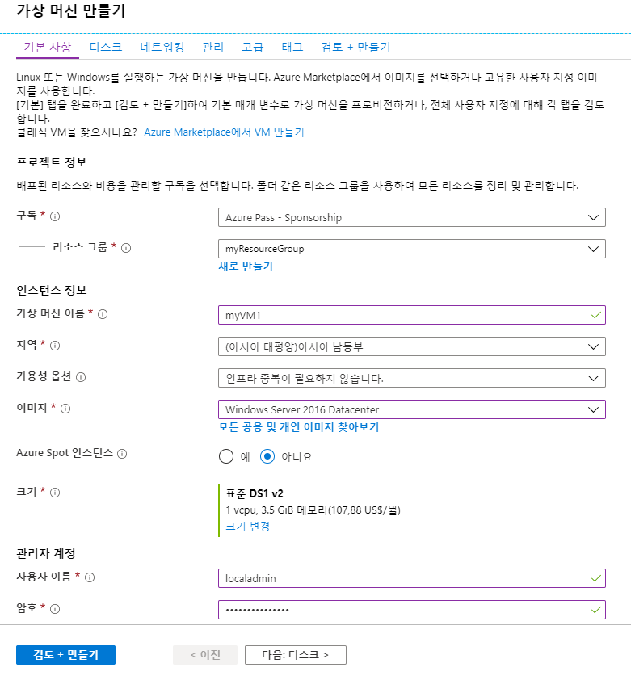
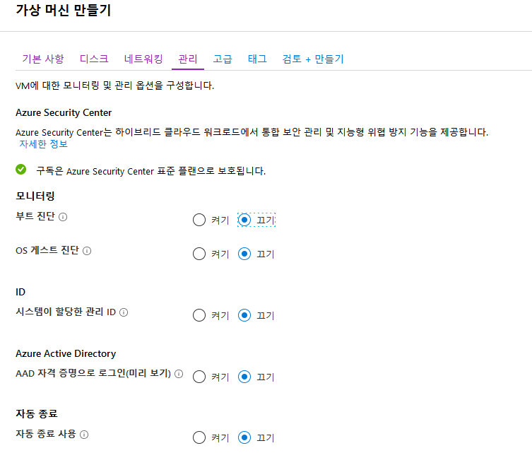

---
lab:
    title: '실습 8 - VNet 피어링'
    module: '모듈 2 - 플랫폼 보호 구현'
---

# 모듈 2: 실습 8 - VNet 피어링


**시나리오**

가상 네트워크 피어링을 사용하여 가상 네트워크를 서로 연결할 수 있습니다. 이러한 가상 네트워크는 같은 지역에 있을 수도 있고 다른 지역에 있을 수도 있습니다. 서로 다른 지역의 가상 네트워크를 연결하는 작업은 글로벌 VNet 피어링이라고도 합니다. 가상 네트워크가 피어링되면 두 가상 네트워크의 리소스가 서로 통신할 수 있습니다. 이때 해당 리소스가 같은 가상 네트워크에 있는 것처럼 대기 시간과 대역폭도 동일합니다. 이 자습서의 학습 내용은 다음과 같습니다.

- 가상 네트워크 2개 만들기
- 가상 네트워크 피어링을 통해 두 가상 네트워크 연결
- 각 가상 네트워크에 VM(가상 머신) 배포
- VM 간 통신


### 연습 1: 가상 네트워크를 만들고 피어링 구현

### 태스크 1: 가상 네트워크 만들기

1.  Azure Portal 왼쪽 위의 **+ 리소스 만들기**를 선택합니다.
2.  **네트워킹**, **가상 네트워크**를 차례로 선택합니다.
3.  다음 정보를 입력하거나 선택하고 나머지 설정은 기본값을 적용한 후에 **만들기**를 선택합니다.

    |설정|값|
    |---|---|
    |이름|myVirtualNetwork1|
    |주소 공간|10.0.0.0/16|
    |구독| 사용자의 구독을 선택합니다.|
    |리소스 그룹| **새로 만들기**를 선택하고 *myResourceGroup*을 입력합니다.|
    |위치| **미국 동부**를 입력합니다.|
    |서브넷 이름|Subnet1|
    |서브넷 주소 범위|10.0.0.0/24|


4.  다음 설정을 변경하여 1~3단계를 다시 완료합니다.

    |설정|값|
    |---|---|
    |이름|myVirtualNetwork2|
    |주소 공간|10.1.0.0/16|
    |리소스 그룹| **기존 항목 사용**을 선택하고 **myResourceGroup**을 선택합니다.|
    |서브넷 주소 범위|10.1.0.0/24|

### 태스크 2: 가상 네트워크 피어링

1.  Azure Portal 위쪽의 검색 상자에 *MyVirtualNetwork1* 입력을 시작합니다. 검색 결과에 **MyVirtualNetwork1**이 표시되면 선택합니다.
2.  **설정**에서 **피어링**, **+ 추가**를 차례로 선택합니다.

3.  다음 정보를 입력하거나 선택하고 나머지 설정은 기본값을 적용한 후에 **확인**을 선택합니다.

    |설정|값|
    |---|---|
    |이름|myVirtualNetwork1-myVirtualNetwork2|
    |구독| 사용자의 구독을 선택합니다.|
    |가상 네트워크|myVirtualNetwork2 - *myVirtualNetwork2* 가상 네트워크를 선택하려면 **가상 네트워크**를 선택하고 **myVirtualNetwork2**를 선택합니다. 같은 지역이나 다른 지역의 가상 네트워크를 선택할 수 있습니다.|
    |이름|myVirtualNetwork2-myVirtualNetwork1|


    다음 스크린샷과 같이 **피어링 상태**가 *시작됨*으로 변경됩니다.


    이 상태가 표시되지 않으면 브라우저를 새로 고치세요.

    **피어링 상태**는 *연결됨*입니다. 즉, *myVirtualNetwork2-myVirtualNetwork1* 피어링의 상태도 *시작됨*에서 *연결됨*으로 변경되었습니다. 두 가상 네트워크의 피어링 상태가 모두 *연결됨*으로 표시되어야 가상 네트워크 피어링이 완전히 설정됩니다. 
    
    

### 태스크 3: 가상 머신 만들기

1.  Azure Portal 왼쪽 위의 **+ 리소스 만들기**를 선택합니다.
2.  **컴퓨팅**, **Windows Server 2016 Datacenter**를 차례로 선택합니다. 다른 운영 체제를 선택해도 되지만 나머지 단계에서는 운영 체제로 **Windows Server 2016 Datacenter**를 선택했다고 가정합니다. 
3.  **기본 사항**에서 다음 정보를 입력하거나 선택하고 나머지 설정은 기본값을 적용한 후에 **만들기**를 선택합니다.

    |설정|값|
    |---|---|
    |리소스 그룹| **MyResourceGroup**을 선택합니다.|
    |이름|myVM1|
    |지역| 미국 동부|
    |사용자 이름| localadmin |
    |암호| Pa55w.rd1234 |
       
     
   

5.  네트워킹 탭을 선택합니다.

    |설정|값|
    |---|---|
    |가상 네트워크| myVirtualNetwork1 - myVirtualNetwork을 아직 선택하지 않았다면 **가상 네트워크**를 선택하고 **가상 네트워크 선택**에서 **myVirtualNetwork1**을 선택합니다.|
    |서브넷| Subnet1 - Subnet1을 아직 선택하지 않았다면 **서브넷**을 선택하고 **서브넷 선택**에서 **Subnet1**을 선택합니다.|
    |공용 인바운드 포트| **선택한 포트 허용**을 선택합니다.|
    |인바운드 포트 선택| **RDP** |


1.  관리 탭을 선택하고 모든 라디오 단추를 **끄기**로 전환합니다.

     

6.  **검토 + 만들기**를 선택한 다음 **만들기**를 클릭합니다.


1.  다음 설정을 변경하여 위의 단계를 다시 완료합니다. VM을 만들려면 몇 분 정도 걸립니다. 두 VM이 모두 생성될 때까지는 나머지 단계를 계속 진행하지 마세요.

 |설정|값|
 |---|---|
 |이름 | myVM2|
 |가상 네트워크 | myVirtualNetwork2|


### 태스크 4: VM 간 통신

1.  Portal 위쪽의 *검색* 상자에 *myVM1* 입력을 시작합니다. 검색 결과에 **myVM1**이 표시되면 선택합니다.
2.  **연결**을 선택하여 *myVm1* VM에 대한 원격 데스크톱 연결을 만듭니다.

3.  VM에 연결하려면 다운로드된 RDP 파일을 엽니다. 메시지가 표시되면 **연결**을 선택합니다.
4.  VM을 만들 때 지정한 사용자 이름과 암호를 입력하고 **확인**을 클릭합니다. VM을 만들 때 입력한 자격 증명을 지정하려면 **다른 옵션 선택**, **다른 계정 사용**을 차례로 선택해야 할 수 있습니다.
5.  로그인 프로세스 중에 인증서 경고가 표시될 수 있습니다. **예**를 선택하여 연결을 진행합니다.
6.  이후 단계에서 ping을 사용하여 *myVm1* VM에서 *myVm2* VM과 통신합니다. ping에서 사용되는 ICMP(Internet Control Message Protocol)는 기본적으로 Windows 방화벽을 통해 거부됩니다. 이후 단계를 수행할 때 *myVm2*에서 이 VM에 대한 ping을 실행할 수 있도록 PowerShell을 사용하여 *myVm1* VM에서 Windows 방화벽을 통해 ICMP를 사용하도록 설정합니다.

    ```powershell
    New-NetFirewallRule -DisplayName "Allow ICMPv4-In" -Protocol ICMPv4
    ```
    
    이 자습서에서는 VM 간의 통신에 ping을 사용하지만, 프로덕션 배포에서는 Windows 방화벽을 통해 ICMP를 허용하지 않는 것이 좋습니다.

7.  *myVm2* VM에 연결하려면 *myVm1* VM의 명령 프롬프트에서 다음 명령을 입력합니다.

    ```cli
    mstsc /v:10.1.0.4
    ```
    
8.  *myVm1*에서 ping을 사용하도록 설정했으므로 이제 IP 주소로 해당 VM에 대해 ping을 실행할 수 있습니다.

    ```cli
    ping 10.0.0.4
    ```
    
9.  *myVM1* 및 *myVM2* 둘 다에 대한 RDP 세션 연결을 끊습니다..


10. 모든 리소스는 이후 랩에서도 사용할 것이므로  실행 중인 상태로 유지하세요.


**결과**: 이 랩이 완료되었습니다.

