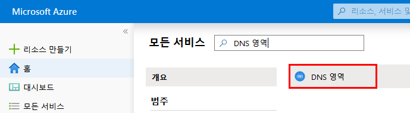
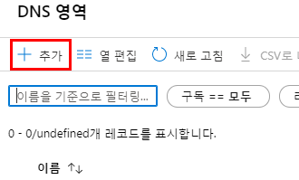
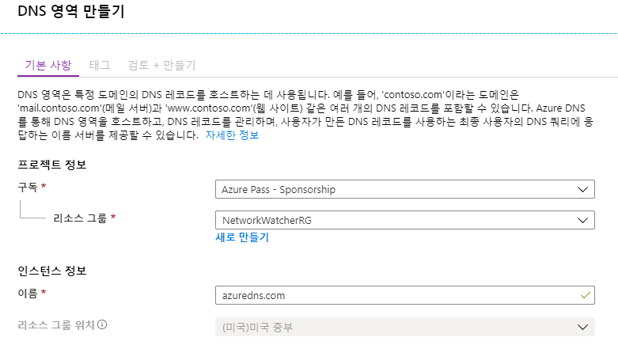
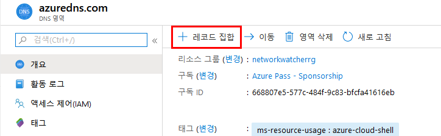
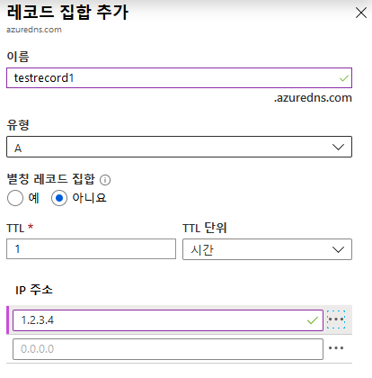
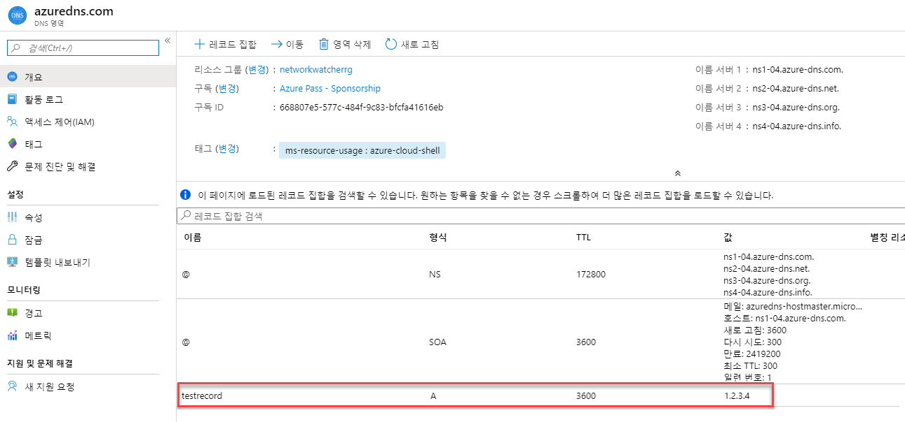
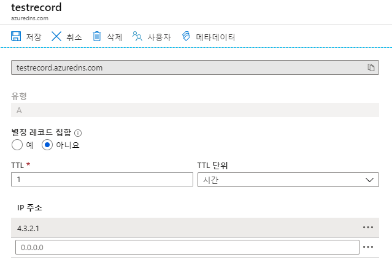
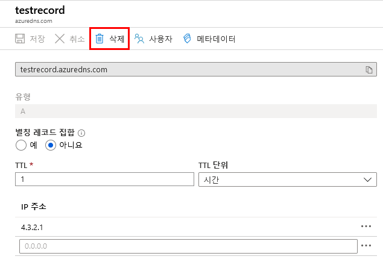

---
lab:
    title: 'LAB 09_Azure DNS'
    module: '모듈 02 - 플랫폼 보호'
---


# 랩: Azure DNS

**시나리오**

이 모듈에서는 DNS 기본 사항과 Azure DNS를 구체적으로 구현하는 방법에 대해 학습합니다. DNS 기본사항에서는 DNS 도메인, 영역, 레코드 유형 및 resolution 방법을 검토하십시오. Azure DNS에서는 위임(delegation), 메트릭, 경고 및 DNS 호스팅 체계를 다룹니다.

**목표**

이 랩은 다음 내용을 포함합니다.

 * Azure DNS Basics
 * Azure DNS 구현


### 연습 1: DNS 영역

#### 작업 1: DNS 영역 생성

1.  Azure 포털에 로그인한다.

2.  **DNS 영역**을 탐색하여 클릭한다. 

     

1. **+ 추가**를 클릭한다.

     

4.  **DNS 영역 만들기** 블레이드에서 다음 값을 사용한 후, **검토 + 만들기**를 클릭한다. 유효성 검사에 통과하면 **만들기**를 클릭한다.

     | **설정** | **값** | 
     |------|---|---|
     | **구독** | **이 랩에서 사용할 구독의 이름** |
     | **리소스 그룹** | 새로 만들기: **az5000209** |
     | **이름** | **고유한 이름으로 설정(예시 : krazurelab.com)** |
     | **리소스 그룹 위치** | 동남아시아|

     


### 연습 2: Azure 포털을 통한 DNS 레코드 및 레코드 셋 관리

Azure 포털을 사용하여 DNS 레코드와 레코드 셋을 관리하는 방법을 실습합니다.

#### 작업 1: 레코드 세트에 새로운 레코드 추가

1.  Azure 포털에서 이전 작업에서 배포한 DNS 영역을 탐색하여 클릭한다. 

    **참고:** 각 DNS 영역은 자체 자원이며, 이 보기에서 레코드 집합 수, 네임 서버 등의 정보를 볼 수 있습니다.

3.  **+ 레코드 집합**을 클릭한다.
 
     

4.  이름에 **testrecord**를 입력하고, IP 주소에 **1.2.3.4**를 입력하여 **확인**을 클릭한다.

     


#### 작업 2: 레코드 업데이트

1.  DNS 영역의 개요 블레이드에서 이전 작업에서 생성한 testrecord를 클릭한다. 

      
 
2.  IP 주소 아래 **4.3.2.1**을 추가하고 **저장**을 클릭한다.

     
 

#### 작업 3: 레코드 집합에서 레코드 제거

Azure 포털을 사용하여 레코드 세트에서 레코드를 제거할 수 있습니다. 레코드 집합에서 마지막 레코드를 제거해도 레코드 집합은 삭제되지 않는다는 점에 유의하십시오.

1.  DNS 영역의 개요 블레이드에서 이전 작업에서 생성한 testrecord를 클릭한다. 

     

2.  **삭제**를 선택하고, 확인 메시지가 뜨면 **예**를 클릭한다. 

      
 
**NS 레코드와 SOA 레코드**

자동으로 생성되는 NS 및 SOA 레코드는 다른 레코드 유형과 다르게 관리됩니다. 

**SOA 레코드 수정**

zone apex (name = "\@")에서 자동으로 생성된 SOA 레코드 집합에서 레코드를 추가하거나 제거할 수 없습니다. 그러나 SOA 레코드("Host" 제외) 및 레코드 집합 TTL의 매개변수를 수정할 수 있습니다.

**zone apex에서 NS 레코드 수정**

zone apex에서 설정된 NS 레코드는 각 DNS 영역과 함께 자동으로 생성됩니다. 영역에 할당된 Azure DNS 이름 서버의 이름을 포함합니다.

해당 NS 레코드 집합에 이름 서버를 추가하여 둘 이상의 DNS provider가 있는 도메인을 공동 호스팅할 수 있습니다. 이 레코드 집합에 대한 TTL 및 메타데이터도 수정할 수 있습니다. 그러나 미리 입력된 Azure DNS 이름 서버는 제거하거나 수정할 수 없습니다.

이는 zone apex에 있는 NS 레코드 집합에만 적용된다는 점에 유의하십시오. 영역에 있는 다른 NS 레코드 집합(child zones을 위임하는 데 사용)은 제한 없이 수정할 수 있습니다.

**SOA 레코드 집합 또는 NS 레코드 집합 삭제**

영역 생성 시 자동으로 만들어진 zone apex (name = "\@")의 SOA 및 NS 레코드 집합은 삭제할 수 없습니다. 이 레코드 집합은 영역을 삭제하면 자동으로 삭제됩니다. 

DNS 영역을 삭제할지 확인하는 메시지가 표시됩니다. DNS 영역을 삭제하면 영역에 포함된 모든 레코드도 삭제됩니다.


### 연습 3: 랩 리소스 삭제

#### 작업 1: Cloud Shell 열기

1. Azure 포털 상단에서 **Cloud Shell** 아이콘을 클릭하여 Cloud Shell 창을 엽니다.

1. Cloud Shell 인터페이스에서 **Bash**를 선택합니다.

1. **Cloud Shell** 명령 프롬프트에서 다음 명령을 입력하고 **Enter**를 눌러 이 랩에서 생성한 모든 리소스 그룹을 나열합니다.

    ```sh
    az group list --query "[?starts_with(name,'az500')].name" --output tsv
    ```

1. 출력된 결과가 이 랩에서 생성한 리소스 그룹만 포함되어 있는지 확인합니다. 이 그룹은 다음 작업에서 삭제됩니다.


#### 작업 2: 리소스 그룹 삭제하기

1. **Cloud Shell** 명령 프롬프트에서 다음 명령을 입력하고 **Enter**를 눌러 이 랩에서 생성한 모든 리소스 그룹을 삭제합니다.

    ```sh
    az group list --query "[?starts_with(name,'az500')].name" --output tsv | xargs -L1 bash -c 'az group delete --name $0 --no-wait --yes'
    ```

1. **Cloud Shell** 명령 프롬프트를 닫습니다.

> **결과**: 이 연습을 완료한 후 이 랩에서 사용된 리소스 그룹을 제거했습니다.