---
lab:
    title: '랩 10 - 부하 분산 장치'
    module: '모듈 2 - 플랫폼 보호 구현'
---

# 모듈 2: 랩 10 - 부하 분산 장치


**시나리오**

이 모듈에서는 네트워크 트래픽을 분산하는 세 가지 방식인 Azure Load Balancer, Azure Traffic Manager, Azure Application Gateway에 대해 알아봅니다. Azure Load Balancer는 애플리케이션에 고가용성 및 네트워크 성능을 제공합니다. Azure Traffic Manager를 사용하면 서비스 엔드포인트로 전송되는 사용자 트래픽 분산을 제어할 수 있습니다. Azure Application Gateway는 웹 애플리케이션으로 전송되는 트래픽을 관리하는 데 사용할 수 있는 웹 트래픽 부하 분산 장치입니다. 

**이 모듈에 포함된 단원은 다음과 같습니다.**

- Azure Load Balancer
- Azure Traffic Manager 
- Azure Application Gateway


## 연습 1: 표준 Load Balancer를 사용하여 네트워크 트래픽 분산


이 섹션에서는 가상 머신 부하를 분산할 수 있는 공용 부하 분산 장치를 만듭니다. 표준 Load Balancer는 표준 공용 IP 주소만 지원합니다. 그러므로 표준 Load Balancer를 만들 때는 표준 Load Balancer용 프런트 엔드(기본 이름: *LoadBalancerFrontend*)로 구성되는 새 표준 공용 IP 주소도 만들어야 합니다. 


### 태스크 1: 공용 부하 분산 장치 만들기

1.  화면 왼쪽 위에서 **리소스 만들기** > **네트워킹** > **부하 분산 장치**를 클릭합니다.  

2.  **부하 분산 장치 만들기** 페이지에서 다음 정보를 입력하거나 선택하고 나머지 설정은 기본값을 적용한 후에 **검토 + 만들기**를 선택합니다.

    | 설정                 | 값                                              |
    | ---                     | ---                                                |
    | 구독               | 사용자의 구독을 선택합니다.    |
    |리소스 그룹 | **새로 만들기**를 선택하고 myResourceGroupLB를 입력합니다.    |
    | 이름                   | *myLoadBalancer*                                   |
    | 지역           | **미국 동부**를 입력합니다.                          |
    | 유형          | 공용                                        |
    | SKU           | 표준                          |
    | 공용 IP 주소 | **새로 만들기**를 선택하고 이름 상자에 *myPublicIP*를 입력합니다.  |
    | 가용성 영역               | **영역 중복**    |
    
      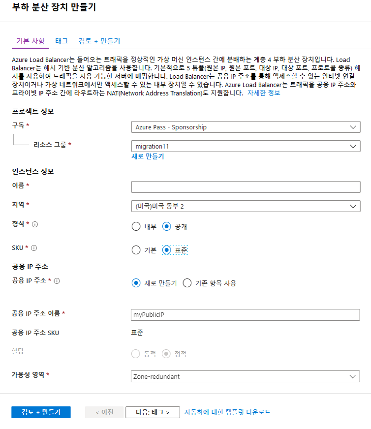

1.  유효성 검사 화면에서 **만들기**를 클릭합니다.

### 태스크 2: 가상 네트워크 만들기

1.  화면 왼쪽 위에서 **+ 리소스 만들기** > **네트워킹** > **가상 네트워크**를 클릭하고 가상 네트워크에 다음 값을 입력합니다.
    - **myVnet** - 가상 네트워크의 이름
    - **10.0.0.0/16** - 주소 공간
    - **myResourceGroupLB** - 기존 리소스 그룹의 이름
    - **myBackendSubnet** - 서브넷 이름
    - **10.0.0.0/24** - 서브넷 주소 범위
    </br>

2.  **만들기**를 클릭하여 가상 네트워크를 만듭니다.

     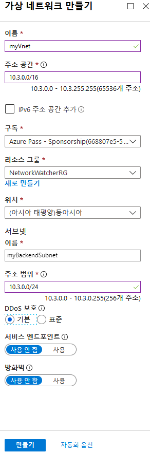

### 태스크 3: 가상 머신 만들기

1.  화면 왼쪽 위에서 **리소스 만들기** > **컴퓨팅** > **가상 머신**을 클릭하고 가상 머신에 다음 값을 입력합니다.
          
    - **myResourceGroupLB** - **리소스 그룹**의 드롭다운 메뉴에서 *myResourceGroupLB*를 선택합니다.
    - **myVM1** - 가상 머신의 이름  
    - **이미지** - Windows Server 2019 Datacenter
    - **localadmin** - **사용자 이름**
    - **Pa55w.rd1234** - **암호**
    - **HTTP(80) 및 RDP(3389)** - 인바운드 포트 규칙
</br>

     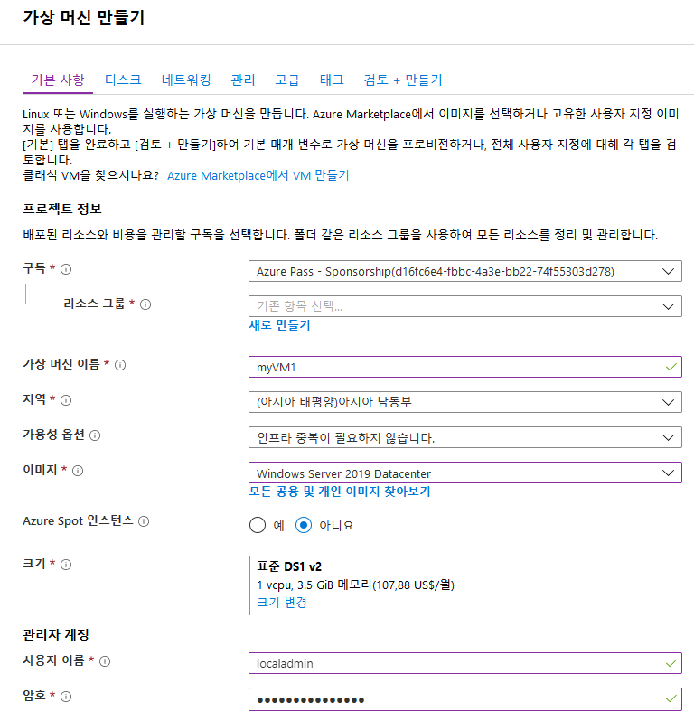

1.  네트워킹 탭을 클릭하고 공용 IP에서 **새로 만들기**를 클릭합니다.  IP 주소 이름을 **myPIP1**로 지정하고 **표준 SKU**, **확인**을 차례로 클릭합니다.

    **참고**: 여기서 표준 SKU를 선택하지 않으면 랩 뒷부분에서 문제가 발생합니다.


     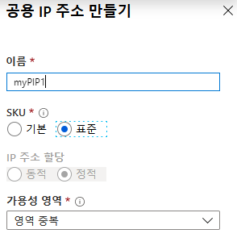

2.  **관리** 탭을 선택하고 모든 라디오 단추가 **아니요** 또는 **끄기**로 설정되어 있는지 확인합니다.

1.  **검토 + 만들기**, **만들기**를 차례로 클릭합니다.

7.  위 단계를 반복하여 두 번째 VM ***myVM2***를 만듭니다. 이때 새 공용 IP 주소로 _**myPIP2**_를 사용합니다. 
 
### 태스크 4: IIS 설치

1.  왼쪽 메뉴에서 **모든 리소스**를 클릭하고 리소스 목록에서 *myResourceGroupLB* 리소스 그룹에 있는 **myVM1**을 클릭합니다.

2.  **개요** 페이지에서 **연결**을 클릭하여 VM에 RDP로 연결합니다.
3.  사용자 이름 *localadmin*으로 VM에 로그인합니다.
4.  PowerShell을 열고 다음 명령을 실행하여 IIS를 설치합니다.

     ```powershell
    Install-WindowsFeature Web-Server
     ```

7.  가상 머신 *myVM2*에 대해 1~4단계를 반복합니다.

### 태스크 5: 부하 분산 장치 리소스 만들기


이 섹션에서는 백 엔드 주소 풀과 상태 프로브의 부하 분산 장치 설정을 구성하고 부하 분산 장치 규칙을 지정합니다.

VM에 트래픽을 분산하기 위해 백 엔드 주소 풀에는 부하 분산 장치에 연결된 가상 NIC의 IP 주소가 포함됩니다. *VM1*과 *VM2*를 포함할 백 엔드 주소 풀 *myBackendPool*을 만듭니다.


1.  왼쪽 메뉴에서 **모든 리소스**를 클릭하고 리소스 목록에서 **myLoadBalancer**를 클릭합니다.

2.  **설정**에서 **백 엔드 풀**, **추가**를 차례로 클릭합니다.

     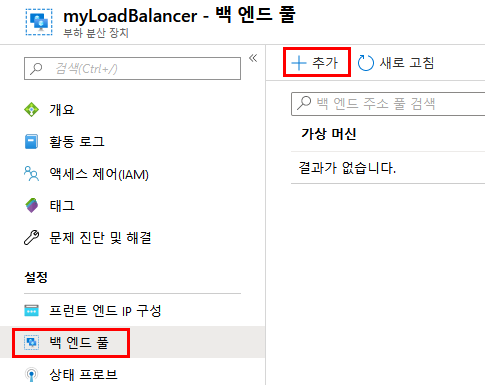

3.  **백 엔드 풀 추가** 페이지에서 다음 작업을 수행합니다.
   - 백 엔드 풀의 이름으로 *myBackendPool*을 입력합니다.
   - **가상 네트워크**로 *myVNet*을 선택합니다.
   - **가상 머신**에서 *myVM1* 및 *myVM2*를 해당 IP 주소와 함께 추가하고 **추가**를 선택합니다.
 </br>
 
     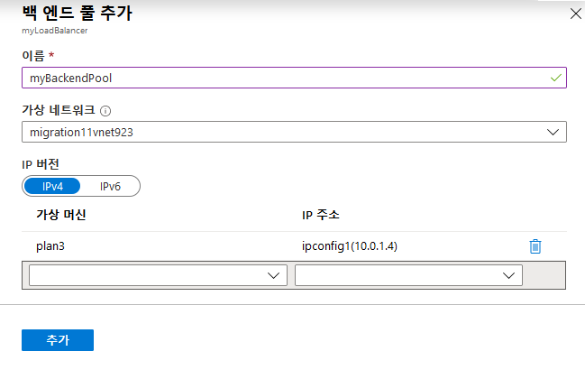

3.  부하 분산 장치 백 엔드 풀 설정에 **VM1** 및 **VM2** VM이 모두 표시되는지 확인합니다.

     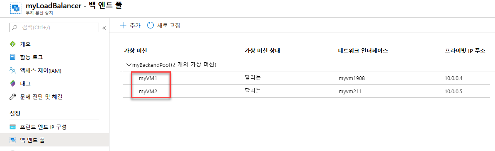

### 태스크 6: 상태 프로브 만들기


부하 분산 장치가 앱의 상태를 모니터링할 수 있도록 하려면 상태 프로브를 사용합니다. 상태 프로브는 상태 검사에 대한 응답에 따라 부하 분산 장치 회전에서 VM을 동적으로 추가하거나 제거합니다. VM의 상태를 모니터링할 상태 프로브 *myHealthProbe*를 만듭니다.


1.  부하 분산 장치 블레이드의 **설정**에서 **상태 프로브**, **추가**를 차례로 클릭합니다.

     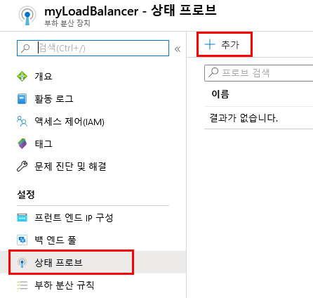

3.  다음 값을 사용해 상태 프로브를 만듭니다.
    - *myHealthProbe* - 상태 프로브 이름
    - **HTTP** - 프로토콜 유형
    - *80* - 포트 번호
    - */* - URI 경로 
    - *15* - 프로브 시도 간의 **간격**(초)
    - *2* - VM을 비정상 상태로 간주하려면 발생해야 하는 **비정상 임계값**(연속 프로브 오류 횟수)
</br>
 
     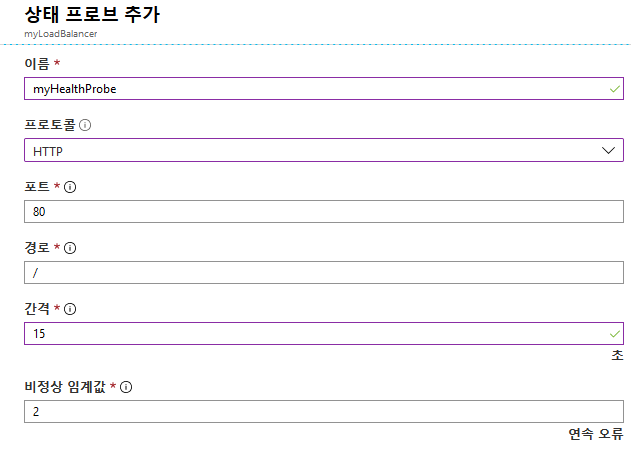


4.  **확인**을 클릭합니다.


### 태스크 7: 부하 분산 장치 규칙 만들기


부하 분산 장치 규칙은 트래픽이 VM에 분산되는 방식을 정의하는 데 사용됩니다. 들어오는 트래픽용 프런트 엔드 IP 구성과 트래픽을 수신할 백 엔드 IP 풀, 그리고 필요한 원본 및 대상 포트를 정의합니다. 프런트 엔드 *FrontendLoadBalancer*의 포트 80을 수신 대기하고, 역시 포트 80을 사용해 부하 분산된 네트워크 트래픽을 백 엔드 주소 풀 *myBackEndPool*로 전송하는 데 사용할 부하 분산 장치 규칙 *myLoadBalancerRuleWeb*을 만듭니다. 


1.  부하 분산 장치 블레이드의 **설정**에서 **부하 분산 규칙**, **추가**를 차례로 클릭합니다.

     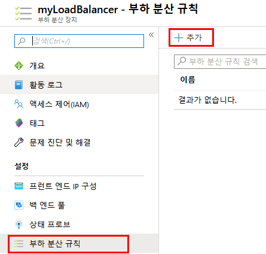


3.  다음 값을 사용하여 부하 분산 규칙을 구성합니다.
    - *myHTTPRule* - 부하 분산 규칙의 이름
    - **TCP** - 프로토콜 유형
    - *80* - 포트 번호
    - *80* - 백 엔드 포트
    - *myBackendPool* - 백 엔드 풀의 이름
    - *myHealthProbe* - 상태 프로브 이름
    </br>
    
      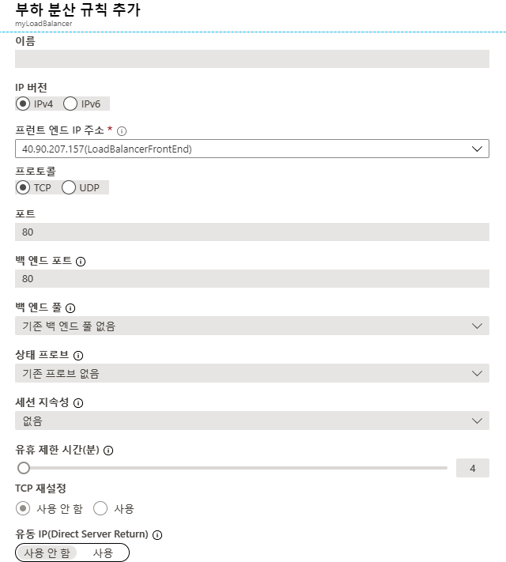
    
4.  **확인**을 클릭합니다.
    
### 태스크 8: 부하 분산 장치 테스트

1.  **개요** 화면에서 부하 분산 장치의 공용 IP 주소를 찾습니다.

     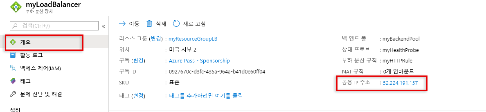
  
2.  공용 IP 주소를 복사한 다음 브라우저의 주소 표시줄에 붙여넣습니다. IIS 웹 서버의 기본 페이지가 브라우저에 표시됩니다.

     

1.  IIS 기본 페이지가 로드됩니다.

1.  Azure Portal의 허브 메뉴에서 **가상 머신**을 클릭합니다.  myVM1을 선택하고 **개요** 블레이드에서 **중지**를 클릭한 다음 **예**를 클릭하여 중지를 확인합니다.

     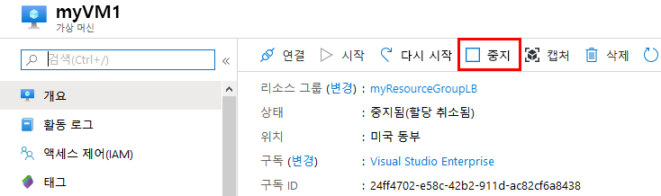
 
1.  myVM1 가상 머신이 중지될 때까지 기다렸다가 부하 분산 장치 공용 IP가 표시된 브라우저 탭으로 돌아옵니다. 그런 다음 새로 고침을 클릭하여 myVM2가 요청을 계속 처리하고 있으며 부하 분산 장치가 정상 작동하고 있음을 확인합니다.

## 연습 2:  부하 분산 장치 ARM 배포

### 태스크 1: ARM 템플릿 배포 


이 템플릿을 사용하면 부하 분산 장치 아래에 가상 머신 2개를 만들고 포트 80에서 부하 분산 규칙을 구성할 수 있습니다. 이 템플릿은 스토리지 계정, 가상 네트워크, 공용 IP 주소, 가용성 집합 및 네트워크 인터페이스도 배포합니다. 이 템플릿에서는 리소스 루프 기능을 사용하여 네트워크 인터페이스와 가상 머신을 만듭니다.


1.  브라우저의 새 탭에서 **`https://aka.gd/2E2MAjh`** URL로 이동합니다.

1.  **Azure에 배포**를 클릭합니다.

     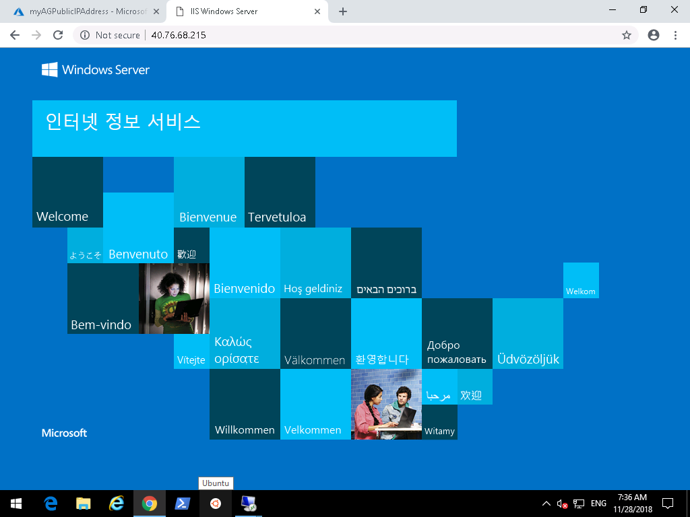

1.  템플릿 블레이드가 열리면 다음 세부 정보를 입력합니다.

      - 리소스 그룹:  **myResourceGroupLB**
      - 관리 사용자 이름:  **localadmin**
      - 관리자 암호:  **Pa55w.rd1234**

1.  **동의...**, **구매**를 차례로 클릭합니다.
# 연습 3: 애플리케이션 게이트웨이 배포

### 태스크 1: 애플리케이션 게이트웨이 만들기


작성한 리소스가 서로 통신하려면 가상 네트워크가 필요합니다. 이 예제에서는 서브넷 두 개를 만듭니다. 그 중 하나는 애플리케이션 게이트웨이용이고 다른 하나는 백 엔드 서버용입니다. 애플리케이션 게이트웨이와 가상 네트워크를 동시에 만들 수 있습니다.


1.  먼저 애플리케이션 게이트웨이를 포함할 서브넷을 만들어야 합니다. 허브 메뉴에서 **가상 네트워크**를 클릭하고 **myVNet**을 선택합니다.

     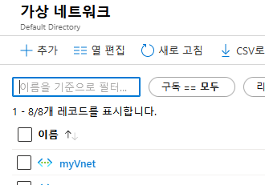
 
1.  **서브넷**, **+ 서브넷**을 차례로 클릭합니다.

     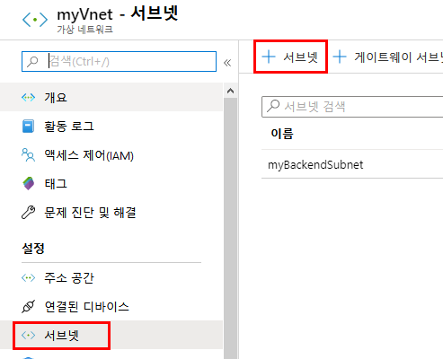
 
1.  이름으로 **myAppGWSubnet**을 입력하고 **확인**을 클릭합니다.

     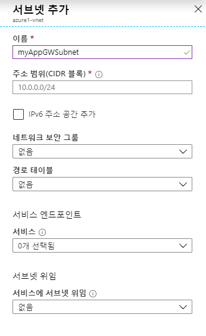

1.  Azure Portal 왼쪽 위의 **리소스 만들기**를 클릭합니다.

2.  **네트워킹**을 클릭하고 추천 목록에서 **Application Gateway**를 클릭합니다.

     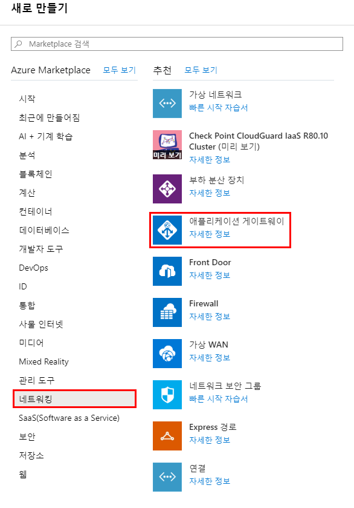

1.  애플리케이션 게이트웨이 기본 사항 블레이드에 아래 값을 입력하고 **다음**을 클릭합니다.

    - *myAppGateway* - 애플리케이션 게이트웨이의 이름
    - *myResourceGroupLB* - 기존 리소스 그룹 선택
    - *myVnet* - 기존 가상 네트워크 선택
</br>
    
        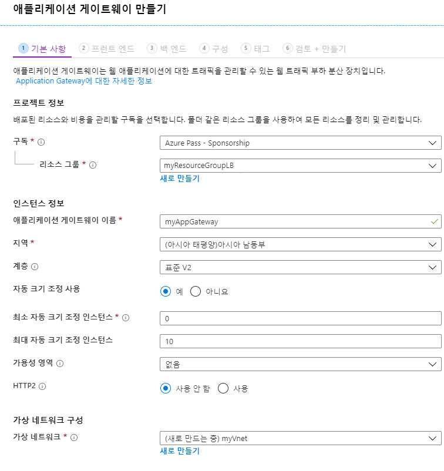

7.  **프런트 엔드 구성** 블레이드에서 **IP 주소 유형**이 **공용**으로 설정되어 있는지 확인하고 **공용 IP 주소**에서 **새로 만들기**를 클릭합니다. 공용 IP 주소 이름으로 ***myAGPublicIPAddress***를 입력하고 **확인**을 클릭합니다.

     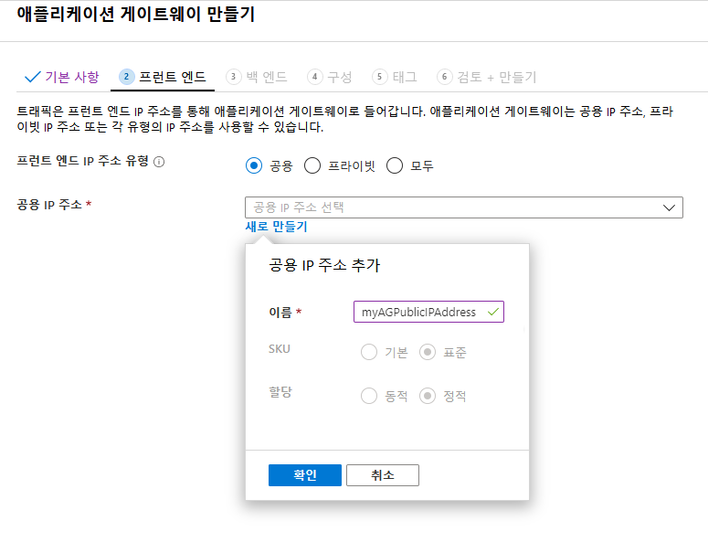
 
1. **다음**을 클릭합니다.

1. **+ 백 엔드 풀 추가**를 선택합니다.

1. 이름으로 **appGatewayBackendPool**을 입력합니다.  백 엔드 대상에서 **가상 머신**을 선택하고 myVM1 및 myVM2 가상 머신과 관련 네트워크 인터페이스를 추가한 후에 **추가**를 클릭합니다.

     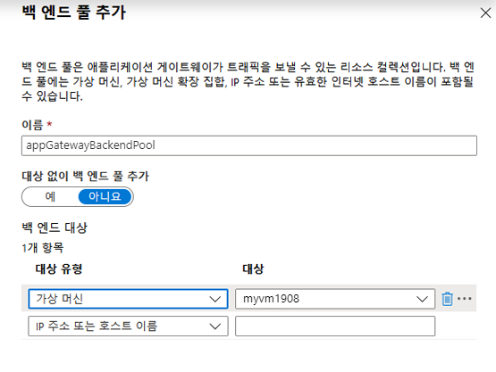

1. **다음**을 클릭합니다.

1. **구성** 탭에서 라우팅 규칙을 사용하여 생성한 프런트 엔드 및 백 엔드 풀을 연결합니다.

1. **라우팅 규칙** 열에서 **규칙 추가**를 선택합니다.

2. **라우팅 규칙 추가** 창이 열리면 **규칙 이름**으로 *myRoutingRule*을 입력합니다.

3. 라우팅 규칙에는 수신기가 필요합니다. **라우팅 규칙 추가** 창 내의 **수신기** 탭에서 수신기에 다음 값을 입력합니다.

    - **수신기 이름**: 수신기 이름으로 *myListener*를 입력합니다.
    - **프런트 엔드 IP**: **공용**을 선택하고 프런트 엔드용으로 만든 공용 IP를 선택합니다.
  
      **수신기** 탭의 기타 설정에는 기본값을 적용하고 **백 엔드 대상** 탭을 선택하여 나머지 라우팅 규칙을 구성합니다.

       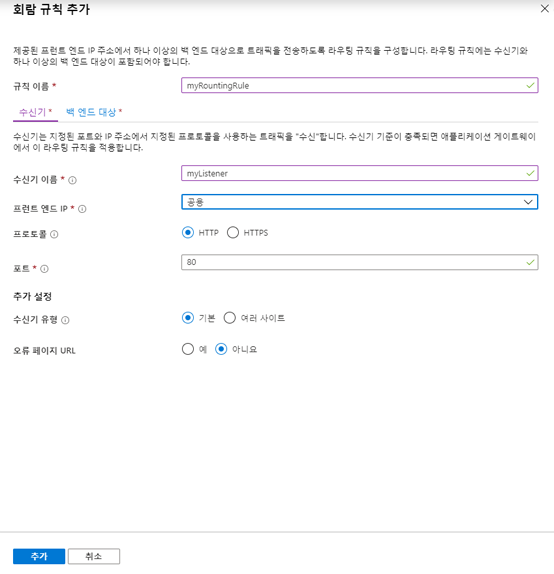

4. **백 엔드 대상** 탭에서 **백 엔드 대상**으로 **myBackendPool**을 선택합니다.

5. **HTTP 설정**에서 **새로 만들기**를 선택하여 새 HTTP 설정을 만듭니다. HTTP 설정에 따라 라우팅 규칙의 동작이 결정됩니다. **HTTP 설정 추가** 창이 열리면 **HTTP 설정 이름**으로 *myHTTPSetting*을 입력합니다. **HTTP 설정 추가** 창의 기타 설정에는 기본값을 적용하고 **추가**를 선택하여 **라우팅 규칙 추가** 창으로 돌아옵니다. 


    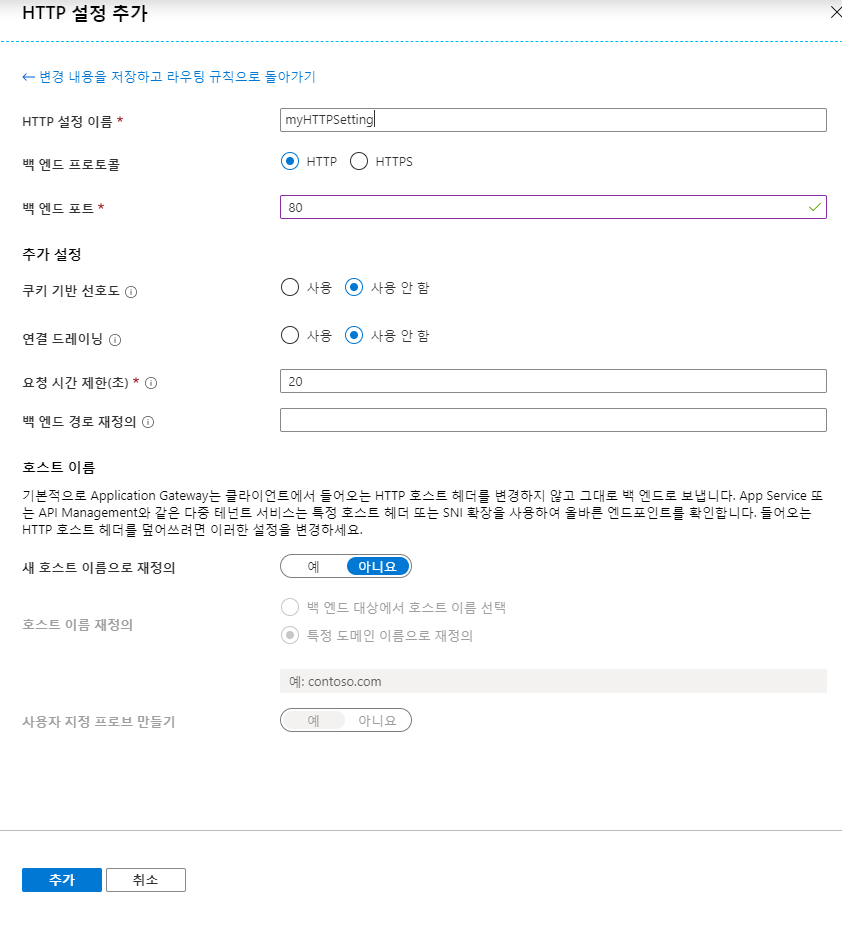

6. **라우팅 규칙 추가** 창에서 **추가**를 선택하여 라우팅 규칙을 저장하고 **구성** 탭으로 돌아옵니다.

      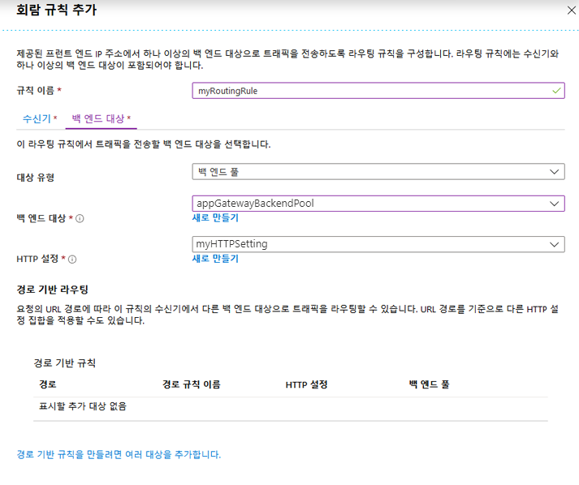

7. **다음: 태그**, **다음: 검토 + 만들기**를 차례로 선택합니다.


### 태스크 2: 애플리케이션 게이트웨이 테스트

1.  개요 화면에서 애플리케이션 게이트웨이의 공용 IP 주소를 찾습니다. **모든 리소스**를 클릭하고 **myAGPublicIPAddress**를 클릭합니다.

     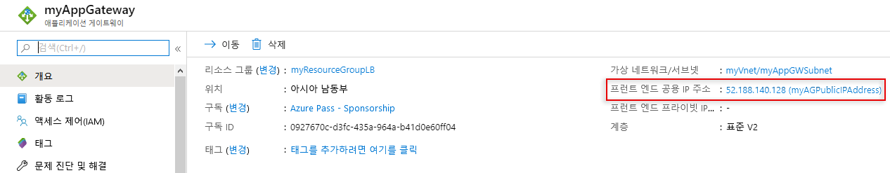
 
2.  공용 IP 주소를 복사한 다음 브라우저의 주소 표시줄에 붙여넣습니다.

     


| 경고: 계속하기 전에 이 랩에서 사용한 모든 리소스를 제거해야 합니다.  **Azure Portal**에서 리소스를 제거하려면 **리소스 그룹**을 클릭합니다.  랩에서 만든 리소스 그룹을 모두 선택합니다.  리소스 그룹 블레이드에서 **리소스 그룹 삭제**를 클릭하고 리소스 그룹 이름을 입력한 다음 **삭제**를 클릭합니다.  추가로 만든 리소스 그룹이 있으면 이 프로세스를 반복합니다. **리소스 그룹을 삭제하지 않으면 다른 랩에서 문제가 발생할 수 있습니다.** |
| --- |
**결과**: 이 랩이 완료되었습니다.
