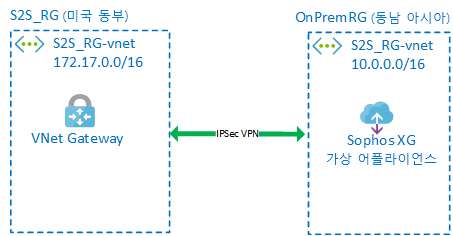
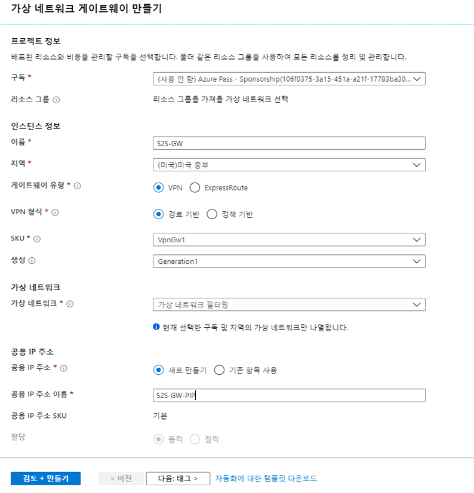
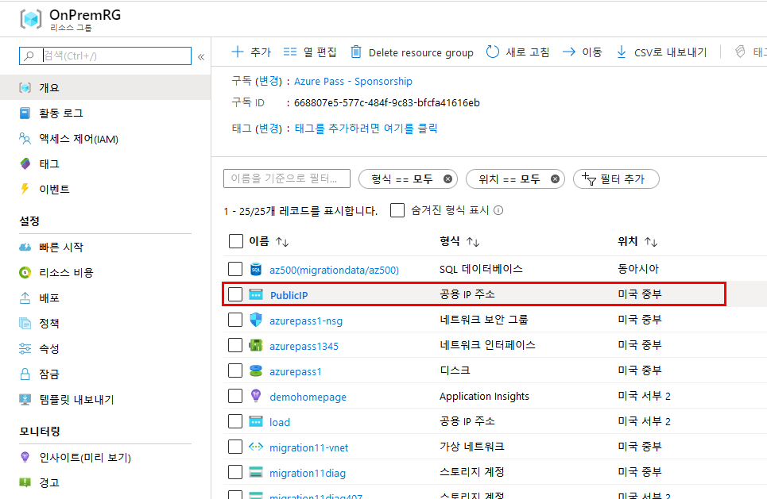
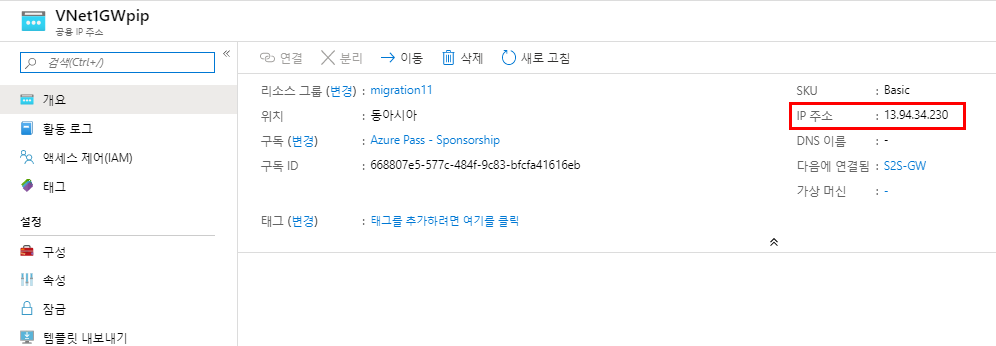
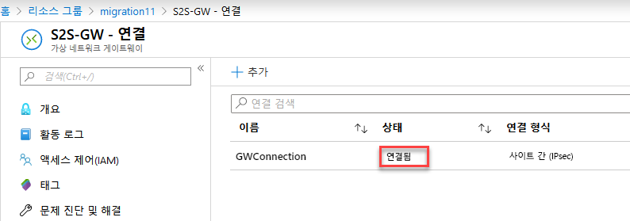

---
lab:
    title: 'LAB 11_On-Prem to Azure Connections - VPN Gateways and Tunnelling
'
    module: '모듈 02 - 플랫폼 보호'
---


# 랩: 온-프레미스와 Azure 연결 - VPN 게이트웨이, 터널링

### 연습 1: 사이트간 연결을 위한 가상 어플라이언스 및 게이트웨이 배포

#### 작업 1: 가상 어플라이언스 배포

이 작업에서는 온프레미스 디바이스를 복제할 Sophos XG 가상 어플라이언스를 생성합니다. 이 어플라이언스의 레이아웃은 다음 그림과 같습니다.

   

1.  브라우저 창을 열고 다음 URL로 접속하여 ARM 템플릿을 실행한다. 

     ```cli
    https://portal.azure.com/#create/Microsoft.Template/uri/https%3A%2F%2Fraw.githubusercontent.com%2FGoDeploy%2FAZ300%2Fmaster%2Fxg-azure-master%2FmainTemplate.json
    ```

2.  필요시 포털에 로그인한다. 

3.  사용자 지정배포 블레이드에 다음 설정을 입력한다.

 | 설정 | 값 |
 |---|---|
 | 리소스 그룹 | 새로 만들기 **az5000211_OnPrem** |
 | 위치 | **(Asia Pacific) 동남아시아** |
 | Admin Password | **Pa55w.rd1234** |
 | Public IP DNS | 고유한 이름 입력 |
 | Storage Name | 고유한 이름 입력 |
 
4.  아래쪽으로 스크롤하여 사용 약관에 동의하고 구매를 클릭한다.
 

#### 작업 2: 리소스 그룹 및 Vnet 생성

이 작업에서는 새 리소스 그룹 내에 가상 머신과 가상 네트워크를 만듭니다. 이 가상 머신과 가상 네트워크를 사용하여 에뮬레이트된 온프레미스 환경에 연결합니다.

1.  Azure 포털 **`https://portal.azure.com`**에 로그인한다.

1.  **리소스 만들기** > **네트워킹** > **가상 네트워크**를 클릭한다.

1.  **가상 네트워크 만들기** 블레이드에 다음 설정을 사용한다.

      - **이름** : S2S_RG-vnet
      - **리소스 그룹** : 새로 만들기 az5000211_S2S
      - **지역** : 미국 동부

      IP 주소 탭에 다음 설정을 사용한다.
      - **IPv4 주소 공간** : 172.17.0.0/16
      - **Subnet address range** : 172.17.0.0/24

1.  **만들기**를 클릭한다.

**참고:** 배포되는 동안 다음 태스크를 계속 진행할 수 있습니다.


#### 작업 3: 게이트웨이 서브넷 및 가상 네트워크 게이트웨이 생성

이 작업에서는 게이트웨이 서브넷 및 가상 네트워크 게이트웨이를 생성하여 온프레미스와 Azure Vnet을 연결한다. 

1.  Azure 포털에서 **리소스 그룹**을 클릭한다. 
 
1.  **az5000211_S2S** 리소스 그룹을 클릭한다.

1.  az5000211_S2S 리소스 그룹 블레이드에서 **S2S_RG-vnet**을 클릭한다. 

1.  **S2S_RG-vnet** 메뉴에서 **서브넷**을 클릭한다.

1.  **+ 게이트웨이 서브넷**을 클릭한다.

    **참고:** 게이트웨이 머신을 포함할 게이트웨이 서브넷을 만들어야 합니다. Azure Software Defined Networking에서 모든 라우팅을 수행합니다.

1.  **서브넷 추가** 블레이드에서 기본 값으로 두고 **확인**을 클릭한다. 

1.  **+ 리소스 만들기**를 클릭한다.

1.  **가상 네트워크 게이트웨이**를 검색하여 클릭한다. 

1.  **만들기**를 클릭한다.

1.  **가상 네트워크 게이트웨이 만들기** 블레이드에서 다음 설정을 사용한다. 

      - **이름**: S2S-GW
      - **지역**: (US) 미국 동부
      - **게이트웨이 유형**: VPN
      - **VPN 형식**: 경로 기반
      - **SKU**: 기본
      - **가상 네트워크**: S2S_RG-vnet 
      - **공용 IP 주소**: (새로 만들기) 이름: S2S-GW-PIP

     

1.  **검토 + 만들기**와 **만들기**를 차례로 클릭한다.

**참고:** 게이트웨이를 배포하는 데 최대 45분이 걸릴 수 있습니다. 대부분의 경우엔 더 빠른 시간 안에 배포됩니다. 종 모양 아이콘을 클릭하여 배포를 모니터링합니다. 게이트웨이가 배포되는 동안 다음 작업을 계속 진행하십시오.


#### 작업 4: Sophos 가상 어플라이언스 구성

1.  Azure 포털에서 **리소스 그룹**을 클릭한다.

1.  **az5000211_OnPrem** 리소스 그룹을 선택한다. 

1.  **공용 IP 주소** 리소스를 선택한다. 

     

1.  할당된 공용 IP 주소를 메모해둔다. 

     

1.  브라우저 창을 열어 **`https://x.x.x.x:4444`** 로 접속한다. (x.x.x.x 는 이전 단계에서 메모한 공용 IP 주소로 대체한다)

1.  브라우저에 따라 연결을 진행하기 위한 다른 옵션이 있을 수 있다.

     

1.  다음 자격 증명을 사용하여 방화벽에 로그인한다.

      - Admin
      - Pa55w.rd1234
 
1.  라이선스 계약에 동의한다. 

1.  방화벽 등록 페이지에서 **I don't have a serial number(start a trial** 을 클릭하고 **I do not want to register now**를 선택한 후에 **Continue**를 클릭한다.

     

1.  경고창이 뜨면 **Continue**를 클릭한다.

1.  Azure 포털로 돌아온다. **az5000211_S2S** 리소스 그룹을 선택하고 **S2S-GW-PIP** 공용 IP를 확인하여 메모해둔다.

    **참고**: IPSec VPN을 통해 해당 공용 IP에 Sophos 가상 어플라이언스를 연결합니다. 

     
 
1.  Sophos Portal로 돌아온다.

1.  **VPN > IPsec Connections**으로 이동하여 **Add**를 선택하고 다음 값을 설정한다. 

    **General Settings**

      - **Name**: On_Prem_to_Azure
      - **IP Version**: IPv4.
      - **Activate on Save:** Selected.
      - **Create firewall rule:** Selected.
      - **Description**: Site to Site connection from On Prem to Azure VNet.
      - **Connection Type**: Site-to-Site.
      - **Gateway Type**: Respond Only.

     

    **Encryption**

      - **Policy**: Microsoft Azure.
      - **Authentication Type**: Preshared Key.
      - **Preshared Key**: 123456789
      - **Repeat Preshared Key**: 123456789

     

    **Gateway Settings**

      - **Listening Interface**: 기본 값 사용
      - **Gateway Address**: 앞서 메모한 Azure VPN 게이트웨이의 공용 IP
      - **Local ID**: IP Address.
      - **Remote ID**: IP Address.
      - **Local ID**: on-premises Sophos XG 방화벽의 공용 IP 주소 
      - **Remote ID**: 앞서 메모한 Azure VPN 게이트웨이의 공용 IP 주소
      - **Local Subnet**: 로컬 서브넷 10.0.0.0/16 (255.255.0.0) 입력

      

      - **Remote Subnet** 원격 서브넷 172.17.0.0 /16 (255.255.0.0) 입력
</br>


1.  **Advanced**: 기본 값 사용

1.  **Save**를 클릭한다. IPsec 연결이 활성화된다. 

**참고**: Do not click on the button under the **Connection** 열 아래 버튼은 클릭하지 마십시오. IPsec 연결 구성(**Gateway type: Respond only**)이 재정의됩니다. 


#### 작업 5: Auzre 연결 생성

이 작업에서는 Azure 게이트웨이에서 온프레미스 방화벽으로의 연결을 생성 및 설정합니다. 

1.  Azure 포털에서 **리소스 그룹**을 클릭한다.

2.  **az5000211_S2S** 리소스 그룹을 선택한다. 
 
1.  **S2S-GW** 게이트웨이를 선택한다.

1.  왼쪽 메뉴에서 **연결**을 클릭한다.

1.  **추가**를 클릭한다.

1.  **연결 추가** 블레이드에서 다음 정보를 입력한다.

      - **이름:** GWConnection
      - **연결 형식:** 사이트간 (IPSec)
      - **가상 네트워크 게이트웨이:** S2S-GW

1.  **로컬 네트워크 게이트웨이**를 클릭한다.

1.  **새로 만들기**를 클릭한다.

1.  **로컬 네트워크 게이트웨이 만들기** 블레이드에 다음 정보를 입력한다. 

      - **이름:** OnPremGW
      - **IP 주소:** 앞서 메모해 둔 Sophos 온프레미스 방화벽의 IP 주소 입력
      - **주소 공간:** 10.0.0.0/16  _(참고:  이 주소 공간은 온프레미스 서버의 IP 범위다)_
 
1.  **확인**을 클릭한다.

2.  **공유 키(PSK)** 입력란에 `123456789`를 입력하고 **확인**을 클릭한다.

    **참고:**  이 키는 실습 환경에서만 사용합니다. 실제 환경에서는 더 복잡한 키를 사용해야 합니다. 

1.  페이지를 새로고침하면 연결이 설정됩니다.

    **참고:** 연결이 설정되는 데 약 30초 소요될 수 있습니다. 
 
     


### 연습 2: 랩 리소스 삭제

#### 작업 1: Cloud Shell 열기

1. Azure 포털 상단에서 **Cloud Shell** 아이콘을 클릭하여 Cloud Shell 창을 엽니다.

1. Cloud Shell 인터페이스에서 **Bash**를 선택합니다.

1. **Cloud Shell** 명령 프롬프트에서 다음 명령을 입력하고 **Enter**를 눌러 이 랩에서 생성한 모든 리소스 그룹을 나열합니다.

    ```sh
    az group list --query "[?starts_with(name,'az500')].name" --output tsv
    ```

1. 출력된 결과가 이 랩에서 생성한 리소스 그룹만 포함되어 있는지 확인합니다. 이 그룹은 다음 작업에서 삭제됩니다.


#### 작업 2: 리소스 그룹 삭제하기

1. **Cloud Shell** 명령 프롬프트에서 다음 명령을 입력하고 **Enter**를 눌러 이 랩에서 생성한 모든 리소스 그룹을 삭제합니다.

    ```sh
    az group list --query "[?starts_with(name,'az500')].name" --output tsv | xargs -L1 bash -c 'az group delete --name $0 --no-wait --yes'
    ```

1. **Cloud Shell** 명령 프롬프트를 닫습니다.

> **결과**: 이 연습을 완료한 후 이 랩에서 사용된 리소스 그룹을 제거했습니다.