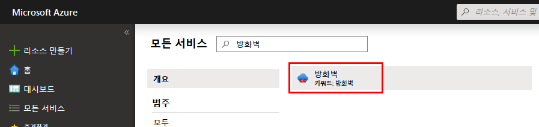
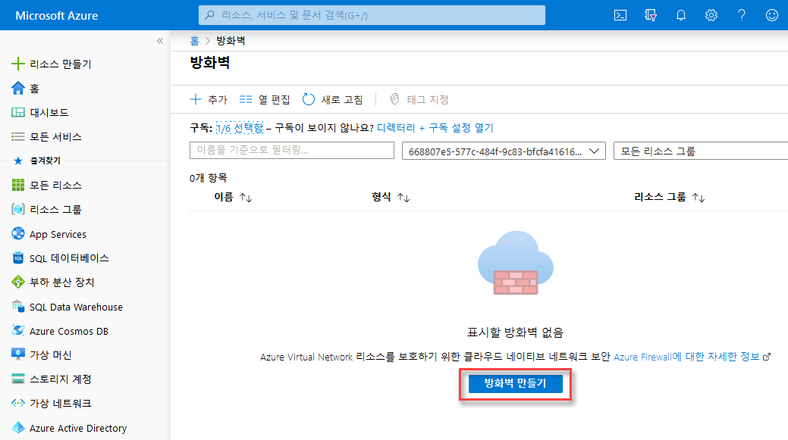
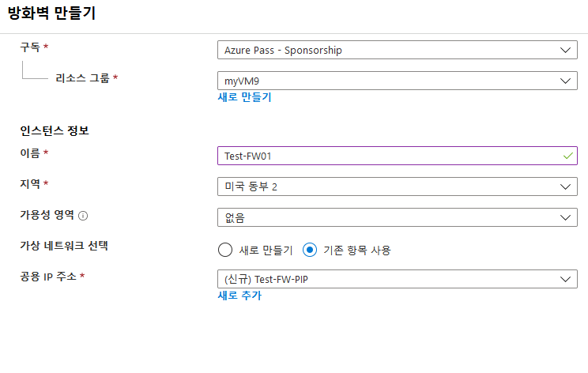
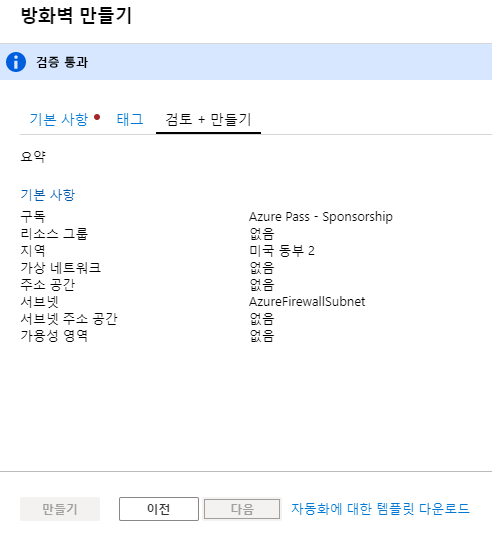

---
lab:
    title: 'LAB 12_Azure Firewall'
    module: '모듈 02 - 플랫폼 보호'
---

# 랩: Azure 방화벽

**시나리오**

외부로부터 들어오는 네트워크 접근을 통제하는 것은 네트워크 보안 전반에 중요한 일입니다. 예를 들어 웹 사이트에 대한 접근을 제한하거나 외부에서 접근하는 특정 IP 주소나 포트 번호를 제한할 수 있습니다.

Azure 방화벽은 Azure 서브넷에 외부 네트워크 접근을 통제하는 방법 중 하나입니다. Azure 방화벽으로 다음과 같은 기능을 구현할 수 있습니다.

* 서브넷에 접근 가능한 FQDN(fully qualified domain name)을 정의하는 애플리케이션 규칙 
* 원본 주소, 프로토콜, 대상 포트 및 대상 주소를 정의하는 네트워크 규칙

서브넷 기본 게이트웨이인 방화벽으로 네트워크 트래픽을 라우팅할 때는 미리 구성된 방화벽 규칙이 네트워크 트래픽에 적용됩니다. 


### 연습 1: Azure 방화벽 배포

#### 작업 1: 실습 환경 구성

1.  브라우저 창에서 다음 URL로 접속하여 실습에 필요한 리소스를 배포하는 ARM 템플릿을 실행합니다.

    ```cli
    https://portal.azure.com/#create/Microsoft.Template/uri/https%3A%2F%2Fraw.githubusercontent.com%2FGoDeploy%2FAZ500%2Fmaster%2FAZ500%20Mod2%20Lab%207%2Ftemplate.json
    ```
 
2.  리소스 그룹 **새로 만들기**를 클릭하고 이름 란에 **az5000212**를 입력한다.  

3.  위치는 **(US) 미국 동부**를 선택한다.  

4.  기타 값은 미리 입력된 기본값으로 둔다.

5.  사용 약관에 동의하고 **구매**를 클릭한다. 

    이 템플릿은 다음과 같은 실습용 리소스를 설정합니다.

 |이름     |유형     | 위치|
 |---------|---------|---------|
azureFirewalls-ip|	공용 IP 주소|	미국 동부	
Firewall-route |	경로 테이블|	미국 동부	
Srv-Jump|	가상 머신|	미국 동부	
Srv-Jump_OsDisk|	디스크|	미국 동부	
srv-jump121	|네트워크 인터페이스|	미국 동부	
Srv-Jump-nsg|	네트워크 보안 그룹|	미국 동부	
Srv-Jump-PIP|	공용 IP 주소|	미국 동부	
Srv-Work|	가상 머신|	미국 동부	
Srv-Work_OsDisk_1 |	디스크|	미국 동부	
srv-work267|	네트워크 인터페이스|	미국 동부	
Srv-Work-nsg|	네트워크 보안 그룹|	미국 동부	
Test-FW-VN|	가상 네트워크|	미국 동부


#### 작업 2: 방화벽 배포

이 작업에서는 VNet에 Azure 방화벽을 배포합니다. 

1.  Azure 포털에서 **방화벽**을 검색하여 선택한다.

     

3.  **방화벽 만들기**를 클릭한다. 

     

4.  **방화벽 만들기** 블레이드에서 다음 설정을 입력한다.

   |설정  |값  |
   |---------|---------|
   |구독     |_이 랩에서 사용할 구독의 이름_|
   |리소스 그룹     |*az5000212* |
   |이름     |Test-FW01|
   |지역     |미국 동부|
   |가상 네트워크 선택     |**기존 항목 사용**: Test-FW-VN|
   |공용 IP 주소    |**새로 추가**. **TEST-FW-PIP**  공용 IP 주소는 표준 SKU 유형이어야 합니다.|
   
   

5.  **검토 + 만들기**를 클릭한다.
6.  **만들기**를 클릭하여 방화벽을 배포한다.

     

    배포에는 몇 분이 소요됩니다.

7.  배포가 끝난 뒤 **az5000212** 리소스 그룹에서 **Test-FW01** 방화벽을 클릭한다. 

8.  **프라이빗 IP** 주소를 메모해둔다. 기본 경로를 생성할 때 해당 주소를 사용한다. 

     


#### 작업 3: 기본 경로 생성

**Workload-SN** 서브넷에서 아웃바운드 기본 경로가 방화벽을 통하도록 구성한다.  

1.  Azure 포털에서 **모든 서비스**를 클릭한다.

2.  **네트워킹**을 선택하고 **경로 테이블**을 클릭한다.

3.  **추가**를 클릭한다.

4.  **이름** : **Firewall-route**

5.  **구독** : 이 랩에서 사용할 구독의 이름

6.  **리소스 그룹** : **az5000212**

7.  **위치** : **미국 동부**

8.  **만들기** 클릭

9.  **새로 고침**을 클릭하고, **Firewall-route** 경로 테이블을 클릭한다.

10.  **서브넷** > **연결**을 클릭한다.

11.  **가상 네트워크** > **Test-FW-VN** 선택

12.  **Subnet** > **Workload-SN** 선택 

**참고** : Workload-SN 서브넷만 선택해야 합니다. 다른 서브넷도 선택하면 방화벽이 제대로 작동하지 않습니다.

13.  **확인**을 클릭한다.

14.  **경로** > **추가** 클릭

15.  **경로 이름** : **FW-DG**

16.  **주소 접두사** : **0.0.0.0/0**

17.  **다음 홉 형식** : **가상 어플라이언스**

     Azure 방화벽은 관리형 서비스이지만, 이 상황에서는 가상 어플라이언스를 사용할 수 있습니다. 

18.  **다음 홉 주소** : 이전 작업에서 메모해둔 방화벽의 프라이빗 IP 주소 입력

19.  **확인**을 클릭한다.


#### 작업 4: 애플리케이션 규칙 구성

이 작업에서는 `msn.com`으로의 아웃바운드 접근을 허용하는 애플리케이션 규칙을 생성합니다.

1.  **az5000212** 리소스 그룹에서 **Test-FW01** 방화벽을 클릭한다. 

2.  **Test-FW01**의 왼쪽 메뉴에서 **규칙**을 클릭한다.

3.  **애플리케이션 규칙 컬렉션** 탭을 클릭한다. 

4.  **애플리케이션 규칙 컬렉션 추가**를 클릭한다.

5.  **이름** 란에 **App-Coll01**를 입력한다.

6.  **우선 순위**로 **200**을 입력한다.

7.  **작업**을 **허용**으로 설정한다.

8.  **대상 FQDN** 아래 **이름** 란에 **AllowGH**를 입력한다.

9.  **Source** : **10.0.2.0/24**

10. **프로토콜:포트** : **http, https**.

11.  **대상 FQDNS** : **msn.com**

12.  **추가**를 클릭한다.

  Azure 방화벽은 기본적으로 허용되는 인프라 FQDN을 위한 기본 제공 규칙 컬렉션이 있습니다. 이러한 FQDN은 플랫폼에 따라 다르며, 다른 목적으로는 사용할 수 없습니다.


#### 작업 5: 네트워크 규칙 구성

이 작업에서는 포트 53(DNS)에서 두 IP 주소에 대한 아웃바운드 접근을 허용하는 네트워크 규칙을 생성합니다. 

1.  **네트워크 규칙 컬렉션** 탭을 클릭한다.

2.  **네트워크 규칙 컬렉션 추가**를 클릭한다.

3.  **이름** : **Net-Coll01**

4.  **우선 순위** : **200**

5.  **작업** : **허용**

6.  **IP 주소** **이름** :  **AllowDNS**

7.  **프로토콜** : **UDP**

8.  **Source** : **10.0.2.0/24**

9.  **대상 주소** : **209.244.0.3,209.244.0.4**

10. **대상 포트** : **53**

11. **추가**를 클릭한다.


#### 작업 6: **Srv-Work** 네트워크에 대한 기본 및 보조 DNS 주소 변경

테스트를 위해 기본 및 보조 DNS 주소를 구성합니다. Azure 방화벽에서 반드시 이러한 작업이 필요한 것은 아닙니다. 

1.  Azure 포털에서 **az5000212** 리소스 그룹을 클릭한다.

2.  **Srv-Work** 가상 머신을 클릭한다. 

    1.  **설정** 섹션의 **네트워킹**을 클릭한다.

    2.  네트워크 인터페이스를 클릭한다.

3.  왼쪽 메뉴에서 **DNS 서버**를 클릭하고 **사용자 지정**을 선택한다.

4.  **DNS 서버 추가** 텍스트 박스에 **209.244.0.3**와 **209.244.0.4**를 차례로 입력한다.

5.  **저장**을 클릭한다. 

6.  **Srv-Work** 가상 머신을 다시 시작한다. 


#### 작업 7: 방화벽 테스트 

이 작업에서는 방화벽이 설정대로 동작하는지 확인합니다.

1.  Azure 포털에서 **Srv-Work** 가상 머신에 대한 네트워크 설정을 검토하고 프라이빗 IP 주소를 메모해둔다.

2.  **Srv-Jump** 가상 머신에 RDP를 통해 접속한 다음, 해당 가상 머신에서 **Srv-Work**의 프라이빗 IP 주소로 원격 데스크톱에 연결을 실행한다.

	-	**Username**: localadmin
    -	**Password**: Pa55w.rd1234
</br>

3.  Internet Explorer을 열어 **`https://www.msn.com`**에 접속한다.

4.  보안 경고에서 **OK** > **Close**를 클릭한다.

   MSN 홈 페이지가 표시된다.

5.  **`https://www.msn.com`**에 접속한다.

       - 방화벽에 의해 차단된다. 
       - 방화벽 규칙이 작동함을 확인한다.
          - 허용된 FQDN 하나로는 이동할 수 있지만 다른 FQDN으로는 이동할 수 없다.  
          - 구성된 외부 DNS 서버를 사용하여 DNS 이름을 확인할 수 있다.


1. 다음 실습에서 사용할 수 있도록 모든 리소스를 그대로 둔다.


