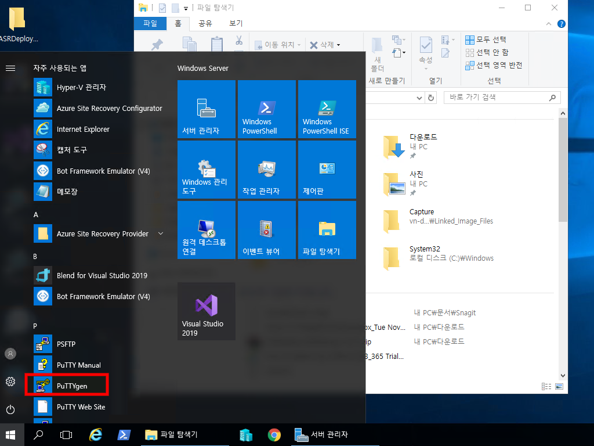
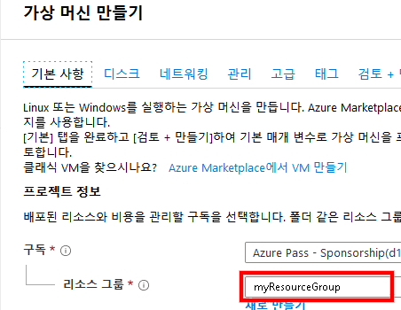
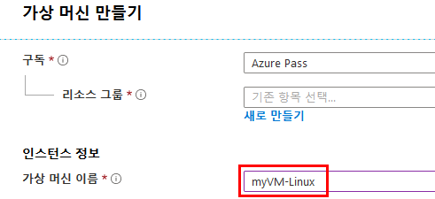
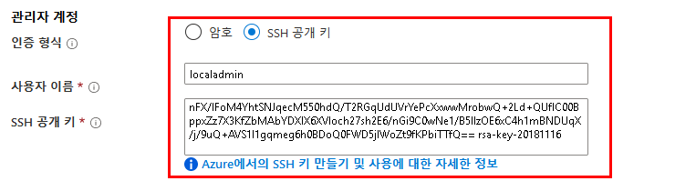
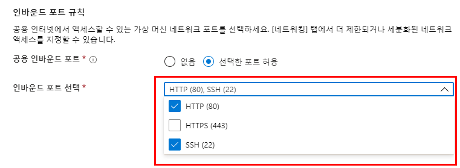
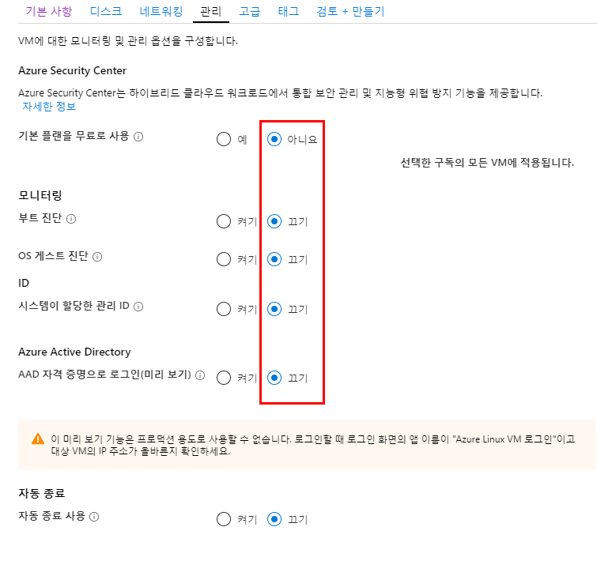
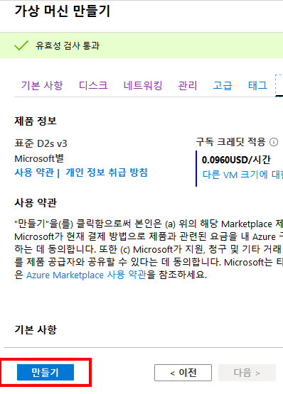
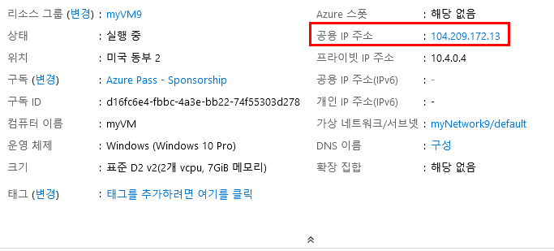
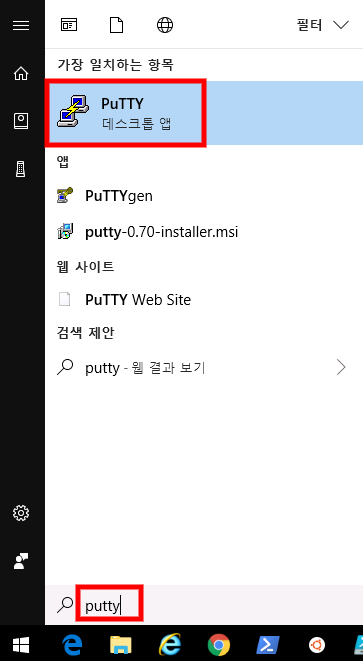

---
lab:
    title: '랩 13 - 보안 관리자 액세스'
    module: '모듈 2 - 플랫폼 보호 구현'
---

# 모듈 2 - 플랫폼 보호 구현 

## 랩 13 - 보안 관리자 액세스 


비보안 연결을 통한 보안 로그인을 허용하는 암호화된 연결 프로토콜인 SSH는 Azure에서 호스트되는 Linux VM의 기본 연결 프로토콜입니다. SSH 자체에서 암호화된 연결을 제공하기는 하지만, SSH 연결에서 암호를 사용하더라도 VM은 무차별 암호 대입 공격(brute force attack) 또는 암호 추측에 여전히 취약합니다. SSH를 사용하여 VM에 연결하는 더욱 안전한 기본 방법은 공개-프라이빗 키 쌍(SSH 키)을 사용하는 것입니다.

- 공개 키는 Linux VM 또는 공개 키 암호화를 통해 사용하려는 기타 서비스에 저장됩니다.

- 로컬 시스템의 프라이빗 키는 Linux VM에 연결할 때 SSH 클라이언트가 사용자의 ID를 확인하는 데 사용됩니다. 이 프라이빗 키는 보호해야 하며 공유하면 안 됩니다.

- 조직의 보안 정책에 따라 여러 Azure VM 및 서비스에 액세스하는 데 단일 공개-프라이빗 키 쌍을 재사용할 수 있습니다. 즉, 액세스하려는 각 VM 또는 서비스용으로 별도의 키 쌍이 필요하지 않습니다.

공개 키는 모든 사용자와 공유할 수 있지만 프라이빗 키는 본인이나 로컬 보안 인프라만 소유하고 있어야 합니다.

## 연습 1: Azure VM 배포 및 VM에 안전하게 연결

### 태스크 1: PuTTYgen을 사용하여 SSH 키 생성

1.  브라우저를 열고 다음 URL로 이동합니다.

     ```cli
    http://www.chiark.greenend.org.uk/~sgtatham/putty/download.html 
     ```

1.  **Putty 설치 관리자**를 다운로드하여 설치합니다.

     

1.  **시작**을 클릭하고 **PuTTYgen**으로 이동합합니다.

     

1.  생성을 클릭합니다. 기본적으로 PuTTYgen은 2048비트 SSH-2 RSA 키를 생성합니다.

     

1.  키가 무작위로 생성되도록 빈 영역에서 마우스를 움직입니다.

     

1.  공개 키가 생성되고 나면 필요에 따라 암호를 입력하고 확인을 위해 다시 입력합니다. 그러면 프라이빗 SSH 키를 사용하여 VM에 인증할 때 암호를 입력하라는 메시지가 표시됩니다. 암호로는 **Pa55w.rd1234**를 입력합니다.

    암호를 지정하지 않으면 프라이빗 키를 입수한 사람이 해당 키를 사용하는 모든 VM이나 서비스에 로그인할 수 있습니다. 그러므로 암호를 만드는 것이 좋습니다. 그러나 암호를 잊어버리면 복구할 수 있는 방법은 없습니다.


1.  공개 키는 창 위쪽에 표시됩니다. Linux VM을 만들 때 이 공개 키의 전체 부분을 복사한 다음 Azure Portal이나 Azure Resource Manager에 붙여넣을 수 있습니다. 컴퓨터 위치에 공개 키를 저장하고 파일 이름을 **public**으로 지정합니다.

     

2.  프라이빗 키도 같은 위치에 저장하되 파일 이름은 **private**으로 지정합니다.

     
 
1.  위쪽 창에서 공개 키를 강조 표시한 다음 복사합니다.

     

### 태스크 2: Azure Portal에서 Linux 가상 머신 만들기

1.  **Azure Portal**로 돌아옵니다.

1.  Azure Portal 왼쪽 위의 **리소스 만들기**를 선택합니다.

1.  Azure Marketplace 리소스 목록 위의 검색 상자에서 **Ubuntu Server 18.04 LTS**를 정식 이름으로 검색하여 선택한 다음 **만들기**를 선택합니다.

1.  **기본 사항** 탭의 **프로젝트 세부 정보**에서 정확한 구독을 선택했는지 확인하고 **리™스 그룹** *myResourceGroup*을 선택합니다. 

     

1.  **인스턴스 세부 정보**에서 **가상 머신 이름**으로 *myVM-Linux*를 입력하고 **지역**으로는 *미국 동부*를 선택합니다. 다른 기본값은 그대로 둡니다.
 
     

1.  **관리자 계정**에서 **SSH 공개 키**를 선택하고 사용자 이름으로 **localadmin**을 입력한 다음 텍스트 상자에 공개 키를 붙여넣습니다. 이때 공개 키의 선행 또는 후행 공백을 제거해야 합니다.

       

1.  **인바운드 포트 규칙** > **공용 인바운드 포트**에서 **선택한 포트 허용**을 선택한 다음 드롭다운에서 **SSH(22)** 및 **HTTP(80)**를 선택합니다. 

    

1.  **관리** 탭을 클릭하고 모든 옵션에서 **아니요** 또는 **끄기**를 선택합니다.

     

1.  나머지 기본값은 그대로 두고 페이지 하단의 **검토 + 만들기** 단추를 선택합니다.

1.  **가상 머신 만들기** 페이지에서 만들려는 VM 관련 세부 정보를 확인할 수 있습니다. VM을 만들 준비가 되면 **만들기**를 선택합니다.

     
 

VM을 배포하려면 몇 분 정도 걸립니다. 배포가 완료되면 다음 섹션으로 진행하세요. 


### 태스크 3: VM에 연결


Windows에서 Linux VM에 SSH로 연결하는 한 가지 방법은 SSH 클라이언트를 사용하는 것입니다. Windows 시스템에 SSH 클라이언트가 설치되어 있거나 Azure Cloud Shell의 Bash에서 SSH 도구를 사용하는 경우 기본적으로 SSH 클라이언트를 사용합니다. GUI 기반 도구를 사용하려는 경우에는 PuTTY를 사용해 연결할 수 있습니다.  이 태스크에서는 PuTTY를 사용합니다.


1.  **Azure Portal 허브 메뉴**에서 **가상 머신**을 클릭하고 **myVM-Linux** 컴퓨터를 선택합니다.


1.  개요 블레이드에서 가상 머신의 **공용 IP 주소**를 적어 두거나 복사합니다.

    **참고:** 실제 공용 IP는 스크린샷에 나와 있는 것과는 다릅니다.


     

1.  시작 메뉴를 클릭하고 PuTTY를 검색하여 **PuTTY**를 시작합니다.

     

2.  Linux Azure Linux VM의 공용 IP 주소를 입력하거나 붙여넣습니다.

       

3.  **연결** > **SSH** > **인증** 범주를 선택합니다. PuTTY 프라이빗 키(.ppk 파일)를 찾아서 선택합니다.

     

4.  **열기**를 클릭하여 VM에 연결합니다.

5.  팝업에서 **예**를 클릭하여 계속 진행합니다.

1.  `로그인 ID` 화면에서 **localadmin**을 입력하고 **Enter** 키를 누릅니다.

     
 
1.  Azure에서 호스트되는 Linux VM에 로그인되었습니다.

     


**결과**: 이 랩이 완료되었습니다.
