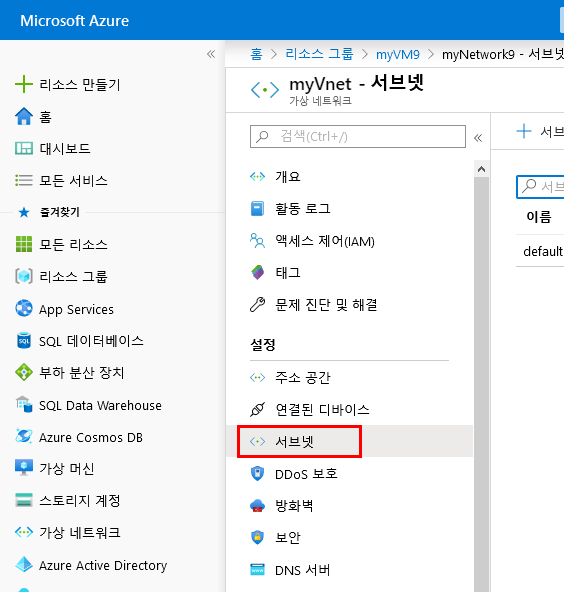
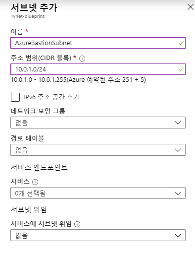
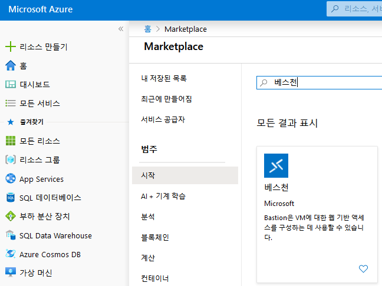
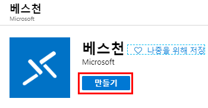
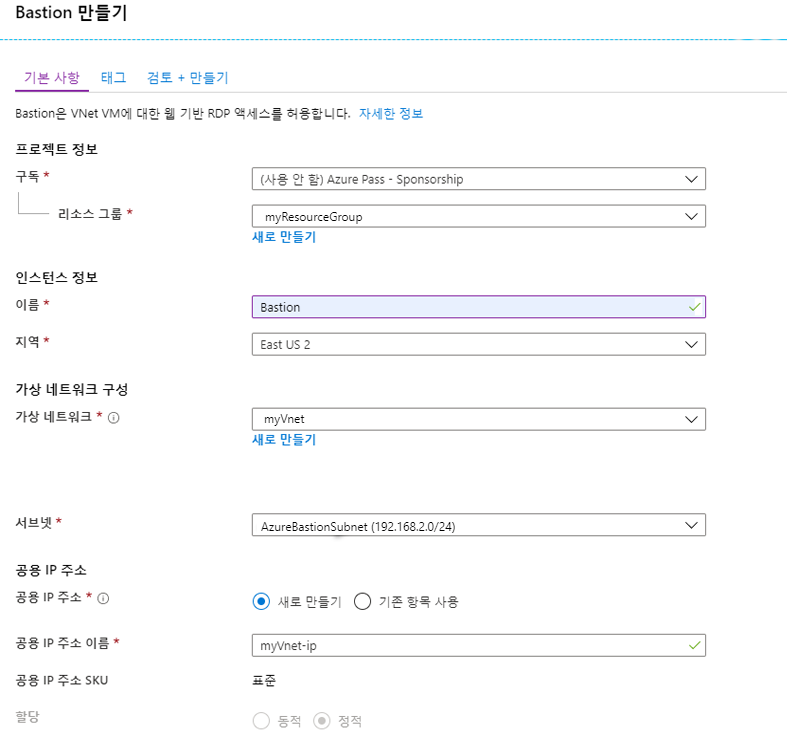
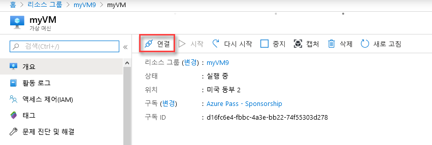
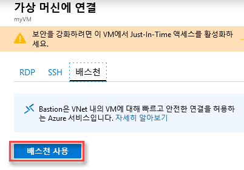
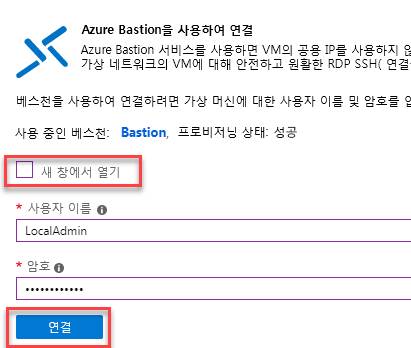
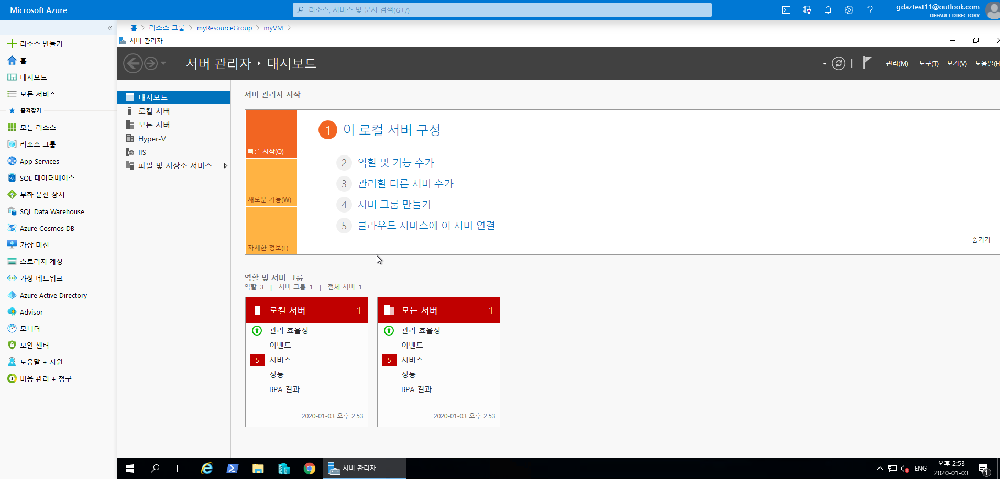

---
lab:
    title: '랩 14 - Azure Bastion'
    module: '모듈 2 - 플랫폼 보호 구현'
---

# 모듈 2: 랩 14 - Azure Bastion


**시나리오**

가상 네트워크 내부에서 프로비전하는 새로운 완전 플랫폼 관리형 PaaS 서비스인 Azure Bastion 서비스는 SSL을 통해 Azure Portal에서 직접 가상 머신에 연결하는 데 사용할 수 있는 안전하고 원활한 RDP/SSH 연결 기능을 제공합니다. Azure Bastion을 통해 연결할 때는 가상 머신에 공용 IP 주소가 필요하지 않습니다.

Bastion에서는 프로비전된 가상 네트워크의 모든 VM에 보안 RDP 및 SSH 연결을 설정할 수 있습니다. Azure Bastion을 사용하면 RDP/SSH를 사용한 보안 액세스 기능을 제공하면서 외부 환경에는 RDP/SSH 포트가 표시되지 않도록 가상 머신을 보호할 수 있습니다. Azure Bastion 사용 시에는 Azure Portal에서 가상 머신에 직접 연결합니다. 추가 클라이언트, 에이전트 또는 소프트웨어는 필요하지 않습니다.


## 연습 1: Azure Bastion 구현

### 태스크 1: 구독에서 Azure Bastion을 사용하도록 설정

1.  **Cloud Shell(PowerShell)**을 열고 필요한 경우 스토리지를 만듭니다.

1.  다음 두 명령을 실행하여 Azure Bastion 서비스 테스트를 위해 리소스 그룹과 가상 머신 및 VNet을 만듭니다.

     ```powershell
    New-AzureRmResourceGroup -Name myResourceGroup -Location "East US"
     ```
    
     ```powershell
    New-AzVm -ResourceGroupName "myResourceGroup" -Name "myVM" -Location "East  US" -VirtualNetworkName "myVnet" -SubnetName "mySubnet" -SecurityGroupName   "myNetworkSecurityGroup" -OpenPorts 80,3389
     ```

    **참고**: VM은 공용 IP 주소 없이 생성됩니다.


1.  메시지가 표시되면 자격 증명으로 **LocalAdmin** 및 **Pa55w.rd1234**를 입력합니다.

1.  Azure Portal에서 **myVnet**으로 이동하여 **서브넷**을 클릭합니다.

     
 
1.  **+ 서브넷**을 클릭하고 다음 세부 정보를 사용하여 서브넷을 만듭니다.

      - 이름: **AzureBastionSubnet** _(대/소문자를 구분하여 입력해야 함)_
      - 주소 범위: **192.168.2.0/24**

1.  **확인**을 클릭합니다.

     

### 태스크 2: 베스천 호스트 만들기

1.  **Azure Portal**의 홈 페이지에서 **+ 리소스 만들기**를 클릭합니다. 

1.  **새로 만들기** 페이지의 *Marketplace 검색* 필드에 **Bastion**을 입력하고 **Enter** 키를 눌러 검색 결과를 표시합니다.

1.  결과에서 **Bastion**을 클릭합니다. 

     

1.  **Bastion** 페이지에서 **만들기**를 클릭하여 **Bastion 만들기** 페이지를 엽니다.

     

1.  **Bastion 만들기** 페이지에서 새 Bastion 리소스를 구성합니다. 아래의 구성 설정을 지정합니다.

    * **구독**: 사용자의 구독 선택
    * **리소스 그룹**: myResourceGruop
    * **이름**: Bastion
    * **지역**: 미국 동부
    * **가상 네트워크**: **myVnet**
    * **공용 IP 주소**: 포트 443을 통해 RDP/SSH에 액세스할 Bastion 리소스의 공용 IP 새 공용 IP를 만들거나 기존 공용 IP를 사용합니다. 생성하는 Bastion 리소스와 같은 지역의 공용 IP 주소를 사용해야 합니다.
    * **공용 IP 주소 이름**: 기본값 유지
    * **공용 IP 주소 SKU**: 기본적으로 **표준**이 미리 입력되어 있음. Azure Bastion은 표준 공용 IP SKU 만 사용/지원합니다.
    * **할당**: 기본적으로 **정적**이 미리 입력되어 있음
</br>

1.  설정 지정이 완료되면 **검토 + 만들기**를 클릭합니다. 그러면 값 유효성 검사가 진행됩니다. 유효성 검사에 통과하면 만들기 프로세스를 시작할 수 있습니다.

     

1.  Bastion 만들기 페이지에서 **만들기**를 클릭합니다.
1.  배포가 진행 중임을 알리는 메시지가 표시됩니다. 리소스가 생성되면 이 페이지에 상태가 표시됩니다. Bastion 리소스를 만들고 배포하려면 5분 정도 걸립니다.

### 태스크 3: 베스천 호스트를 사용하여 VM에 연결 


기존 VM을 사용하여 Portal에서 베스천 호스트를 만들면 가상 머신 및/또는 가상 네트워크에 해당하는 기본값이 여러 설정에 자동 적용됩니다.


1.  **Azure Portal - Bastion 미리 보기**에서 가상 머신으로 이동한 다음 **연결**을 클릭합니다.

       

1.  오른쪽 사이드바에서 **베스천**, **베스천 사용**을 차례로 클릭합니다.

       

1.  새 창에서 열기를 선택 취소하고 자격 증명으로 **LocalAdmin** 및 **Pa55w.rd1234**를 입력한 후에 **연결**을 클릭합니다.

     

1.  이제 VM에 연결되었습니다.

     
 

| 경고: 계속하기 전에 이 랩에서 사용한 모든 리소스를 제거해야 합니다.  **Azure Portal**에서 리소스를 제거하려면 **리소스 그룹**을 클릭합니다.  랩에서 만든 리소스 그룹을 모두 선택합니다.  리소스 그룹 블레이드에서 **리소스 그룹 삭제**를 클릭하고 리소스 그룹 이름을 입력한 다음 **삭제**를 클릭합니다.  추가로 만든 리소스 그룹이 있으면 이 프로세스를 반복합니다. **리소스 그룹을 삭제하지 않으면 다른 랩에서 문제가 발생할 수 있습니다.** |
| --- |

**결과**: 이 랩이 완료되었습니다.

