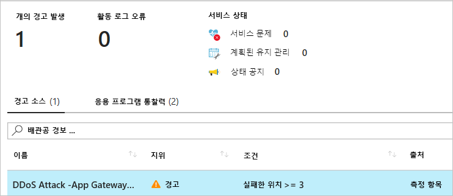
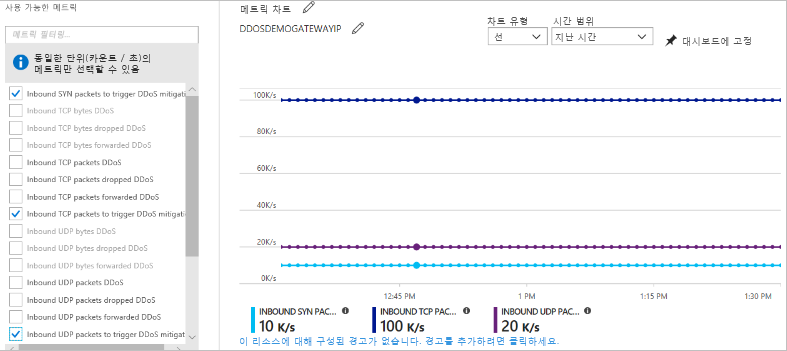

---
lab:
    title: '랩 15 - Azure DDoS Protection Standard 관리'
    module: '모듈 2 - 플랫폼 보호 구현'
---

# 모듈 2: 랩 15 - Azure DDoS Protection Standard 관리

이 랩에서는 DDoS(분산형 서비스 거부) Protection을 사용하거나 사용하지 않도록 설정하는 방법과, 원격 분석을 사용해 Azure DDoS Protection Standard로 DDoS 공격을 완화하는 방법을 알아봅니다. DDoS Protection Standard는 Azure 공용 IP 주소가 할당된 애플리케이션 게이트웨이, 부하 분산 장치, 가상 머신 등의 Azure 리소스를 보호합니다. 

## 연습 1: Azure에서 DDoS Protection 구현

### 태스크 1: DDoS 보호 계획 작성

DDoS 보호 계획은 여러 구독에서 DDoS Protection Standard가 사용하도록 설정된 가상 네트워크 집합을 정의합니다. 조직용으로 DDoS 보호 계획 하나를 구성하고 영러 구독의 가상 네트워크를 같은 계획에 연결할 수 있습니다. DDoS 보호 계획 자체는 계획을 만들 때 선택하는 구독에도 연결됩니다. DDoS 보호 계획은 여러 지역과 구독에서 작동합니다. 예를 들어 미국 동부 지역에서 계획을 만들어 테넌트의 1번 구독에 연결할 수 있습니다. 그리고 테넌트 전반에 걸쳐 여러 지역의 다른 구독에서 같은 계획을 가상 네트워크에 연결할 수 있습니다. 계획이 연결된 구독에는 해당 계획의 월 정기 요금과, 보호되는 공용 IP 주소 수가 100개를 초과하는 경우의 초과분 요금이 청구됩니다. 

대다수 조직에서는 계획을 여러 개 만들 필요가 없습니다. 계획은 구독 간에 이동할 수 없습니다. 계획이 포함된 구독을 변경하려면 기존 계획을 삭제하고 새 계획을 만들어야 합니다.

1.  Azure Portal 왼쪽 위의 **리소스 만들기**를 선택합니다.
2.  *DDoS*를 검색합니다. 검색 결과에 **DDoS 보호 계획**이 표시되면 선택합니다.
3.  **만들기**를 선택합니다.
4.  고유한 값을 입력/선택하거나 다음 예제 값을 입력/선택한 다음 **만들기**를 선택합니다.

    |설정        |값                                              |
    |---------      |---------                                          |
    |이름           | myDdosProtectionPlan                              |
    |구독   | 사용자의 구독을 선택합니다.                         |
    |리소스 그룹 | **새로 만들기**를 선택하고 *myResourceGroup* 입력 |
    |위치       | 미국 동부                                           |

### 태스크 2: 새 가상 네트워크에 대해 DDoS를 사용하도록 설정

1.  Azure Portal 왼쪽 위의 **리소스 만들기**를 선택합니다.
2.  **네트워킹**, **가상 네트워크**를 차례로 선택합니다.
3.  고유한 값을 입력/선택하거나 다음 예제 값을 입력/선택하고 나머지 기본값은 그대로 적용한 다음 **만들기**를 선택합니다.

    | 설정         | 값                                                        |
    | ---------       | ---------                                                    |
    | 이름            | myVirtualNetwork                                             |
    | 구독    | 사용자의 구독을 선택합니다.                                    |
    | 리소스 그룹  | **기존 항목 사용**을 선택하고 **myResourceGroup** 선택 |
    | 위치        | 미국 동부                                                      |
    | DDoS 보호 | **Standard**를 선택하고 **DDoS 보호**에서 **myDdosProtectionPlan** 선택. 선택한 계획은 가상 네트워크와 같은 구독에 있을 수도 있고 다른 구독에 있을 수도 있습니다. 계획과 가상 네트워크의 구독이 다른 경우에는 두 구독이 모두 같은 Azure Active Directory 테넌트에 연결되어 있어야 합니다.|

 가상 네트워크에 대해 DDoS Standard가 사용하도록 설정되어 있으면 가상 네트워크를 다른 리소스 그룹이나 구독으로 이동할 수 없습니다. DDoS Standard가 사용하도록 설정된 가상 네트워크를 이동해야 하는 경우에는 먼저 DDoS Standard를 사용하지 않도록 설정하고 가상 네트워크를 이동한 다음 DDoS Standard를 사용하도록 설정합니다. 가상 네트워크를 이동하고 나면 가상 네트워크의 보호된 공용 IP 주소용으로 자동 조정된 정책 임계값이 모두 초기화됩니다.

### 태스크 3: 기존 가상 네트워크에 대해 DDoS를 사용하도록 설정

1.  Azure Portal 왼쪽 위의 **리소스 만들기**를 선택합니다.

3.  Portal 위쪽의 **리소스, 서비스 및 문서 검색** 상자에 DDoS Protection Standard를 사용하도록 설정할 가상 네트워크의 이름을 입력합니다. 검색 결과에 가상 네트워크의 이름이 표시되면 선택합니다.
4.  **설정**에서 **DDoS 보호**를 선택합니다.
5.  **Standard**를 선택합니다. **DDoS 보호 계획**에서 기존 DDoS 보호 계획 또는 1단계에서 만든 계획을 선택한 다음 **저장**을 선택합니다. 선택한 계획은 가상 네트워크와 같은 구독에 있을 수도 있고 다른 구독에 있을 수도 있습니다. 계획과 가상 네트워크의 구독이 다른 경우에는 두 구독이 모두 같은 Azure Active Directory 테넌트에 연결되어 있어야 합니다.

### 태스크 3: 가상 네트워크에 대해 DDoS를 사용하지 않도록 설정

1.  Portal 위쪽의 **리소스, 서비스 및 문서 검색** 상자에 DDoS Protection Standard를 사용하지 않도록 설정할 가상 네트워크의 이름을 입력합니다. 검색 결과에 가상 네트워크의 이름이 표시되면 선택합니다.

2.  **설정**에서 **DDoS 보호**를 선택합니다.
3.  **DDoS 보호 계획**에서 **Basic**을 선택한 다음 **저장**을 선택합니다.

### 태스크 4: DDoS 보호 계획 사용

1.  Portal 왼쪽 위의 **모든 서비스**를 선택합니다.

2.  **필터** 상자에 *DDoS*를 입력합니다. 검색 결과에 **DDoS 보호 계획**이 표시되면 선택합니다.
3.  목록에서 확인할 보호 계획을 선택합니다.
4.  계획과 관련된 모든 가상 네트워크가 나열됩니다.
5.  계획을 삭제하려면 먼저 계획에서 모든 가상 네트워크의 연결을 해제해야 합니다. 

### 태스크 5: DDoS 보호 메트릭용 경고 구성

사용 가능한 DDoS 보호 메트릭 중 하나를 선택하여 공격 중에 공격 완화가 진행 되면 Azure Monitor 경고 구성을 사용하여 경고를 표시할 수 있습니다. 조건이 충족되면 지정한 주소에 경고 이메일이 수신됩니다.

1.  Portal 왼쪽 위의 **모든 서비스**를 선택합니다.
2.  **필터** 상자에 *Monitor*를 입력합니다. 검색 결과에 **Monitor**가 표시되면 선택합니다.
3.  **공유 서비스**에서 **메트릭**을 선택합니다.
4.  고유한 값을 입력/선택하거나 다음 예제 값을 입력하고 나머지 기본값은 그대로 적용한 다음 **확인**을 선택합니다.

    |설정                  |값                                                                                               |
    |---------                |---------                                                                                           |
    |이름                     | myDdosAlert                                                                                        |
    |구독             | 경고를 수신할 공용 IP 주소가 포함된 구독 선택        |
    |리소스 그룹           | 경고를 수신할 공용 IP 주소가 포함된 리소스 그룹 선택      |
    |리소스                 | 경고를 수신할 공용 IP 주소가 포함된 공용 IP 주소 선택. DDoS는 가상 네트워크 내의 리소스에 할당된 공용 IP 주소를 모니터링합니다.                   |
    |메트릭                   | DDoS 공격 유무                                                                            |
    |임계값                | 값이 **1**이면 공격이 진행 중인 것이고 **0**이면 공격이 진행 중이지 않은 것입니다.                         |
    |기간                   | 원하는 값 선택                                                                   |
    |이메일을 통해 알림         | 확인란 선택                                                                                  |
    |추가 관리자 | 구독의 이메일 소유자, 참가자 또는 독자가 아닌 경우 이메일 주소 입력 |

    공격 검색 후 몇 분 내에 Azure Monitor 메트릭에서 다음 그림과 같은 이메일이 수신됩니다.

       

### 태스크 6: DDoS 보호 원격 분석 사용

공격 관련 원격 분석은 Azure Monitor를 통해 실시간으로 제공됩니다. 공용 IP 주소에 대한 완화가 진행 중인 동안에만 원격 분석을 사용할 수 있습니다. 공격이 완화되기 전이나 후의 원격 분석은 확인할 수 없습니다.

1.  Portal 왼쪽 위의 **모든 서비스**를 선택합니다.

2.  **필터** 상자에 *Monitor*를 입력합니다. 검색 결과에 **Monitor**가 표시되면 선택합니다.
3.  **공유 서비스**에서 **메트릭**을 선택합니다.
4.  원격 분석을 확인할 공용 IP 주소가 포함된 **구독** 및 **리소스 그룹**을 선택합니다.
5.  **리소스 종류**로 **공용 IP 주소**를 선택하고 원격 분석을 확인할 특정 공용 IP 주소를 선택합니다.
6.  일련의 **사용 가능한 메트릭**이 화면 왼쪽에 표시됩니다. 이러한 메트릭을 선택하면 개요 화면의 **Azure Monitor 메트릭 차트**에 해당 그래프가 표시됩니다.
7.  **집계** 유형을 **최대**로 선택합니다.

 메트릭 이름에는 다양한 패킷 종류와 해당 리소스의 종류(바이트 또는 패킷)가 표시됩니다. 각 메트릭의 태그 이름 기본 구문은 다음과 같습니다.

  - **삭제된 태그 이름**(예: **인바운드 패킷 삭제된 DDoS**): DDoS 보호 시스템에서 삭제/스크럽한 패킷 수
  - **전달된 태그 이름**(예: **인바운드 패킷 전달된 DDoS**): DDoS 시스템에서 대상 VIP로 전달한 패킷 수(필터링되지 않은 트래픽)
  - **태그 이름 없음**(예: **인바운드 패킷 DDoS**): 스크러빙 시스템에 유입된 총 패킷 수 - 삭제/전달된 패킷의 합을 나타냄

### 태스크 7: DDoS 완화 정책 확인

DDoS Protection Standard는 DDoS가 사용하도록 설정된 가상 네트워크에서 보호된 리소스의 각 공용 IP 주소에 자동 조정된 세 가지 완화 정책(TCP SYN, TCP, UDP)을 적용합니다. 다음 그림에 나와 있는 것처럼 **집계** 유형이 '최대'로 설정된 **DDoS 완화를 트리거할 인바운드 TCP 패킷** 및 **DDoS 완화를 트리거할 인바운드 UDP 패킷**을 선택하면 정책 임계값을 확인할 수 있습니다.

   

정책 임계값은 Azure Machine Learning 기반 네트워크 트래픽 프로파일링을 통해 자동 구성됩니다. 정책 임계값 위반 시에만 공격 대상 IP 주소에 대한 DDoS 완화가 진행됩니다.

### 태스크 8: DDoS 공격 완화 보고서 구성

공격 완화 보고서에서는 리소스에 대한 공격 관련 세부 정보를 제공하기 위해 집계되는 Netflow 프로토콜 데이터를 사용합니다. 공용 IP 리소스가 공격을 받을 때마다 완화가 시작되는 즉시 보고서 생성도 시작됩니다. 5분마다 증분 보고서가 생성되며, 전체 완화 기간에 대한 완화 후 보고서가 별도로 생성됩니다. 따라서 DDoS 공격이 장시간 계속되는 경우 5분마다 완화 보고서의 최신 스냅숏을 확인할 수 있으며, 공격 완화가 종료되면 전체 요약을 확인할 수 있습니다. 

1.  Portal 왼쪽 위의 **모든 서비스**를 선택합니다.

2.  **필터** 상자에 *Monitor*를 입력합니다. 검색 결과에 **Monitor**가 표시되면 선택합니다.
3.  **설정**에서 **진단 설정**을 선택합니다.
4.  기록할 공용 IP 주소가 포함된 **구독** 및 **리소스 그룹**을 선택합니다.
5.  **리소스 종류**로 **공용 IP 주소**를 선택하고 메트릭을 기록할 특정 공용 IP 주소를 선택합니다.
6.  **DDoSMitigationReports 로그를 수집하려면 진단 설정**을 선택하고 다음 중에서 필요한 옵션을 모두 선택합니다.

    - **스토리지 계정에 보관**: Azure Storage 계정에 데이터가 작성됩니다. 
    - **이벤트 허브로의 스트리밍**: 로그 수신자가 Azure Event Hub를 사용해 로그를 선택할 수 있습니다. 이벤트 허브를 사용하면 Splunk 또는 기타 SIEM 시스템과의 통합이 가능합니다. 
    - **Log Analytics에 보내기**: Azure Monitor 서비스에 로그를 작성합니다. 
 

 증분 보고서와 공격 후 완화 보고서에는 다음 필드가 포함됩니다.
 
  - 공격 벡터
  - 트래픽 통계
  - 패킷 삭제 이유
  - 관련 프로토콜
  - 상위 10개 출처 국가/지역
  - 상위 10개 원본 ASN

### 태스크 9: DDoS 공격 완화 흐름 로그 구성

공격 완화 흐름 로그에서는 현재 진행 중인 DDoS 공격 중에 삭제된 트래픽, 전달된 트래픽 및 기타 주요 데이터 요소를 실시간에 가깝게 검토할 수 있습니다. 이벤트 허브를 통해 이 데이터의 지속적인 스트림을 SIEM 시스템에 수집하면 실시간에 가깝게 데이터를 모니터링하고, 가능한 조치를 취하고, 방어 작업 요구를 충족할 수 있습니다. 

1.  Portal 왼쪽 위의 **모든 서비스**를 선택합니다.

2.  **필터** 상자에 *Monitor*를 입력합니다. 검색 결과에 **Monitor**가 표시되면 선택합니다.
3.  **설정**에서 **진단 설정**을 선택합니다.
4.  기록할 공용 IP 주소가 포함된 **구독** 및 **리소스 그룹**을 선택합니다.
5.  **리소스 종류**로 **공용 IP 주소**를 선택하고 메트릭을 기록할 특정 공용 IP 주소를 선택합니다.
6.  **DDoSMitigationFlowLogs 로그를 수집하려면 진단 설정**을 선택하고 다음 중에서 필요한 옵션을 모두 선택합니다.

    - **스토리지 계정에 보관**: Azure Storage 계정에 데이터가 작성됩니다. 이 옵션에 대해 자세히 알아보세요.
    - **이벤트 허브로의 스트리밍**: 로그 수신자가 Azure Event Hub를 사용해 로그를 선택할 수 있습니다. 이벤트 허브를 사용하면 Splunk 또는 기타 SIEM 시스템과의 통합이 가능합니다. 
    - **Log Analytics에 보내기**: Azure Monitor 서비스에 로그를 작성합니다. 
1.  Azure Analytics 대시보드에서 흐름 로그 데이터를 확인하려면

 흐름 로그에 포함된 필드는 다음과 같습니다. 

  - 원본 IP
  - 대상 IP
  - 원본 포트 
  - 대상 포트 
  - 프로토콜 유형 
  - 완화 중에 수행한 작업

### 태스크 10: DDoS 검색 유효성 검사(선택 사항, AZ-500 과정에는 포함되지 않음)

**참고**: 이 태스크는 과정 내용에 포함되어 있지 않은  연장 연습이므로 원하는 경우에만 수행하면 됩니다.

Microsoft는 [BreakingPoint Cloud](https://www.ixiacom.com/products/breakingpoint-cloud)와 협력하여 시뮬레이션을 위해 DDoS Protection 사용 가능 공용 IP 주소를 대상으로 트래픽을 생성할 수 있는 인터페이스를 작성했습니다. BreakPoint Cloud 시뮬레이션에서는 다음 작업을 수행할 수 있습니다.

- Microsoft Azure DDoS Protection이 DDoS 공격에서 Azure 리소스를 보호하는 방식의 유효성 검사
- DDoS 공격이 진행되는 동안 인시던트 대응 프로세스 최적화
- DDoS 규정 준수 관련 문서 작성
- 네트워크 보안 팀 교육 진행

**권한**

DDoS 보호 계획을 사용하려면 계정이 네트워크 참가자 역할 또는 아래 표에 나와 있는 적절한 작업을 수행할 권한이 할당된 역할에 할당되어 있어야 합니다.

| 작업                                            | 이름                                     |
| ---------                                         | -------------                            |
| Microsoft.Network/ddosProtectionPlans/read        | DDoS 보호 계획 작성              |
| Microsoft.Network/ddosProtectionPlans/write       | DDoS 보호 계획 작성 또는 업데이트  |
| Microsoft.Network/ddosProtectionPlans/delete      | DDoS 보호 계획 삭제            |
| Microsoft.Network/ddosProtectionPlans/join/action | DDoS 보호 계획 연결              |

가상 네트워크에 대해 DDoS Protection을 사용하도록 설정하려는 경우에는 가상 네트워크에 적절한 작업을 수행할 권한도 계정에 할당되어 있어야 합니다.

| 경고: 계속하기 전에 이 랩에서 사용한 모든 리소스를 제거해야 합니다.  **Azure Portal**에서 리소스를 제거하려면 **리소스 그룹**을 클릭합니다.  랩에서 만든 리소스 그룹을 모두 선택합니다.  리소스 그룹 블레이드에서 **리소스 그룹 삭제**를 클릭하고 리소스 그룹 이름을 입력한 다음 **삭제**를 클릭합니다.  추가로 만든 리소스 그룹이 있으면 이 프로세스를 반복합니다. **리소스 그룹을 삭제하지 않으면 다른 랩에서 문제가 발생할 수 있습니다.** |
| --- |

**결과**: 이 랩이 완료되었습니다.
