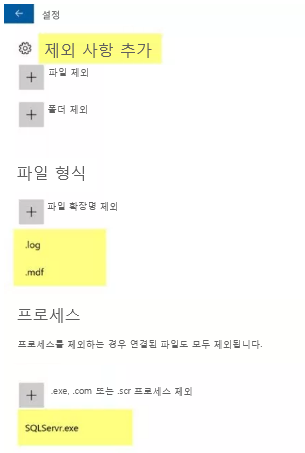

---
lab:
    title: '랩 16 - VM용 맬웨어 방지 프로그램'
    module: '모듈 2 - 플랫폼 보호 구현'
---

# 모듈 2: 랩 16 - VM용 맬웨어 방지 프로그램

**시나리오**

Azure Security Center는 맬웨어 방지 보호 상태를 모니터링하여 Endpoint Protection 문제 블레이드에서 보고합니다. Security Center는 VM과 컴퓨터가 맬웨어 위협에 취약해질 수 있는 탐지된 위협 및 불충분한 보호와 같은 문제를 보여줍니다. 
Endpoint Protection 문제의 정보를 참조하면 식별된 문제를 해결할 계획을 세울 수 있습니다. 

Security Center는 다음과 같은 Endpoint Protection 문제를 보고합니다. 

- Azure VM에 Endpoint Protection이 설치되어 있지 않음. 해당 Azure VM에 지원되는 맬웨어 방지 솔루션이 설치되어 있지 않습니다. 
- Azure 이외의 컴퓨터에 Endpoint Protection이 설치되어 있지 않음. Azure가 아닌 해당 컴퓨터에 지원되는 맬웨어 방지 솔루션이 설치되어 있지 않습니다.
- Endpoint Protection 상태 문제:  

- **만료된 서명**. 이러한 VM 및 컴퓨터에 맬웨어 방지 솔루션이 설치되어 있지만 해당 솔루션에 최신 맬웨어 방지 서명이 없습니다. 
  - **실시간 보호 없음**. 이러한 VM 및 컴퓨터에 맬웨어 방지 솔루션이 설치되어 있지만 실시간 보호가 구성되지 않았습니다. 서비스가 사용 중지 설정되거나 솔루션이 지원되지 않으므로 Security Center에서 상태를 가져오지 못할 수 있습니다. 
 - **보고하지 않음**. 맬웨어 방지 솔루션이 설치되어 있지만 데이터를 보고하지 않습니다. 
 - **알 수 없음**. 맬웨어 방지 솔루션이 설치되어 있지만 상태를 알 수 없거나 알 수 없는 오류를 보고합니다.

## 연습 1: Azure VM에 맬웨어 방지 프로그램 배포

## 태스크 1: 맬웨어 방지 확장을 사용하여 Azure Virtual Machine 만들기

VM용 맬웨어 방지 프로그램을 사용하도록 설정하고 구성 VM을 프로비전하는 동안 Azure Portal을 사용하여 Azure VM용으로 Microsoft Antimalware를 사용 설정하고 구성하려면 다음 단계를 완료합니다. 

1.  **Azure Portal**(**`https://portal.azure.com`**)에 로그인합니다.

2.  새 VM을 만들려면 **가상 머신**으로 이동하여 추가를 선택한 다음 이미지 드롭다운 아래에서 **Windows Server**를 선택합니다.

1.  VM의 다음 세부 정보를 입력합니다.

 | 옵션 | 입력 내용 |
 | -- | --|
 | 리소스 그룹 | 새로 만들기 > **myResourceGroup** |
 | VM 이름 | **myVM** |
 | 지역 | **미국 동부** |
 | 이미지 | **Windows Server 2019 Datacenter** |
 | 사용자 이름 | **localadmin** |
 | 암호 | **Pa55w.rd1234** |

1.  **관리** 탭을 클릭하고 모든 라디오 단추가 **끄기**로 설정되어 있는지 확인합니다.

1.  **고급** 탭을 클릭하고 **설치 확장 선택**을 클릭합니다.

1.  **Microsoft Antimalware** 확장을 선택합니다.  _목록 아래쪽의 추가 로드를 클릭하여 확장을 표시해야 할 수도 있습니다._

11.  **Microsoft Antimalware** 블레이드에서 **만들기**를 클릭합니다. 
12.  확장 설치 섹션에서 파일, 위치, 프로세스 제외 사항 및 기타 검색 옵션을 구성할 수 있습니다. 

1.  제외된 파일 형식에 **.mdf;.log**를 입력합니다.

1.  제외된 프로세스에 **SQLServr.exe**를 입력합니다. 

1.  **확인**을 선택합니다. 

14.  설정 섹션으로 돌아와서 **검토 + 만들기**를 선택합니다. 
15.  유효성 검사 화면에서 **만들기**를 클릭합니다. 
16.  VM이 생성되면 RDP를 통해 VM에 로그온한 다음 Microsoft Antimalware > 제외를 열어 배포가 정상적으로 완료되었는지 확인합니다.

     

| 경고: 계속하기 전에 이 랩에서 사용한 모든 리소스를 제거해야 합니다.  **Azure Portal**에서 리소스를 제거하려면 **리소스 그룹**을 클릭합니다.  랩에서 만든 리소스 그룹을 모두 선택합니다.  리소스 그룹 블레이드에서 **리소스 그룹 삭제**를 클릭하고 리소스 그룹 이름을 입력한 다음 **삭제**를 클릭합니다.  추가로 만든 리소스 그룹이 있으면 이 프로세스를 반복합니다. **리소스 그룹을 삭제하지 않으면 다른 랩에서 문제가 발생할 수 있습니다.** |
| --- |

**결과**: 이 랩이 완료되었습니다.

