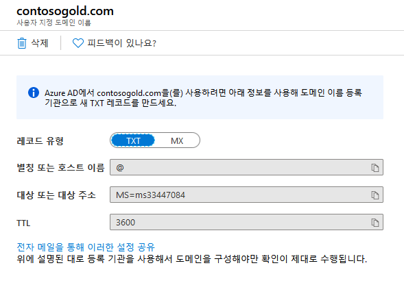
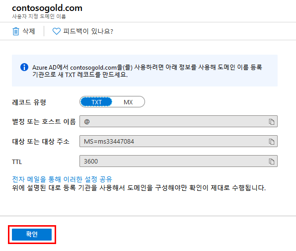
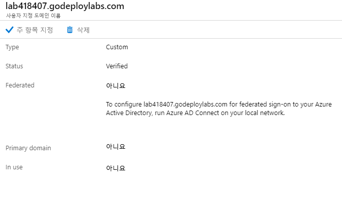

---
lab:
    title: '랩 18 - 사용자 지정 도메인'
    module: '모듈 2 - 플랫폼 보호 구현'
---

# 모듈 2: 랩 18 - 사용자 지정 도메인

**시나리오**

모든 새 Azure AD 테넌트의 초기 도메인 이름은 domainname.onmicrosoft.com입니다. 초기 도메인 이름을 변경하거나 삭제할 수는 없지만 목록에 조직 이름을 추가할 수는 있습니다. 사용자 지정 도메인 이름을 추가하면 alain@contoso.com과 같이 사용자들이 쉽게 이해할 수 있는 사용자 이름을 만들 수 있습니다.

### 연습 1: Azure Active Directory 포털을 통해 사용자 지정 도메인 이름 추가

### 태스크 1: Azure AD에 사용자 지정 도메인 이름 추가

1.  Azure Portal에서 **Azure Active Directory**를 선택합니다.

1.  **사용자 지정 도메인 이름**, **사용자 지정 도메인 추가**를 차례로 선택합니다.

       

2.  랩 환경의 DNS 탭으로 이동하여 할당한 고유 사용자 지정 도메인 이름을 확인합니다.  이 이름의 형식은 labxxxxxx.customdomainname.com입니다.

1.  사용자 지정 도메인 이름 필드에 이전 단계에서 확인한 도메인 이름을 입력하고 **도메인 추가**를 클릭합니다.

    확인되지 않은 도메인이 추가되고 DNS 정보가 표시된 **labxxxxx.customdomainname.com** 페이지가 나타납니다.

4.  **labxxxxx.customdomainname.com** 페이지에서 DNS 정보를 복사합니다. DNS 정보의 예로는 MS=ms64983159 등이 있습니다.

       

### 태스크 2: 도메인 등록 기관에 DNS 정보 추가

Azure AD에 사용자 지정 도메인 이름을 추가한 후에는 도메인 등록 기관으로 돌아와서 복사한 TXT 파일의 Azure AD DNS 정보를 추가해야 합니다. 도메인에 대해 이 TXT 레코드를 만들면 도메인 이름 소유권이 "확인"됩니다.

1.  랩 환경의 DNS 탭으로 돌아와 복사한 DNS 정보를 기준으로 도메인의 새 TXT 레코드를 만듭니다.  값 레코드만 입력해야 합니다.  이름 필드는 비워 두고 **저장**을 클릭합니다.

**참고**: 도메인 이름은 원하는 수만큼 등록할 수 있습니다. 하지만 각 도메인은 Azure AD에서 자체 TXT 레코드를 가져옵니다. 따라서 도메인 등록 기관에 TXT 파일 정보를 정확하게 입력해야 합니다. 실수로 잘못된 정보나 중복된 정보를 입력하면 TTL 시간이 초과될 때까지 60분 동안 기다려야 입력을 다시 시도할 수 있습니다.

### 태스크 2: 사용자 지정 도메인 이름 확인

사용자 지정 도메인 이름을 등록한 후에는 Azure AD에서 해당 이름이 유효한지 확인해야 합니다. 도메인 등록 기관에 따라 이름이 도메인 등록 기관에서 Azure AD로 즉시 전파될 수도 있고, 전파에 며칠이 걸릴 수도 있습니다.

1.  Azure Portal **labxxxxx.customdomainname.com** 페이지로 돌아와서 **확인**을 클릭합니다.

     

1.  도메인이 확인되었습니다.

     

1.  사용자 지정 도메인 이름을 확인한 후에는 확인 TXT 레코드를 삭제해도 됩니다.

**결과**: 이 랩이 완료되었습니다.

