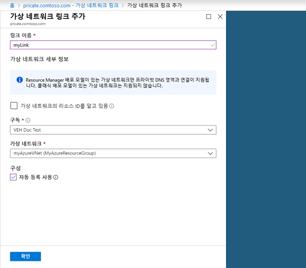

---
lab:
    title: '랩 19 - 프라이빗 DNS'
    module: '모듈 2 - 플랫폼 보호 구현'
---

# 모듈 2: 랩 19 - 프라이빗 DNS


**시나리오**

DNS 영역은 특정 도메인의 DNS 레코드를 호스트하는 데 사용됩니다. Azure DNS에서 도메인 호스팅을 시작하려면 해당 도메인 이름용 DNS 영역을 만들어야 합니다. 그러면 이 DNS 영역 내에 도메인의 각 DNS 레코드가 생성됩니다. 가상 네트워크에 프라이빗 DNS 영역을 게시하려면 영역 내에서 레코드를 확인할 수 있는 가상 네트워크 목록을 지정합니다.  이러한 가상 네트워크가 *연결된* 가상 네트워크입니다. 자동 등록이 사용하도록 설정되어 있으면 Azure DNS는 가상 머신이 작성/삭제되거나 가상 머신 IP 주소가 변경될 때마다 영역 레코드도 업데이트합니다.

이 랩의 학습 내용은 다음과 같습니다.

> * 프라이빗 DNS 영역 만들기
> * 가상 네트워크 만들기
> * 가상 네트워크 연결
> * 테스트 가상 머신 만들기
> * 추가 DNS 레코드 만들기
> * 프라이빗 영역 테스트


## 연습 1: Azure Portal을 사용하여 Azure 프라이빗 DNS 영역 만들기

### 태스크 1: 프라이빗 DNS 영역 만들기


다음 예제에서는 **MyAzureResourceGroup** 리소스 그룹에 **private.contoso.com** DNS 영역을 만듭니다.

DNS 영역에는 도메인의 DNS 항목이 포함되어 있습니다. Azure DNS에서 도메인 호스팅을 시작하려면 해당 도메인 이름용 DNS 영역을 만듭니다.


1.  Portal 검색 창의 검색 텍스트 상자에 **프라이빗 DNS 영역**을 입력하고 **Enter** 키를 누릅니다.
1.  **프라이빗 DNS 영역**을 선택합니다.
2.  **프라이빗 DNS 영역 만들기**를 선택합니다.

1.  **프라이빗 DNS 영역 만들기** 페이지에서 다음 값을 입력하거나 선택합니다.

   - **리소스 그룹**: **새로 만들기**를 선택하고 *MyAzureResourceGroup*을 입력한 다음 **확인**을 선택합니다. 리소스 그룹 이름은 Azure 구독 내에서 고유해야 합니다. 
   -  **이름**: 이 예제에서는 *private.contoso.com*을 입력합니다.
</br>   
1.  **리소스 그룹 위치**로는 **미국 중서부**를 선택합니다.

1.  **검토 + 만들기**를 선택합니다.

1.  **만들기**를 선택합니다.

영역을 만드는 데는 몇 분 정도 걸릴 수 있습니다.

### 태스크 2: 가상 네트워크 만들기

1.  Portal 페이지 왼쪽 위에서 **리소스 만들기**, **네트워킹**, **가상 네트워크**를 차례로 선택합니다.

2.  **이름**으로 **myAzureVNet**을 입력합니다.
3.  **리소스 그룹**으로 **MyAzureResourceGroup**을 선택합니다.
4.  **위치**로는 **미국 동부**를 선택합니다.
5.  나머지 기본값은 그대로 적용하고 **만들기**를 선택합니다.

### 태스크 3: 가상 네트워크 연결


가상 네트워크에 프라이빗 DNS 영역을 연결하려면 가상 네트워크 링크를 만듭니다.


1.  **MyAzureResourceGroup** 리소스 그룹을 열고 **private.contoso.com** 프라이빗 영역을 선택합니다.

2.  왼쪽 창에서 **가상 네트워크 링크**를 선택합니다.
3.  **추가**를 선택합니다.
4.  **링크 이름**으로 **myLink**를 입력합니다.
5.  **가상 네트워크**로 **myAzureVNet**을 선택합니다.
6.  **자동 등록 사용** 확인란을 선택합니다.
7.  **확인**을 선택합니다.

     

### 태스크 4: 테스트 가상 머신 만들기


이제 프라이빗 DNS 영역을 테스트할 수 있도록 가상 머신 두 개를 만듭니다.


1.  Portal 페이지 왼쪽 위에서 **리소스 만들기**, **Windows Server 2016 Datacenter**를 차례로 선택합니다.

1.  리소스 그룹으로 **MyAzureResourceGroup**을 선택합니다
1.  가상 머신 이름으로 **myVM01**을 입력합니다.
1.  **지역**으로 **미국 동부**를 선택합니다.
1.  관리자 이름으로 **LocalAdmin**을 입력합니다.
2.  암호로 **Pa55w.rd1234**를 입력하고 확인을 위해 다시 한 번 입력합니다.

5.  **공용 인바운드 포트**에서 **선택한 포트 허용**을 선택한 다음 **인바운드 포트 선택**에서 **RDP(3389)**를 선택합니다.
10.  페이지의 나머지 옵션에는 기본값을 적용하고 **다음: 디스크 >**를 클릭합니다.
11.  **디스크** 페이지에서 기본값을 적용하고 **다음:**** 네트워킹 >**을 클릭합니다.
1.  가상 네트워크로 **myAzureVNet**이 선택되어 있는지 확인합니다.
1.  페이지의 나머지 옵션에는 기본값을 적용하고 **다음: 관리 >**를 클릭합니다.
2.  **부트 진단**에서 **끄기**를 선택하고 나머지 기본값은 그대로 적용한 후에 **검토 + 만들기**를 선택합니다.
1.  설정을 검토하고 **만들기**를 클릭합니다.

1.  이 단계를 반복하여 다른 가상 머신 **myVM02**를 만듭니다.

두 가상 머신 만들기를 완료하려면 몇 분 정도 걸립니다.

### 태스크 5: 추가 DNS 레코드 만들기


다음 예제에서는 DNS 영역 **private.contoso.com**, **MyAzureResourceGroup**에서 상대적 이름이 **db**인 레코드를 만듭니다. 레코드 집합의 정규화된 이름은 **db.private.contoso.com**입니다. 레코드 종류는 "A"이고 IP 주소는 **myVM01**입니다.


1.  **MyAzureResourceGroup** 리소스 그룹을 열고 **private.contoso.com** 프라이빗 영역을 선택합니다.

2.  **+ 레코드 집합**을 선택합니다.
3.  **이름**으로 **db**를 입력합니다.
4.  **IP 주소**로 **myVM01**에 표시되는 IP 주소를 입력합니다. 가상 머신을 시작하면 이 IP 주소가 자동 등록됩니다.
5.  **확인**을 선택합니다.

### 태스크 6: 프라이빗 영역 테스트


이제 **private.contoso.com** 프라이빗 영역의 이름 확인을 테스트할 수 있습니다.

ping 명령을 사용하여 이름 확인을 테스트할 수 있습니다. 인바운드 ICMP 패킷을 허용하도록 두 가상 머신의 방화벽을 구성합니다.


1.  myVM01에 연결한 다음 관리자 권한으로 Windows PowerShell 창을 엽니다.

2.  다음 명령을 실행합니다.

       ```powershell
       New-NetFirewallRule -DisplayName "Allow ICMPv4-In" -Protocol ICMPv4
       ```

1.  myVM02에서도 같은 단계를 반복합니다.

### 태스크 7: 이름으로 VM에 ping 실행

1.  myVM02 Windows PowerShell 명령 프롬프트에서 자동 등록된 호스트 이름을 사용하여 myVM01에 대해 ping을 실행합니다.

       ```cli
       ping myVM01.private.contoso.com
       ```
   
    다음과 같은 출력이 표시됩니다.

    ```cli
    Pinging myvm01.private.contoso.com [10.2.0.4] with 32 bytes of data:
    Reply from 10.2.0.4: bytes=32 time<1ms TTL=128
    Reply from 10.2.0.4: bytes=32 time=1ms TTL=128
    Reply from 10.2.0.4: bytes=32 time<1ms TTL=128
    Reply from 10.2.0.4: bytes=32 time<1ms TTL=128
    ```
   
2.  이제 앞에서 만든 **db** 이름에 대해 ping을 실행합니다.
   
       ```cli
       ping db.private.contoso.com
       ```
       다음과 같은 출력이 표시됩니다.
   
       ```cli
       PS C:\> ping db.private.contoso.com

       Pinging db.private.contoso.com [10.2.0.4] with 32 bytes of data:
       Reply from 10.2.0.4: bytes=32 time<1ms TTL=128
       Reply from 10.2.0.4: bytes=32 time<1ms TTL=128
       Reply from 10.2.0.4: bytes=32 time<1ms TTL=128
       Reply from 10.2.0.4: bytes=32 time<1ms TTL=128

       Ping statistics for 10.2.0.4:
           Packets: Sent = 4, Received = 4, Lost = 0 (0% loss),
       Approximate round trip times in milli-seconds:
           Minimum = 0ms, Maximum = 0ms, Average = 0ms
       PS C:\>
       ```


| 경고: 계속하기 전에 이 랩에서 사용한 모든 리소스를 제거해야 합니다.  **Azure Portal**에서 리소스를 제거하려면 **리소스 그룹**을 클릭합니다.  랩에서 만든 리소스 그룹을 모두 선택합니다.  리소스 그룹 블레이드에서 **리소스 그룹 삭제**를 클릭하고 리소스 그룹 이름을 입력한 다음 **삭제**를 클릭합니다.  추가로 만든 리소스 그룹이 있으면 이 프로세스를 반복합니다. **리소스 그룹을 삭제하지 않으면 다른 랩에서 문제가 발생할 수 있습니다.** |
| --- |

**결과**: 이 랩이 완료되었습니다.
