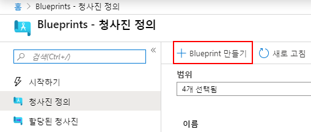
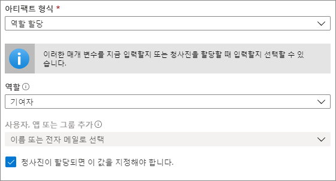
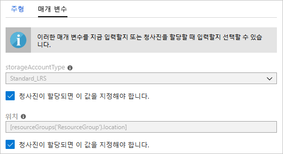
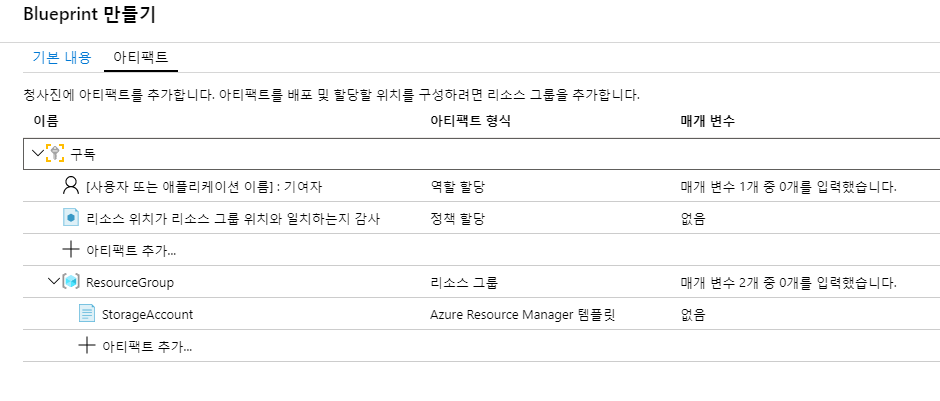
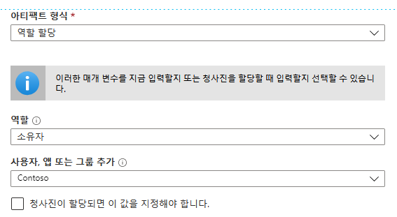
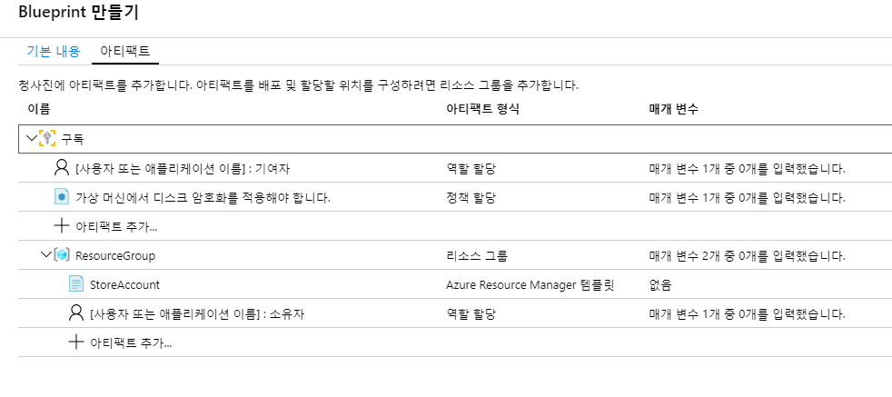
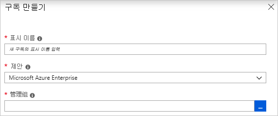
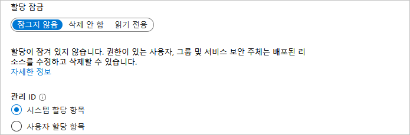
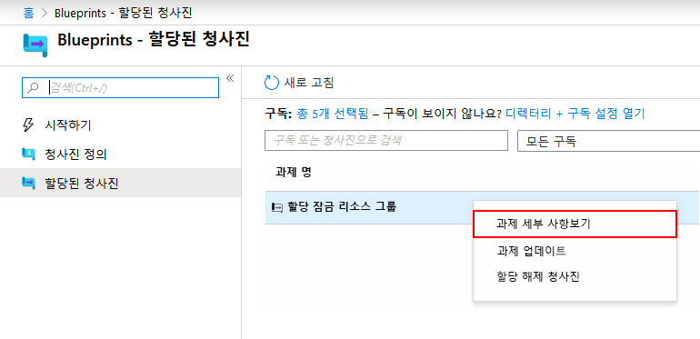

---
lab:
    title: '랩 20 - Azure Blueprints'
    module: '모듈 2 - 플랫폼 보호 구현'
---


# 모듈 2: 랩 20 - Azure Blueprints


**시나리오**

청사진을 만들고 할당하는 방법을 확인할 때는 Azure Resource Manager 템플릿/정책/보안 등을 기준으로 하여 재사용하고 빠르게 배포할 수 있는 구성을 개발하기 위한 공통 패턴을 정의할 수 있습니다. 이 자습서에서는 Azure Blueprints를 사용하여 조직 내에서 청사진 만들기/게시/할당과 관련된 몇 가지 일반적인 태스크를 수행하는 방법을 배웁니다. 이러한 태스크는 다음과 같습니다.

- 새 청사진을 만들고 지원되는 여러 아티팩트 추가
- 아직 초안 상태인 기존 청사진 변경
- 청사진을 할당 가능한 게시됨 상태로 표시
- 기존 구독에 청사진 할당
- 할당된 청사진의 상태 및 진행률 확인
- 구독에 할당된 청사진 제거


## 연습 1: 포털에서 청사진 만들기

### 태스크 1: 청사진 만들기


규정 준수용 표준 패턴을 정의하는 첫 단계에서는 사용 가능한 리소스에서 청사진을 작성합니다. 이 예제에서는 구독용 역할 및 정책 할당 구성을 위해 새 청사진 **MyBlueprint**를 만듭니다. 그런 다음 새 리소스 그룹을 추가하고 새 리소스 그룹에 Resource Manager 템플릿 및 역할 할당을 만듭니다.


1.  왼쪽 창에서 **모든 서비스**를 선택합니다. **Blueprints**를 검색하여 선택합니다.

1.  왼쪽 페이지에서 **청사진 정의**를 선택하고 페이지 위쪽의 **+ 청사진 만들기**
   단추를 선택합니다.

    또는 **시작** 페이지에서 **만들기**를 선택하여 청사진 만들기로 바로 이동합니다.

       

1.  **청사진 이름**을 **MyBlueprint**와 같이 입력합니다. 문자와 숫자를 조합하여 48자까지 입력하되 공백이나 특수 문자는 포함하지 마세요. **청사진 설명**은 일단 비워 둡니다.

1.  **정의 위치** 상자에서 오른쪽의 줄임표를 선택하고 청사진을 저장할 구독을 선택한 다음 **선택**을 선택합니다.

1.  정보가 정확한지 확인합니다. **청사진 이름** 및 **정의 위치** 필드의 내용은 나중에 변경할 수 없습니다. 페이지 아래쪽의 **다음: 아티팩트**를 선택하거나 페이지 위쪽의 **아티팩트** 탭을 선택합니다.

1.  구독 수준에서 역할 할당을 추가합니다.

   1. **구독** 아래에서 **+ 아티팩트 추가**를 선택합니다. **아티팩트 추가** 창이
      브라우저 오른쪽에 열립니다.

   1. **아티팩트 형식**으로 **역할 할당**을 선택합니다.

   1. **역할**에서 **참가자**를 선택합니다. 동적 매개 변수를 나타내는 확인란이 있는 **사용자, 앱 또는 그룹 추가** 상자는
      비워 둡니다.

   1. **추가**를 선택하여 청사진에 이 아티팩트를 추가합니다.

      

        **참고**: 대다수 아티팩트는 매개 변수를 지원합니다. 청사진 생성 중에 값이 할당되는 매개 변수는 *정적 매개 변수*입니다. 그리고 청사진 생성 중에 할당되는 매개 변수는 *동적 매개 변수*입니다.


1.  구독 수준에서 정책 할당을 추가합니다.

   1. 역할 할당 아티팩트 아래에서 **+ 아티팩트 추가** 행을 선택합니다.

   1. **아티팩트 형식**으로 **정책 할당**을 선택합니다.

   1. **유형**을 **기본 설정**으로 변경하고 **검색**에 **태그**를 입력합니다.

   1. **검색** 창 외부를 클릭하면 필터링이 수행됩니다. **리소스 그룹에 태그 및 해당 값
      추가**를 선택합니다.

   1. **추가**를 선택하여 청사진에 이 아티팩트를 추가합니다.

1.  정책 할당 **리소스 그룹에 태그 및 해당 기본값 추가**의 행을 선택합니다.

1.  청사진 정의의 일부분으로 아티팩트에 매개 변수를 제공하는 창이 열립니다. 할당 중에 매개 변수를 설정(동적 매개 변수)하는 대신, 이 창에서 해당 청사진을 기준으로 하여 모든 할당에 대해 매개 변수를 설정(정적 매개 변수)할 수 있습니다. 이 예제에서는 청사진 할당 중에 동적 매개 변수를 사용하므로 기본값을 그대로 두고 **취소**를 선택합니다.

1.  구독 수준에서 리소스 그룹을 추가합니다.

   1. **구독** 아래에서 **+ 아티팩트 추가**를 선택합니다.

   1. **아티팩트 형식**으로 **리소스 그룹**을 선택합니다.

   1. **아티팩트 표시 이름**, **리소스 그룹 이름** 및 **위치** 확인란은 선택하지 않은 상태로 유지하고, 각 매개 변수 속성의 확인란은 선택하여 속성을 동적 매개 변수로 지정합니다.

   1. **추가**를 선택하여 청사진에 이 아티팩트를 추가합니다.

1.  리소스 그룹 아래에 템플릿을 추가합니다.

   1. **ResourceGroup** 항목 아래에서 **+ 아티팩트 추가** 행을 선택합니다.

   1. **아티팩트 형식**으로 **Azure Resource Manager 템플릿**을 선택하고 **아티팩트 표시 이름**을 **StorageAccount**로 설정합니다. **설명**은 비워 두면 됩니다.

   1. **템플릿** 탭의 편집기 상자에 다음 Resource Manager 템플릿을 붙여넣습니다.  템플릿을 붙여넣은 후 **매개 변수** 탭을 선택하고 템플릿 매개 변수 **storageAccountType** 및 **location**이 검색되었는지 확인합니다. 각 매개 변수가 자동으로 검색되어 입력되었으며 동적 매개 변수로 구성되었습니다.

        ```json
              {
                  "$schema": "https://schema.management.azure.com/schemas/      2015-01-01/deploymentTemplate.json#",
                  "contentVersion": "1.0.0.0",
                  "parameters": {
                      "storageAccountType": {
                          "type": "string",
                          "defaultValue": "Standard_LRS",
                          "allowedValues": [
                              "Standard_LRS",
                              "Standard_GRS",
                              "Standard_ZRS",
                              "Premium_LRS"
                          ],
                          "metadata": {
                              "description": "스토리지 계정 유형"
                          }
                      },
                      "location": {
                          "type": "string",
                          "defaultValue": "[resourceGroup().location]",
                          "metadata": {
                              "description": "모든 리소스의 위치입니다."
                          }
                      }
                  },
                  "variables": {
                      "storageAccountName": "[concat('store', uniquestring      (resourceGroup().id))]"
                  },
                  "resources": [{
                      "type": "Microsoft.Storage/storageAccounts",
                      "name": "[variables('storageAccountName')]",
                      "location": "[parameters('location')]",
                      "apiVersion": "2018-07-01",
                      "sku": {
                          "name": "[parameters('storageAccountType')]"
                      },
                      "kind": "StorageV2",
                      "properties": {}
                  }],
                  "outputs": {
                      "storageAccountName": {
                          "type": "string",
                          "value": "[variables('storageAccountName')]"
                      }
                  }
              }
        ```

1. **storageAccountType** 확인란 선택을 취소하고 드롭다운 목록의
      **allowedValues**에 Resource Manager 템플릿에 들어 있는 값만 포함되어 있는지 확인합니다. 확인란을 선택하여 storageAccountType을
      다시 동적 매개 변수로 설정합니다.

1. **추가**를 선택하여 청사진에 이 아티팩트를 추가합니다.

      

1.  완성된 청사진은 다음과 같습니다. 각 아티팩트의 **매개 변수** 열에는 **매개 변수 _y_개 중 _x_개를 입력했습니다.**가 표시됩니다. 동적 매개 변수는 각 청사진을 할당할 때 설정됩니다.

       

1.  계획한 아티팩트를 모두 추가했으므로 페이지 아래쪽의 **초안 저장**을 선택합니다.

### 태스크 2:  청사진 편집


청사진 만들기에서 설명을 입력하지 않았거나 새 리소스 그룹에 역할 할당을 추가하지 않은 경우 다음 단계를 수행하면 두 가지 사항을 모두 수정할 수 있습니다.


1.  왼쪽 페이지에서 **청사진 정의**를 선택합니다.

1.  청사진 목록에서 이전에 만든 청사진을 마우스 오른쪽 단추로 클릭하고 **청사진
   편집**을 선택합니다.

1.  **청사진 설명**에 청사진 및 청사진을 구성하는 아티팩트 관련 정보를 입력합니다. 이 연습에서는 다음과 같은 설명을 입력합니다. **이 청사진은 구독에서 태그 정책 및 역할 할당을 설정하고, 리소스 그룹을 만들고, 해당 리소스 그룹에 역할 할당 및 리소스 템플릿을 배포합니다.**

1.  페이지 아래쪽의 **다음: 아티팩트**를 선택하거나 페이지 위쪽의 **아티팩트** 탭을
   선택합니다.

1.  리소스 그룹 아래에 할당을 추가합니다.

   1. **ResourceGroup** 항목 바로 아래에서 **+ 아티팩트 추가** 행을 선택합니다.

   1. **아티팩트 형식**으로 **역할 할당**을 선택합니다.

   1. **역할** 아래에서 **소유자**를 선택하고 **사용자, 앱 또는 그룹 추가** 상자 아래의 확인란 선택을 취소합니다.

   1. 추가할 사용자, 앱 또는 그룹을 검색하여 선택합니다. 이 아티팩트는 이 청사진의 모든 할당에서 동일하게 설정되는 정적 매개 변수를 사용합니다.

1. **추가**를 선택하여 청사진에 이 아티팩트를 추가합니다.

   

1.  완성된 청사진은 다음과 같습니다. 새로 추가한 역할 할당에 **매개 변수 1개 중 1개를 입력했습니다.**가 표시됩니다. 즉, 이 매개 변수는 정적 매개 변수입니다

       
   
1.  청사진이 업데이트되었으므로 **초안 저장**을 선택합니다.

### 태스크 3: 청사진 게시


계획된 모든 아티팩트를 청사진에 추가했으므로 이제 청사진을 게시합니다. 게시한 청사진은 구독에 할당할 수 있습니다.


1.  왼쪽 페이지에서 **청사진 정의**를 선택합니다.

1.  청사진 목록에서 이전에 만든 청사진을 마우스 오른쪽 단추로 클릭하고 **청사진
   게시**를 선택합니다.

1.  열리는 창에서 **버전**을 **v1**과 같이 입력합니다. 문자, 숫자, 하이픈을 조합하여 최대 20자까지 입력할 수 있습니다. 필요한 경우 **1차 게시** 등의 텍스트를 **변경 메모**에 입력합니다.

1.  페이지 아래쪽의 **게시**를 선택합니다.

### 태스크 4:  청사진 할당


게시한 청사진은 구독에 할당할 수 있습니다. 작성한 청사진을 관리 그룹 계층 구조의 구독 중 하나에 할당하면 됩니다. 구독에 저장한 청사진은 해당 구독에만 할당할 수 있습니다. 


1.  왼쪽 페이지에서 **청사진 정의**를 선택합니다.

1.  청사진 목록에서 이전에 만든 청사진을 마우스 오른쪽 단추로 클릭하거나 줄임표를 선택하고 **청사진 할당**을 선택합니다.

1.  **청사진 할당** 페이지의 **구독** 드롭다운 목록에서 이 청사진을 배포할 구독을 선택합니다.

       Azure Billing에서 제공하는 지원되는 Enterprise 제품이 있는 경우 구독 상자 아래에서 새로 만들기 링크가 활성화됩니다. 다음 단계를 수행합니다.

    a. 기존 구독을 선택하는 대신 **새로 만들기** 링크를 선택하여 새 구독을 만듭니다.

    b. 새 구독의 **표시 이름**을 입력합니다.

    c. 드롭다운 목록에서 사용 가능한 **제안**을 선택합니다.

    d. 줄임표를 사용하여 구독을 자식으로 포함할 관리 그룹을 선택합니다.

    e. 페이지 아래쪽의 **만들기**를 선택합니다.

    

    **중요**: **만들기**를 선택하는 즉시 새 구독이 작성됩니다.

    **참고**: 선택하는 각 구독마다 할당이 생성됩니다. 선택한 구독의 나머지 부분은 강제로 변경하지 않고 나중에 단일 구독 할당을 변경할 수 있습니다.


1.  **할당 이름**에 이 할당의 고유한 이름을 입력합니다.

1.  **위치**에서 관리 ID 및 구독 배포 개체를 만들 지역을 선택합니다. Azure Blueprints는 이 관리 ID를 사용하여 할당된 청사진의 모든 아티팩트를 배포합니다. 

1.  **청사진 정의 버전** 드롭다운에서는 선택되어 있는 **게시됨** 버전인 **v1** 항목을 그대로 유지합니다. 기본값은 가장 최근에 게시된 버전입니다.

1.  **잠금 할당**에서는 기본값인 **잠그지 않음**을 그대로 유지합니다. 

       

1.  **관리 ID**에서는 기본값인 **시스템 할당**을 그대로 유지합니다.

1.  구독 수준 역할 할당 **[사용자 그룹 또는 애플리케이션 이름]: 참가자**에서 사용자, 앱 또는 그룹을 검색하여 선택합니다.

1.  구독 수준 정책 할당의 경우 **태그 이름**을 **CostCenter**로, **태그 값**을 **ContosoIT**로 설정합니다.

1.  **ResourceGroup**의 **이름**에는 **StorageAccount**를 입력하고, **위치**로는 드롭다운 목록에서 **미국 동부 2**를 선택합니다.

    **참고**: 청사진 정의 중에 리소스 그룹에 추가한 각 아티팩트는 함께 배포할 리소스 그룹 또는 개체와의 정렬을 위해 들여쓰기됩니다.  매개 변수를 사용하지 않거나 할당 시에 정의할 매개 변수가 없는 아티팩트는 상황 정보 제공용으로만 목록에 표시됩니다.


1.  Azure Resource Manager 템플릿 **StorageAccount**에서 **storageAccountType** 매개 변수의 값으로 **Standard_GRS**를 선택합니다.

1.  페이지 아래쪽의 정보 상자 내용을 확인하고 **할당**을 선택합니다.

### 태스크 5: 청사진 배포 추적


청사진을 구독 하나 이상에 할당하면 다음의 두 가지 작업이 수행됩니다.

- 청사진이 각 구독의 **할당된 청사진** 페이지에 추가됩니다.
- 청사진을 통해 정의된 모든 아티팩트를 배포하는 프로세스가 시작됩니다.

    청사진이 구독에 할당되었으므로 이제 배포 프로세스를 확인합니다.


1.  왼쪽 페이지에서 **할당된 청사진**을 선택합니다.

1.  청사진 목록에서 이전에 할당한 청사진을 마우스 오른쪽 단추로 클릭하고 **할당
   정보 보기**를 선택합니다.

       

1.  **청사진 할당** 페이지에서 모든 아티팩트가 정상적으로 배포되었으며
   배포 중에 오류가 발생하지 않았는지 유효성을 검사합니다. 오류가 발생한 경우 [청사진 문제 해결](./troubleshoot/general.md)에서
   발생한 문제를 확인하는 단계를 참조하세요.

### 태스크 6:  청사진 할당 해제


더 이상 필요하지 않은 청사진 할당은 구독에서 제거합니다. 청사진이 패턴/정책/디자인이 업데이트된 최신 청사진으로 바뀌었을 수 있습니다. 청사진을 제거해도 해당 청사진의 일부로 할당된 아티팩트는 그대로 유지됩니다. 청사진 할당을 제거하려면 다음 단계를 수행합니다.


1.  왼쪽 페이지에서 **할당된 청사진**을 선택합니다.

1.  청사진 목록에서 할당을 해제할 청사진을 선택합니다. 그런 다음
   페이지 위쪽의 **청사진 할당 해제** 단추를 선택합니다.

1.  확인 메시지를 살펴본 후에 **확인**을 선택합니다.

### 태스크 6: 청사진 삭제

1.  왼쪽 페이지에서 **청사진 정의**를 선택합니다.

1.  삭제할 청사진을 마우스 오른쪽 단추로 클릭하고 **청사진 삭제**를 선택합니다. 그런 다음
   확인 대화 상자에서 **예**를 클릭합니다.


**참고**: 이 방법으로 청사진을 삭제하면 선택한 청사진의 게시된 버전도 모두 삭제됩니다. 단일 버전을 삭제하려면 청사진을 열고 **게시된 버전** 탭을 선택한 다음 삭제하려는 버전을 선택하고 **이 버전 삭제**를 선택합니다. 또한 해당 청사진 정의의 모든 청사진 할당을 삭제할 때까지는 청사진을 삭제할 수 없습니다.


| 경고: 계속하기 전에 이 랩에서 사용한 모든 리소스를 제거해야 합니다.  **Azure Portal**에서 리소스를 제거하려면 **리소스 그룹**을 클릭합니다.  랩에서 만든 리소스 그룹을 모두 선택합니다.  리소스 그룹 블레이드에서 **리소스 그룹 삭제**를 클릭하고 리소스 그룹 이름을 입력한 다음 **삭제**를 클릭합니다.  추가로 만든 리소스 그룹이 있으면 이 프로세스를 반복합니다. **리소스 그룹을 삭제하지 않으면 다른 랩에서 문제가 발생할 수 있습니다.** |
| --- |

**결과**: 이 랩이 완료되었습니다.

