---
lab:
    title: '랩 1 - Azure Monitor'
    module: '모듈 3: 보안 작업 관리'
---

# 모듈 3: 랩 1 - Azure Monitor


클라우드 및 온-프레미스 환경에서 원격 분석 정보를 수집/분석하고 필요한 조치를 취하는 데 사용할 수 있는 포괄적인 솔루션을 제공하는 Azure Monitor를 활용하면 애플리케이션과 서비스의 가용성과 성능을 최대화할 수 있습니다. 그러면 애플리케이션의 성능 수준을 파악할 수 있으며, 성능에 영향을 주는 문제와 애플리케이션이 사용하는 리소스를 사전에 확인할 수 있습니다.

이 랩에서는 다음 작업을 수행하도록 Azure Monitor를 구성합니다.

- Azure 가상 머신에서 데이터 수집
- Application Insights를 사용하여 웹 사이트 모니터링


 
## 연습 1: Azure Monitor를 사용하여 Azure 가상 머신에서 데이터 수집


Azure Monitor는 상세 분석 및 상관 관계 지정을 위해 Azure 가상 머신의 데이터를 Log Analytics 작업 영역에 직접 수집할 수 있습니다. Windows 및 Linux용 Log Analytics VM 확장을 설치하면 Azure Monitor가 Azure VM에서 데이터를 수집할 수 있습니다. 이 연습에서는 몇 가지 간단한 단계를 통해 VM 확장을 사용하여 Azure Linux 또는 Windows VM에서 데이터를 구성하고 수집하는 방법을 살펴봅니다.  


### 태스크 1: 모니터링할 Azure VM 배포

1.  Azure Cloud Shell을 열고 다음 두 명령을 실행하여 모니터링하는 데 사용할 리소스 그룹과 Azure VM을 만듭니다.

     ```powershell
    New-AzResourceGroup -Name myResourceGroup -Location EastUS
     ```

     ```powershell
    New-AzVm -ResourceGroupName "myResourceGroup" -Name "myVM" -Location "East  US" -VirtualNetworkName "myVnet" -SubnetName "mySubnet" -SecurityGroupName   "myNetworkSecurityGroup" -PublicIpAddressName "myPublicIpAddress"     -OpenPorts 80,3389
     ```

1.  자격 증명을 입력하라는 메시지가 표시되면 사용자로 **LocalAdmin** 을 입력하고 암호로는 **Pa55w.rd1234** 를 사용합니다.

### 태스크 2: 작업 영역 만들기

1.  Azure Portal에서 **모든 서비스** 를 선택합니다. 리소스 목록에서 **Log Analytics** 를 입력합니다. 입력을 시작하면 입력에 따라 목록이 필터링됩니다. **Log Analytics 작업 영역** 을 선택합니다.

       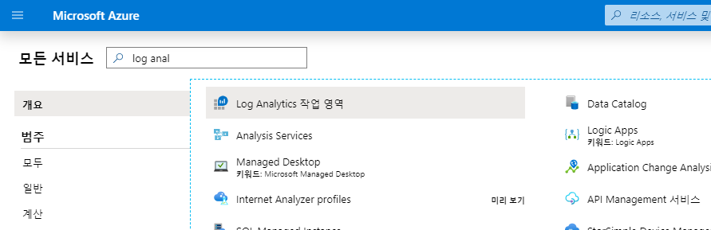

2.  **만들기** 를 선택한 후 다음 항목을 적절하게 선택합니다.

       * 새 **Log Analytics 작업 영역** 의 이름을 *myWorkspaceDemo* 와 같이 입력합니다.  
       * 선택되어 있는 기본값이 적절하지 않으면 드롭다운 목록에서 연결할 **구독** 을 선택합니다.
       * **리소스 그룹** 으로는 태스크 1에서 만든 VM이 포함된 리소스 그룹인 **myResourceGroup** 을 선택합니다.
       * 위치로는 **EastUS** 를 선택합니다. 
       * 가격 책정 계층은 **Gb당(2018)** 을 그대로 유지합니다.
  
           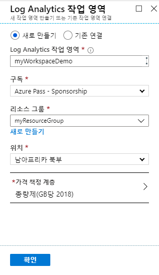

3.  **Log Analytics 작업 영역** 창에 필요한 정보를 입력하고 **확인** 을 선택합니다.  

1.  정보를 확인하고 작업 영역을 만드는 동안 메뉴의 **알림** 에서 진행 상황을 추적할 수 있습니다. 

### 태스크 2: Log Analytics VM 확장을 사용하도록 설정


Azure에 이미 배포된 Windows 및 Linux 가상 머신의 경우 Log Analytics VM 확장을 통해 Log Analytics 에이전트를 설치합니다. 확장을 사용하면 설치 프로세스를 간편하게 진행할 수 있으며, 지정한 Log Analytics 작업 영역으로 데이터를 전송하도록 에이전트가 자동으로 구성됩니다. 최신 버전이 릴리스되면 에이전트도 자동으로 업그레이드되므로 최신 기능과 수정 사항을 사용할 수 있습니다. 이 태스크를 진행하기 전에 VM이 실행 중인지 확인하세요. VM이 실행되고 있지 않으면 프로세스가 정상적으로 완료되지 않습니다. 
 

1.  Azure Portal 왼쪽 위의 **모든 서비스** 를 선택합니다. 리소스 목록에서 **Log Analytics** 를 입력합니다. 입력을 시작하면 입력에 따라 목록이 필터링됩니다. **Log Analytics 작업 영역** 을 선택합니다.

2.  Log Analytics 작업 영역 목록에서 앞에서 만든 **myWorkspaceDemo** 를 선택합니다.

    **참고**: 실제 작업 영역의 이름은 **myWorkspaceDemo** 와 다를 수 있습니다.


3.  왼쪽 메뉴의 작업 영역 데이터 원본에서 **가상 머신** 을 선택합니다.  

4.  **가상 머신** 목록에서 에이전트를 설치할 가상 머신을 선택합니다. VM의 **Log Analytics 연결 상태** 가 **연결 안 됨** 으로 표시됩니다.

5.  가상 머신의 세부 정보에서 **연결** 을 선택합니다. 에이전트가 자동으로 설치되어 Log Analytics 작업 영역용으로 구성됩니다. 이 과정은 몇 분 정도 걸립니다. 이 시간 동안 **상태** 는 **연결 중** 으로 표시됩니다.

6.  에이전트를 설치 및 연결하고 나면 **Log Analytics 연결 상태** 가 **이 작업 영역** 으로 업데이트됩니다.

### 태스크 3: Windows VM의 이벤트 및 성능 수집


Azure Monitor는 장기 분석 및 보고용으로 지정하는 Windows 이벤트 로그 또는 Linux Syslog 및 성능 카운터에서 이벤트를 수집할 수 있으며, 특정 조건이 검색되면 작업을 수행할 수 있습니다. 먼저 Windows 시스템 로그 및 Linux Syslog와 몇 가지 공통 성능 카운터에서 이벤트 수집을 구성하려면 다음 단계를 수집합니다.  


1.  Log Analytics 작업 영역 블레이드에서 **고급 설정** 을 선택합니다.

       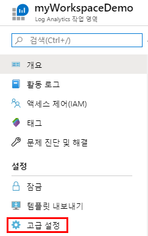

2.  **데이터**, **Windows 이벤트 로그** 를 차례로 선택합니다.

3.  로그 이름을 입력하여 이벤트 로그를 추가합니다.  **시스템** 을 입력하고 더하기 기호(**+**)를 선택합니다.

4.  표에서 **오류** 및 **경고** 심각도를 선택합니다.

5.  페이지 위쪽의 **저장** 을 선택하여 구성을 저장합니다.

6.  **Windows 성능 데이터** 를 선택하여 Windows 컴퓨터에서 성능 카운터를 수집하도록 설정합니다.

7.  새 Log Analytics 작업 영역용으로 Windows 성능 카운터를 처음 구성할 때는 몇 가지 공통 카운터를 빠르게 만들 수 있는 옵션이 제공됩니다. 목록의 각 카운터 옆에는 확인란이 표시됩니다.

       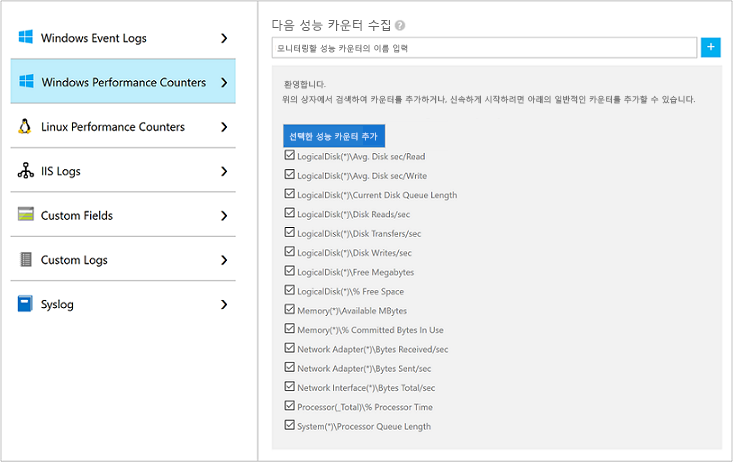

    **선택한 성능 카운터 추가** 를 선택합니다.  해당 성능 카운터가 추가되고 수집 샘플 간격은 10초로 미리 설정됩니다.
  
8.  페이지 위쪽의 **저장** 을 선택하여 구성을 저장합니다.


### 태스크 4: 수집된 데이터 확인


데이터 수집을 사용하도록 설정했으므로 간단한 로그 검색 예제를 실행하여 대상 VM에서 데이터를 확인해 보겠습니다.  


1.  선택한 작업 영역의 왼쪽 창에서 **로그** 를 선택합니다.

2.  로그 쿼리 페이지의 쿼리 편집기에 `Perf`를 입력하고 **실행** 을 선택합니다.

       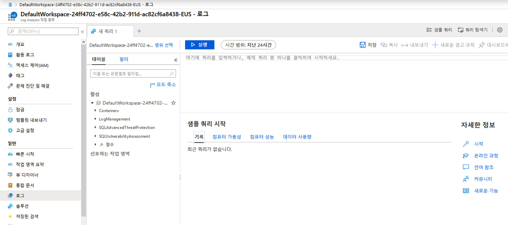

    예를 들어 다음 이미지의 쿼리는 성능 레코드 10,000개를 반환했습니다. 그런데 VM을 몇 분만 실행했으므로 결과 수는 이보다 훨씬 적습니다.

       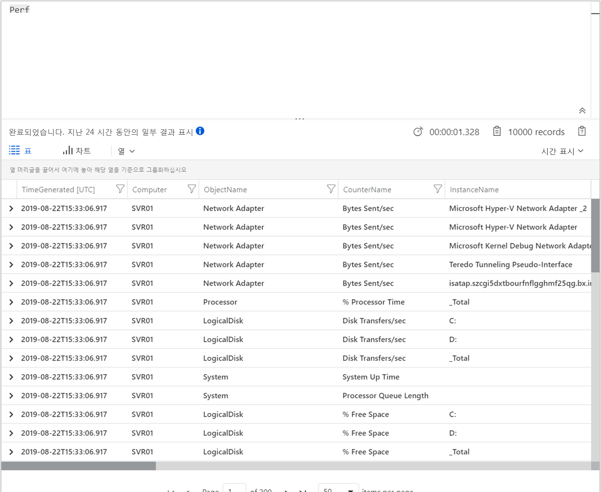

## 연습 2: Azure Monitor Application Insights를 사용하여 웹 사이트 모니터링


Azure Monitor Application Insights를 사용하면 웹 사이트에서 가용성, 성능 및 사용량을 쉽게 모니터링할 수 있습니다. 또한 사용자가 보고할 때까지 기다리지 않고도 애플리케이션의 오류를 빠르게 파악하고 진단할 수 있습니다. Application Insights는 서버 쪽 모니터링 기능과 클라이언트/브라우저 쪽 모니터링 기능을 모두 제공합니다.

이 연습에서는 웹 사이트 방문자의 클라이언트/브라우저 쪽 환경을 파악할 수 있도록 오픈 소스 Application Insights JavaScript SDK를 추가하는 과정을 안내합니다.


### 태스크 1: Application Insights를 사용하도록 설정


Application Insights는 온-프레미스나 클라우드에서 실행되는 모든 인터넷 연결 애플리케이션에서 원격 분석 데이터를 수집할 수 있습니다. 이 데이터를 확인하려면 다음 단계를 수행합니다.


1.  **리소스 만들기** > **관리 도구** > **Application Insights** 를 선택합니다.

    구성 상자가 나타나면 다음 표의 정보를 사용하여 입력 필드에 내용을 입력합니다.

   | 설정        | 값   | 
   | ------------ |------|
   | **이름**      | 전역적으로 고유한 값 입력 |
   | **리소스 그룹**     | mySResourceGroup |
   | **위치** | 미국 동부 |

2.  **만들기** 를 클릭합니다.

### 태스크 2: HTML 파일 만들기

1.  로컬 컴퓨터에서``hello_world.html`` 파일을 만듭니다. 이 예제에서 해당 파일은 C: 드라이브 루트에 ``C:\hello_world.html``로 저장됩니다.
2.  ``hello_world.html``에 아래 스크립트를 복사합니다.

    ```html
    <!DOCTYPE html>
    <html>
    <head>
    <title>Azure Monitor Application Insights</title>
    </head>
    <body>
    <h1>Azure Monitor Application Insights Hello World!</h1>
    <p>You can use the Application Insights JavaScript SDK to perform client/browser-side monitoring of your website. To learn about more advanced JavaScript SDK configurations visit the <a href="https://github.com/Microsoft/ApplicationInsights-JS/blob/master/API-reference.md" title="API Reference">API reference</a>.</p>
    </body>
    </html>
    ```

### 태스크 3: App Insights SDK 구성

1.  **개요** > **기본 정보** 로 이동하여 애플리케이션의 **계측 키** 를 복사합니다.

       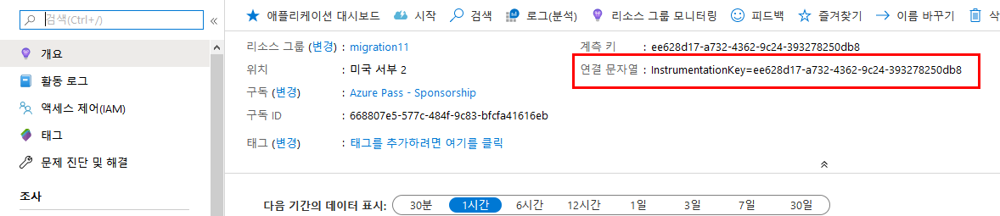

2.  ``</head>`` 태그를 닫기 전에 ``hello_world.html``에 다음 스크립트를 추가합니다.

       ```javascript
        <script type="text/javascript">
          var sdkInstance="appInsightsSDK";window[sdkInstance]="appInsights";   var aiName=window[sdkInstance],aisdk=window[aiName]||function(e)   {function n(e){t[e]=function(){var n=arguments;t.queue.push(function   (){t[e].apply(t,n)})}}var t={config:e};t.initialize=!0;var     i=document,a=window;setTimeout(function(){var n=i.createElement ("script");n.src=e.url||"https://az416426.vo.msecnd.net/scripts/b/   ai.2.min.js",i.getElementsByTagName("script")[0]   .parentNode.appendChild(n)});try{t.cookie=i.cookie}catch(e){}t.queue=  [],t.version=2;for(var r=["Event","PageView","Exception","Trace", "DependencyData","Metric","PageViewPerformance"];r.length;)n("track" +r.pop());n("startTrackPage"),n("stopTrackPage");var s="Track"+r[0]; if(n("start"+s),n("stop"+s),n("setAuthenticatedUserContext"),n   ("clearAuthenticatedUserContext"),n("flush"),! (!0===e.disableExceptionTracking||e.extensionConfig&&    e.extensionConfig.ApplicationInsightsAnalytics&&    !0===e.extensionConfig.ApplicationInsightsAnalytics.    disableExceptionTracking)){n("_"+(r="onerror"));var o=a[r];a[r] =function(e,n,i,a,s){var c=o&&o(e,n,i,a,s);return!0!==c&&t["_"+r](   {message:e,url:n,lineNumber:i,columnNumber:a,error:s}),c}, e.autoExceptionInstrumented=!0}return t}(
          {
             instrumentationKey:"INSTRUMENTATION_KEY"
          }
          );window[aiName]=aisdk,aisdk.queue&&0===aisdk.queue.length&&  aisdk.trackPageView({});
       </script>
       ```

3.  ``hello_world.html``을 편집하여 계측 키를 추가합니다.

4.  로컬 브라우저 세션에서 ``hello_world.html``을 엽니다. 단일 페이지 뷰가 생성됩니다. 브라우저를 새로 고치면 여러 테스트 페이지 뷰를 생성할 수 있습니다.

### 태스크 4: Azure Portal에서 모니터링 시작

1.  이제 계측 키를 검색했던 Application Insights **개요** 페이지를 Azure Portal에서 다시 열어 현재 실행 중인 애플리케이션 관련 세부 정보를 확인할 수 있습니다. 개요 페이지의 4개 기본 차트에는 서버 쪽 애플리케이션 데이터가 표시됩니다. 여기서는 JavaScript SDK와의 클라이언트/브라우저 쪽 상호 작용을 계측하므로, 서버 쪽 SDK도 설치한 경우가 아니면 이 특정 보기는 필요하지 않습니다.

2.   애플리케이션 맵 아이콘  **Analytics** 를 클릭합니다.  그러면 Application Insights에서 수집한 모든 데이터를 분석하는 데 사용할 수 있는 유용한 쿼리 언어를 제공하는 **Analytics** 가 열립니다. 클라이언트 쪽 브라우저 요청 관련 데이터를 확인하려면 다음 쿼리를 실행합니다.

    ```json
    // average pageView duration by name
    let timeGrain=1s;
    let dataset=pageViews
    // additional filters can be applied here
    | where timestamp > ago(15m)
    | where client_Type == "Browser" ;
    // calculate average pageView duration for all pageViews
    dataset
    | summarize avg(duration) by bin(timestamp, timeGrain)
    | extend pageView='Overall'
    // render result in a chart
    | render timechart
    ```

       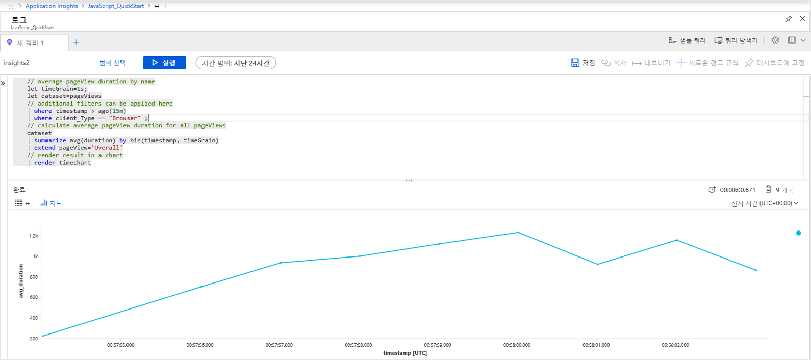

3.  **개요** 페이지로 돌아옵니다. **조사** 머리글 아래에서 **브라우저** 를 클릭하고 **성능** 을 선택합니다. 그러면 웹 사이트 성능 관련 메트릭을 확인할 수 있습니다. 웹 사이트의 오류와 예외 분석을 위한 보기도 제공됩니다. **샘플** 을 클릭하면 개별 트랜잭션 세부 정보를 살펴볼 수 있습니다. 여기서 전체 트랜잭션 세부 정보에 액세스할 수 있습니다.

       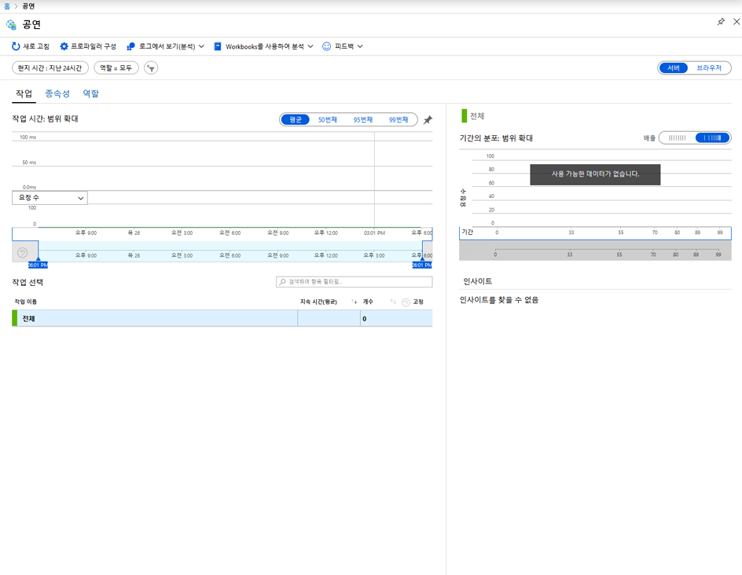

4.  사용자 행동 분석 도구를 살펴보려면 기본 Application Insights 메뉴에서 **사용** 머리글 아래의 **사용자** 를 선택합니다. 여기서는 컴퓨터 한 대에서 테스트를 진행하므로 사용자 한 명의 데이터만 표시됩니다. 라이브 웹 사이트에서는 사용자 분포가 다음과 같이 표시됩니다.

       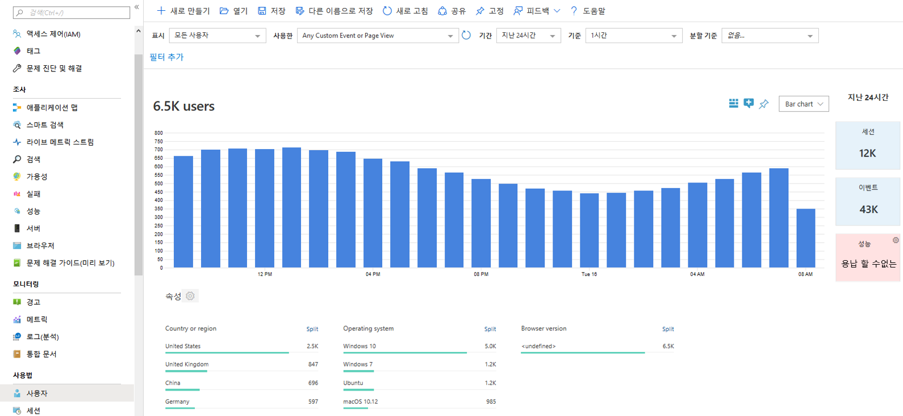
    
5.  페이지가 여러 개인 더 복잡한 웹 사이트를 계측한 경우에는 [**User Flows**](../../azure-monitor/app/usage-flows.md)라는 유용한 도구를 활용할 수도 있습니다. **User Flows** 를 사용하면 방문자가 웹 사이트의 여러 부분을 이동하는 경로를 추적할 수 있습니다.

      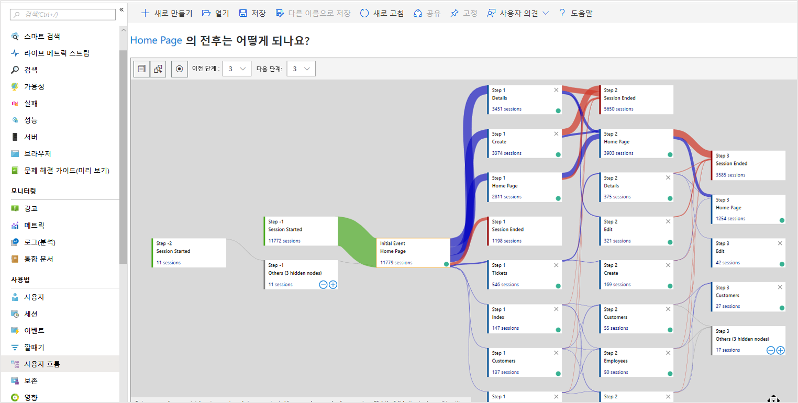

1.  모든 리소스는 이후 랩에서도 사용할 것이므로  그대로 남겨 두세요.


**결과**: 이 랩에서는 Azure Monitor를 사용하여 리소스를 모니터링하는 방법을 배웠습니다.

