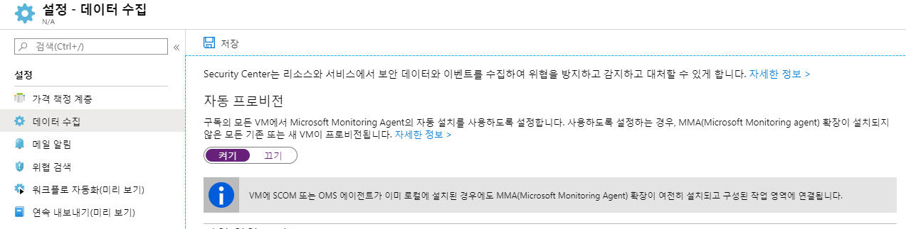
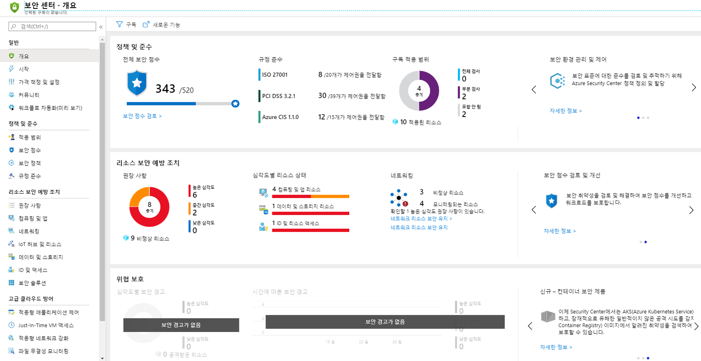
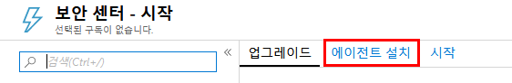
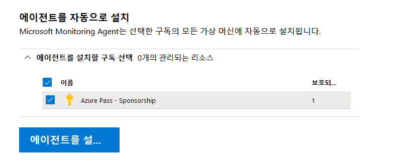
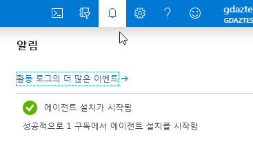
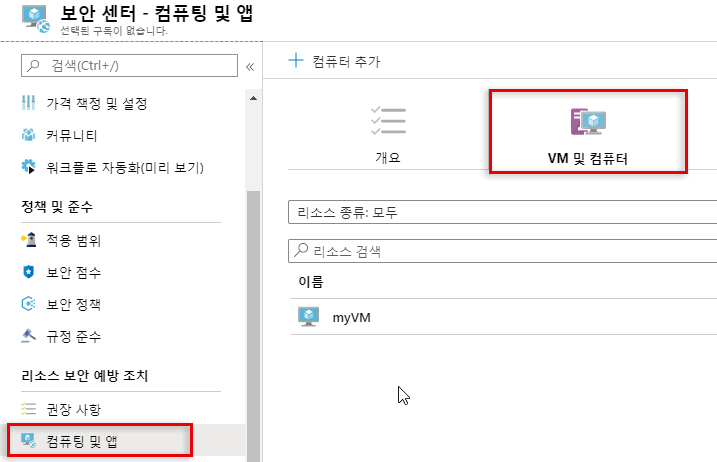
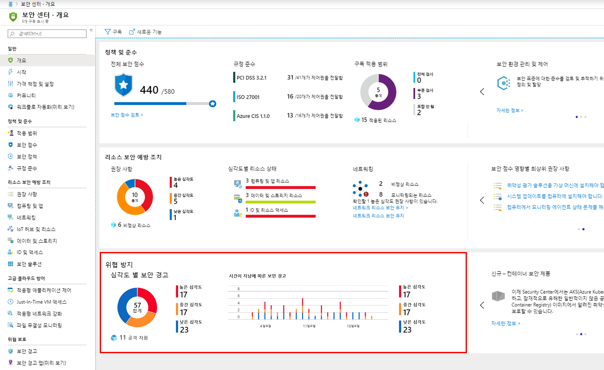
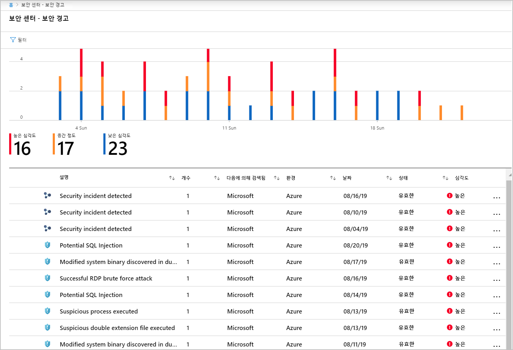
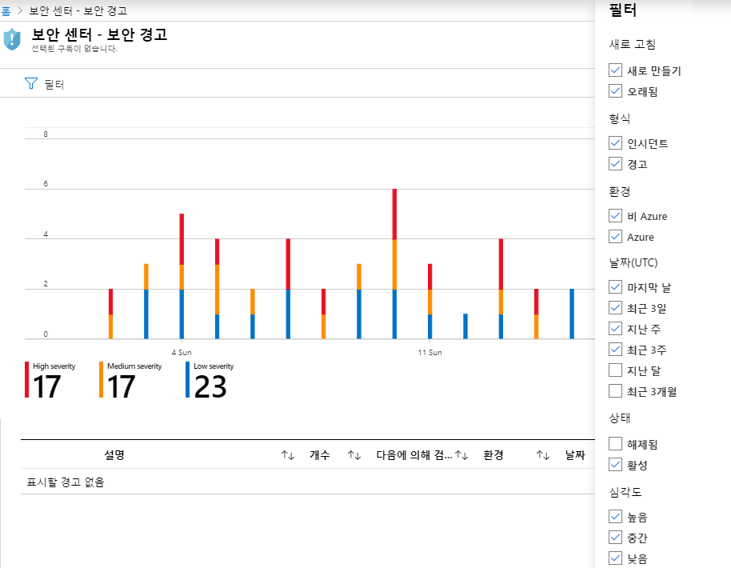
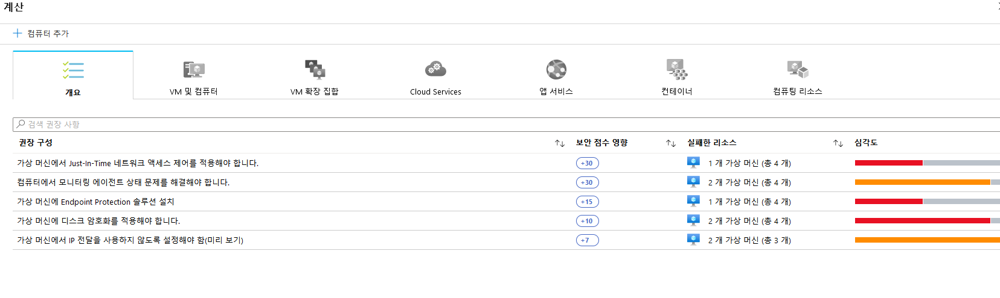

---
lab:
    title: '랩 2 - Security Center'
    module: '모듈 3: 보안 작업 관리'
---

# 모듈 3: 랩 2 - Security Center

Azure Security Center는 데이터 센터의 보안 상태를 강화하며 Azure 및 기타 클라우드의 하이브리드 워크로드와 온-프레미스 워크로드 전반에 걸쳐 Advanced Threat Protection 서비스를 제공하는 통합 인프라 보안 관리 시스템입니다.

리소스의 보안을 유지하려면 클라우드 공급자, Azure 및 고객이 모두 협력해야 합니다. 클라우드로 전환할 때도 워크로드를 안전하게 유지해야 하지만, IaaS(서비스 제공 인프라)로 전환하는 고객의 경우 PaaS(Platform as a Service ) 및 SaaS(Software as a Service)에서보다 워크로드의 보안을 더욱 철저하게 관리해야 합니다. Azure Security Center는 네트워크를 강화하고, 서비스를 보호하고, 보안 상태를 유지하는 데 필요한 도구를 제공합니다.

## 연습 1: Security Center Standard에 Azure 구독 온보딩

Azure Security Center에서는 하이브리드 클라우드 워크로드 전반에 적용되는 통합 보안을 관리 및 위협 방지 기능을 제공합니다. Free 계층에서는 Azure 리소스 전용으로 제한된 보안 기능만 제공하는 반면, Standard 계층에서는 온-프레미스 및 기타 클라우드에서도 사용할 수 있는 기능을 제공합니다. Security Center Standard를 사용하면 보안 취약성을 찾아서 수정할 수 있으며, 액세스 및 애플리케이션 제어를 적용하여 악의적인 활동을 차단할 수 있습니다. 또한 분석 및 인텔리전스를 사용하여 위협을 검색하고, 공격 시에 신속한 대응을 할 수 있습니다. 무료로 Security Center Standard 평가판을 사용해 볼 수 있습니다. 자세한 내용은 가격 책정 페이지를 참조하세요.

이 연습에서는 보안 강화를 위해 Standard 계층으로 업그레이드하고, 보안 취약성과 위협을 모니터링하기 위해 가상 머신에 Microsoft Monitoring Agent를 설치합니다.

### 태스크 1: 데이터 수집 자동화

Security Center는 Azure VM 및 Azure 외부 환경의 컴퓨터에서 데이터를 수집하여 보안 취약성과 위협을 모니터링합니다. 데이터를 수집하는 데 사용되는 Microsoft Monitoring Agent는 컴퓨터에서 여러 보안 관련 구성과 이벤트 로그를 읽고 분석을 위해 작업 영역에 데이터를 복사합니다. Security Center는 기본적으로 새 작업 공간을 자동으로 만듭니다.

자동 프로비저닝을 사용하도록 설정하면 Security Center에서는 지원되는 모든 Azure VM 및 새로 생성되는 VM에 Microsoft Monitoring Agent를 설치합니다. 자동 프로비저닝은 사용하도록 설정하는 것이 좋습니다.

Microsoft Monitoring Agent 자동 프로비저닝을 사용하도록 설정하려면 다음 단계를 수행합니다.

1.  Azure Portal의 허브 메뉴에서 **Security Center** 을 선택합니다.

     

1.  **시작** 블레이드에서 **업그레이드** 를 클릭합니다.

     
     
1.  Security Center 기본 메뉴에서 **가격 책정 및 설정** 을 선택합니다.

2.  구독 행에서 설정을 변경할 구독을 클릭합니다.
3.  **데이터 수집** 탭에서 **자동 프로비저닝** 을 **켜기** 로 설정합니다.
4.  변경 내용을 저장하지 **않고** 블레이드를 끝냅니다.

    **참고**: 다음 연습이 정상적으로 작동하도록 하려면 저장을 클릭하지 않아야 합니다.

 
     

 Security Center는 Azure VM과 관련하여 파악한 새 인사이트를 활용하여 시스템 업데이트 상태, OS 보안 구성, Endpoint Protection 관련 추가 권장 사항과 일반 추가 보안 경고를 제공할 수 있습니다.

## 연습 2: Security Center Standard에 Windows 컴퓨터 온보딩

Azure 구독을 온보딩한 후에는 Microsoft Monitoring Agent를 프로비전하여 온-프레미스, 기타 클라우드 등 Azure 외부에서 실행되는 리소스에 Security Center를 사용하도록 설정할 수 있습니다.

이 연습에서는 Windows 컴퓨터에 Microsoft Monitoring Agent를 설치하는 방법을 설명합니다.

### 태스크 1: 새 Windows 컴퓨터 추가

1.  Azure Portal에서 **Security Center** 를 선택합니다. **Security Center - 개요** 가 열립니다.

       

3.  Security Center 기본 메뉴에서 **시작** 을 선택합니다.
4.  **에이전트 설치** 탭을 선택합니다.

       

5.  아래쪽의 에이전트를 자동으로 설치 섹션으로 스크롤하여 **에이전트 설치** 를 클릭합니다.

     

1.  배포를 모니터링하여 에이전트가 설치될 때까지 기다립니다.

     
 
1.  **Security Center** 를 열고 **컴퓨팅 및 앱**, **VM 및 컴퓨터** 를 차례로 클릭합니다.

     
 
1.  가상 머신이 모니터링됩니다.

## 연습 3: Azure Security Center에서 경고 관리 및 응답

Security Center는 Azure 리소스, 네트워크 그리고 방화벽 및 Endpoint Protection 솔루션과 같은 연결된 파트너 솔루션을 통해 로그 데이터를 자동으로 수집, 분석 및 통합하여 실제 위협을 탐지하고 긍정 오류를 줄입니다. Security Center는 문제를 신속하게 조사하는 데 필요한 정보와 공격을 해결하는 방법에 대한 권장 사항과 함께 우선 순위가 지정된 보안 경고 목록을 표시합니다.

### 태스크 1: 경고 관리
 
1.  Security Center 대시보드에서 **위협 방지** 타일을 표시하여 경고의 개요를 확인합니다.

    **참고**: 타일에 **보안 경고가 없음** 이 표시되면 평가가 실행될 때까지 다소 기다려야 할 수 있습니다.

       

1.  경고 관련 추가 세부 정보를 확인하려면 타일을 클릭합니다.  아래 스크린샷에는 실제 환경에서 표시될 수 있는 경고가 나와 있습니다.

       

1.  표시되는 경고를 필터링하려면을 **필터** 를 클릭하고 **필터** 블레이드가 열리면 적용할 필터 옵션을 선택합니다. 그러면 선택한 필터에 따라 목록이 업데이트됩니다. 필터링은 매우 유용하게 활용할 수 있습니다. 시스템의 침해 가능성을 조사하여 지난 24시간 동안에 발생한 보안 경고를 해결하려는 경우를 예로 들 수 있습니다.

       

### 태스크 2: 권장 사항에 따른 대응

1.  Azure Security Center에서 **개요** 를 클릭합니다.

1.  **리소스 보안 예방 조치** 목록의 **심각도별 리소스 상태** 섹션에서 **컴퓨팅 및 앱 리소스** 를 선택합니다.

     

1.  권장 사항을 검토합니다.

       

| 경고: 계속하기 전에 이 랩에서 사용한 모든 리소스를 제거해야 합니다.  **Azure Portal** 에서 리소스를 제거하려면 **리소스 그룹** 을 클릭합니다.  랩에서 만든 리소스 그룹을 모두 선택합니다.  리소스 그룹 블레이드에서 **리소스 그룹 삭제** 를 클릭하고 리소스 그룹 이름을 입력한 다음 **삭제** 를 클릭합니다.  추가로 만든 리소스 그룹이 있으면 이 프로세스를 반복합니다. **리소스 그룹을 삭제하지 않으면 다른 랩에서 문제가 발생할 수 있습니다.** |
| --- |

**결과**: 이 랩이 완료되었으며, 시리즈의 다음 랩을 진행할 수 있습니다.

