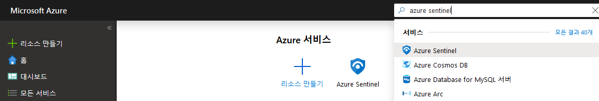
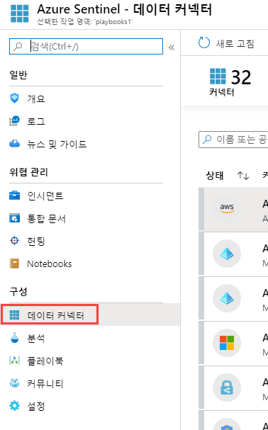
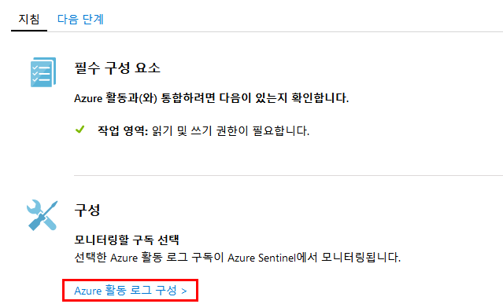
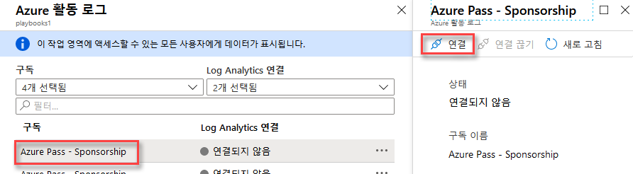

---
lab:
    title: '랩 4 - Azure Sentinel'
    module: '모듈 3: 보안 작업 관리'
---

# 모듈 3: 랩 4 - Azure Sentinel

Azure Sentinel에서는 기업 환경을 전체적으로 파악할 수 있습니다. 수십 년간 축적된 Microsoft 보안 환경의 클라우드 및 대규모 인텔리전스를 활용할 수 있습니다. 또한 AI(인공 지능)를 활용하여 더욱 스마트한 방식으로 빠르게 위협을 검색하고 대응할 수 있습니다.

## 연습 1: Azure Sentinel 등록

Azure Sentinel을 등록하려면 먼저 Azure Sentinel을 사용하도록 설정한 다음 데이터 원본을 연결해야 합니다. Azure Sentinel에 포함되어 있는 다양한 Microsoft 솔루션용 커넥터는 즉시 사용 가능하며 Microsoft Threat Protection 솔루션, Office 365를 비롯한 Microsoft 365 원본, Azure AD, Azure ATP, Microsoft Cloud App Security 등의 솔루션과 실시간으로 통합도 가능합니다. 그리고 더욱 광범위한 보안 에코시스템을 구축하기 위한 타사 솔루션용 기본 제공 커넥터도 포함되어 있습니다. 일반 이벤트 형식, Syslog 또는 REST API를 사용하여 데이터 원본을 Azure Sentinel과 연결할 수 있습니다.  

데이터 원본을 연결한 후에는 데이텅에 따라 인사이트를 표시하는 전문적으로 작성된 통합 문서 갤러리 중에서 적합한 항목을 선택할 수 있습니다. 이러한 통합 문서는 필요에 따라 쉽게 사용자 지정할 수 있습니다.

### 태스크 1: Azure Sentinel 사용

1.  Azure Portal에서 Azure Sentinel을 검색합니다. 

       

1.  **+추가** 를 클릭합니다.
1.  필요한 경우 미국 동부 지역을 사용하여 새 리소스 그룹에 새 작업 영역을 만듭니다.

    **참고**:   - Azure Security Center에서 만든 기본 작업 영역은 목록에 표시되지 않으므로 이 작업 영역에는 Azure Sentinel을 설치할 수 없습니다.   - 중국, 독일 및 Azure Government 지역을 제외한 Log Analytics의 모든 GA 지역 내 작업 영역에서 Azure Sentinel을 실행할 수 있습니다. Azure Sentinel에서 생성하는 데이터(예: 작업 영역에서 제공하는 일부 고객 데이터를 포함할 수 있는 경고 규칙, 책갈피, 인시던트)는 유럽에 있는 작업 영역의 경우 서유럽에 저장되고, 모든 미국 내 작업 영역 및 유럽 이외 지역에 있는 작업 영역의 경우 미국 동부에 저장됩니다.

6.  **Azure Sentinel 추가** 를 클릭합니다.
  

### 태스크 3: 데이터 원본 연결

Azure Sentinel은 서비스에 연결하고 이벤트 및 로그를 Azure Sentinel로 전달하여 서비스 및 앱에 대한 연결을 만듭니다. 컴퓨터 및 가상 컴퓨터의 경우 로그를 수집하고 이를 Azure Sentinel로 전달하는 Azure Sentinel 에이전트를 설치할 수 있습니다. 방화벽 및 프록시의 경우 Azure Sentinel은 Linux Syslog 서버를 활용합니다. 에이전트가 설치되면 에이전트가 로그 파일을 수집하고 이를 Azure Sentinel로 전달합니다. 

1.  Azure Portal에서 모든 리소스를 선택하고 이전 태스크에서 만든 Log Analytics 작업 영역을 선택합니다.

1.  메뉴에서 **데이터 커넥터** 를 선택합니다. 이 페이지에서는 Azure Sentinel이 제공하는 커넥터의 전체 목록과 해당 상태를 확인할 수 있습니다. 연결하려는 커넥터를 선택하고 **커넥터 페이지 열기** 를 선택합니다. 

       

1.  **Azure 활동** 을 선택하고 **커넥터 페이지 열기** 를 클릭합니다.

1.  **Azure 활동 로그 구성** 을 선택합니다.

     

1.  특정 커넥터 페이지에서 모든 필수 구성 요소를 충족했는지 확인하고 지침에 따라 Azure Sentinel에 데이터를 연결합니다. 로그가 Azure Sentinel과 동기화되기 시작할 때까지는 시간이 다소 걸릴 수 있습니다. 데이터를 연결하고 나면 **데이터 수신됨** 그래프에 데이터 요약이 표시되며 데이터 형식의 연결 상태도 표시됩니다.

   

1.  Azure 구독을 선택하고 **연결** 을 클릭합니다.

     
 

**결과**: 이 랩이 완료되었습니다.
