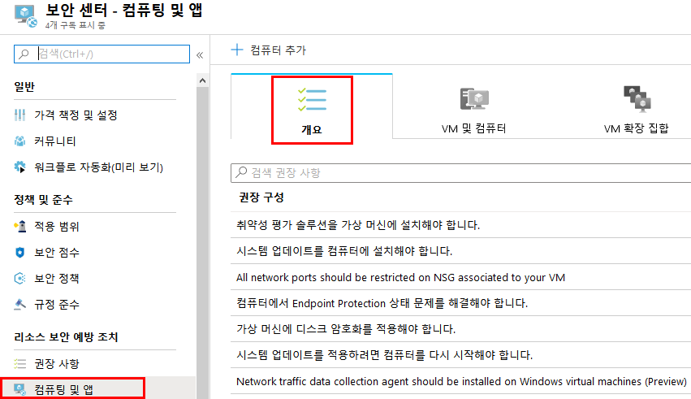
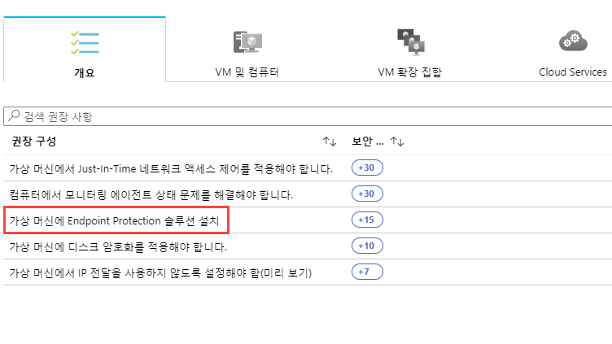
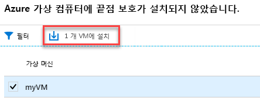

---
lab:
    title: '랩 5 - Azure Security Center를 사용하여 Endpoint Protection 문제 관리'
    module: '모듈 3: 보안 작업 관리'
---

# 모듈 3: 랩 5 - Azure Security Center를 사용하여 Endpoint Protection 문제 관리

Azure Security Center는 맬웨어 방지 보호 상태를 모니터링하여 Endpoint Protection 문제 블레이드에서 보고합니다. Security Center는 가상 컴퓨터(VM)와 컴퓨터가 맬웨어 방지 위협에 취약하도록 만들 수 있는 감지된 위협 및 불충분한 보호와 같은 문제를 강조 표시합니다. **Endpoint Protection 문제**의 정보를 사용하여 식별된 모든 문제를 해결할 계획을 파악할 수 있습니다.

Security Center는 다음과 같은 Endpoint Protection 문제를 보고합니다.

- Endpoint Protection이 Azure VM에 설치되지 않음 - 해당 Azure VM에 지원되는 맬웨어 방지 솔루션이 설치되어 있지 않습니다.
- Endpoint Protection이 비 Azure 컴퓨터 설치되지 않음 - Azure가 아닌 해당 컴퓨터에 지원되는 맬웨어 방지 솔루션이 설치되어 있지 않습니다.
- Endpoint Protection 상태:

  - 오래된 서명 - 이러한 VM 및 컴퓨터에 맬웨어 방지 솔루션이 설치되어 있지만 해당 솔루션에 최신 맬웨어 방지 서명이 없습니다.
  - 실시간 보호 없음 - 이러한 VM 및 컴퓨터에 맬웨어 방지 솔루션이 설치되어 있지만 실시간 보호가 구성되지 않았습니다. 
  - 보고하지 않음 - 맬웨어 방지 솔루션이 설치되어 있지만 데이터를 보고하지 않습니다.
  - 알 수 없음 - 맬웨어 방지 솔루션이 설치되어 있지만 상태를 알 수 없거나 알 수 없는 오류를 보고합니다.

## 연습 1: 권장 사항 구현

Endpoint Protection 문제는 Security Center에서 권장 사항으로 표시됩니다.  사용자 환경이 맬웨어 방지 위협에 취약한 경우 이 권장 사항이 **권장 사항** 및 **컴퓨팅** 아래에 표시됩니다. **Endpoint Protection 문제 대시보드**를 보려면 컴퓨팅 워크플로를 진행해야 합니다.

이 연습에서는 **컴퓨팅**을 사용합니다.  Azure VM과 기타 컴퓨터에서 맬웨어 방지 프로그램을 설치하는 방법을 각각 살펴보겠습니다.

### 태스크 1: Azure VM에 맬웨어 방지 프로그램 설치

1.  Security Center 기본 메뉴 또는 **개요**에서 **컴퓨팅 및 앱**을 선택합니다.

       

2.  **컴퓨팅**에서 **가상 머신에 Endpoint Protection 솔루션 설치**를 선택합니다. **Endpoint Protection 문제** 대시보드가 열립니다.

       

1.  **Endpoint Protection이 Azure VM에 설치되지 않음** 블레이드에서 **1개 VM에 설치**를 클릭합니다.

     

5.  **Endpoint Protection 선택**에서 사용할 Endpoint Protection 솔루션을 선택합니다. 이 예제에서는 **Microsoft Antimalware**를 선택합니다.

6.  Endpoint Protection 솔루션 관련 추가 정보가 표시됩니다. **확인**을 선택합니다.

**결과**: 이 랩이 완료되었습니다.
