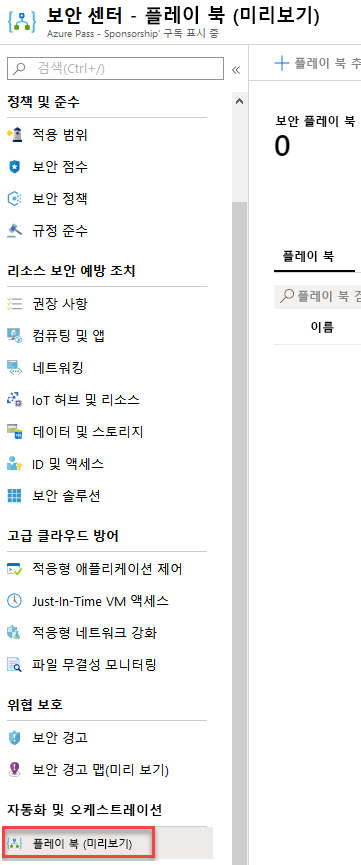
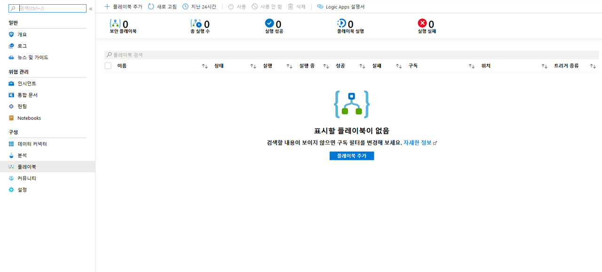
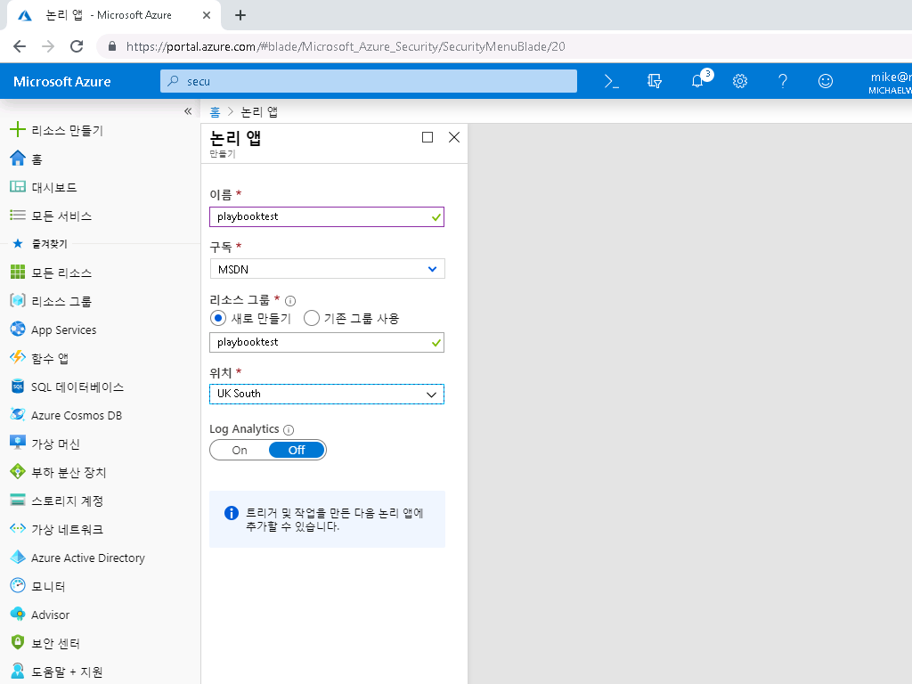
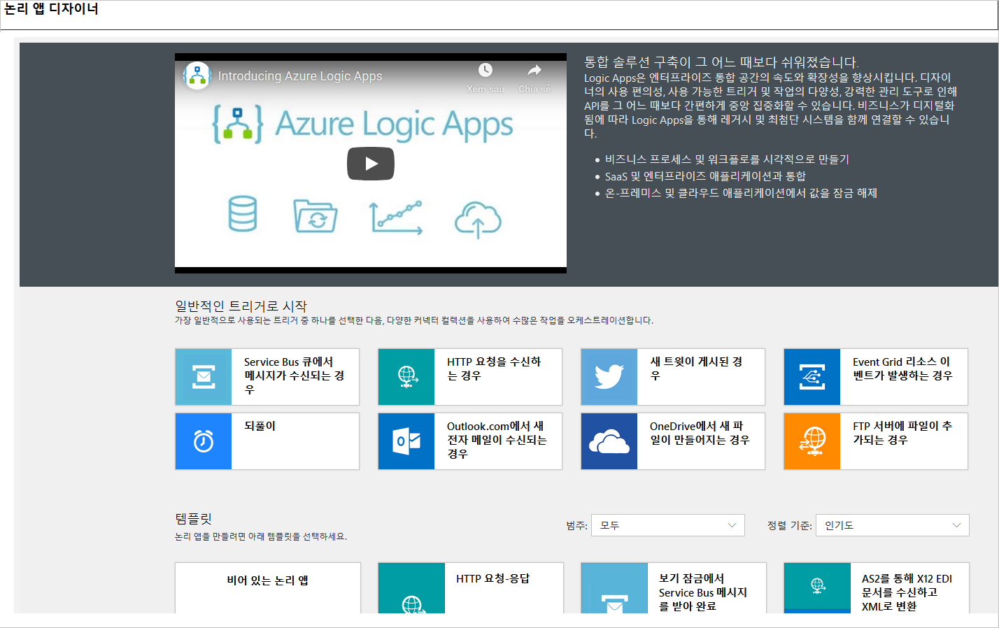
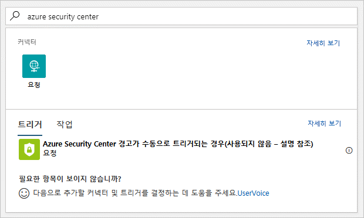
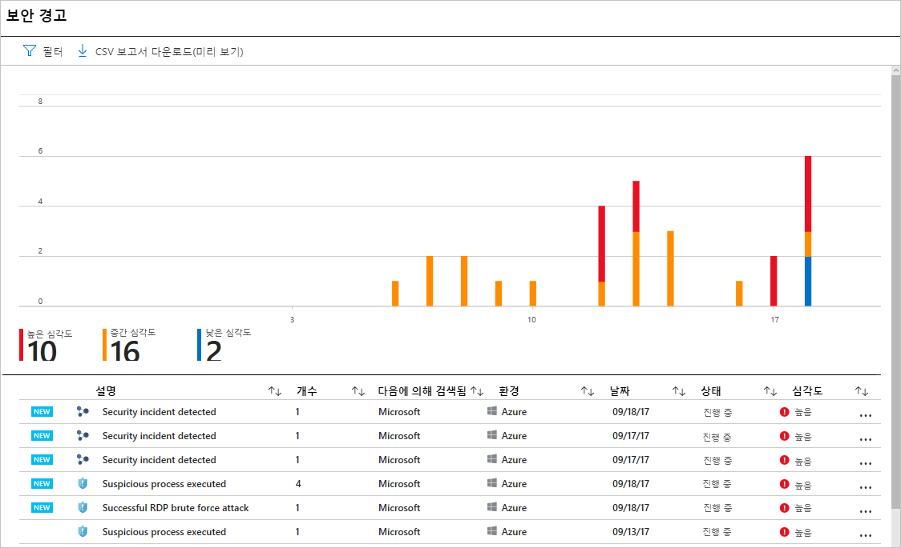
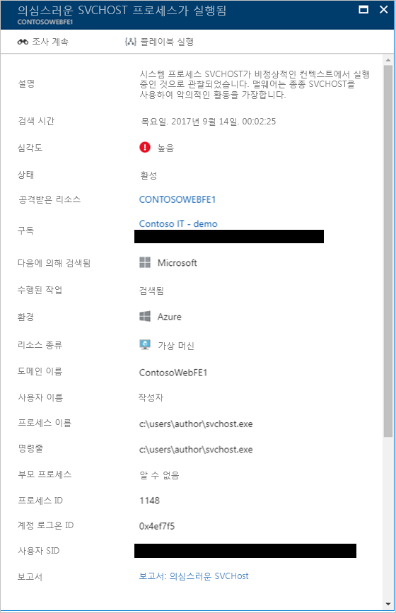
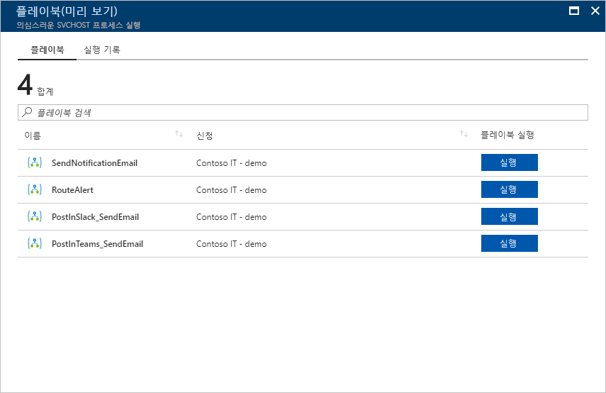
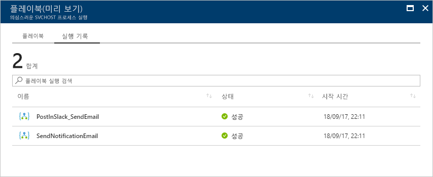

---
lab:
    title: '랩 6 - Azure Security Center의 보안 플레이북'
    module: '모듈 3: 보안 작업 관리'
---

# 모듈 3: 랩 6 - Azure Security Center의 보안 플레이북

보안 플레이북은 선택한 경고에서 특정 플레이북이 트리거되고 나면 Security Center에서 실행할 수 있는 절차 모음입니다. 보안 플레이북을 사용하면 Security Center에서 검색된 특정 보안 경고에 대한 응답을 자동화하고 오케스트레이션할 수 있습니다. Security Center의 보안 플레이북은 Azure Logic Apps를 기반으로 합니다. 따라서 Logic Apps 템플릿의 보안 범주에서 제공되는 템플릿을 사용할 수 있습니다. 이러한 템플릿은 필요에 따라 수정할 수도 있고, Azure Logic Apps 워크플로를 사용하여 Security Center를 트리거로 사용해 새 플레이북을 만들 수도 있습니다.

## 연습 1: Azure에서 보안 플레이북 만들기 및 관리

### 태스크 1: Security Center에서 보안 플레이북 만들기

Security Center에서 새 보안 플레이북을 만들려면 다음 단계를 수행합니다.

1.  **Security Center** 대시보드를 엽니다.

Security Center 옵션이 회색으로 표시되면 시작 창을 클릭하고 **평가판 시작**을 클릭합니다.

2.  왼쪽 창의 **자동화 및 오케스트레이션** 섹션에서 **플레이북(미리 보기)**를 클릭합니다.

       

	

3.  **Security Center - 플레이북(미리 보기)** 페이지에서 **플레이북 추가** 단추를 클릭합니다.

     

 

4.  **논리 앱 만들기** 페이지에서 고유한 이름을 입력하여 새 논리 앱을 만들고 **만들기** 단추를 클릭합니다. **고유한 이름으로 새 리소스 그룹을 만듭니다**. 작성이 완료되면 새 플레이북이 목록에 표시됩니다. 목록에 새 플레이북이 표시되지 않으면 **새로 고침** 단추를 클릭합니다. 새 플레이북이 표시되면 클릭하여 플레이북 편집을 시작합니다.

      
    
5.  **Logic App Designer**가 표시됩니다. **비어 있는 논리 앱**을 클릭하여 새 플레이북을 만듭니다. 범주 아래에서 **보안**을 선택하고 템플릿 중 하나를 사용할 수도 있습니다.

    

6.  **모든 커넥터 및 트리거 검색** 필드에 *Azure Security Center*를 입력하고 **Azure Security Center 경고에 대한 응답이 트리거되는 경우**를 선택합니다.

    

7.  이제 플레이북을 트리거하면 수행되는 작업을 정의할 수 있습니다. 작업, 논리 조건, Switch Case 조건 또는 루프를 추가할 수 있습니다. **새 단계**를 클릭하여 보안 경고 생성 시에 수행될 수 있는 작업 목록을 찾아봅니다. 경고에서 사용자 지정 작업 및 코드를 트리거할 수도 있습니다.

8.  트리거 작업 유무에 관계없이 플레이북을 저장하려면 저장을 클릭합니다.

### 태스크 2: Security Center에서 보안 플레이북 실행

경고 응답을 오케스트레이션하거나, 다른 서비스에서 자세한 내용을 확인하거나, 경고를 수정하려는 경우 Security Center에서 보안 플레이북을 실행할 수 있습니다. 플레이북에 액세스거하려면 다음 단계를 수행합니다.

1.  **Security Center** 대시보드를 엽니다.

2.  왼쪽 창의 **위협 방지**에서 **보안 경고**를 클릭합니다.

    

3.  조사하려는 경고를 클릭합니다.

**참고**: 랩 환경에서는 보안 경고가 발생하지 않을 수도 있습니다. 이 경우에는 스크린샷을 참조하여 경고 미리 보기를 확인할 수 있습니다.

4.  경고 페이지 위쪽에서 **플레이북 실행** 단추를 클릭합니다.

    
    
5.  플레이북 페이지에서 실행할 플레이북을 선택하고 **실행** 단추를 클릭합니다. 트리거 전에 플레이북을 확인하려는 경우 플레이북을 클릭하면 디자이너가 열립니다.

    

### 태스크 3: 기록

플레이북을 실행한 후에는 이전 실행 정보와 단계에 액세스할 수도 있습니다. 이러한 기록에는 이전에 실행한 플레이북의 상태와 관련된 자세한 정보가 포함되어 있습니다. 기록은 경고가 발생한 상황별로 생성됩니다. 즉, 이 페이지에 표시되는 플레이북 기록과 이 플레이북을 트리거한 경고 간에는 상관 관계가 지정되어 있습니다.

   

1.  특정 플레이북 실행 관련 추가 세부 정보를 확인하려면 플레이북 자체를 클릭합니다. 그러면 전체 워크플로와 함께 논리 앱 실행 페이지가 표시됩니다.

     

2.  이 워크플로에서 각 태스크가 실행되는 데 걸린 시간을 확인할 수 있으며, 각 태스크를 확장하여 결과를 확인할 수 있습니다.

**참고**: Azure Logic Apps를 사용하여 플레이북을 직접 만드는 방법과 관련된 자세한 내용은 [클라우드 앱과 클라우드 서비스 간의 프로세스를 자동화하는 첫 번째 논리 앱 워크플로 만들기](https://docs.microsoft.com/azure/logic-apps/logic-apps-create-a-logic-app)를 참조하세요.

**결과**: 이 랩에서는 Azure Security Center에서 플레이북을 사용하는 방법을 배웠습니다.

