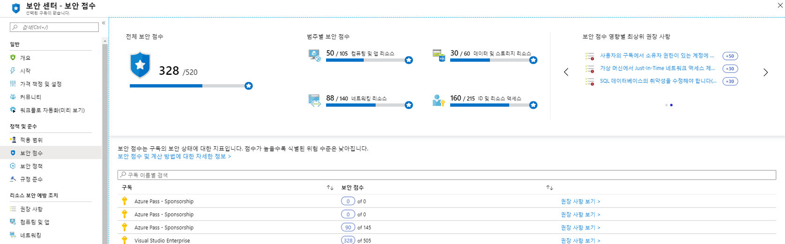
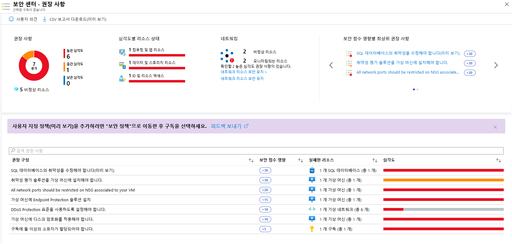

---
lab:
    title: '랩 7 - Azure Security Center의 Secure Score'
    module: '모듈 3: 보안 작업 관리'
---

# 모듈 3: 랩 7 - Azure Security Center의 Secure Score

보안 이점을 제공하는 서비스가 너무 많기 때문에 워크로드를 보호하고 강화하기 위해 먼저 수행해야 하는 단계를 파악하기가 어려운 경우가 많습니다. Azure Secure Score는 보안 권장 사항을 검토하여 우선 순위를 지정하므로 먼저 수행해야 하는 권장 사항을 파악할 수 있습니다. 그러므로 가장 심각한 보안 취약성을 확인해 조사 우선 순위를 지정할 수 있습니다. Secure Score는 워크로드 보안 상태를 평가하는 데 사용할 수 있는 도구입니다.

**Secure Score 계산**

Security Center는 보안 분석가의 작업 방식과 비슷하게 보안 권장 사항을 검토하고 고급 알고리즘을 적용해 각 권장 사항의 중요도를 결정합니다.
Azure Security Center는 활성 권장 사항을 지속적으로 검토한 다음 이 권장 사항을 기준으로 보안 점수를 계산합니다. 권장 사항의 점수는 워크로드 보안에 가장 큰 영향을 주는 보안 모범 사례와 심각도를 토대로 결정됩니다.

Security Center는 **전체 보안 점수**도 제공합니다. 

**전체 보안 점수**는 모든 권장 사항 점수의 총합입니다. 선택한 항목에 따라 모든 구독 또는 관리 그룹의 전체 보안 점수를 볼 수 있습니다. 점수는 선택한 구독 및 해당 구독에 현재 적용되는 권장 사항에 따라 달라집니다.

 
## 연습 1: Azure Security Center의 보안 점수 개선

### 태스크 1: Azure Portal에서 보안 점수를 확인합니다.

1.  Azure 대시보드에서 **Security Center**, **Secure Score**를 차례로 클릭합니다.
2.  화면 위쪽에 주요 보안 점수가 표시됩니다.

       - **전체 보안 점수**는 정책/선택한 구독별 점수를 나타냅니다.
       - **범주별 보안 점수**에는 보안 상태를 최우선으로 확인해야 하는 리소스가 표시됩니다.
       - **보안 점수 영향별 주요 권장 사항**에서는 구현하는 경우 보안 점수가 가장 많이 높아지는 권장 사항 목록이 제공됩니다.

 
       

    
      **참고**: 각 구독의 보안 점수 합계가 전체 보안 점수와 같지는 않습니다. 보안 점수는 구독 전체의 보안 점수를 합한 값이 아니라 권장 사항당 총 리소스와 정상 리소스 간의 비율을 기준으로 계산된 값입니다. 

3.  보안 점수를 개선하기 위해 수정할 수 있는 구독 관련 권장 사항을 확인하려면 **권장 사항 보기**를 클릭합니다.
4.  권장 사항 목록에서 각 권장 사항에는 **보안 점수 영향**을 나타내는 열이 있습니다. 이 숫자는 권장 사항을 따를 경우 전체 보안 점수가 얼마나 향상되는지를 나타냅니다. 예를 들어 아래 화면에서 **컨테이너 보안 구성의 취약성을 수정**하면 보안 점수가 35점 높아집니다.

       

### 태스크 2: 개별 보안 점수 확인

개별 보안 점수를 확인하려는 경우 개별 권장 사항 블레이드 내에서 점수를 찾을 수 있습니다.  

**권장 사항 보안 점수**는 총 리소스 수와 정상 리소스 간의 비율을 기준으로 계산된 값입니다. 정상 리소스 수가 총 리소스 수와 같으면 권장 사항의 최대 보안 점수인 50점이 지정됩니다. 보안 점수를 최대한 높이려면 권장 사항에 따라 비정상 리소스를 수정합니다.

**권장 사항 영향**에서는 권장 사항 단계를 적용하는 경우 높일 수 있는 보안 점수를 확인할 수 있습니다. 예를 들어 보안 점수가 42인데 **권장 사항 영향**이 +3인 경우 권장 사항에 나와 있는 단계를 수행하면 점수가 45점으로 높아집니다.

1.  보안 점수 블레이드에서 권장 사항을 클릭합니다.

    권장 사항에는 수정 단계를 수행하지 않으면 워크로드가 영향을 받게 되는 위협이 표시됩니다.

     

**결과**: 이 랩에서는 Azure Security Center에서 보안 점수를 높이는 방법을 배웠습니다.
