---
lab:
    title: '랩 8 - 보안 기준 작성'
    module: '모듈 3: 보안 작업 관리'
---

# 모듈 3: 랩 8 - 보안 기준 작성 

Azure는 고객 책임 영역 내에서는 보안 인시던트를 모니터링하거나 인시던트에 대응하지 않습니다. 하지만 이러한 용도로 사용되는 Azure Security Center, Azure Sentinel 등의 다양한 도구는 제공합니다. 또한 기본적으로 모든 서비스를 최대한 안전하게 만들려는 노력도 하고 있습니다. 즉, 모든 서비스에는 이미 대부분의 일반적인 사용 사례에 대한 보안을 제공하도록 설계된 기준이 마련되어 있습니다. 그러나 Azure에서는 서비스 사용 방식을 예측할 수 없으므로, 항상 이러한 보안 제어 사항을 검토하여 해당 사항이 위험을 적절하게 완화하는지 여부를 평가해야 합니다.

이 랩에서는 Azure 서비스의 보안 기준을 설명합니다. 각 단원에서는 아키텍처에 사용 중인 서비스의 보안 확인을 위한 기준이 포함된 검사 목록을 제공합니다.

이 랩에서는 다음 작업을 수행합니다.

- Azure 플랫폼 보안 기준 및 보안 기준이 작성된 방식 알아보기
- 가장 흔히 사용되는 Azure 서비스용 보안 기준 작성 및 유효성 검사

 
## 연습 1: IAM(ID 및 액세스 관리) 기준 만들기

기업 자산의 보안을 강화하고 액세스 권한을 부여하는 과정에서는 ID 관리 작업이 매우 중요합니다. 클라우드 기반 자산을 보호하고 제어하려면 Azure 관리자, 애플리케이션 개발자 및 애플리케이션 사용자의 ID와 액세스를 관리해야 합니다.

**IAM 관련 권장 사항**

ID 및 액세스 관리를 위한 권장 사항은 다음과 같습니다. 각 권장 사항에는 Azure Portal에서 수행해야 하는 기본 단계가 포함되어 있습니다. 

### 태스크 1: Azure AD 관리자 포털에 대한 액세스 제한

관리자가 아닌 모든 사용자에게는 최소 권한 규칙에 따라 중요한 데이터가 포함된 관리자 포털 액세스 권한을 제공해서는 안 됩니다.

1.  Azure Portal에 로그인합니다.

2.  왼쪽에서 **Azure Active Directory** > **사용자**를 선택합니다.

3.  **사용자 설정**으로 이동합니다.

4.  Azure AD 관리자 포털에 대한 액세스 제한이 예로 설정되어 있는지 확인합니다. 이 값을 예로 설정하면 관리자가 아닌 모든 사용자가 관리 포털에서 Azure AD 데이터에 액세스할 수 없게 됩니다. 하지만 Visual Studio 등의 기타 클라이언트나 PowerShell을 사용한 Azure AD 데이터 액세스는 제한되지 않습니다.

       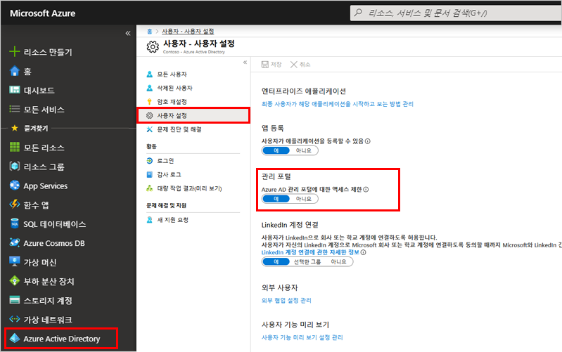

1.  **저장**을 클릭합니다.

### 태스크 2: Azure MFA(Multi-Factor Authentication)를 사용하도록 설정

권한이 있는 사용자와 없는 사용자에 대해 MFA를 사용하도록 설정합니다.

1.  Azure Portal에 로그인합니다.

2.  왼쪽에서 **Azure Active Directory** > **사용자**를 선택합니다.

3.  **+ 새 사용자**를 클릭합니다.

1.  새 사용자 블레이드에서 다음 세부 정보를 입력하고 만들기를 클릭합니다.

      - **사용자 이름**: Abbi
      - **이름**: Abbi Skinner
      - **이름**: Abbi 
      - **성**: Skinner
      - **역할**: 전역 관리자 선택

2.  왼쪽에서 **Azure Active Directory** > **사용자** > **모든 사용자**를 선택합니다.

3.  Multi-Factor Authentication을 선택합니다. 새 창이 열립니다.

4.  Abbi Skinner를 선택하고 **사용**을 클릭합니다.

       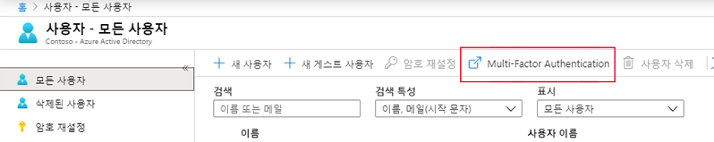

1.  **Multi-Factor Auth사용**을 선택하고 **닫기**를 클릭합니다.

     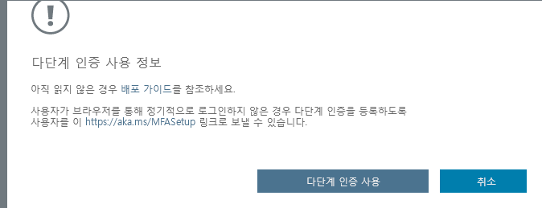
 
1.  이제 Abbi에 대해 MFA가 사용하도록 설정되었습니다.

### 태스크 3: 신뢰할 수 있는 디바이스에서 MFA 저장 차단 

사용자가 신뢰하는 디바이스와 브라우저에 사용할 수 있는 Multi-Factor Authentication 저장 기능은 모든 Multi-Factor Authentication 사용자용으로 제공되는 무료 기능입니다. 사용자는 Multi-Factor Authentication을 사용하여 디바이스에 정상적으로 로그인하고 나면 지정된 기간(일) 동안은 후속 확인을 바이패스할 수 있습니다. 하지만 계정 또는 디바이스가 손상되는 경우에는 신뢰할 수 있는 디바이스에 Multi-Factor Authentication이 저장되어 있으면 보안 수준이 낮아질 수 있습니다.

1.  Azure Portal에 로그인합니다.

2.  왼쪽에서 **Azure Active Directory** > **사용자** > **모든 사용자**를 선택합니다.

3.  Multi-Factor Authentication을 선택합니다.

4.  **Abbi Skinner**를 선택하고 **사용자 설정 관리**를 클릭합니다.

5.  **모든 저장된 디바이스에서 다단계 인증 복원**이 선택되어 있는지 확인하고 **저장**을 클릭합니다.

       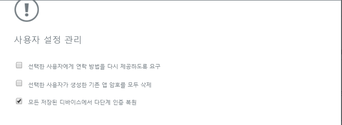

### 태스크 4: 게스트 정보 파악 

이 태스크에서는 게스트 사용자가 없는지 확인하거나, 업무상 게스트 사용자를 사용해야 하는 경우에는 게스트의 권한을 제한합니다.

1.  Azure Portal에 로그인합니다.

2.  왼쪽에서 **Azure Active Directory** > **사용자** > **모든 사용자**를 선택합니다.

3.  표시 드롭다운을 선택하고 **게스트 사용자만**을 선택합니다.

4.  목록에 게스트 사용자(USER TYPE=Guest)가 없는지 확인합니다.

       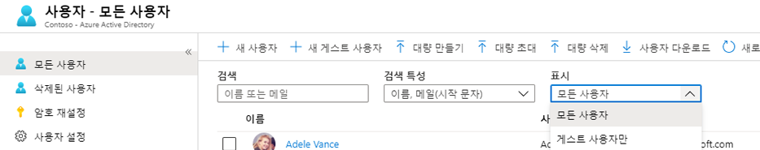

### 태스크 5: 암호 옵션

이중 확인을 설정하면 공격자는 두 가지 ID 형식을 모두 알아내야 사용자 암호를 악의적으로 다시 설정할 수 있습니다.

1.  Azure Portal에 로그인합니다.

2.  왼쪽에서 **Azure Active Directory** > **사용자**를 선택합니다.

3.  **암호 재설정**을 선택합니다

4.  인증 방법으로 이동합니다.

5.  재설정에 필요한 방법 수를 2로 설정합니다.

1.  방법 두 가지를 선택하고 **저장**을 클릭합니다.
    

### 태스크 6: 사용자 인증 방법 다시 확인 간격 설정 

인증 다시 확인을 사용 안 함으로 설정하면 등록된 사용자에게 인증 정보를 다시 확인하라는 메시지가 표시되지 않습니다.

1.  Azure Portal에 로그인합니다.

2.  왼쪽에서 **Azure Active Directory** > **사용자**를 선택합니다.

3.  **암호 재설정**으로 이동합니다.

4.  **등록**으로 이동합니다.

5.  사용자에게 해당 인증 정보를 다시 확인하도록 요청하기까지의 기간이 0으로 설정되어 있지 않은지 확인합니다. 기본값은 180일입니다.

       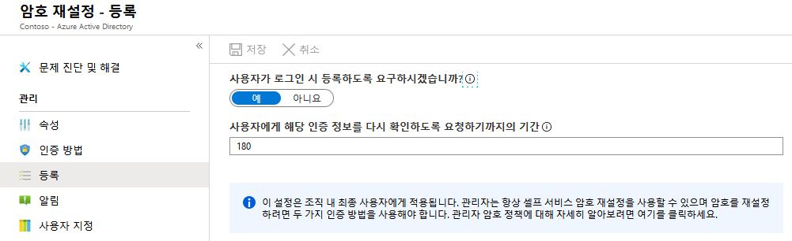

### 태스크 7: 구성원 및 게스트 초대 가능 

아니요로 설정해야 합니다. 관리자를 통한 초대를 제한하면 권한이 부여된 계정만 Azure 리소스에 액세스할 수 있게 됩니다.

1.  Azure Portal에 로그인합니다.

2.  왼쪽에서 **Azure Active Directory** > **사용자**를 선택합니다.

3.  **사용자 설정**으로 이동합니다.

4.  외부 사용자로 이동하여 **외부 공동 작업 설정 관리**를 클릭합니다.

5.  구성원이 초대할 수 있음이 **아니요**로 설정되어 있는지 확인합니다.

       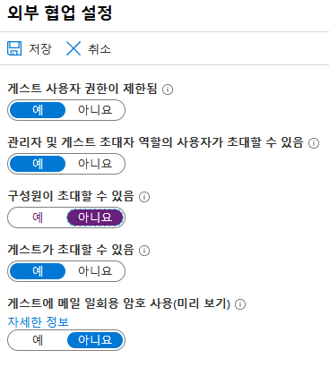

### 태스크 8: 사용자가 보안 그룹을 만들고 관리 

이 기능을 사용하도록 설정하면 AAD의 모든 사용자가 새 보안 그룹을 만들 수 있습니다. 보안 그룹 생성은 관리자로 제한되어야 합니다.

1.  Azure Portal에 로그인합니다.

2.  왼쪽에서 **Azure Active Directory** > **그룹**을 선택합니다.

3.  **설정** 섹션의 일반으로 이동합니다.

4.  사용자가 보안 그룹을 만들 수 있음이 **아니요**로 설정되어 있는지 확인합니다.

       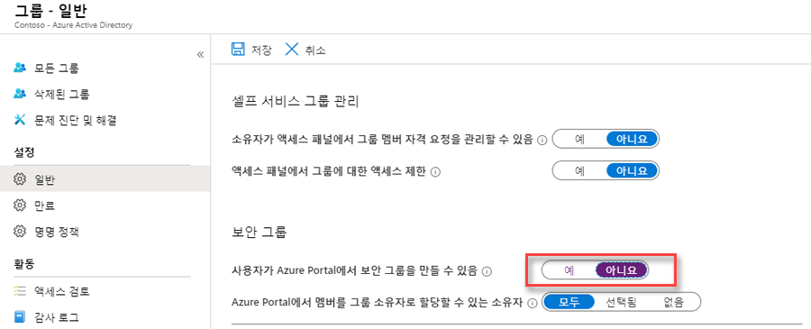

### 태스크 9: 셀프 서비스 그룹 관리 사용 

이 기능은 업무상 여러 사용자에게 위임해야 할 때까지는 사용하지 않도록 설정해 두는 것이 좋습니다.

1.  Azure Portal에 로그인합니다.

2.  왼쪽에서 **Azure Active Directory** > **그룹**을 선택합니다.

3.  **설정** 섹션의 일반으로 이동합니다.

4.  셀프 서비스 그룹 관리 사용이 **아니요**로 설정되어 있는지 확인합니다.

       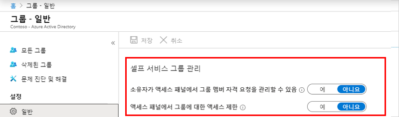

### 태스크 10: 애플리케이션 옵션 - 사용자가 앱을 등록할 수 있음

사용자 지정 애플리케이션은 관리자가 등록해야 합니다.

1.  Azure Portal에 로그인합니다.

2.  왼쪽에서 **Azure Active Directory** > **사용자**를 선택합니다.

3.  사용자 설정으로 이동합니다.

4.  사용자가 애플리케이션을 등록할 수 있음이 **아니요**로 설정되어 있는지 확인하고 **저장**을 클릭합니다.

       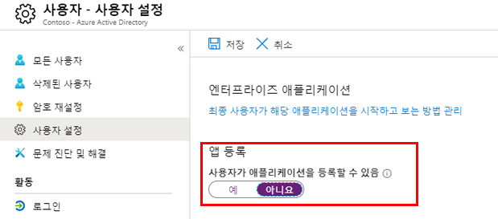

## 연습 2: Azure Security Center 기준 만들기

ASC(Azure Security Center)에서는 Azure, 온-프레미스 및 기타 클라우드에서 실행되는 워크로드에 대한 통합 보안 관리 및 고급 위협 보호 기능을 제공합니다. 다음은 Azure 구독에 대한 다양한 보안 정책을 설정하는 Security Center 권장 사항입니다.

이러한 정책은 Azure 구독의 리소스에 권장되는 컨트롤 집합을 정의합니다.

### 태스크 1: 시스템 업데이트 사용 

Azure Security Center에서는 매일 Windows 및 Linux VM(가상 머신)에 누락된 운영 체제 업데이트가 있는지 모니터링합니다. Security Center는 Windows 컴퓨터에서 구성된 서비스에 따라 Windows 업데이트 또는 WSUS(Windows Server Update Services)에서 사용 가능한 보안 및 중요 업데이트 목록을 검색합니다. Security Center는 Linux 시스템의 최신 업데이트도 확인합니다. VM 또는 컴퓨터에 시스템 업데이트가 누락된 경우 Security Center에서는 시스템 업데이트를 권장합니다.

1.  Azure Portal에 로그인합니다.

2.  **Security Center** 기본 메뉴에서 **보안 정책**을 선택합니다.

3.  **정책 관리** 화면이 표시됩니다.

4.  표시된 목록에서 사용자의 구독을 선택합니다.

5.  정책에 **시스템 업데이트를 컴퓨터에 설치해야 합니다.**가 포함되어 있는지 확인합니다.

6.  Azure Security Center에서 모니터링 사용 링크를 클릭합니다. 이 항목은 GUID와 함께 Azure 기본값으로 표시될 수도 있습니다.

       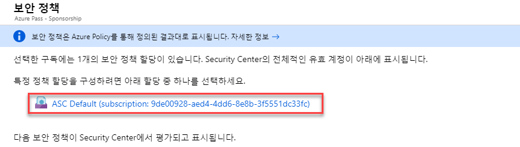

7.  이 예제에서 ASC 에이전트가 VM 또는 물리적 컴퓨터에 배포되지 않았으므로 AuditIfNotExists 메시지가 표시됩니다. AuditIfNotExists이 표시되면 if 조건과 일치하는 리소스를 감사할 수 있습니다. 리소스가 배포되지 않은 경우에는 NotExists 가 표시됩니다.

       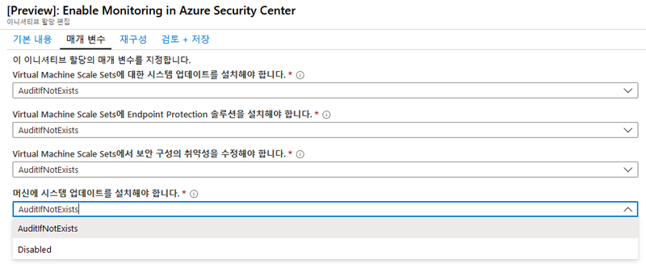

    리소스가 사용하도록 설정된 경우 Audit이 표시되고, 배포되었지만 사용하지 않도록 설정된 경우에는 Disabled가 표시됩니다.

       

### 태스크 2: 보안 구성 사용

Azure Security Center는 방화벽, 감사, 암호 정책 등과 관련된 규칙을 포함하여 OS를 강화하기 위한 150개 이상의 권장 규칙 집합을 적용하여 보안 구성을 모니터링합니다. 컴퓨터에 취약한 구성이 있는 것으로 밝혀지면 Security Center에서 보안 권장 사항을 생성합니다.

1.  Azure Portal에 로그인합니다.

2.  **Security Center** 기본 메뉴에서 **보안 정책**을 선택합니다.

3.  정책 관리 화면이 표시됩니다.

4.  표시된 목록에서 사용자의 구독을 선택합니다.

5.  정책에 **Virtual Machine Scale Sets에서 보안 구성의 취약성을 수정해야 합니다.**가 포함되어 있는지 확인합니다.

       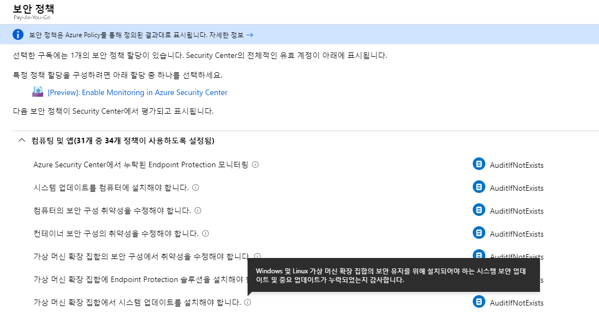

    **참고**: 위에서 설명한 것처럼, 제목에 (*)가 있는 아래의 모든 정책이 보안 정책 블레이드에 나열됩니다.

      - **Endpoint Protection 사용** - _모든 가상 머신에 Endpoint Protection을 사용하는 것이 좋습니다._
      - **디스크 암호화 사용** - _Azure Disk Encryption을 사용하여 암호화되지 않은 Windows 또는 Linux VM 디스크가 있는 경우 디스크 암호화를 적용하는 것이 좋습니다. 디스크 암호화를 사용하면 Windows 및 Linux IaaS VM 디스크를 암호화할 수 있습니다. VM에서 OS 및 데이터 볼륨 모두를 암호화하는 것이 좋습니다._
      - **네트워크 보안 그룹 사용** _NSG(네트워크 보안 그룹)를 아직 사용하도록 설정하지 않았다면 사용하도록 설정하는 것이 좋습니다. NSG에는 가상 네트워크에서 VM 인스턴스에 대한 네트워크 트래픽을 허용하거나 거부하는 ACL(액세스 제어 목록) 규칙 목록이 포함되어 있습니다. NSG는 해당 서브넷 내의 서브넷 또는 개별 VM 인스턴스와 연결할 수 있습니다. NSG가 서브넷과 연결되면 ACL 규칙이 해당 서브넷의 모든 VM 인스턴스에 적용됩니다. 또한 NSG를 해당 VM에 직접 연결하여 개별 VM에 대한 트래픽을 추가로 제한할 수 있습니다._
      - **웹 애플리케이션 방화벽 사용** - _웹 애플리케이션을 보호하기 위해 Microsoft 파트너의 WAF(웹 애플리케이션 방화벽)를 추가하는 것이 좋다는 메시지가 표시될 수 있습니다._
      - **취약성 평가 사용** - _Azure Security Center의 취약성 평가는 Security Center VM(가상 머신) 권장 사항의 일부입니다. Security Center에서 VM에 설치된 취약성 평가 솔루션을 찾지 못하면 이를 설치할 것을 권장합니다. 파트너 에이전트가 배포된 후 파트너의 관리 플랫폼에 취약성 데이터를 보고하기 시작합니다. 또한 파트너의 관리 플랫폼은 Security Center에 취약성 및 상태 모니터링 데이터를 다시 제공합니다._
      - **스토리지 암호화 사용** - _이 설정을 사용하면 Azure Blob 및 Files의 모든 새 데이터가 암호화됩니다._
      - **JIT 네트워크 액세스 사용** - _JIT(Just-In-Time) VM(가상 머신) 액세스 기능을 사용하면 인바운드 트래픽이 Azure VM으로만 전송되도록 설정할 수 있으므로 공격에 대한 노출을 줄이는 동시에 필요 시 VM에 연결하기 위한 액세스 권한을 쉽게 제공할 수 있습니다._
      - **적응형 애플리케이션 제어 사용** - _적응형 애플리케이션 제어는 Azure Security Center의 자동화된 지능형 종단 간 애플리케이션 허용 목록 솔루션입니다. 이를 통해 Azure 및 비 Azure VM(Windows 및 Linux)에서 실행할 수 있는 애플리케이션을 제어할 수 있고, 무엇보다도 맬웨어에 맞서 VM을 강화할 수 있습니다. Security Center는 기계 학습을 사용하여 VM에서 실행되는 애플리케이션을 분석하고 이 인텔리전스를 사용하여 특정 허용 목록 규칙을 적용하도록 도와줍니다. 이 기능은 애플리케이션 허용 목록 정책을 구성하고 유지 관리하는 프로세스를 크게 간소화합니다._
      - **SQL 감사 및 위협 검색 사용** - Azure Security Center에서는 감사를 아직 사용하지 않은 경우 Azure SQL 서버의 모든 데이터베이스에서 감사 및 위협 검색을 사용하도록 권장합니다. 감사 및 위협 탐지를 통해 규정 준수를 유지하고, 데이터베이스 활동을 이해하고, 비즈니스 문제를 나타내거나 보안 위반으로 의심될 수 있는 불일치 및 이상 징후를 파악할 수 있습니다.
      - **SQL 암호화 사용** - _Azure Security Center에서는 TDE를 아직 사용하지 않은 경우 SQL 데이터베이스에서 투명 데이터 암호화(TDE)를 사용하도록 권장합니다. TDE는 데이터를 보호하고 애플리케이션을 변경하지 않고도 데이터베이스, 관련 백업 및 미사용 트랜잭션 로그 파일을 암호화하여 규정 준수 요구 사항을 충족하도록 합니다._
      - **보안 연락처 이메일 및 전화 번호 설정** - _Azure Security Center에서는 아직 제공하지 않은 경우 Azure 구독에 대한 보안 연락처 세부 정보를 제공하도록 권장합니다. 이 정보는 MSRC(Microsoft 보안 대응 센터)에서 불법적이거나 권한이 없는 당사자가 고객 데이터에 액세스한 사실을 발견한 경우 Microsoft에서 귀하에게 연락하는 데 사용됩니다. MSRC는 Azure 네트워크 및 인프라의 일부 보안 모니터링을 수행하고 타사로부터 위협 인텔리전스 및 악용 불만 사항을 접수합니다._

2.  **비용 관리 + 청구**를 선택합니다.

    **참고**: 다음 단계는 Azure Pass 구독에서는 작동하지 않지만, 실제 시나리오에서 수행해야 하는 단계를 파악할 수 있도록 이 랩에 포함되었습니다.

3.  연락처 정보 화면이 표시됩니다.

4.  표시된 연락처 정보를 입력하거나 유효성을 검사합니다.

       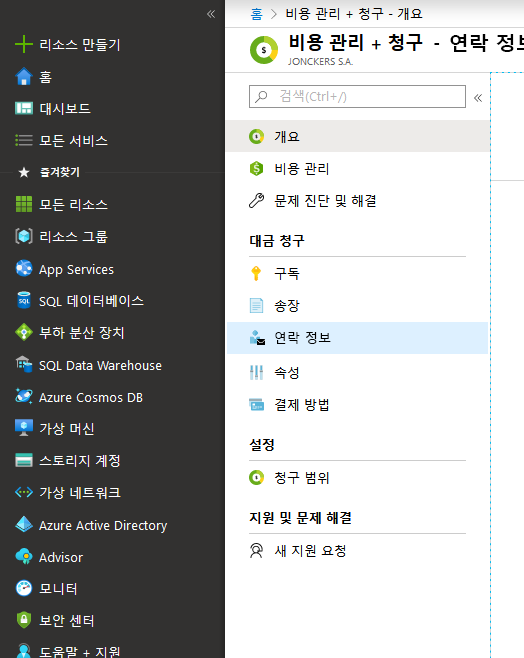

### 태스크 3: 경고에 대한 이메일 받기 사용 

Azure 구독의 보안 연락처 세부 정보를 아직 입력하지 않은 경우 입력하는 것이 좋다는 메시지가 표시됩니다.

1.  **비용 관리 + 청구**를 선택합니다.
3.  가격 책정 및 설정 화면이 표시됩니다.
4.  구독을 클릭합니다.
5.  **이메일 알림**을 클릭합니다.
6.  **저장**을 선택합니다. 

     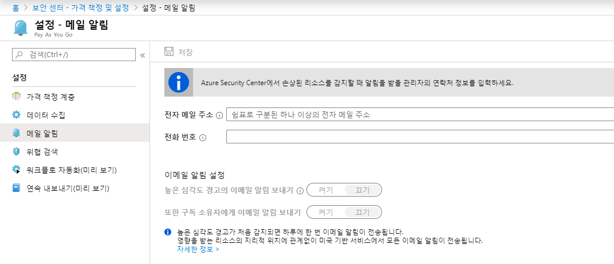

### 태스크 4: 구독 소유자에게도 이메일 보내기 사용 

Azure 구독의 보안 연락처 세부 정보를 아직 입력하지 않은 경우 입력하는 것이 좋다는 메시지가 표시됩니다.

1.  이메일 알림 양식을 사용하여 이메일을 쉼표로 구분해 더 추가할 수 있습니다.

1.  **저장**을 클릭합니다.

## 연습 3: Azure 스토리지 계정 기준 만들기 

Azure 스토리지 계정은 Azure Storage 데이터 개체를 저장하고 액세스할 수 있는 고유한 네임스페이스를 제공합니다.  스토리지 계정도 보호해야 합니다.

### 태스크 1: 보안 강화 전송 필요

Azure Storage 데이터의 보안을 강화하기 위해 수행해야 하는 또 다른 단계는 클라이언트와 Azure Storage 간의 데이터를 암호화하는 것입니다. 첫 번째 권장 사항은 공용 인터넷을 통해 안전하게 통신할 수 있도록 항상 HTTPS 프로토콜을 사용하는 것입니다. REST API를 호출하여 스토리지 계정의 개체에 액세스할 때 스토리지 계정에 대해 보안 전송 필요를 사용하도록 설정하여 HTTPS 사용을 시행할 수 있습니다. 이 방법을 사용하면 HTTP를 사용한 연결이 거부됩니다.

1.  **모든 서비스** 아래에서 **스토리지 계정**으로 이동합니다.

3.  스토리지 계정을 선택합니다.

4.  **설정**에서 **구성**을 선택합니다.

5.  **보안 전송 필요**가 **사용**으로 설정되어 있는지 확인합니다.

       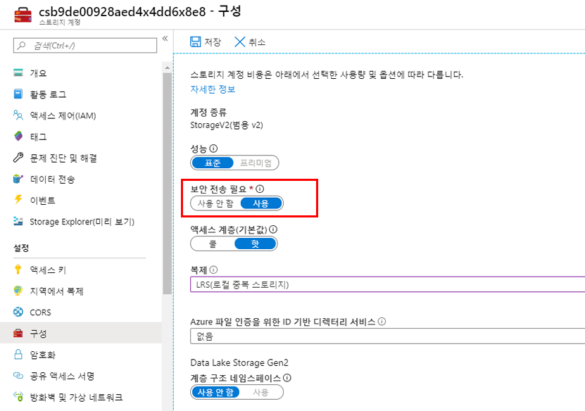

### 태스크 2: BLOB(Binary Large Object) 암호화 사용

Microsoft의 클라우드용 개체 스토리지 솔루션인 Azure Blob Storage는 대량의 구조화되지 않은 데이터 저장용으로 최적화되어 있습니다. 구조화되지 않은 데이터는 특정 데이터 모델이나 정의를 따르지 않는 텍스트, 이진 데이터 등의 데이터입니다. 스토리지 서비스 암호화는 미사용 데이터를 보호합니다. Azure Storage는 데이터 센터에 기록될 때 데이터를 암호화하고 여기에 액세스하면 자동으로 암호를 해독합니다.

1.  Azure 서비스 아래에서 스토리지 계정으로 이동합니다.
3.  스토리지 계정을 선택합니다.
4.  **설정**에서 **암호화**를 선택합니다.
5.  Azure Storage 암호화는 모든 신규 및 기존 스토리지 계정에서 사용하도록 설정되며, 사용하지 않도록 설정할 수는 없습니다.

     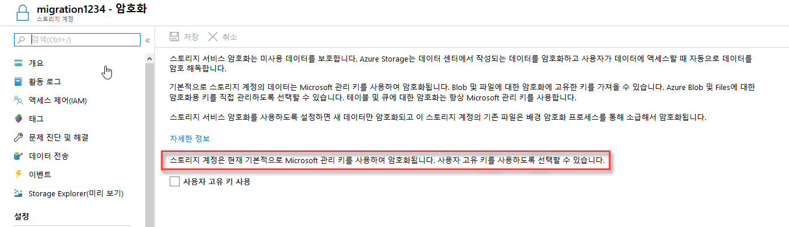

### 태스크 3: 액세스 키 주기적으로 재생성

스토리지 계정을 만들 때 Azure는 스토리지 계정에 액세스할 때 인증에 사용되는 두 개의 512비트 저장소 액세스 키를 생성합니다. 이러한 키를 주기적으로 회전하면 이러한 키에 대한 의도치 않은 액세스나 노출을 줄일 수 있습니다.

1.  Azure 서비스 아래에서 **스토리지 계정**으로 이동합니다.

3.  스토리지 계정을 선택합니다.
4.  스토리지 계정에서 **활동 로그**로 이동합니다.
5.  시간 간격 드롭다운에서 **사용자 지정**을 선택하고 범위가 90일이 되도록 시작 시간과 종료 시간을 선택합니다.
6.  **적용**을 클릭합니다. 
 
     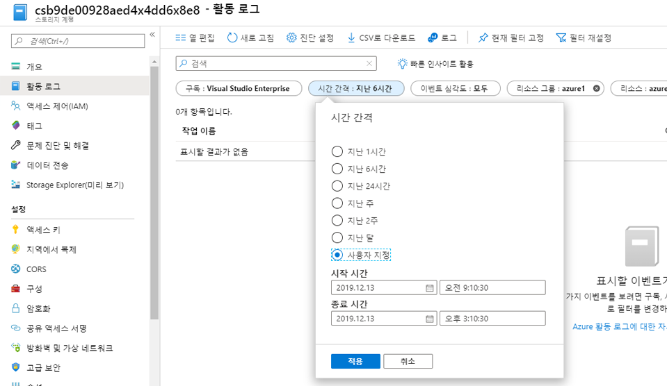

### 태스크 4: SAS(공유 액세스 서명) 토큰이 1시간 이내에 만료되어야 함

SAS(공유 액세스 서명)는 Azure Storage 리소스에 대한 제한된 액세스 권한을 부여하는 URI입니다. 스토리지 계정 키를 제공하여 신뢰해서는 안 되지만 특정 스토리지 계정 리소스 액세스 권한은 위임하려는 클라이언트에게 공유 액세스 서명을 제공할 수 있습니다. 공유 액세스 서명 URI를 이러한 클라이언트에 배포하면 지정된 사용 권한 집합과 함께 지정된 기간 동안 리소스에 대한 액세스 권한을 부여할 수 있습니다.

현재 SAS 토큰 만료 시간은 확인할 수 없습니다. Microsoft에서 토큰 생성 매개 변수가 아닌 설정으로 토큰 만료 시간을 만들 때까지 이 권장 사항에서는 수동 확인을 요구합니다.

1.  **스토리지 계정**으로 이동합니다.

3.  기존 계정을 선택합니다.
4.  스토리지 계정에서 **공유 액세스 서명**으로 이동합니다.
5.  시작 및 만료 날짜/시간을 설정합니다.
6.  허용되는 프로토콜을 HTTPS만으로 설정합니다.

    아래에 두 SAS 기능이 모두 나와 있습니다. 
 
    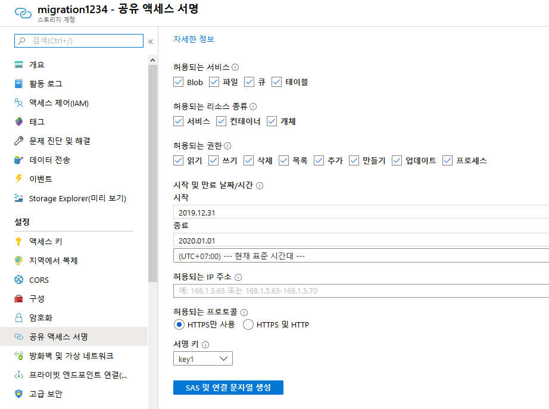
 

### 태스크 5: BLOB 컨테이너에 대한 개인 액세스만 허용 

Azure Blob 저장소에서 컨테이너 및 해당 Blob에 대한 익명의 공용 읽기 액세스를 사용할 수 있습니다. 이렇게 하면 계정 키를 공유하지 않고 그리고 SAS(공유 액세스 서명)를 요구하지 않고도 이러한 리소스에 대한 읽기 전용 액세스 권한을 부여할 수 있습니다. 기본적으로 컨테이너 및 컨테이너 내의 모든 Blob은 적절한 사용 권한이 부여된 사용자만 액세스할 수 있습니다. 익명 사용자에게 컨테이너 및 해당 Blob에 대한 읽기 액세스 권한을 부여하려면 컨테이너 공용 액세스 수준을 설정하면 됩니다. 컨테이너에 대한 공용 액세스 권한을 부여하면 익명 사용자가 요청에 대한 승인을 받지 않아도 공개적으로 액세스할 수 있는 컨테이너 내에서 Blob을 읽을 수 있습니다.

1.  **스토리지 계정**으로 이동합니다.
3.  스토리지 계정에서 **Blob 서비스** 아래의 **컨테이너**를 선택합니다.
1.  **+ 컨테이너**를 클릭합니다.
1.  컨테이너 이름을 **az500**으로 지정하고 **확인**을 클릭합니다.

4.  공용 액세스 수준이 비공개인지 확인합니다.

     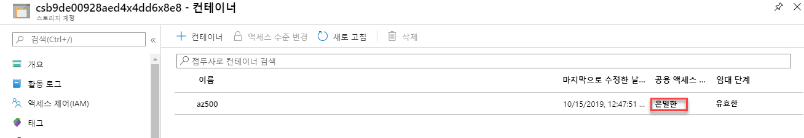

## 연습 4: Azure SQL Database 기준 만들기

Microsoft SQL Server와 동일한 기능을 대부분 지원하는 클라우드 기반 관계형 데이터베이스 서버인 Azure SQL Server를 활용하면 온-프레미스 데이터베이스를 진단, 백업, 보안 및 확장성 기능이 기본 제공되는 클라우드 기반 데이터베이스로 손쉽게 전환할 수 있습니다.  이 연습에서는 Azure SQL Server 정책 설정을 위한 보안 권장 사항을 확인합니다.

### 태스크 1: 감사 사용

Azure SQL Database 및 SQL Data Warehouse에 대한 감사는 데이터베이스 이벤트를 추적하고 이를 Azure 스토리지 계정, OMS 작업 영역 또는 Event Hubs의 감사 로그에 기록합니다. 감사의 또 다른 기능:

-   규정 준수를 유지하고, 데이터베이스 활동을 이해하고, 비즈니스 문제를 나타내거나 보안 위반으로 의심될 수 있는 불일치 및 이상 징후를 파악할 수 있습니다.
-   규정 준수를 보장하지는 않지만 규정 준수 표준을 용이하게 준수할 수 있도록 합니다.

1.  Azure Portal에서 **SQL 데이터베이스**로 이동합니다.
1.  **+ 추가**를 클릭합니다.
1.  당음 설정을 사용하여 데이터베이스를 만들고 **검토 + 만들기**, **만들기**를 차례로 클릭합니다.

      - **리소스 그룹**: myResourceGroup 선택
      - **데이터베이스 이름**: az500
      - **서버**: **새로 만들기**
         - **서버 이름** 서버의 고유한 이름 지정
         - **서버 관리자 로그인**: localadmin
         - **암호**: Pa55w.rd1234
         - **위치**: EastUS

1.  배포가 완료되면 **리소스로 이동**을 클릭합니다.

4.  **보안** 섹션에서 **감사**를 선택합니다.

1.  **서버 설정 보기**를 클릭합니다.

     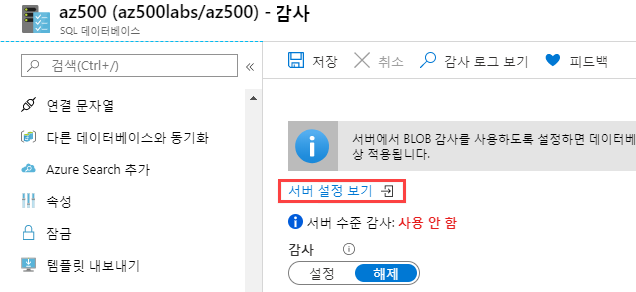
 
1.  **켜기**를 선택하고 **Log Analytics** 옆의 확인란을 선택합니다.

1.  이전 랩에서 만든 Log Analytics 작업 영역을 선택하고 **저장**을 클릭합니다.

     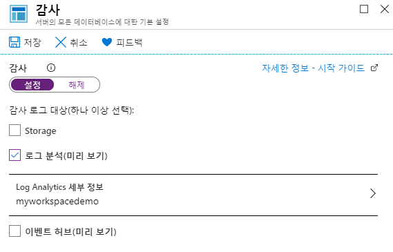

1.  감사 블레이드를 끝냅니다.

5.  감사가 **켜기**로 설정되어 있는지 확인하고 **Log Analytics** 옆의 확인란을 선택합니다.

1.  이전 랩에서 만든 Log Analytics 작업 영역을 선택하고 저장을 클릭합니다.

     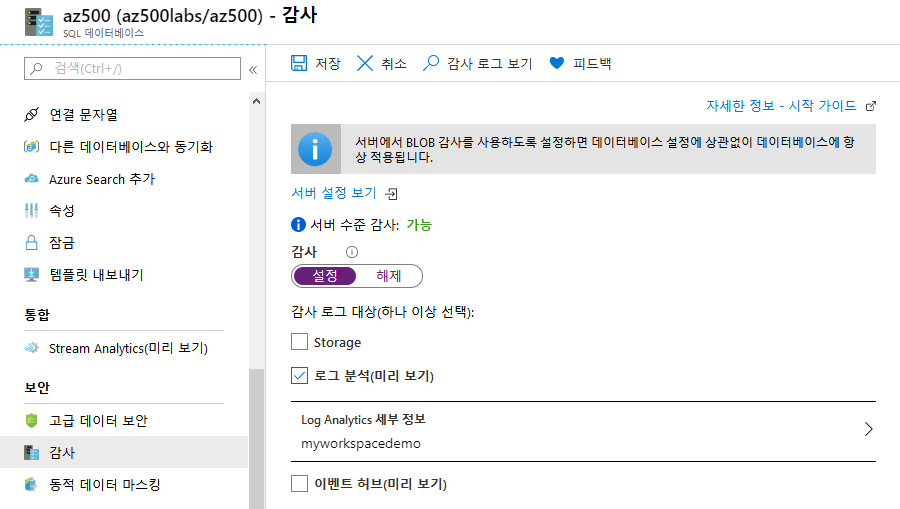

### 태스크 2: 위협 탐지 서비스 사용

단일 데이터베이스 및 풀링된 데이터베이스용 위협 검색 기능은 데이터베이스에 액세스하거나 악용하려는 비정상적인 시도를 의도하는 비정상적인 활동을 검색합니다. 위협 탐지는 잠재적 SQL 삽입, 비정상적인 위치 또는 데이터 센터로부터의 액세스, 익숙하지 않은 보안 주체 또는 잠재적으로 유해한 애플리케이션으로부터의 액세스 및 무차별 암호 대입 SQL 자격 증명을 식별할 수 있습니다. 위협 검색은 고급 SQL 보안 기능을 위한 통합 패키지인 고급 데이터 보안(ADS)의 일부입니다. 위협 탐지는 중앙 SQL ADS 포털을 통해 액세스하고 관리할 수 있습니다.

1.  Azure Portal에서 **SQL 데이터베이스**로 이동합니다.

2.  **보안** 아래에서 **Advanced Data Security**으로 이동합니다.
3.  **설정**을 클릭합니다.
4.  **서버에서 Advanced Data Security 사용**을 선택하고 **예**, **저장**을 차례로 클릭합니다.

### 태스크 3: 모든 위협 검색 유형 사용 

ADS(Advanced Data Security)는 데이터 검색/분류, 취약성 평가, ATP(Advanced Threat Protection)를 비롯한 고급 SQL 보안 기능 집합을 제공합니다.

Advanced Threat Protection은 심층 방어 SQL 보안 전략의 일환인 ADS(Advanced Data Security) 제품에 포함되어 있습니다. 중앙 SQL ADS 포털을 통해 Advanced Threat Protection에 액세스하여 관리 작업을 수행할 수 있습니다.

1.  Azure Portal에서 **SQL 데이터베이스**로 이동합니다.
4.  **보안** 아래에서 **Advanced Data Security**으로 이동합니다.
1.  **설정**을 클릭합니다.

7.  **경고 보내기**가 적절하게 설정되어 있는지 확인합니다.

     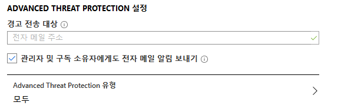

## 연습 5: 로깅 및 모니터링 기준 만들기

보안 위협을 확인/검색/완화하려는 경우에는 로깅과 모니터링을 반드시 수행해야 합니다. 적절한 로깅 정책을 사용하면 보안 위반 발생 시기를 확인할 수 있을 뿐 아니라 원인 제공자도 파악할 수 있습니다. Azure 활동 로그는 리소스/진단 로그에 대한 외부 액세스 관련 데이터를 제공합니다. 이 데이터에서는 해당 특정 리소스의 작업에 대한 정보가 제공됩니다.

### 태스크 1: 로그 프로필이 있는지 확인

Azure 활동 로그는 Azure에서 발생한 구독 수준 이벤트 관련 정보를 제공합니다. 이러한 정보에는 Azure Resource Manager 작동 데이터, Service Health 이벤트 업데이트 등의 폭넓은 데이터가 포함됩니다. 관리 범주에서 구독에 대한 제어 평면 이벤트를 보고하기 때문에 이전에는 활동 로그를 감사 로그 또는 운영 로그라고 했습니다. Azure 구독마다 하나의 활동 로그가 있습니다. 또한 외부에서 리소스에 대해 수행하는 작업 관련 데이터를 제공합니다. 반면 리소스가 내보내는 진단 로그는 해당 리소스의 작동 관련 정보를 제공합니다. 각 리소스에서 진단 설정을 사용하도록 설정해야 합니다.

1.  Azure Portal에서 **모니터**로 이동하여 **활동 로그**를 선택합니다.

3.  **이벤트 허브로 내보내기**를 클릭합니다.
5.  다음 설정을 구성하고 **저장**을 클릭합니다.

      - **지역**: EastUS
      - **선택**: 스토리지 계정으로 내보내기
      - **저장소 계정**: 스토리지 계정을 선택하고 확인을 클릭합니다.
      - **보존**: 90일

6.  **저장**을 선택합니다.

     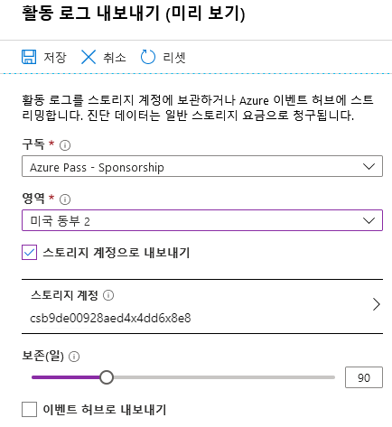

### 태스크 2: 활동 로그 보존 기간이 365일 이상으로 설정되어 있는지 확인

보존 기간(일)을 0으로 설정하면 데이터가 영구적으로 보존됩니다.

1.  위에 나와 있는 단계를 수행하고 보존 기간(일) 슬라이더 막대를 조정합니다.

### 태스크 3: "네트워크 보안 그룹 만들기, 업데이트 또는 삭제"에 대한 활동 로그 경고 만들기 

기본적으로는 NSG를 작성/업데이트/삭제할 때 모니터링 경고가 생성되지 않습니다. 보안 그룹을 변경하거나 삭제하면 부적절한 원본에서 내부 리소스에 액세스하거나 예기치 않은 아웃바운드 네트워크 트래픽을 전송하기 위해 내부 리소스에 액세스할 수 있게 됩니다.

1.  Azure Portal에서 **모니터**로 이동하여 **경고**를 선택합니다.

3.  **+ 새 경고 규칙**을 선택합니다.

4.  **리소스** 섹션에서 **선택**을 클릭합니다.

1.  사용자의 구독을 선택하고 **완료**를 클릭합니다.

4.  **조건** 섹션에서 **추가**를 클릭합니다.

1.  **네트워크 보안 그룹 만들기 또는 업데이트**를 검색한 다음 선택합니다.

1.  신호 논리 구성 블레이드의 이벤트를 시작한 사람에서 **모두**를 입력하고 **완료**를 클릭합니다.

     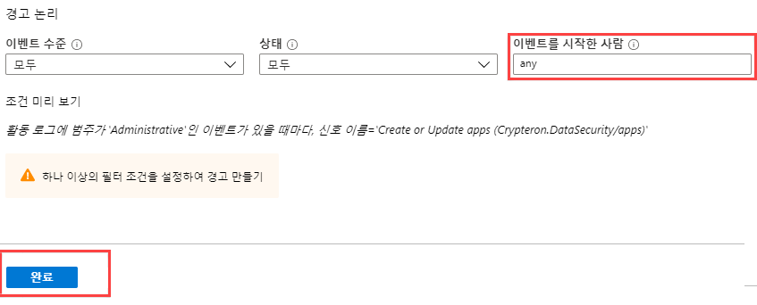

1.  **작업** 섹션에서 **작업 그룹 만들기**를 클릭합니다.

1.  작업 그룹 추가 블레이드에서 다음 세부 정보를 입력합니다.

      - **작업 그룹 이름**: NSG 경고
      - **짧은 이름**: NSGAlert
      - **작업 이름**: NSG 경고
      - **작업 유형**: 이메일/SMS/푸시/음성

1.  **이메일/SMS/푸시/음성** 블레이드에서 이메일 확인란을 선택하고 이메일 주소를 입력한 후에 **확인**을 클릭합니다.

     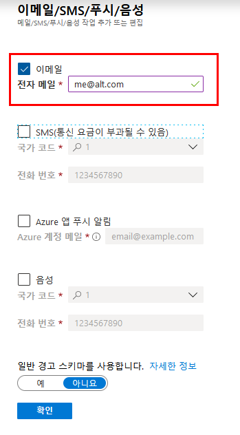

1.  작업 그룹 추가 블레이드에서 **확인**을 클릭합니다.

     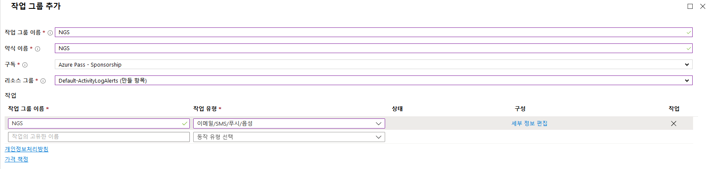

1.  규칙 만들기 블레이드의 **경고 세부 정보** 섹션에 다음 세부 정보를 입력합니다.

      - **경고 규칙 이름**. NSG 경고
      - **리소스 그룹에 저장**: myResourceGroup

     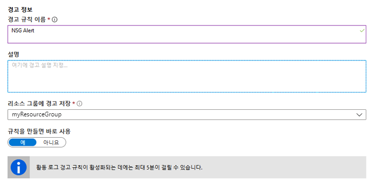

6.  **경고 규칙 만들기**를 클릭합니다.

## 연습 5: 네트워킹 기준 만들기

Azure 네트워킹 서비스는 설계에 따라 유연성, 가용성, 복원력, 보안 및 무결성을 극대화합니다. Azure에 있는 리소스 간, 온-프레미스 리소스와 Azure에서 호스트되는 리소스 간, 그리고 인터넷과 Azure 간에 네트워크 연결을 설정할 수 있습니다.

### 태스크 1: 인터넷에서 RDP 및 SSH 액세스 제한 

RDP(원격 데스크톱 프로토콜) 및 SSH(보안 셸) 프로토콜을 사용하여 Azure 가상 머신에 연결할 수 있습니다. 이러한 프로토콜을 사용하면 원격 위치에서 VM을 관리할 수 있으며 데이터 센터 컴퓨팅의 표준입니다.

인터넷을 통해 이러한 프로토콜을 사용할 때 발생할 수 있는 보안 문제는 공격자가 무차별 암호 대입 기술을 사용하여 Azure 가상 시스템에 액세스할 수 있다는 것입니다. 공격자가 액세스 권한을 얻은 후에는 VM을 가상 네트워크에 있는 다른 컴퓨터를 손상시키거나 Azure 외부에서 네트워크로 연결된 장치를 공격하기 위한 시작점으로 사용할 수 있습니다.

인터넷에서 Azure VM에 RDP 및 SSH를 통해 직접 액세스할 수 없도록 설정하는 것이 좋습니다. 인터넷에서 직접 RDP 및 SSH 액세스를 사용하지 않도록 설정한 후 원격 관리를 위해 이러한 VM에 액세스하는 데 사용할 수 있는 다른 옵션이 있습니다.

- 지점 및 사이트 간 VPN
- 사이트 간 VPN
- Azure ExpressRoute
- Azure Bastion 호스트

1.  Azure Portal에서 **가상 머신**을 클릭합니다.

1.  **myVM**을 선택합니다.

1.  **네트워킹** 블레이드를 엽니다.

1.  RDP(포트 3389)를 허용하는 규칙을 선택하고 **삭제**를 클릭합니다.

     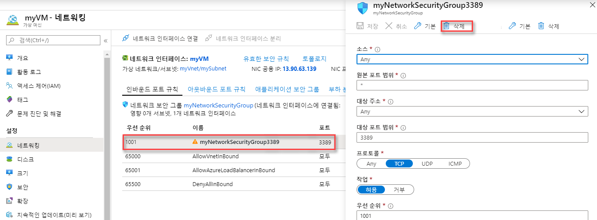

## 태스크 2: 인터넷에서 SQL Server 액세스 제한 

방화벽 시스템을 사용하면 컴퓨터 리소스에 대한 무단 액세스를 방지할 수 있습니다. 방화벽이 켜져 있지만 올바르게 구성되지 않은 경우 SQL Server에 연결하려는 시도가 차단될 수 있습니다.

방화벽을 통해 SQL Server 인스턴스에 액세스하려면 SQL Server를 실행하는 컴퓨터에서 방화벽을 구성해야 합니다. IP 범위 `0.0.0.0/0`(시작 IP `0.0.0.0`, 종료 ID `0.0.0.0`)에 대한 수신을 허용하면 SQL Database가 공격에 취약하도록 만들 수 있는 모든 트래픽에 대한 공개 액세스를 허용합니다. 인터넷을 통한 수신을 허용하는 SQL 데이터베이스가 없는지 확인합니다.

1.  Azure Portal에서 **SQL Server**로 이동하여 사용 중인 SQL Server를 선택합니다.

4.  **방화벽 및 가상 네트워크**를 클릭합니다.

     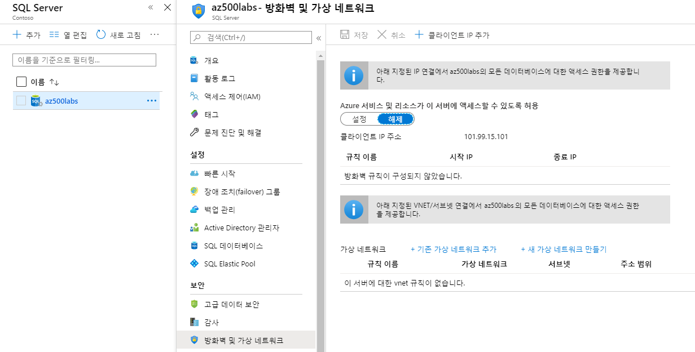

5.  방화벽 규칙이 있고 더 넓은 공용 IP 범위에 액세스할 수 있는 시작 IP `0.0.0.0` 및 종료 IP `0.0.0.0` 또는 기타 조합을 가진 규칙이 없는지 확인합니다.

6.  블레이드를 닫습니다.

### 태스크 3: NSG 흐름 로그 구성

구독에서 가상 네트워크를 만들거나 업데이트하면 가상 네트워크의 지역에서 Network Watcher가 자동으로 사용하도록 설정됩니다. Network Watcher가 자동으로 사용하도록 설정되더라도 리소스에는 아무런 영향이 없으며 관련 비용도 발생하지 않습니다.

NSG(네트워크 보안 그룹) 흐름 로그는 NSG를 통한 IP 트래픽 송수신 정보를 볼 수 있는 Network Watcher의 기능입니다. 흐름 로그는 JSON 형식으로 작성되며 규칙별 기준에 따라 아웃바운드 및 인바운드 흐름, 흐름에 적용되는 네트워크 인터페이스(NIC), 흐름에 대한 5튜플 정보(소스/대상 IP, 소스/대상 포트 및 프로토콜), 트래픽 허용 또는 거부 여부 그리고 버전 2에서 처리량 정보(바이트 및 패킷)를 표시합니다. 로그를 사용하여 이상 징후를 확인하고 의심되는 위반에 대한 인사이트를 제공할 수 있습니다.

1.  Azure Portal에서 **모든 서비스**를 선택합니다.

3.  **네트워킹**을 선택합니다.

4.  **Network Watcher**를 선택합니다.

5.  로그에서 **NSG 흐름 로그**를 선택합니다.

1.  **켜기**를 선택합니다.

1.  스토리지 계정을 선택하고 **저장**을 클릭합니다.

 

### 태스크 4: Network Watcher를 사용하도록 설정 

NSG(네트워크 보안 그룹) 흐름 로그는 NSG를 통한 IP 트래픽 송수신 정보를 볼 수 있는 Network Watcher의 기능입니다.

1.  Azure Portal에서 모든 서비스를 선택합니다. 필터 상자에 **Network Watcher**를 입력합니다. 결과에 Network Watcher가 나타나면 이를 선택합니다.

3.  지역을 클릭하여 확장한 다음 사용하지 않도록 설정된 지역의 줄임표(...) 단추를 선택합니다.

4.  **Network Watcher 사용**을 선택합니다.

     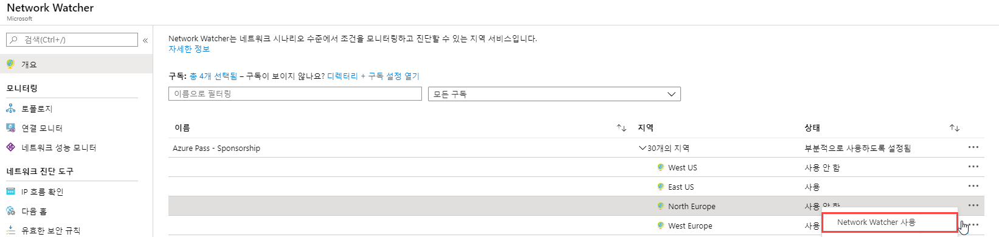

## 연습 7: Azure VM 기준 만들기

Azure Policy는 Azure에서 정책을 만들고, 할당하고, 관리하는 데 사용하는 서비스입니다. 이러한 정책은 리소스에 대해 서로 다른 규칙과 효과를 적용하므로 이러한 리소스는 회사 표준 및 서비스 수준 계약을 준수합니다. Azure Policy는 리소스가 할당된 정책을 준수하지 않는지 여부를 평가하여 이러한 요구를 충족합니다. 예를 들어, 사용자 환경에서 가상 컴퓨터의 특정 SKU 크기만 허용하는 정책을 사용할 수 있습니다. 이 정책이 구현되면 새 리소스와 기존 리소스의 준수 여부를 평가합니다. 올바른 유형의 정책을 사용하면 기존 리소스가 규정을 준수하도록 할 수 있습니다.

**Azure 네트워킹 보안 권장 사항**

아래에는 Azure 구독에서 VM(가상 머신) 정책을 설정하려면 따라야 하는 보안 권장 사항이 나와 있습니다. 각 권장 사항에는 Azure Portal에서 수행해야 하는 기본 단계가 포함되어 있습니다. 사용자의 구독에서 실제 리소스를 사용해 이러한 단계를 수행하여 각 구독의 보안 유효성을 검사해야 합니다. 수준 2 옵션을 사용하는 경우 일부 기능이나 활동이 제한될 수도 있으므로 적용할 보안 옵션을 신중하게 고려하세요.

### 태스크 1: OS 디스크가 암호화되어 있는지 확인

Azure Disk Encryption을 사용하면 조직 보안 및 규정 준수 약정을 충족하도록 데이터를 보호할 수 있습니다. Windows의 BitLocker 기능과 Linux의 DM-Crypt 기능을 사용하여 Azure 가상 컴퓨터(VM)의 OS 및 데이터 디스크에 대한 볼륨 암호화를 제공합니다. 또한 Azure Key Vault와 통합되어 디스크 암호화 키 및 비밀을 제어하고 관리할 수 있으며 Azure 저장소에 있는 동안 VM 디스크의 모든 미사용 데이터를 암호화합니다. Windows 및 Linux VM용 Azure Disk Encryption은 표준 VM 및 Azure Premium Storage가 있는 VM의 Azure 공용 지역 및 Azure Government 지역에서 일반적으로 사용할 수 있습니다.

Azure Security Center(권장)를 사용하는 경우 암호화되지 않은 VM이 있는 경우 경고가 표시됩니다.

1.  Azure Portal에서 **KeyVault**를 검색합니다.

1.  **Key Vault**를 선택한 다음 **만들기**를 클릭합니다.

1.  다음 세부 정보를 입력합니다.

      - **리소스 그룹**: myResourceGroup
      - **키 자격 증명 모음 이름**: _고유한 이름 입력_
      - **지역**: EastUS
   
     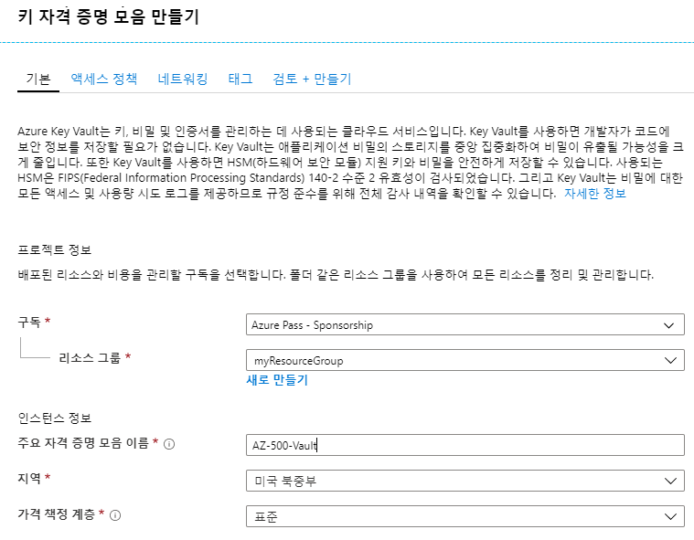

1.  **액세스 정책** 탭을 선택하고 볼륨 암호화에 대해 **Azure Disk Encryption**을 선택합니다.

     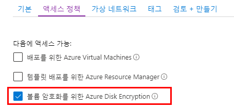

1.  **검토 + 만들기**, **만들기**를 차례로 클릭합니다.

1.  계속하기 전에 배포가 완료될 때까지 기다립니다.

1.  Azure Portal에서 **가상 머신**을 선택합니다.

1.  **myVM** 가상 머신을 선택합니다.

3.  **설정** 섹션에서 **디스크**를 선택합니다.

1.  디스크가 암호화되지 않았음을 확인합니다.

     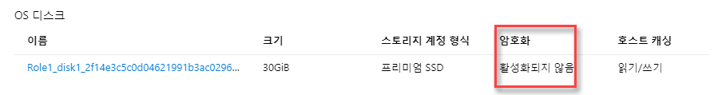

1.  **암호화**를 클릭합니다.

     

5.  암호화할 **OS 및 데이터 디스크**를 선택합니다.

1.  **암호화를 위해 Key Vault 및 키 선택**을 클릭하고 키 자격 증명 모음을 선택한 후에 **선택**을 클릭합니다.

1.  **저장**, **예**를 차례로 클릭합니다.

### 태스크 2: 승인된 확장만 설치되어 있는지 확인

Azure VM(가상 머신) 확장은 Azure VM에서 배포 후 구성 및 자동화 태스크를 제공하는 간단한 애플리케이션입니다. 예를 들어, 가상 컴퓨터에서 소프트웨어 설치 및 바이러스 백신 보호를 요구하거나 가상 컴퓨터 내에서 스크립트를 실행해야 하는 경우 VM 확장을 사용할 수 있습니다. Azure VM 확장은 Azure CLI, PowerShell, Azure Resource Manager 템플릿 및 Azure Portal에서 실행할 수 있습니다. 확장은 새 VM 배포와 함께 번들로 제공되거나 기존 시스템에 대해 실행할 수 있습니다.

1.  Azure Portal에서 **가상 머신**을 선택합니다.

3.  **myVM**을 선택하고 **설정** 섹션에서 **확장**을 클릭합니다.
5.  나열된 확장을 사용하도록 승인되었는지 확인합니다.

     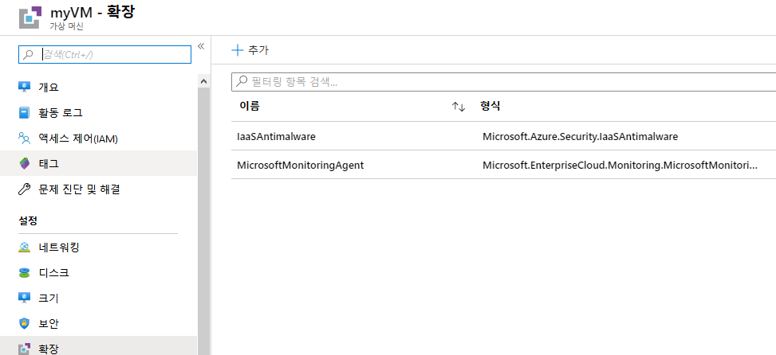

**결과**: 이 랩이 완료되었습니다.

