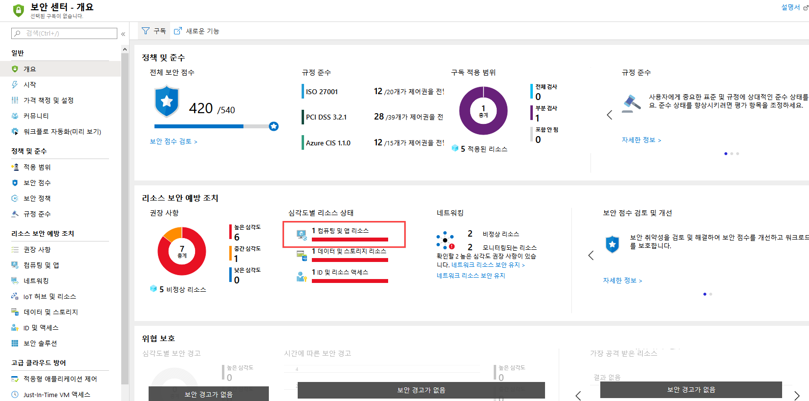
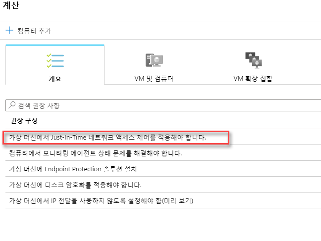
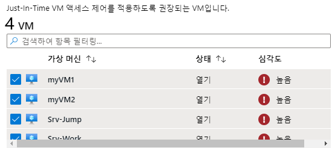
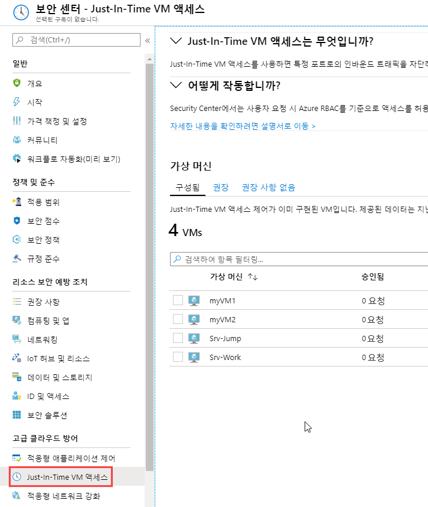
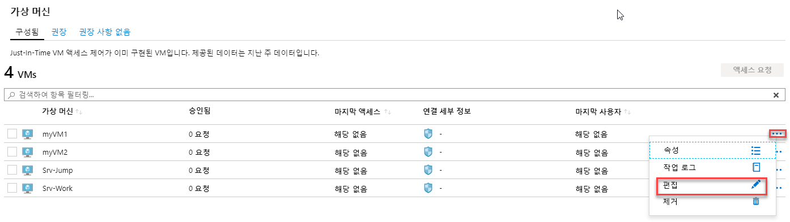
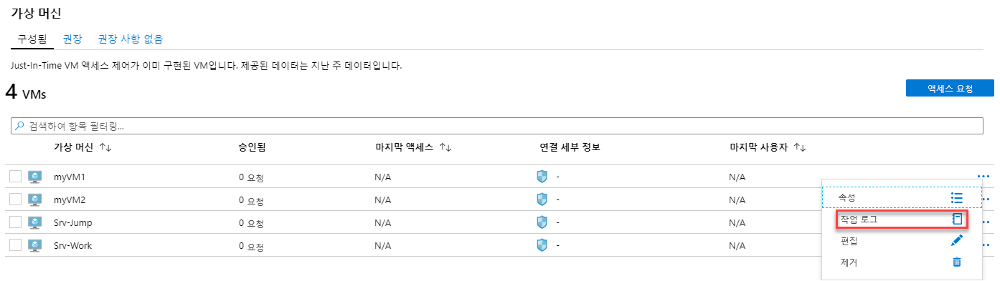
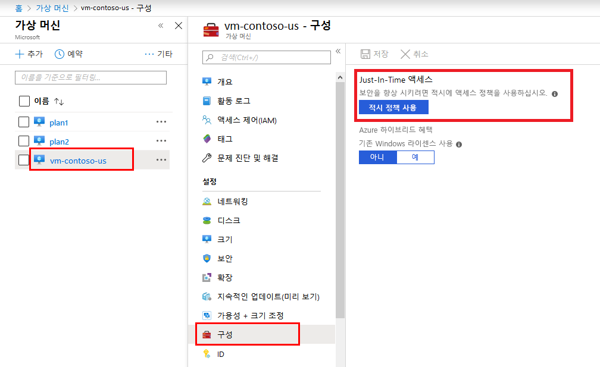
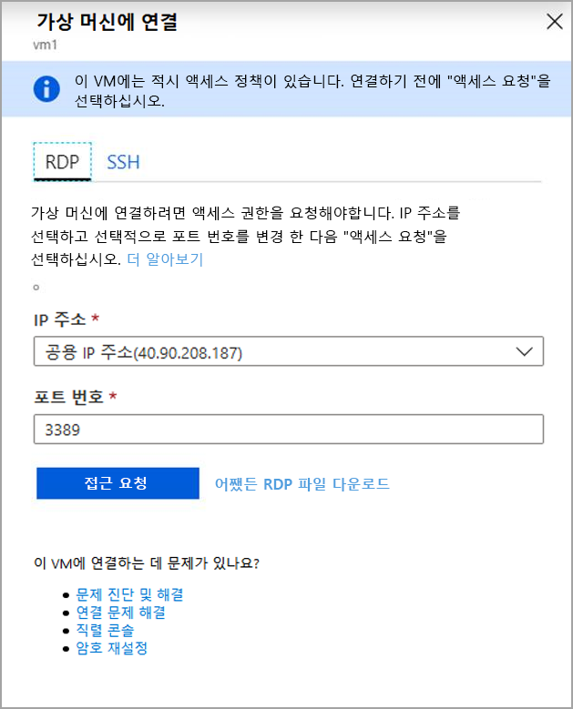

---
lab:
    title: '랩 9 - JIT'
    module: '모듈 3: 보안 작업 관리'
---

# 모듈 3: 랩 9 - JIT

**시나리오**

JIT(Just-in-time) 가상 머신(VM) 액세스를 사용하면 Azure VM에 대한 인바운드 트래픽을 잠그고 공격에 대한 노출을 줄이는 동시에 필요할 때 VM에 쉽게 연결할 수 있습니다.

무차별 암호 대입 공격(brute force attack)은 일반적으로 VM에 대한 액세스 권한을 얻기 위한 수단으로 관리 포트를 대상으로 합니다. 성공하면 공격자는 VM을 제어하고 사용자 환경으로 침입할 발판을 마련할 수 있습니다.

무차별 암호 대입 공격에 대한 노출을 줄이는 한 가지 방법은 포트가 열려 있는 시간을 제한하는 것입니다. 관리 포트는 항상 열어둘 필요는 없습니다. 예를 들어, 관리 또는 유지 관리 작업을 수행하기 위해 VM에 연결할 때만 열어야 합니다. Just-in-time이 사용될 경우 Security Center는 NSG(네트워크 보안 그룹) 및 Azure Firewall 규칙을 사용하여 관리 포트에 대한 액세스를 제한하여 공격자의 대상이 될 수 없도록 합니다.

## 연습 1: Just-In-Time을 사용해 가상 머신 액세스 관리

세 가지 방식으로 VM에서 JIT 정책을 구성할 수 있습니다.

- Azure Security Center에서 JIT 액세스 구성
- Azure VM 블레이드에서 JIT 액세스 구성
- 프로그래밍 방식으로 VM에서 JIT 정책 구성

### 태스크 1: Azure Security Center에서 VM에 대해 JIT 액세스 구성

1.  Azure Portal에서 **Security Center**를 열고 **시작**을 클릭합니다.

1.  **에이전트 설치**를 클릭합니다.

     

**참고**: 에이전트가 배포될 때까지 최대 5분 동안 기다려야 할 수 있습니다.

2.  왼쪽 창에서 **개요**를 선택합니다.

1.  **컴퓨팅 및 앱 리소스**를 선택합니다.

     

1.  컴퓨팅 블레이드에서 권장 사항을 확인합니다.

1.  **가상 머신에서 Just-In-Time 네트워크 액세스 제어를 적용해야 합니다.**를 선택합니다.

     

1.  가상 머신 4대를 모두 선택하고 **VM 4대에서 JIT 사용**을 클릭합니다.

     

1.  **JIT VM 액세스 구성** 블레이드에서 **저장**을 클릭합니다.
  - 이 블레이드에는 Azure Security Center에서 권장하는 기본 포트가 표시됩니다.
      - 22 - SSH
      - 3389 - RDP
      - 5985 - WinRM 
      - 5986 - WinRM
 
     

1.  블레이드를 모두 닫고 Security Center 블레이드에서 **Just-In-Time VM 액세스**를 클릭합니다.

     

    **Just-In-Time VM 액세스** 창이 열립니다.
      
    **Just-In-Time VM 액세스** 시에는 VM 상태 관련 정보가 제공됩니다.

    - **구성됨** - Just-In-Time VM 액세스를 지원하도록 구성된 VM. 지난 주의 데이터가 표시됩니다. 이러한 데이터에는 각 VM의 승인된 요청 수, 마지막 액세스 날짜/시간, 마지막 사용자가 포함됩니다.
    - **추천** - Just-In-Time VM 액세스를 지원할 수는 있지만 지원하도록 구성되지는 않은 VM. 이러한 VM의 경우 Just-In-Time VM 액세스 제어를 사용하도록 설정하는 것이 좋습니다.
    - **권장 사항 없음** - VM 사용이 권장되지 않는 이유는 다음과 같습니다.
      - NSG 누락 - Just-In-Time 솔루션을 사용하려면 NSG가 있어야 합니다.
      - 클래식 VM - Security Center Just-In-Time VM 액세스에서는 현재 Azure Resource Manager를 통해 배포된 VM만 지원합니다. Just-In-Time 솔루션은 클래식 배포를 지원하지 않습니다. 
      - 기타 - 구독 또는 리소스 그룹의 보안 정책에서 Just-In-Time 솔루션이 해제되어 있는 VM이나, NSG가 없고 공용 IP가 누락된 VM은 이 범주에 포함됩니다.
 

**참고**: VM에 대해 JIT VM 액세스를 사용하도록 설정하면 Azure Security Center에서는 해당 VM과 연결된 Azure Firewall 및 네트워크 보안 그룹의 선택한 포트용으로 "모든 인바운드 트래픽 거부" 규칙을 만듭니다. 선택한 포트용으로 다른 규칙이 생성된 경우에는 새로 생성된 "모든 인바운드 트래픽 거부" 규칙보다 기존 규칙이 우선적으로 적용됩니다. 선택한 포트에 적용되는 기존 규칙이 없으면 네트워크 보안 그룹과 Azure Firewall에서 새로 생성된 "모든 인바운드 트래픽 거부" 규칙이 최우선으로 적용됩니다.

### 태스크 2: ASC를 통해 JIT 액세스 요청

ASC를 통해 VM 액세스 권한을 요청하려면 다음 단계를 수행합니다.

1.  **Just-In-Time VM 액세스**에서 **구성됨** 탭을 선택합니다.

2.  **가상 머신**에서 액세스 권한을 요청할 VM 중 하나를 선택합니다. 그러면 VM 옆에 확인 표시가 나타납니다.

    - **연결 세부 정보** 열의 아이콘은 NSG 또는 FW에 대해 JIT가 사용하도록 설정되었는지 여부를 나타냅니다. NSG와 FW 둘 다에 대해 JIT가 사용하도록 설정되어 있으면 방화벽 아이콘만 표시됩니다.

    - **연결 세부 정보** 열에서는 VM을 연결하는 데 필요한 정보 및 VM의 열린 포트가 제공됩니다.

      

3.  **액세스 요청**을 클릭합니다. **액세스 요청** 창이 열립니다.

       

4.  **액세스 요청**에서 각 VM에 대해 열려는 포트, 해당 포트가 열리는 원본 IP 주소, 그리고 포트를 열 기간을 구성합니다. Just-In-Time 정책에 구성된 포트에 대한 액세스 권한만 요청할 수 있습니다. 각 포트를 열 수 있는 최대 시간은 Just-In-Time 정책에 따라 결정됩니다.

5.  **포트 열기**를 클릭합니다.

**참고**: 액세스 권한을 요청하는 사용자가 프록시로 보호되는 경우에는 **내 IP** 옵션이 작동하지 않을 수 있습니다. 이 경우 조직의 전체 IP 주소 범위를 정의해야 할 수 있습니다.

### 태스크 3:  ASC를 통해 JIT 액세스 정책 편집

해당 VM에서 보호할 새 포트를 구성하거나 이미 보호 대상으로 지정된 포트 관련 기타 설정을 변경하면 VM의 기존 Just-In-Time 정책을 변경할 수 있습니다.

VM의 기존 Just-In-Time 정책을 편집하려면 다음 단계를 수행합니다.

1.  **구성됨** 탭의 **VM** 아래에서 원하는 VM의 행 안에 있는 점 3개를 클릭하여 포트를 추가할 VM을 선택합니다. 

1.  **편집**을 선택합니다.
1.  **JIT VM 액세스 구성**에서 이미 보호 대상으로 지정된 포트의 기존 설정을 편집하거나 새 사용자 지정 포트를 추가할 수 있습니다. 
  
      

### 태스크 4:  ASC에서 JIT 액세스 활동 감사

로그 검색을 사용하면 VM 활동 관련 인사이트를 파악할 수 있습니다. 로그를 확인하려면 다음 단계를 수행합니다.

1.  **Just-In-Time VM 액세스**에서 **구성됨** 탭을 선택합니다.
2.  **VM** 아래에서 원하는 VM의 행 안에 있는 점 3개를 클릭하여 정보를 확인할 VM을 선택한 다음 메뉴에서 **활동 로그**를 선택합니다. **활동 로그**가 열립니다.

       

   **활동 로그**에서는 해당 VM에 대한 이전 작업의 필터링된 보기와 작업 시간/날짜/구독이 제공됩니다.

**여기를 클릭하여 모든 항목을 csv로 다운로드하세요.**를 선택하여 로그 정보를 다운로드할 수 있습니다.

필터를 수정하고 **적용**을 클릭하여 검색과 로그를 작성합니다.

### 태스크 5: Azure VM 블레이드를 통해 VM에 대한 JIT 액세스 구성

여러 VM에서 Just-In-Time 액세스를 손쉽게 제공하려는 경우 VM 내의 직접 Just-In-Time 액세스만 허용하도록 VM을 설정할 수 있습니다.

1.  Azure Portal에서 **가상 머신**을 선택합니다.

2.  Just-In-Time 액세스만 가능하도록 제한할 가상 머신을 클릭합니다.
3.  메뉴에서 **구성**을 클릭합니다.
4.  **Just-In-Time 액세스**에서 **Just-In-Time 정책 사용**을 클릭합니다. 

    그러면 다음 설정을 사용하여 VM에 대한 Just-In-Time 액세스가 설정됩니다.

       - Windows 서버:
         - RDP 포트 3389
         - 최대 액세스 허용 시간: 3시간
         - 허용되는 원본 IP 주소: 모두
    
       - Linux 서버:
         - SSH 포트 22
         - 최대 액세스 허용 시간: 3시간
         - 허용되는 원본 IP 주소: 모두
     
    VM에 대해 Just-In-Time이 이미 사용하도록 설정되어 있는 경우 VM의 구성 페이지로 이동하면 Just-In-Time이 사용하도록 설정되어 있음을 확인할 수 있으며, 링크를 통해 Azure Security Center에서 정책을 열어 설정을 확인하고 변경할 수 있습니다. 

     

### 태스크 5:  Azure VM 블레이드를 통해 VM에 대한 JIT 액세스 권한 요청

Azure Portal에서 VM에 연결하려고 하면 Azure에서는 해당 VM에 대해 Just-In-Time 액세스 정책이 구성되어 있는지를 확인합니다.

- VM에서 JIT 정책을 구성하지 않은 경우 **액세스 요청**을 클릭하여 VM용으로 설정된 JIT 정책에 따라 VM에 액세스 가능하도록 설정할 수 있습니다. 

     

  다음의 기본 매개 변수를 사용하여 액세스 권한을 요청합니다.

  - **원본 IP**: '모두'(*)(변경 불가)
  - **시간 범위**: 3시간(변경 불가) 
  - **포트 번호**: Windows의 경우 RDP 포트 3389/Linux의 경우 포트 22(변경 가능)

  **참고**: Azure Firewall을 통해 보호되는 VM에 대한 요청이 승인되면 Security Center에서는 해당 VM에 연결하는 데 사용할 수 있는 적절한 연결 세부 정보(DNAT 표의 포트 매핑)를 사용자에게 제공합니다.

  - VM에 JIT가 구성되어 있지 않으면 해당 VM에서 JIT 정책을 구성하라는 메시지가 표시됩니다.

      

| 경고: 계속하기 전에 이 랩에서 사용한 모든 리소스를 제거해야 합니다.  **Azure Portal**에서 리소스를 제거하려면 **리소스 그룹**을 클릭합니다.  랩에서 만든 리소스 그룹을 모두 선택합니다.  리소스 그룹 블레이드에서 **리소스 그룹 삭제**를 클릭하고 리소스 그룹 이름을 입력한 다음 **삭제**를 클릭합니다.  추가로 만든 리소스 그룹이 있으면 이 프로세스를 반복합니다. **리소스 그룹을 삭제하지 않으면 다른 랩에서 문제가 발생할 수 있습니다.** |
| --- |

**결과**: 이 랩이 완료되었습니다.

